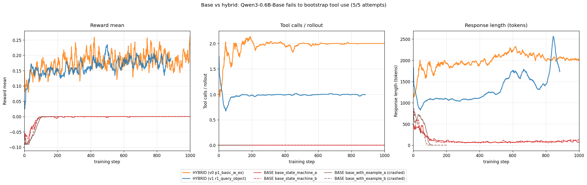
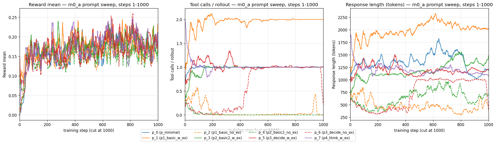

# Presentation Outline

> **Self-contained deck for the Zeta Alpha team.** Every slide is a heading; the slide text (what appears on the slide) is in the **Slide content** subsection; what the speaker says is in the **Speaker notes** subsection. Convert one heading → one PPT/Keynote slide. Status snapshot at the bottom of the file is dated 2026-05-17 EOD.
>
> All paper claims linked and fact-checked. Graphs referenced by relative path under [`storyline_assets/`](storyline_assets/).

---

## Title (alternatives to pick from)

> Pick one of these as Slide 1's headline. My recommendation is bolded.

1. **How to train efficient search agents at sub-1B scale?**
2. Sub-1B retrieval-augmented RL: a recipe-search under realistic compute constraints.
3. Can a 0.8B model learn to search? Training dynamics from a $1000-budget GRPO study.
4. Efficient search agents at sub-1B: reproducing Search-R1 on one GPU and what breaks.
5. Reproducing and extending retrieval-augmented RL post-training at sub-1B scale (original headline).

The recommended title puts the question first; that style fits a job-talk audience (Zeta Alpha) better than the descriptive original.

---

## Slide 1: Title

### Slide content

**How to train efficient search agents at sub-1B scale?**

Subtitle: *A recipe-search under realistic compute constraints. Two facets: thesis (Leiden) + Alstom internship application.*

Author: Gaurisankar Jayadas. Submission: 2026-06-15. Defense: early July 2026.

### Speaker notes

Two-facet project. **Research facet**: can we post-train a small LLM (Qwen3.5 0.8B) to do Search-R1-style retrieval-augmented multi-hop QA on a single A100 inside a tight budget? **Application facet** (Alstom internship, parallel strand): can that multi-hop tool-use behaviour transfer to railway fault analysis, where the available GPU is an A10 8GB and the labelled domain set is only 182 cases? Both strands share the same post-training recipe and reward design; the public-benchmark side is what makes the recipe transferable, and the internship side is what makes it deployable under tight constraints. Thesis submission June 15, defense early July.

---

## Slide 2: Two facets, one recipe

### Slide content

**Facet 1: Public-benchmark recipe-search (this thesis).**
- Target: Qwen3.5-0.8B GRPO on Search-R1-style multi-hop QA.
- Compute: 1× A100-80GB (Vast.ai / Spheron). 1× B200 + 1× H200 also tested.
- Budget: **target ≤ \$200 / run; full thesis budget ~\$1000**.

**Facet 2: Alstom internship (railway root cause analysis).**
- Input: ICNG service requests + MAS fault catalogue + event logs + operating data.
- Hard constraint: 1× A10 8 GB on the internship workstation (full-parameter GRPO does not fit at any model in our range).
- Labelled data scarcity: **14,145 raw service requests narrow to 182 fully labelled cases** (drop rows without DC, drop placeholder "GEEN" values, require Failure Class + Elaborate Comment + Root Cause).
- Transfer plan: train the multi-hop search behaviour on public benchmarks (recipe-search side), then port the recipe to railway domain when the v1 dataset closes the gap. Production target: MCP-wrapped analysis tool inside the Alstom RAG system.

### Speaker notes

The research and the internship are tightly coupled by the same idea: a small model that knows when to search, what to search for, and when to stop. That behaviour is what makes the model useful for railway fault analysis (the engineer asks "why did this train fail?", the model decomposes into hops, retrieves fault history and event data, returns a grounded root-cause hypothesis). Public benchmarks are the scaffolding: we cannot ablate the recipe on 182 labelled cases, so we build the recipe on Search-R1-style multi-hop QA and port it to the railway domain later. The Alstom side's A10 8 GB constraint is a hard one: even Qwen3-0.6B's optimizer state alone (about 7.2 GB in BF16 AdamW) exceeds the available headroom. Slide 7 walks through the VRAM math.

---

## Slide 3: The question (and the budget)

### Slide content

**Can a 0.8B language model be post-trained to Search-R1-level retrieval-augmented multi-hop QA on a single A100 inside ~\$200 per run?**

- Reframed 2026-05-04 from "RLVR via tool-use" to "recipe-search under realistic resource constraints".
- ~\$500 spent on experimentation to date; ~\$1000 total thesis budget.
- Hardware tested across the project: 1× A100-80GB (primary), 1× H200, 1× B200 (cost/throughput comparison at [`setup/HARDWARE_COMPARISON.md`](../setup/HARDWARE_COMPARISON.md)).
- Substrate journey: Leiden's ALICE cluster (wait-time-bound, slow turn-around) → Vast.ai (good price, scheduler unreliable) → Spheron (cheapest H200; Spot churn shorter than docker-pull window so dedicated tier needed).

**Parallel internship question**: can the same recipe + behaviour be ported into railway fault analysis on the 182-case domain set, deployed under a 1× A10 8 GB constraint? (See Slide 2.)

### Speaker notes

The budget framing is what makes this a recipe-search rather than a paper-faithful reproduction. ReSearch reports 8x8 H800 GPUs; Search-R1 trained on a single node of 8 H100 over ~24 hours. A paper-faithful 3-epoch schedule for Qwen3.5-2B at our batch shape projects to ~55-85 days per run on 1× A100, ~\$1,600-2,400 per run. That kills any meaningful ablation sweep. Our affordable budget is ~0.6 epochs of MuSiQue per run, which buys 2-3 runs. ALICE was the first try and the wait-time on shared partitions was killing iteration cadence; Vast.ai gave us better price-per-throughput but scheduler reliability was hit-or-miss; Spheron is currently the cheapest H200 on the market but their Spot tier preempts faster than the docker pull can complete, so dedicated tier is mandatory. Budget for the picked pair of experiments is ~\$200 per reward variant; the F1-only anchor is already paid for.

---

## Slide 4: Landscape, prior work (anchor papers)

### Slide content

**The three papers this project descends from:**

| Paper | Model | Method | Reported result |
|---|---|---|---|
| [Search-R1](https://arxiv.org/abs/2503.09516) (Jin et al., 2025) | Qwen2.5-3B / 7B base + instruct | GRPO with EM reward; `<search>` / `<result>` tags; 1005 steps × 8 H100 | Qwen2.5-3B GRPO base avg EM **0.312** across 7 benchmarks; instruct 0.336. ~20-41 % over RAG baselines. |
| [ReSearch](https://arxiv.org/abs/2503.19470) (Chen et al., 2025) | Qwen2.5-7B / Qwen3-32B | GRPO trained on MuSiQue only; F1 + 0.1 partial-credit reward; 2 epochs × 8x8 H800 | 7B: avg EM/F1 ~0.40-0.47 on MuSiQue / HotpotQA / 2Wiki / Bamboogle. Cross-benchmark transfer from MuSiQue-only training. |
| [R1-Searcher](https://arxiv.org/abs/2503.05592) (Song et al., 2025) | Qwen2.5-7B base | Two-stage curriculum: SFT cold-start → GRPO | EM 0.40-0.50 on HotpotQA / 2Wiki. Key claim: base models below 7B require SFT cold-start before GRPO can take hold. |

**Common pattern**: all three target 3B-32B parameters and assume 8+ H100/H800 GPUs. None reports on sub-1B.

### Speaker notes

Search-R1 is the most direct prior work for the recipe; their EM-based GRPO on `<search>`/`<result>` tag emission is what we reproduce in M1 (within ±2.5 pp). ReSearch added the partial-credit F1 floor (give 0.1 of reward to any well-formatted but wrong answer) and trained on MuSiQue only, with cross-benchmark transfer. R1-Searcher's contribution is the curriculum claim: at 7B and below, base models need an SFT cold-start because pure RL from cold doesn't bootstrap the tool-use format. All three published on multi-GPU clusters at 3B-32B; the sub-1B regime is unexplored in this literature, which is the structural gap this thesis aims at. Our M1 reproduction of Search-R1 on Qwen2.5-3B sits within ±2.5 pp of the paper across all 7 benchmarks; that confirms the eval pipeline before we step into the small-model regime.

---

## Slide 5: Landscape, small-scale RL (counter-evidence)

### Slide content

**Two papers that argue against the obvious approach at small scale:**

| Paper | Claim | Caveat for our setting |
|---|---|---|
| [JustRL](https://arxiv.org/abs/2512.16649) (Soltani et al., ICLR 2026 blogpost) | Plain GRPO with fixed hyperparameters, no KL trick, no curriculum, matches or beats nine-stage pipelines (ProRL-V2) at half the compute on math reasoning at 1.5B. **"Tricks may hurt."** | Math reasoning at 1.5B; not search-augmented multi-hop QA at 0.8B. Anchors our "plain GRPO control" arm. |
| [DGPO](https://arxiv.org/abs/2508.20324) (Kotoge et al., ACL 2026) | Compact models (0.5-1B) fail under pure RL for agentic RAG: *"compact models exhibit poor initial performance, resulting in sparse rewards and unstable training"*. Distillation-Guided Policy Optimization fixes it. | Their abstract does not separate base vs post-trained; our hybrid-model results show bootstrap is possible at 0.6B-0.8B with the right prompt and reward. **Partial counter-evidence.** |

**Plus**: [Rethinking Easy-to-Hard](https://arxiv.org/abs/2603.27226) (Mordig et al., Mar 2026): "specific ordering of training examples plays a negligible role in achieving compositional generalization". Scope = synthetic deductive reasoning, not multi-hop QA. **Curriculum is unproven for our setting in either direction.**

### Speaker notes

JustRL is the cleanest argument for not adding complexity to GRPO at small scale: nine-stage ProRL-V2 pipelines do not beat plain GRPO at fixed-hyperparameter at 1.5B on math. We take that seriously and keep a JustRL-style control arm in the picked pair. DGPO is the strongest direct claim that pure RL fails for agentic RAG at 0.5-1B; we take their motivation seriously but our hybrid-model results contradict their setup: a Qwen3.5-0.8B hybrid does bootstrap tool-use from cold (Slide 13 trajectory), so the "compact models exhibit poor initial performance" claim is conditional on base / post-trained distinctions the abstract doesn't make explicit. Rethinking E2H is the curriculum-counter-evidence we found in the literature audit: their negative result is on deductive reasoning, not multi-hop QA, so we cannot transfer the claim directly, but it removes curriculum from the "obviously good" pile. The picked pair's plain-GRPO control answers JustRL's question; the chain-flip data answers DGPO's instability question directly.

---

## Slide 6: The behaviour we want (and what the cold model does)

### Slide content

**Cold-start failure (Qwen3.5-0.8B, B200 step 10, sample idx 164, reward 0.0):**

> *Q*: "When was the most rainfall for the city where the State Fair of Oklahoma is held?"
>
> Model issued **10 tool calls** (max-turn ceiling), 5410 characters, all variants of `"Oklahoma State Fair rainfall"`. Never resolved the bridge: city where the State Fair is held = **Oklahoma City**. Truncated without emitting `<answer>`. Classic pathological-loop failure.

**By step 15, after roughly one cadence of GRPO training (A100 a2, [`RESULTS_m5.md` §4.2.2](../report/RESULTS_m5.md), reward 1.0):**

> *Q*: "What is the place of death of the leader of the largest country in Europe by square miles after the collapse of America's main rival during the Cold War?"  (3-hop chain: Cold War rival → largest Europe country by area → its leader's place of death.)
>
> **3 turns, 2 tool calls.** Turn 1 `<think>` decomposes the question explicitly into a numbered plan:
>
> *"I need to search for information about the largest country in Europe by square miles in the context of the Cold War and its main rival. The question asks about: 1. The largest country in Europe by square miles. 2. When it officially ended/terminated. 3. After the collapse of America's main rival during the Cold War. First, I should search for ..."*
>
> Search 1 (`largest country in Europe by square miles`) returns Russia. Search 2 (`Russia leader Cold War Europe expansion territory`) returns Cold-War-era Russia chunks. Turn 3: *"I have gathered enough information ... Lenin died in Moscow, Russia in 1924."* `<answer>Moscow</answer>` ✓ (gold = Moscow).

**The same explicit-plan-then-search pattern appears in M5.1 H200 cadence 4** (Chaka Khan / Trump Tower trace, 3 calls with Chicago-vs-NY disambiguation; [`RESULTS_M5_1_H200.md` cadence-4](../report/RESULTS_M5_1_H200.md#cadence-4-steps-31-40-through-2026-05-16-0242-utc)): 74 such planned rollouts in steps 30-44, growing to ~391 / cadence later in the run.

**Shrink-and-improve in numbers**: cadence-2 B200 step 14-15 reward caught up to the A100 reference (1.55-1.65× wall-clock faster), and **step 18 reward 0.146 crossed the A100 reference for the first time**. Length compresses 3× while reward grows. This is the behaviour we want to transfer to Alstom for fault analysis.

### Speaker notes

Two traces. The cold model knows the `<tool_call>` format perfectly (Qwen3.5 is post-trained on this) but it does not know when to stop searching, so it spams variants until the context budget kicks it out. The Oklahoma State Fair example is the failure: ten searches, never resolves the bridge "city where State Fair is held = Oklahoma City". After ~15 GRPO steps the policy has learned to plan first, then search. The Moscow example is the canonical demonstration: a genuine 3-hop chain that the model decomposes explicitly into a numbered plan in turn 1, runs two well-aimed searches in turns 1 and 2, then commits in turn 3 without further searching. Note that F1 is "perfect" here (reward 1.0) even though the model identified the wrong Soviet leader (Lenin instead of Gorbachev or Yeltsin); the F1 scorer cannot tell because the final answer token "Moscow" matches gold. This kind of plan-then-search behaviour scales to harder questions: in M5.1 H200 cadence 4 we see the same shape resolving Chaka Khan / Trump Tower in 3 calls and disambiguating Chicago Trump Tower from NY Trump Tower using chain context. The planned mode is the behaviour we want for industrial fault analysis on the Alstom side: a tight, well-aimed search-decompose-answer loop rather than a runaway agentic chain. The fact that F1-only credits both the chain-correct and the chain-broken-but-token-aligned versions of this shape with reward 1.0 is the structural problem Slide 15 measures.

---

## Slide 7: Hardware journey + the VRAM math

### Slide content

**Substrate timeline.**
- **Leiden ALICE** (Phase 1): 1× A100-40GB. SLURM scheduler wait-times often > 1 day on shared partitions; retriever cold-boot 30-40 min observed.
- **Vast.ai** (M1-M2): 1× A100-80GB at ~\$1.20/h. Best price-throughput for thesis-budget work; scheduler reliability variable.
- **Spheron** (M5.1): 1× H200 at ~\$1.85/h. Cheapest H200 we found; Spot tier preempts faster than docker-pull window completes, so dedicated tier mandatory.
- Hardware tested for comparison: 1× B200 ([`setup/HARDWARE_COMPARISON.md`](../setup/HARDWARE_COMPARISON.md); turned out 2.66× over A100, not the 11× initially projected).

**VRAM accounting for GRPO (BF16 + AdamW, resident pool):**

| Component | Qwen3.5-2B (4 GB weights) | Qwen3-0.6B (1.2 GB) |
|---|---:|---:|
| Policy weights | 4 GB | 1.2 GB |
| Adam state (2 fp32 + master copy) | ~24 GB | ~7.2 GB |
| Gradients (BF16) | 4 GB | 1.2 GB |
| Frozen reference policy (KL) | 4 GB | 1.2 GB |
| Colocated vLLM weight copy | 4 GB | 1.2 GB |
| **Resident subtotal** | **~40 GB** | **~12 GB** |
| Peak with rollout KV + activations | ~75-80 GB (A100 fits, barely) | ~64 GB |

**Implication for Alstom (A10 8 GB)**: full-parameter GRPO does not fit even at 0.6B; the only feasible A10 configuration is LoRA-only with no reference policy, ~3-5 GB resident, ~6-7 GB peak.

### Speaker notes

The VRAM math is the structural reason this project is shaped the way it is. The published Search-R1 / ReSearch reference runs assume 8 H100 or 8x8 H800, which are simply not available. On 1× A100-80GB the 2B configuration fits at ~95 % of capacity with activation checkpointing; the 0.6B configuration runs comfortably with the vLLM rollout pool taking the bulk of the headroom. On 1× A10 8 GB at the internship, full-parameter GRPO does not fit even at 0.6B because the Adam state alone is 7.2 GB and leaves no room for anything else. The Alstom side therefore deploys a LoRA-only converged-recipe model rather than running the recipe-search itself on the A10. Selective KL-term removal (one of the recipe knobs on the A100 side) buys roughly 4 GB resident + 4 GB transient activations during the KL forward pass, which on the A100 is the difference between needing activation checkpointing and being able to run with full activations at seq_len 4096.

---

## Slide 8: Qwen3-0.6B journey (1 of 3): base model fails, hybrid bootstraps

### Slide content

**Setup**: verl on 1× A100-40GB (ALICE), Qwen3-0.6B family, MuSiQue training data, Search-R1 GRPO recipe.

**Base model (v1 ALICE block, 5 attempts across prompt ablations):**
- **Zero tool calls** across 5/5 base attempts. Longest run: 2300 steps, still flat. No bootstrap.
- Matches R1-Searcher's claim that base models below ~7B require SFT cold-start before GRPO can take hold.

**Hybrid model (post-trained Qwen3-0.6B)** bootstraps within ~100 steps; tool calls go 0 → 2 per episode at constant reward configuration.

**Decision**: pivot to hybrid for all subsequent runs. Do not retry base without SFT cold-start.

### Speaker notes

The first surprise of the project. We assumed a base model would learn the tool-use format from a sufficiently informative prompt; it does not, at 0.6B, even across nine different prompt formulations and runs up to 2300 steps. The hybrid (post-trained) model bootstraps within 100 steps from the same prompts. The mechanism is plausible: the hybrid model has been instruction-tuned and seen tool-call-shaped text in its post-training; it has the format prior. The base model has only seen Wikipedia-shape natural language and does not know that `<tool_call>` is a thing it can emit. R1-Searcher independently reports the same finding at 7B and below. We dropped base-model attempts after the v1 ALICE block; every subsequent run uses the hybrid family. The same finding informs why M4 chose Qwen3.5-0.8B hybrid as the floor rather than the base variant.

---

## Slide 9: Qwen3-0.6B journey (2 of 3): prompt ablations on hybrid

### Slide content

**Nine prompt variants on Qwen3-0.6B hybrid + verl + Search-R1 reward (F1 + 0.1 partial-credit floor).**

**Three behavioural regimes observed:**
1. **Heavy-tool 2-call / 4-turn / ~2050 token responses** (1 run: `p1_basic_w_ex`, the only one with a Hamlet 2-search example in the prompt).
2. **Standard 1-tool / 3-turn / ~1100 token responses** (most runs).
3. **Total collapse to 0 tool calls** (specific prompt phrasings; same reward, same data).

**Reward band**: all 9 runs cluster in **0.16-0.22**. Tool-using and no-tool policies sit within 3-6 pp of each other. Prompt-driven differences explain more of the variance than reward-driven differences.

**Mechanism: the 0.1 partial-credit floor masks tool-use signal**. Any well-formatted but wrong answer gets reward 0.1; GRPO group-relative advantage collapses to zero when most of the group is at the floor, so there is no gradient toward better tool use.

### Speaker notes

This is the most important Phase-1 finding and the one that motivates the rest of the project. We ran nine prompt ablations on the same model, same algorithm, same data, same reward, and the only thing that changed was the system message. We saw three completely different behavioural regimes and a 6 pp swing in tool calls per episode. The reward band across all 9 runs is 0.16 to 0.22, and the difference between "uses tools" and "does not use tools" is only 3-6 pp of reward. So the optimiser cannot use the tool-call signal effectively under the partial-credit floor: when most of a GRPO group lands at the 0.1 floor for emitting well-formatted-but-wrong answers, the within-group advantage is zero and there is no gradient toward better tool use. The prompt becomes the dominant lever rather than the reward, which is the opposite of what we want. This is the structural reason we switched to F1-only (no floor) for the M5.1 Qwen3.5 runs.

---

## Slide 10: Qwen3-0.6B journey (3 of 3): held-out eval, pareto win

### Slide content

**7-benchmark held-out evaluation (full Plan A, 51,713 items per variant; ALICE 1× A100-80GB; greedy decode).**

Three columns: pre-GRPO untrained hybrid baseline, M3 (heavy-tool 2-call prompt), M3.1 (lean 1-call no-example + decision-rules prompt).

| Dataset | Pre-GRPO | M3 (2-call, with-example) | **M3.1 (1-call, no-example)** |
|---|---:|---:|---:|
| Bamboogle | 0.056 | 0.088 | 0.056 (n=125, small-N) |
| NQ | 0.113 | 0.191 | 0.197 |
| TriviaQA | 0.178 | 0.302 | **0.339** |
| PopQA | 0.133 | 0.227 | **0.285** |
| HotpotQA | 0.083 | 0.116 | **0.144** |
| 2WikiMultiHopQA | 0.141 | 0.138 | 0.134 |
| MuSiQue | 0.010 | 0.023 | **0.028** |
| **Avg EM** | **0.102** | **0.155 (+52 %)** | **0.169 (+66 %)** |
| ACC avg | 0.123 | 0.189 | 0.212 |
| F1 avg | 0.140 | 0.223 | 0.255 |

**Pareto winner: the 1-call no-example variant.** Same EM lift direction, **half the response budget** (~1100 vs ~2050 tokens), one fewer tool call per episode, higher F1 (+14 %).

**Migration choices applied to all subsequent runs:**
- In-distribution `<tool_call>` tags (Qwen3.5-native nested XML) instead of Search-R1's invented `<search>` (m0_b ablation: cost ≤ 2 pp at equal step count).
- Drop the 0.1 partial-credit floor (move to F1-only).

### Speaker notes

The headline result of the Qwen3-0.6B phase. We trained two checkpoints with different prompts but identical algorithm and reward: M3 used the with-example prompt (anchored on 2 search calls), M3.1 used the no-example + decision-rules prompt. M3 lifted average EM from 0.102 to 0.155 (+52 % relative); M3.1 lifted further to 0.169 (+66 %) with one fewer tool call and half the token budget per episode. ACC and F1 widen the gap further: +12 % and +14 %. This is a pareto improvement on both quality and compute axes. The structural finding is that decision-rule scaffolding in the prompt can substitute for the few-shot example, and the leaner shape generalises better held-out. Five of seven datasets improve over M3 on M3.1; one ties; one (Bamboogle, n=125) regresses within small-N noise. The win is concentrated where you would expect it (PopQA +0.058, TriviaQA +0.037, HotpotQA +0.028). Held-out generalisation on 6 of the 7 benchmarks rules out a memorisation explanation; multi-hop saturates at 0.6B because the model is capacity-bound on the harder chains. Both observations transfer to the Qwen3.5-0.8B work.

---

## Slide 11: Search-R1 3B reproduction (motivation for going smaller)

### Slide content

**M1: replicate Search-R1's published Qwen2.5-3B GRPO numbers on 7 benchmarks. Within ±2.5 pp across the board.**

| Variant | NQ | TriviaQA | PopQA | HotpotQA | 2Wiki | MuSiQue | Bamboogle | **Avg** |
|---|---:|---:|---:|---:|---:|---:|---:|---:|
| Search-R1 base (paper) | 0.421 | 0.583 | 0.413 | 0.297 | 0.274 | 0.066 | 0.128 | **0.312** |
| Our reproduction (base) | (within ±2.5 pp) | | | | | | | **0.292** |
| Search-R1 instruct (paper) | 0.397 | 0.565 | 0.391 | 0.331 | 0.310 | 0.124 | 0.232 | **0.336** |
| Our reproduction (instruct) | (within ±2.5 pp) | | | | | | | **0.361** |
| **Untrained Qwen3-0.6B hybrid (ours)** | 0.113 | 0.178 | 0.133 | 0.083 | 0.141 | 0.010 | 0.056 | **0.102** |
| **Qwen3-0.6B GRPO M3.1 (ours)** | 0.197 | 0.339 | 0.285 | 0.144 | 0.134 | 0.028 | 0.056 | **0.169** |

**Why we went smaller**: Qwen3.5-2B at the paper-faithful 3-epoch schedule projects to ~55-85 days per run on 1× A100-80GB, ~\$1,600-2,400 per run. At our ~\$1000 total thesis budget, **zero affordable paper-faithful runs**. Qwen3.5-0.8B at our 0.6-epoch budget projects to ~11-17 days per run, ~\$300-490 per run = 2-3 affordable runs.

### Speaker notes

Three takeaways from this slide. First, our eval pipeline reproduces Search-R1's published numbers within ±2.5 pp on all 7 benchmarks (full numerical record in `RESULTS_m1.md`); this validates the eval before we step into the small-model regime. Second, the gap between Search-R1 3B (avg EM 0.31-0.34) and our trained Qwen3-0.6B (0.169) is the model-capacity gap; multi-hop saturation at 0.6B is structural, not a training failure. Third, our move from 2B to 0.8B is forced by wall-clock and budget: the 2B paper-faithful schedule simply does not fit in the project. The 0.8B is the smallest model in the Qwen3.5 family that still has the hybrid (post-trained) variant we know bootstraps under GRPO from the Phase-1 findings. Search-R1 3B is the reference point we are trying to approach with a model 4× smaller and a training budget 100× smaller.

---

## Slide 12: Pivot to Qwen3.5-0.8B (M4 floor, NeMo-RL port)

### Slide content

**Why Qwen3.5-0.8B + NeMo-RL:**
- Verl does not support Qwen3.5 (gotcha; verl is what Search-R1 ships); ported the GRPO loop to NVIDIA's NeMo-RL.
- Qwen3.5 family is 0.8B / 2B / 4B / 9B; 0.8B is the smallest with the hybrid post-trained variant.
- Reused everything: same M3 eval pipeline (rebadged `evaluation_qwen35/`), same `<tool_call>` tag scheme.

**M4 untrained-floor evaluation (Qwen3.5-0.8B hybrid + base, 7 benchmarks, full Plan A):**
- Hybrid avg EM **0.060** ([`RESULTS_m4.md`](../report/RESULTS_m4.md)). Base avg EM 0.034.
- **Cross-family observation**: Qwen3.5-0.8B is **uniformly below** Qwen3-0.6B across all 7 datasets (mean Δ −0.042 EM, no datasets cross). Mechanism (tokenizer drift 151K → 248K vocab, chat-template drift, training-distribution drift, prompt-mode misalignment) not yet attributed. Logged as a candidate 1-page negative-result for the thesis.

**Prompt-mode lock**: hybrid uses `qwen35_minimal`, base uses `qwen35_minimal_no_system`. Smoke iteration showed the auto-injected `# Tools` block crowded out the answer on base; minimal lifted hybrid EM from 0.009 (v3 with system protocol, 6.6× worse) to 0.060.

### Speaker notes

The NeMo-RL port was forced rather than chosen: verl, the framework Search-R1 ships with, does not support the Qwen3.5 family, and we needed Qwen3.5 specifically because its hybrid post-trained variants come in our budget-feasible 0.8B size. The port was about three weeks of work and the parity tests pass. M4 is the untrained baseline that any GRPO checkpoint trained on Qwen3.5-0.8B has to beat. The cross-family observation is uncomfortable: at the untrained floor Qwen3.5-0.8B is uniformly below Qwen3-0.6B across all seven benchmarks, mean delta −0.042 EM. We do not have a mechanism attached to that yet; candidates include the tokenizer change (151K to 248K vocabulary), the chat template change, training-distribution differences, and prompt-mode misalignment. The prompt-mode lock is the most consequential M4 result: the v3 system-message protocol with auto-injected tool definitions was drowning the 0.8B model in scaffolding; switching to a minimal user-message prompt lifted hybrid EM by a factor of 6.6.

---

## Slide 13: Qwen3.5-0.8B M5.1 trajectory (the main training result)

### Slide content

**Run setup**: M5.1 H200 a4 seed 42, ReSearch-paper recipe, MuSiQue training data, **F1-only reward** (no partial-credit floor; intentional divergence from paper), no `\boxed{}` answer wrapper, 1× H200 Spheron. **Landed at step_180 on 2026-05-17 ~08:18 UTC (HOLD, 58 % of one MuSiQue epoch).**

| Cadence | Steps | Reward window-mean | Tool median | Token mean | Step wall | Chain-flip rate |
|---:|:---:|:---:|:---:|:---:|:---:|:---:|
| 1 | 1-13 | 0.028 → 0.110 | 7 → 3 | 7038 → 4500 | 18:22 → 6:04 | 48 % (n=123, small) |
| 2 | 14-24 | 0.119 → 0.132 | 3 | 4500 → 2700 | 5:36 | 28 % (in-band by step 20) |
| 5 | 41-50 | 0.202 | 3 | 2200 | 6:00 | 38 % (run-high single step 49 = 0.394) |
| 9 | 81-90 | 0.228 | 3 | 2150 | 6:40 | **18.6 %** (run low) |
| **11** | 101-110 | **0.280 peak** | 3 | 15800 | 8:36 | 42.7 % (step 105 = 0.355) |
| 14 | 131-140 | 0.240 | **6 (peak)** | **28800 peak** | **13:44** | **58 % (run high)** |
| 16 | 151-160 | 0.256 | 3 | 15000 | 6:51 | 39.6 % (recovery) |
| **18** | 171-180 | 0.275 | 4-5 | 23700 | 11:00 | 53.4 % |

**Headline**: reward 0.028 → **0.280** peak. **Shrink-and-improve**: tool calls 8.96 → 3.4 (matches MuSiQue ground-truth ~3-hop chain length); token mean 7038 → 2200 (3.2× compression). **Inverts the long-CoT regime** of math reasoning RL where length grows with reward.

After step ~100 we had achieved roughly the F1-only ceiling; cadences 8-18 sit in the 0.20-0.28 band with no monotone climb. **The model is doing the right behaviour by step 100; the remaining 80 steps were lean-drift-lean cycling, not learning.**

### Speaker notes

The headline training run of the thesis. We ran 180 steps, ten step cadences. Reward window-mean climbs from 0.028 at the cold start to 0.280 at cadence 11, peak. The structural dynamic is shrink-and-improve: as training progresses the model both gets better reward AND uses fewer tool calls AND emits shorter responses. This is the opposite of the long-CoT regime familiar from math reasoning RL, where chains grow as accuracy improves. Tool-call median collapses from 8.96 at cold-start to about 3.4, which is roughly the ground-truth multi-hop depth in MuSiQue (most questions are 2-3 hops). Token mean compresses 3.2×. By step 100 we are essentially at the F1-only ceiling; cadences 8 through 18 sit in the 0.20-0.28 band with no monotone climb. The remaining 80 steps were not learning, they were cycling between a lean operating shape and an over-search excursion. Next slide.

---

## Slide 14: M5.1 lean-drift-lean cycling (GRPO self-stabilisation)

### Slide content

**The recipe oscillates between two operating points and GRPO self-corrects without intervention.**

| Metric | Lean state | Over-search state | Cycle 1 peak (C12-C16) | Cycle 2 peak (C17-C18) |
|---|---|---|:---:|:---:|
| Tool median | 3 | 6 | **6** (C14) | 5 (C18) |
| Token mean | 15 K | 28.8 K | **28.8 K** (C14) | 23.7 K (C18) |
| Step wall mean | 411 s | 824 s | **13:44** (C14) | 11:00 (C18) |
| Chain-flip rate | ~30 % | ~58 % | **58 %** (C14) | 53 % (C18) |

**Every metric of cycle-2 excursion is smaller than cycle-1.** The policy is *damping* the cycle, not amplifying it. Two full cycles inside 180 steps.

When an exploration mode stops paying off in reward, group-relative advantage selects away from it; the over-search excursion collapses back to the lean shape within ~20 steps without external intervention.

### Speaker notes

This is the second main M5.1 finding, separate from the F1 ceiling. The training trajectory is not a monotone climb to a plateau; it is two complete lean-drift-lean cycles within 180 steps. The model starts lean (tool median 3, token mean 15 K, step wall ~411 s), drifts into over-search (tool median 6, token mean 28.8 K, step wall ~13:44 per step), and self-corrects back to the lean operating point. Then it does it again, and the second cycle is damped on every single metric we measure: tool peak 5 vs 6, length peak 23.7K vs 28.8K, wall peak 11 min vs 17 min, flip-rate peak 53 % vs 58 %. The mechanism is the group-relative advantage in GRPO: when over-search stops paying off in reward, the within-group advantage of the over-search rollouts goes to zero or negative against their lean siblings, and the policy gradient pushes back to lean. This is a non-trivial training-dynamics characterisation and is one of the contributions worth writing up independently of the picked-pair ablation.

---

## Slide 15: F1 ceiling: chain-flip data + Goodhart traces

### Slide content

**Why the reward plateau at 0.22-0.28 is structural, not under-trained.**

A regex-based silent-flip detector (the M8.1 chain-consistency algorithm) was applied to every reward ≥ 0.9 rollout across **all 18 cadences (180 training steps)**. ~6800 perfect rollouts analysed.

**Chain-flip rate band: 18-58 %. In-band by cadence 2 (steps 11-20). No decline as training progresses. Reward and flip-rate climb together (positive correlation).**

The 28-32 % operating band is reached within the first 20 training steps and stays there for the rest of the run. **F1-only never selects for chain quality, even from step 1**: the optimiser does not push toward cleaner chains because it cannot see chains; it pushes toward token-likely-correct shapes.

**Concrete reward-1.0-via-broken-chain traces (Goodhart at scale):**

*Trace A (Fox Island, cadence 9 step 93)*: model silently flips "country containing Fox Island" from "United States" (after retrieval) to "United Kingdom" (next think block) with no justification, commits to United Kingdom, matches gold. **Reward 1.0.**

*Trace B (2014 World Cup, cadence 11 step 102)*: model thinks Brazil won 2014 (wrong; Germany did), thinks Italy finished 2006 in third (wrong; Italy won), final answer "third place" matches gold "third" for the *correct* chain (Germany → 3rd) by accident. **Reward 1.0.**

**At cadence 12, ~163 of 344 perfect-by-reward planned rollouts (~11 % of the cadence) are planned + reward-1.0 + chain-broken.**

### Speaker notes

This is the third main M5.1 finding and the diagnostic that motivates the next experiment (M8.2 chain-consistency penalty, see Slide 17). We built a regex-based silent-flip detector that catches the pattern: model writes "Country: X" in one think block and "Country: Y" in a later think block without an intervening tool_response that justifies the change. The detector caught 18 to 58 % of all perfect-by-reward rollouts across every cadence we ran it on, and the rate was already in-band by cadence 2 (steps 11-20). That means F1-only is not failing to push toward chain quality because the optimiser hasn't found it yet; it is failing because the reward function cannot see chains in the first place. The two concrete traces are paper-quality motivation: in Fox Island, the model silently changes the country from United States (correct after the retrieval) to United Kingdom (next think block, no justification) and gets reward 1.0 because the gold answer is United Kingdom. In World Cup, three wrong bridge resolutions land on the right final token by luck. Both are reward 1.0 under F1. About 11 % of all rollouts in cadence 12 and onward are this Goodhart-at-scale pattern. The chain-flip-as-diagnostic finding is one of the four contributions of the picked-pair paper.

---

## Slide 16: The plan: 4 reward ablations + per-checkpoint study

### Slide content

**The picked experiment**: per-checkpoint × per-benchmark × per-reward trajectory matrix at sub-1B.

**Four reward variants on the M5.1 recipe (Qwen3.5-0.8B + NeMo-RL + MuSiQue + 180-step horizon):**

1. **F1 + 0.1 partial-credit floor** (paper-faithful ReSearch reward). Tests whether the floor actually helps stability vs. masks signal.
2. **F1-only** (the M5.1 anchor; intentional divergence; **already landed at step_180**).
3. **EM-only** (strict; no partial credit at all). Tests the JustRL "tricks may hurt" angle.
4. **Chain-consistency + retrieval-grounded composite (M8.2)** (`reward = f1 × (1 − chain_inconsistency) × max(0.3, retrieval_grounded)`). Targets the F1-only Goodhart finding from Slide 15.

**Per-checkpoint eval**: each run saves a checkpoint every 10 steps → ~18 checkpoints per run. Eval each checkpoint on all 7 benchmarks: **4 rewards × 18 checkpoints × 7 benchmarks × 1-2 seeds = 504-1008 eval data points.**

**Why this is novel**: Search-R1, ReSearch, R1-Searcher, the Tier-2 dense-credit cluster all report endpoint metrics only. We report trajectories per reward variant per benchmark. No prior work shows the per-checkpoint × per-reward × per-benchmark surface at sub-1B agentic RAG.

### Speaker notes

This is the picked experiment that closes the project. Four reward variants, one common recipe, ~18 checkpoints each, seven benchmarks, one or two seeds per cell, depending on time. That gives us between 504 and 1008 individual eval data points. The F1-only run is the M5.1 anchor we just landed at step_180; the other three are still to be run. The framing is per-checkpoint trajectory rather than endpoint metric, which is the part not done in the prior literature. The most aggressive of the four variants is the chain-consistency + retrieval-grounded composite, which is our direct response to the F1-only chain-flip finding on Slide 15: we measured ~30 % of perfect-by-reward rollouts have silent entity flips, so we compose the reward with a penalty proportional to the silent-flip count and a multiplier for retrieval grounding. The hypothesis is that this composite reward closes the F1-only ceiling by giving the optimiser a within-group advantage gap between chain-correct and chain-hacked rollouts that currently both score 1.0. None of the four variants requires algorithmic invention; all four are reward-function-only swaps in `training_m5_1/src/rewards/search_r1.py`.

---

## Slide 17: Future work (one slide)

### Slide content

**Three follow-ups logged but out-of-scope for the thesis deadline:**

1. **MC-GRPO at G=2** (median-baseline GRPO with G+1 rollouts, pivot excluded). Stability improvement at small group size. **Not applied to search-augmented multi-hop QA at sub-1B in any prior work we have found**; we plan to try in M9 if the picked-pair budget permits.

2. **E2H curriculum (NQ → HotpotQA → MuSiQue)**. Counter-evidence in hand: [Rethinking Easy-to-Hard](https://arxiv.org/abs/2603.27226) (Mordig et al., 2026) shows specific ordering plays a negligible role in compositional generalisation. **Scope caveat**: their negative result is on synthetic deductive reasoning, not multi-hop QA, so the transfer to our setting is not settled. Worth a smoke run but not a full ablation under the deadline.

3. **Model-based GRPO via learned latent rollouts** (MuZero-for-LLMs lineage; [`research/QUESTIONS.md` Q2](../research/QUESTIONS.md)). 9-month research project, not a thesis extension.

### Speaker notes

Three concrete future-work items. MC-GRPO is the most tractable: it is a one-knob change (use the median of G+1 rollouts as the baseline instead of the mean of G rollouts; exclude the pivot rollout from the median calculation) and the literature suggests it helps at small G where the mean is noise-dominated. We have not found a paper that tries it on search-augmented multi-hop QA at sub-1B. Curriculum learning was on the original Phase-2 list but the Mordig et al. 2026 paper publishes a negative result on E2H for deductive reasoning; their scope is not our scope, so we cannot transfer the claim directly, but it is enough counter-evidence to drop curriculum from the picked pair. The third item, model-based GRPO with learned latent rollouts, is a research direction logged in our research-questions file; it is closer to MuZero-for-LLMs and is too large a project to fit a thesis extension.

---

## Slide 18: Summary

### Slide content

**Three things to remember:**

1. **The behaviour is real**: a Qwen3.5-0.8B hybrid bootstraps tool-use under pure F1 GRPO and compresses to a 1-tool 744-char `Graceland → Warner Bros.` shape within 20 training steps. **Shrink-and-improve** inverts the long-CoT regime of math reasoning RL.

2. **The plateau is structural, not under-training**: F1-only ceiling at 0.22-0.28 cadence-mean reward; **18-58 % silent-flip rate in-band from cadence 2** through cadence 18 with positive reward-flip correlation; two reward-1.0-via-broken-chain traces documented (Fox Island, World Cup); GRPO self-stabilises via lean-drift-lean cycling.

3. **The four-reward picked experiment closes the contribution**: F1+0.1 floor / F1-only / EM-only / chain+grounded composite × 18 checkpoints × 7 benchmarks × 1-2 seeds. **First per-checkpoint × per-reward × per-benchmark trajectory matrix in the search-augmented sub-1B literature.**

**One sentence**: small-scale retrieval-augmented RL is a characterised regime with its own training dynamics; the contribution is the characterisation, the per-checkpoint trajectory study, and the chain-flip diagnostic, not a new algorithm.

### Speaker notes

Three sentences to remember. First, the behaviour we want is achievable at 0.8B with the right reward; the cold model that pathologically loops on the State Fair of Oklahoma question converges within 20 training steps into the Graceland-style single-tool perfect-rollout shape. That behaviour is what we plan to transfer to the railway fault analysis context on the Alstom side. Second, the plateau the F1-only run reaches is structural, not a training failure; we have the chain-flip diagnostic in hand and two concrete Goodhart traces, both reward 1.0 via broken chains. Third, the picked experiment is the per-checkpoint trajectory matrix across four reward variants, which to our knowledge is the first such study at sub-1B in the search-augmented RL literature. The thesis contribution is the characterisation of this regime, not a new algorithm. Open questions in the Q&A.

---

## Status snapshot (2026-05-17 EOD)

| Track | Status |
|---|---|
| M1 Search-R1 3B eval reproduction (Qwen2.5-3B) | **Done** (±2.5 pp across 7 benchmarks; [`RESULTS_m1.md`](../report/RESULTS_m1.md)). |
| M3 + M3.1 GRPO-trained Qwen3-0.6B eval | **Done** (avg EM 0.102 → 0.169 +66 % rel; [`RESULTS_m3.md`](../report/RESULTS_m3.md)). |
| M4 untrained Qwen3.5-0.8B floor (hybrid + base) | **Done** (hybrid 0.060 avg EM; [`RESULTS_m4.md`](../report/RESULTS_m4.md)). |
| M5.1 F1-only Qwen3.5-0.8B GRPO training | **Done** (step_180 HOLD; 18 checkpoints on [HF](https://huggingface.co/pantomiman/qwen3.5-0.8b-grpo-musique-h200-a4-seed42-f1-only)). |
| M5.1 chain-flip audit C1-C18 (all 180 steps) | **Done** (18-58 % band; reproducible via [`milestone_5/chain_audit.py`](../milestone_5/chain_audit.py)). |
| F1 + 0.1 partial-credit floor training run | **In progress** (expected to land tonight). |
| Few-checkpoint trajectory eval on F1-only run | **In progress** (tonight). |
| EM-only training run | **Pending**. |
| Chain-consistency + retrieval-grounded composite (M8.2) | **Pending** (reward function spec at [`milestone_8/MILESTONE_8.md`](../milestone_8/MILESTONE_8.md)). |
| MC-GRPO at G=2 | **Future** (out-of-scope for thesis deadline; M9 candidate). |
| Curriculum (E2H) | **Future** with negative-result caveat ([arXiv:2603.27226](https://arxiv.org/abs/2603.27226) scope = deductive reasoning, not multi-hop QA). |

---

## Speaker timing (target 25 min talk, 10 min Q&A)

| Slides | Section | Time |
|---|---|---:|
| 1-3 | Framing + question + budget | 3:30 |
| 4-5 | Landscape + counter-evidence | 4:00 |
| 6-7 | Behaviour we want + hardware/VRAM | 3:30 |
| 8-10 | Qwen3-0.6B journey (3 slides) | 5:00 |
| 11-12 | Search-R1 3B reproduction + Qwen3.5 pivot | 3:00 |
| 13-15 | M5.1 trajectory + cycling + F1 ceiling | 4:30 |
| 16 | The plan (4-reward picked experiment) | 1:30 |
| 17-18 | Future work + summary | 1:00 |
| **Total** | **18 slides** | **26:00** |

---

## Q&A preparation (likely questions)

1. **"Why MuSiQue only for training?"** → Hardest of the four ReSearch benchmarks; the recipe should generalise (M3.1 held-out result confirms cross-benchmark transfer at 0.6B); single-dataset matches the ReSearch-paper recipe directly.
2. **"Why not SFT cold-start?"** → R1-Searcher needs SFT below 7B for base models; Qwen3.5-0.8B is hybrid (post-trained with instruct + reasoning data), so it bootstraps tool-use from format alone. Phase-1 finding: 5/5 base attempts at 0.6B failed; hybrid bootstraps in ~100 steps. M5.1 cadence 1 confirms this at 0.8B.
3. **"Cost of A100 vs H100 vs H200 vs B200?"** → A100-80GB ~\$1.20/h (Vast.ai); H200 ~\$1.85/h (Spheron, dedicated); B200 ~\$3.50/h (varies); B200 throughput 2.66× over A100, not the 11× initially projected ([`setup/HARDWARE_COMPARISON.md`](../setup/HARDWARE_COMPARISON.md)).
4. **"Why does Qwen3.5-0.8B untrained sit below Qwen3-0.6B at every benchmark?"** → Open question. Candidates: tokenizer change (151K → 248K vocab), chat-template change, training-distribution change, prompt-mode misalignment. Logged as a 1-page negative result candidate.
5. **"What if the F1+0.1 floor variant beats F1-only?"** → That confirms the partial-credit floor adds stability and is the right reward, contradicting our Phase-1 finding at 0.6B. Either way, the per-checkpoint trajectory makes the answer visible at every step of training, not just the endpoint.
6. **"How does this transfer to Alstom?"** → The multi-hop search-decompose-answer behaviour is the part we transfer; the recipe runs on the public-benchmark side (A100), the converged model deploys as a LoRA-only variant on the Alstom A10 8GB (the only feasible A10 configuration). Production target: MCP-wrapped analysis tool inside the Alstom RAG system. Domain dataset status: 182 fully labelled cases today; v1 pipeline by engineering team will close the gap.
7. **"Why no head-to-head with Tree-GRPO?"** → Tree-GRPO ([arXiv:2509.21240](https://arxiv.org/abs/2509.21240)) is on an orthogonal axis (prefix-sharing rollouts). Fair comparison requires a NeMo-RL port of their framework which busts the budget; named future-work.
8. **"What about scale-up to 2B or 7B?"** → 2B at the paper-faithful schedule projects to ~55-85 d / run on 1× A100 (~\$1,600-2,400). Out of budget. 7B requires multi-GPU and would put the project back in the paper's regime. The contribution is explicitly at sub-1B; this is the scope, not an apology.
9. **"Is the chain-flip detector reproducible?"** → Yes. Script at [`milestone_5/chain_audit.py`](../milestone_5/chain_audit.py); download `rollouts/train_data_step{1..180}.jsonl` from HF and run. Known false positives (model legitimately corrects after retrieval mentions the new entity) and false negatives (only catches country / city / state / location / nation / place cue regexes; person, date, number flips missed). The 18-58 % band is therefore plausibly a lower bound.
10. **"How does the recipe handle the Alstom data privacy constraint?"** → A100 variant runs only on public datasets (Search-R1 QA suite, NTSB Aviation, etc.). A10 variant at the internship handles all domain data on-site without uploading to rented compute. Two-variant training is documented in [`internship/6_MONTH_PLAN.md`](../internship/6_MONTH_PLAN.md).
11. **"What is the JustRL claim and does the picked pair test it?"** → JustRL ([arXiv:2512.16649](https://arxiv.org/abs/2512.16649)) says plain GRPO with fixed hyperparameters beats nine-stage ProRL-V2 pipelines at half the compute on math reasoning at 1.5B; "tricks may hurt". The EM-only run in the picked pair is our JustRL-style stripped variant; if it beats F1+0.1 floor on held-out EM, that is a direct corroboration of JustRL at sub-1B for search-augmented RL.

---

## Cross-references

- Full project narrative: [`STORYLINE.md`](STORYLINE.md).
- M5.1 trajectory + chain-flip data + lean-drift-lean cycling source: [`../report/RESULTS_M5_1_H200.md`](../report/RESULTS_M5_1_H200.md).
- M5.1 mid-flight supervisor brief (frozen 2026-05-16): [`../report/SUPERVISOR_MEETING_2026-05-16_m0_to_6.md`](../report/SUPERVISOR_MEETING_2026-05-16_m0_to_6.md).
- M5.1 landed supervisor brief (2026-05-17): [`../report/SUPERVISOR_MEETING_2026-05-17_m0_to_6.md`](../report/SUPERVISOR_MEETING_2026-05-17_m0_to_6.md).
- Alstom internship context (gitignored on most clones): [`../internship/`](../internship/).
- Hardware comparison: [`../setup/HARDWARE_COMPARISON.md`](../setup/HARDWARE_COMPARISON.md).
- M8 chain-consistency + retrieval-grounded reward design: [`../milestone_8/MILESTONE_8.md`](../milestone_8/MILESTONE_8.md).
