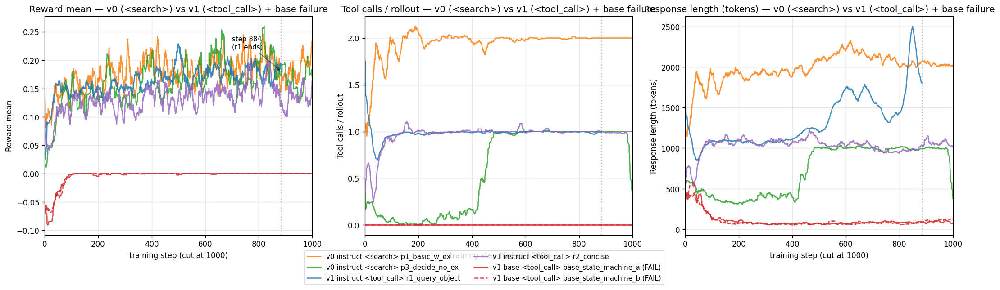

# Storyline (living document)

> A walkthrough of the project's narrative arc from Phase-1 ALICE runs through M5.1 H200 training to the picked-pair contribution, with every claim cross-referenced to file:line or paper, and a critical assessment of whether the result is defensible as a NeurIPS / ICLR submission. Living document; revise as M5.1 lands and as the picked pair runs. Companion: [`../report/SUPERVISOR_MEETING_2026-05-16_m0_to_6.md`](../report/SUPERVISOR_MEETING_2026-05-16_m0_to_6.md) is the supervisor brief; this file is the introspective working narrative.

**Status**: living. Initial author 2026-05-16; next revision when M5.1 lands.

## 0. The narrative arc in one paragraph

We started in April 2026 on a Qwen3-0.6B hybrid + verl + ALICE stack, replicating the ReSearch-paper recipe knob-for-knob. The base model could not bootstrap tool-use from cold start; the hybrid model could but the F1 + 0.1-partial-credit floor in the reward made tool-using and no-tool policies look nearly identical to the optimiser, so prompt design (not reward design) became the dominant lever; we ablated the prompt nine ways and saw three behavioural regimes (heavy-tool 2-call, standard 1-tool, total collapse) all clustered in a 0.16-0.22 reward band; the tag-token choice (`<search>` vs `<tool_call>`) made essentially no difference at equal step count; held-out eval on 7 benchmarks lifted EM 0.102 → 0.155 (+52 % rel) but the lift was concentrated on single-hop because 0.6B is multi-hop-capacity-bound. We then pivoted to NeMo-RL (verl does not support Qwen3.5) and Qwen3.5-0.8B (Qwen3.5-2B at the paper recipe projects to 55-85 days / run on 1× A100, infeasible at our budget); the M5.1 H200 a4 run is climbing through cadence 9 with reward 0.028 → 0.228 across 93 steps in the **shrink-and-improve regime** (length compresses 3× while reward grows, inverting the long-CoT regime familiar from math reasoning RL); the plateau at ~0.22-0.24 is structural (F1-only cannot distinguish chain-correct from token-aligned-by-luck rollouts). The picked-pair contribution turns this into a publishable result by running three reward variants (F1+0.1 / F1-only / EM-only) and evaluating every 10-step checkpoint of each run on all 7 benchmarks: ~15-20 checkpoints × 3 rewards × 7 benchmarks × 1-2 seeds = 315-840 eval data points. The framing is *efficient tool use from a hybrid model under realistic resource constraints*, not long-CoT reasoning, not a new algorithm.

## 1. Phase 0: prompt exploration on Qwen3-0.6B (M0_a, "run_1_4b")

### 1.1. Setup

29 verl-FSDP training runs on ALICE 1× A100-40GB across April 3 to 19. Two W&B project blocks: `research` (v0, 14 focus runs with paper `<search>` / `<result>` tags) and `research_revamp` (v1, 15 runs with `<tool_call>` / `<tool_response>` JSON tags). Model: Qwen3-0.6B (hybrid + base attempts). Training data: MuSiQue. Reward: paper-faithful ReSearch 3-tier (`0` if format broken, `0.1` if format-OK but F1=0, else `F1`).

Hyperparameters vs the paper recipe at 7B (per [`RESULTS_m0_a.md` §2](../report/RESULTS_m0_a.md#L62)): `max_response_length` halved 8192 → 4096; rollout width `n` reduced 5 → 3 to fit 1× A100-40GB. Everything else paper-matched.

The W&B tag `run_1_4b` covers the 9-run prompt-ablation block (most likely "0.6B-class model on the *4*0GB profile"; not "1.4B"). The five pre-tag setup runs are bring-up only: no full prompts captured in W&B notes, all under 1000 steps; not data points.

### 1.2. Eight qualifying runs at the 1000-step cut

Per the standardisation rule "include only runs with ≥ 1000 training steps; cut all to step 1000". 8 of the 9 prompt-ablation runs qualify; the 9th (`p0_paper_w_ex_fj9ew2ik`, 957 steps) sits 43 steps short and is excluded from the standardised view.

Step-1000 snapshot (last 100 steps moving mean to dampen noise):

| Alias | W&B label + run id | Reward | Tool calls | Resp. length | KL loss | Behaviour |
|---|---|---:|---:|---:|---:|---|
| p_0 | `p_minimal` (`un4quq94`) | 0.180 | 1.00 | 1130 | 0.20 | Standard 1-tool / 3-turn |
| p_1 | `p1_basic_w_ex` (`z7kcxfof`) | **0.193** | 2.00 | 2025 | 0.22 | **Heavy-tool 2-call / 4-turn** (Hamlet example anchors 2 searches) |
| p_2 | `p1_basic_no_ex` (`e8l6r2kd`) | 0.171 | 0.09 | 500 | 0.17 | **Tool-use collapse to ~0** |
| p_3 | `p2_basic2_w_ex` (`6dl2fz14`) | 0.179 | 1.00 | 1364 | 0.11 | Standard 1-tool / 3-turn |
| p_4 | `p2_basic2_no_ex` (`1cuveici`) | 0.163 | 0.00 | 657 | 0.14 | **Total tool collapse** |
| p_5 | `p3_decide_w_ex` (`0rjkbaa1`) | 0.184 | 1.00 | 1179 | 0.18 | Standard 1-tool / 3-turn |
| p_6 | `p3_decide_no_ex` (`el6s2d2h`) | 0.161 | 0.84 | 871 | 0.27 | Tool-use **survives example removal** (decision-rules scaffolding) |
| p_7 | `p4_think_w_ex` (`2jfi1l4c`) | 0.176 | 1.00 | 1112 | 0.16 | Standard 1-tool / 3-turn |

Data source: [`docs/report/archive/m0_a/csv/*.csv`](../report/archive/m0_a/csv/) (W&B-exported per-step traces). Extraction script + table at [`storyline_assets/m0_a_step1000_table.csv`](storyline_assets/m0_a_step1000_table.csv).


### 1.3. What the prompt sweep tells us

- **Three behavioural regimes emerge from prompt variation alone**: heavy-tool 2-call (`p_1` Hamlet-anchored), standard 1-tool (`p_0`, `p_3`, `p_5`, `p_7`), and total collapse (`p_2`, `p_4`). All at constant config (same model, same reward, same training data, same seed).
- **All reward in 0.16-0.22 band**. Tool-using rollouts cluster at 0.18-0.22, no-tool rollouts at 0.16-0.17. Gap = 3-6 pp. Prompt-driven behavioural swing = 0 → 2 tool calls and 500 → 2025 response length, a 9 pp *behavioural* swing. Prompt-design lever beats reward-design lever by ~3x.
- **Removing the example collapses tool-use unless the rules section carries the load**. Pairs (`p_1`/`p_2`, `p_3`/`p_4`, `p_5`/`p_6`) hold rules fixed and toggle the example. Pairs 1-2 and 3-4 collapse on `_no_ex`; pair 5-6 (decision-rules: "after each search, decide whether another is needed") survives. This is the cleanest finding in Phase-1.
- **Single seed everywhere**. The 3-6 pp tool/no-tool gap and the +0.025 reward improvement on `p_6` over `p_1` (read in the cross-prompt table) are both single-seed observations.

### 1.4. The five pre-tag setup runs (the user asked: are they important?)

**Not for the storyline.** Five runs predate `run_1_4b` and have no full prompts captured in W&B notes ([`RESULTS_m0_a.md` §9](../report/RESULTS_m0_a.md#L403)). Only `setup_run0_old_prompt` (464 steps) is mechanistically interesting: tool-use collapsed to 0, but reward still climbed 0.004 → 0.151 *via the partial-credit floor*. This is the first observation of the floor mechanism the rest of the project is built on; cited once, not analysed further.

## 2. The F1 + 0.1 floor masks the tool-use signal

### 2.1. What the reward formula does

The ReSearch-paper reward used in M0_a (verl-legacy `qa_em.py`; not the 6-tier `qa_em_format.py` Search-R1 also ships, per [CLAUDE.md "Gotchas"](../../claude/CLAUDE.md)):

```
reward = 0                  if format broken
       = 0.1                if format OK and F1 == 0
       = F1                 if format OK and F1 > 0
```

This is a discontinuity: F1 just above 0 reads `reward = F1` (which may be below 0.1), but F1 exactly 0 reads 0.1. In practice this becomes `reward = max(F1, 0.1)` once normalised, which is the formula that produces the 0.18-0.22 band observed across all 9 runs.

### 2.2. Why this masks the tool-use signal: a math example

GRPO computes per-rollout advantage as `(reward_i - group_mean) / group_std`. With G=5 rollouts on a hard MuSiQue prompt where most rollouts produce wrong-but-well-formatted answers:

**Group A (typical hard prompt, no tool helps; all 5 rollouts at floor)**:

| Rollout | Tool calls | F1 | Reward |
|---|---:|---:|---:|
| 1 | 0 | 0.00 | 0.10 (floor) |
| 2 | 1 | 0.05 | 0.10 (clamped up) |
| 3 | 2 | 0.07 | 0.10 (clamped up) |
| 4 | 0 | 0.00 | 0.10 (floor) |
| 5 | 1 | 0.04 | 0.10 (clamped up) |

Group mean = 0.10. Group std = 0. **All advantages are 0** (or NaN; GRPO returns 0 advantage when std collapses). The optimiser sees **no signal**: a rollout that fired 2 tool calls and retrieved partial evidence (F1=0.07) gets the same gradient as a rollout that emitted "I think the answer is X" with no tool calls and F1=0. **Tool-use behaviour and no-tool behaviour are indistinguishable to the gradient.**

**Group B (one rollout breaks above the floor)**:

| Rollout | Tool calls | F1 | Reward |
|---|---:|---:|---:|
| 1 | 0 | 0.00 | 0.10 |
| 2 | 1 | 0.05 | 0.10 |
| 3 | 2 | 0.15 | **0.15** |
| 4 | 0 | 0.00 | 0.10 |
| 5 | 1 | 0.08 | 0.10 |

Group mean = 0.11. Group std = 0.020. Advantage for rollout 3 = (0.15 - 0.11) / 0.020 = **+2.0σ**; the other four are **-0.5σ** each. The gradient flows, but only for the one rollout that broke through.

**Group C (no floor; F1-only reward)**:

| Rollout | Tool calls | F1 | Reward |
|---|---:|---:|---:|
| 1 | 0 | 0.00 | 0.00 |
| 2 | 1 | 0.05 | 0.05 |
| 3 | 2 | 0.07 | 0.07 |
| 4 | 0 | 0.00 | 0.00 |
| 5 | 1 | 0.04 | 0.04 |

Group mean = 0.032. Group std = 0.029. Advantages: rollout 1 = -1.10σ, rollout 2 = +0.62σ, rollout 3 = **+1.31σ**, rollout 4 = -1.10σ, rollout 5 = +0.27σ. **Now the tool-use signal is discriminative even when no rollout broke F1=0.15.**

### 2.3. How often does the floor bite?

[`RESULTS_m0_a.md` §7](../report/RESULTS_m0_a.md#L367) back-calculates that with an observed end-of-run reward of 0.16-0.22 against a 0.10 floor, only **6-12 % of rollouts get a non-zero F1 hit on top of the floor**. The remaining 88-94 % of rollouts are at the 0.10 floor regardless of what they did with the tool. The floor masks the tool-use signal across roughly 9 of every 10 rollouts at this model size and dataset.

### 2.4. What this means for the M5.1 / picked-pair design

M5.1 was set up with **F1-only** (no floor), explicitly because Phase-1 Finding 1 named this mechanism. The picked-pair experiment C re-tests the floor by running all three variants (F1+0.1, F1-only, EM-only) on the M5.1 recipe to produce the first ablation-grade evidence at 0.8B.

### 2.5. Where this sits in the 2026 literature

- **ReSearch ([arXiv:2503.19470](https://arxiv.org/abs/2503.19470))** uses this reward formula but does not ablate the floor. Their [paper note §"Takeaways"](../papers/2503.19470_research.md#L77) flags the floor as "the load-bearing detail presented in the paper without comment".
- **arXiv:2602.19526 "How to Train Your Deep Research Agent?" (Feb 2026)** ablates EM vs F1 vs F1+action-penalty in Search-R1 at 3B+ and finds F1+action-penalty wins. They do **not** ablate the partial-credit floor specifically. Our experiment is the small-model / single-GPU / no-format-reward complementary point ([`LITERATURE_GAP_AUDIT_2026-05-16.md` Tier 1 #1](LITERATURE_GAP_AUDIT_2026-05-16.md#1-how-to-train-your-deep-research-agent--arxiv260219526-feb-2026)).
- **JustRL ([arXiv:2512.16649](https://arxiv.org/abs/2512.16649), ICLR 2026 blogpost)** is the "tricks may hurt" finding; minimal recipe beats layered. F1-only sits in their philosophical lane.
- **IGPO / TIPS / IG-Search / Search-P1** define the 2026 dense-credit-shaping trend; we argue F1-only is *deliberate minimalism* against this trend, motivated by the floor mechanism.

## 3. Base-model attempts fail (M0_b)

### 3.1. What we observed

Five Qwen3-0.6B-Base training attempts in the v1 block, all at the `<tool_call>` JSON tag format. **All five stayed at `tool_call_counts/mean = 0` throughout training** ([`RESULTS_m0_b.md` §1](../report/RESULTS_m0_b.md#L19); CSVs at [`m0_b/csv/base_state_machine_*.csv`](../report/archive/m0_b/csv/), [`base_with_example_*.csv`](../report/archive/m0_b/csv/)).

Step-1000 snapshot (qualifying runs only):

| Run | Steps | Reward | Tool calls | Resp. length | Note |
|---|---:|---:|---:|---:|---|
| `base_state_machine_a` | 2301 | -0.00002 | **0.00** | 91 | 0 tool calls across all 2301 steps |
| `base_state_machine_b` | 2301 | -0.00002 | **0.00** | 116 | 0 tool calls across all 2301 steps |
| `base_breakthrough` | 2301 | 0.7 | 0.00 | n/a | **Excluded**: reward-function code-change artifact, not learning (per CLAUDE.md gotcha #2) |
| `base_with_example_a` | 115 | n/a | 0 | crashed | response_length collapsed → 1 token, then crashed |
| `base_with_example_b` | 204 | n/a | 0 | crashed | same failure mode |

### 3.2. Citations

The base-model failure is consistent with two papers:

- **R1-Searcher ([arXiv:2503.05592](https://arxiv.org/abs/2503.05592))** introduces a two-stage curriculum (Stage 1: format-RL; Stage 2: outcome-RL) explicitly because outcome-only RL fails to bootstrap base-model tool-use. Their result is on Qwen2.5-7B-Base; we observe the same failure mode more acutely at Qwen3-0.6B-Base. The takeaway in [`papers/2503.05592_r1-searcher.md` §"Takeaways"](../papers/2503.05592_r1-searcher.md#L75): *"Stage 1 solves the cold-start problem we hit in Phase-1 base-model attempts"*.
- **DGPO / Compact LMs Search Like Agents ([arXiv:2508.20324](https://arxiv.org/abs/2508.20324) v4, Apr 2026)** argues **0.5-1B agentic RAG fails under pure RL** and proposes distillation-guided GRPO. Our 5/5 failures at 0.6B-Base are the failure mode they characterise.

### 3.3. Why we stay on hybrid

The Qwen3 / Qwen3.5 *hybrid* checkpoint was post-trained on a mix of instruct + reasoning data and carries a chat template plus a tool-use prior; the base checkpoint has neither. The hybrid bootstraps `<tool_call>` emission from the format prior (zero-shot). The base cannot, and we do not have the budget for an SFT cold-start stage (which would add ~50-100 H100-hours to each training run). Hybrid stays as our anchor model for the rest of the project.

## 4. Tag tokens (`<search>` vs `<tool_call>`) cost essentially nothing

### 4.1. The comparison

The v0 block used the paper's `<search>` / `<result>` tags (ReSearch-style, invented for the paper); the v1 block introduced `<tool_call>` / `<tool_response>` JSON tags (Qwen-native, in-distribution for the post-trained model). The cleanest A/B is at equal step count.

`r1_query_object` (v1 `<tool_call>`) ran to step 884 (the shortest qualifying run); the longer-training runs are cut at step 884 for the comparison:

| Run | Step | Reward | Tool calls | Resp. length |
|---|---:|---:|---:|---:|
| v0 `p1_basic_w_ex` (`<search>`, heavy-tool 2-call) | 884 | 0.192 | 2.00 | 2027 |
| v0 `p3_decide_no_ex` (`<search>`, 1-tool decision-rules) | 884 | **0.199** | 1.00 | 992 |
| v1 `r1_query_object` (`<tool_call>` JSON) | 884 | **0.180** | 0.99 | 1914 |
| v1 `r2_concise` (`<tool_call>` JSON, shorter prompt) | 884 | 0.151 | 1.00 | 982 |
| v1 `base_state_machine_a` (base, fail) | 884 | -0.00002 | 0.00 | 85 |
| v1 `base_state_machine_b` (base, fail) | 884 | -0.00007 | 0.00 | 74 |



### 4.2. Reading the comparison

- v0 best at step 884 = 0.199 (`p3_decide_no_ex`); v1 best at step 884 = 0.180 (`r1_query_object`). **Gap ~1-2 pp.** Well within the 3-6 pp tool-use signal noise band (§2.3).
- The v1 `r2_concise` lower number (0.151) is **prompt-design variance, not tag-format variance**; the prompt is shorter and lacks the explicit JSON-arg example that `r1_query_object` carries.
- The v0 `p1_basic_w_ex` heavy-tool variant (0.192) sits between the two; the heavy-tool regime is a prompt artifact (Hamlet 2-search example), not a tag-format artifact.

The conclusion is **softer than the original verbal phrasing ("tokens don't matter") but holds**: tag-token format costs ≤ 2 pp reward at equal step count, which is within prompt-design variance. The choice is dictated by which format keeps the model in-distribution for inference; for Qwen3.5 that is the canonical `<tool_call>` form ([`MILESTONE_4.md` M4.1 lock](../milestone_4/MILESTONE_4.md)).

## 5. Held-out 7-benchmark eval of v0 GRPO checkpoints (M3 / M3.1)

### 5.1. M3 (the `p1_basic_w_ex` checkpoint)

Two v0 GRPO checkpoints were evaluated on the 7-benchmark Search-R1 suite at full Plan A scale (51,713 items / variant, greedy decode, 1× A100-80GB; pipeline frozen at [`CODE_SETUP_m3.md`](../report/CODE_SETUP_m3.md) §3).

| Variant | Bamboogle | NQ | TriviaQA | PopQA | HotpotQA | 2Wiki | MuSiQue | Avg EM |
|---|---:|---:|---:|---:|---:|---:|---:|---:|
| pre-GRPO Qwen3-0.6B hybrid | 0.056 | 0.113 | 0.178 | 0.133 | 0.083 | **0.141** | 0.010 | 0.102 |
| v0 `p1_basic_w_ex` GRPO checkpoint (`z7kcxfof`) | **0.088** | **0.191** | **0.302** | **0.227** | **0.116** | 0.138 | **0.023** | **0.155** |
| Δ EM | +0.032 | +0.078 | +0.124 | +0.094 | +0.033 | −0.003 | +0.013 | **+0.053 (+52 % rel)** |

Source: [`RESULTS_m3.md` §6 + §9](../report/RESULTS_m3.md#L233).

### 5.2. The pareto effect: parametric memory drives the single-hop lifts

Lifts are concentrated on single-hop QA: NQ +0.078 EM (+69 %), TriviaQA +0.124 EM (+70 %), PopQA +0.094 EM (+71 %). Multi-hop datasets dampen: HotpotQA +0.033 EM (+40 %), 2WikiMultiHopQA −0.003 EM (essentially tied), MuSiQue +0.013 EM (doubles in relative but small absolute).

The user's intuition that this is a "pareto effect maybe because of parametric memory" is correct in spirit. The mechanism: at 0.6B parameters, the model carries enough parametric memory to answer a single fact lookup *once retrieval has surfaced the right entity* (NQ, PopQA, TriviaQA shapes); it lacks the capacity to compose two retrieved facts into a multi-hop answer (HotpotQA, 2Wiki, MuSiQue shapes). GRPO + retrieval reinforces the *retrieval + lookup* sub-skill which transfers cleanly to single-hop; the *compose-two-facts* sub-skill is upstream-bound by model capacity, not training. The pareto-style "lift everywhere except multi-hop" shape is the signature of this capacity bound, which [`RESULTS_m3.md` §10.2](../report/RESULTS_m3.md#L250) names as "multi-hop is capacity-bound, not training-bound at 0.6B".

### 5.3. M3.1 (the `p3_decide_no_ex` checkpoint)

Run id `el6s2d2h`; the prompt that survived example removal. Avg EM 0.169 vs M3 baseline 0.155 (+0.014 abs, +9 % rel held-out EM). ACC and F1 widen the gap to +12 % and +14 % rel ([`RESULTS_m3.md` §14.4-14.5](../report/RESULTS_m3.md#L381)). The no-example + decision-rules combination genuinely produces higher-quality answers, just not always within EM strict-match.

### 5.4. Caveat: reward keeps climbing even without tool-use

The user flagged: "we saw that even without tooluse the reward was climbing because of the reward format floor at this level". This is correct and is the cross-reference to §2: `setup_run0_old_prompt` (464 steps; tool-use collapsed to 0) had reward climb 0.004 → 0.151 entirely from the floor mechanism. Same shape appears in `p1_basic_no_ex` (0.169 reward at step 1000 with tool calls at 0.09; the model abandoned the tool but reward still grew because format-OK rollouts pull 0.10 / rollout).

## 6. Migration to NeMo-RL + Qwen3.5

### 6.1. Why we left verl + Qwen3-0.6B

Two compounding constraints surfaced:

- **Verl does not support Qwen3.5** ([`training/VERL_REFERENCE.md`](../training/VERL_REFERENCE.md) gotcha; CLAUDE.md gotcha). Verl's RMPad allowlist excluded Qwen3 until late, and Qwen3.5's hybrid GatedDeltaNet `linear_attention` layers do not flow through verl's varlen path at all ([`research/QUESTIONS.md` Q1](../research/QUESTIONS.md#q1-sequence-packing-in-verl-and-nemo-rl-works-with-qwen3-not-qwen35)).
- **Qwen3-0.6B is multi-hop-capacity-bound** (§5.2). To get a model that can compose two retrieved facts we need at least ~2B parameters.

NeMo-RL is the only framework with first-class Qwen3.5 support (DTensor V2 + dynamic batching workaround for the GDN kernel issue). M2 ported the Search-R1 GRPO loop to NeMo-RL with 15 reward-parity tests passing ([`milestone_2/MILESTONE_2.md`](../milestone_2/MILESTONE_2.md), [`training/SMOKE_RESULTS_2026-05-06.md`](../training/SMOKE_RESULTS_2026-05-06.md)).

### 6.2. The 3B comparison baseline (clarification: this is Search-R1 3B, not R1-Searcher)

The user's verbal description was "we tried eval of R1-Searcher 3B as a baseline (branch `plan-a-eval`)". The actual content on [`origin/plan-a-eval`](https://github.com/GaurisankarJ/reason_over_search/tree/plan-a-eval) is the **Search-R1** 3B baseline (`PeterJinGo/SearchR1-nq_hotpotqa_train-qwen2.5-3b-em-grpo` and `-it-em-grpo`), not R1-Searcher. R1-Searcher is a different paper ([arXiv:2503.05592](https://arxiv.org/abs/2503.05592)) we cite only for the base-model-failure motivation (§3.2). I am preserving "Search-R1 3B" in this document; flagging the verbal mix-up so the supervisor brief and any future paper draft are clean.

Search-R1 3B Plan-A numbers (1 seed × 7 datasets × 3 variants, 8× RTX 4090, 1 h 52 min wall, from [`origin/plan-a-eval`'s `docs/eval/plan_a_8gpu/RESULTS.md`](https://github.com/GaurisankarJ/reason_over_search/blob/plan-a-eval/docs/eval/plan_a_8gpu/RESULTS.md)):

| Variant | Bamboogle | NQ | TriviaQA | PopQA | HotpotQA | 2Wiki | MuSiQue | Grand-mean EM |
|---|---:|---:|---:|---:|---:|---:|---:|---:|
| `qwen_25_3b_instruct` (raw, no GRPO) | 0.160 | 0.197 | 0.405 | 0.235 | 0.178 | 0.177 | 0.043 | **0.199** |
| Search-R1 GRPO `base` | 0.120 | 0.390 | **0.576** | 0.339 | 0.280 | 0.257 | 0.051 | **0.288** |
| Search-R1 GRPO `instruct` | **0.320** | 0.394 | 0.533 | 0.350 | **0.335** | **0.330** | **0.124** | **0.341** |

### 6.3. Why this is the right comparator

For the picked-pair contribution: we are training a 0.8B model with the F1 / F1+0.1 / EM-only reward variants. The relevant **3B reference points** are:
- Raw Qwen2.5-3B-Instruct (no GRPO): 0.199 EM avg, the "untrained 3B floor".
- Search-R1 GRPO 3B-Instruct: 0.341 EM avg, the "trained 3B ceiling" at the same Search-R1 eval protocol.

Our 0.8B M5.1-final + 7-benchmark eval lands somewhere on this map. If it beats raw Qwen2.5-3B-Instruct, that is the "0.8B catches up to 3B without GRPO" claim. If it lands above 0.20 EM avg the comparison is non-trivial. Direct head-to-head against Search-R1 GRPO 3B (0.341 EM) is the gold standard but not realistic at 0.8B; the takeaway frames as "approaching 3B-raw at half the parameter budget".

### 6.4. Qwen3.5-2B is unaffordable; drop to 0.8B

Per [`training/PAPER_VS_OURS_TRAINING.md` §7](../training/PAPER_VS_OURS_TRAINING.md#L131): running the paper's 3-epoch schedule with `num_prompts_per_step=512` and `gbs=256` on 1× A100 would take **55-85 days / run** (~\$1,600-2,400) for Qwen3.5-2B at the smoke-anchored ~57 s / step. Even our reduced 0.6-epoch budget (1005 steps × 102 prompts/step) projects to **11-17 d / run, ~\$300-490 / run** on 1× A100.

The user's verbal phrasing was "85 days on an A100 after running a few steps in smoke tests". This is **the upper bound of the 55-85 day range** for the paper-faithful 3-epoch schedule, not our affordable 0.6-epoch shape. Either way, Qwen3.5-2B is **infeasible** for the picked-pair ablation (3 reward variants × ≥10 d = 30 d wall-clock, ~\$900-1200).

Drop to Qwen3.5-0.8B: ~3× smaller per-step cost, fits the picked-pair budget envelope.

## 7. M5.1 training: Qwen3.5-0.8B GRPO at the ReSearch-paper recipe (live)

### 7.1. Setup (intentional divergences from the paper)

- **Model**: Qwen3.5-0.8B hybrid.
- **Reward**: F1-only on `<answer>X</answer>` content (no format reward, no partial-credit floor). Phase-1 Finding 1 motivated this explicitly.
- **No `\boxed{}` wrapper** (M4 prompt-mode lock).
- **Training data**: MuSiQue only (the hardest of the four ReSearch benchmarks).
- **Substrate**: Spheron 1× H200 (a4 run, after a3 crash on B200 sm_100 kernel immaturity) with persistent volume `miletone5`.
- **Other knobs**: paper-matched (G=5 rollouts/prompt, batch shape, learning rate). Full clause-by-clause map at [`milestone_5/PAPER_VS_OURS_M5.md`](../milestone_5/PAPER_VS_OURS_M5.md).

### 7.2. The live trajectory (cadence 1-9, through 2026-05-16 ~12:30 UTC)

| Cadence | Steps | Reward window-mean | rew > 0 | Tool calls | Token mean | Step wall (min) |
|---:|:---:|:---:|:---:|:---:|:---:|:---:|
| 1 | 1-13 | 0.028 → 0.110 | 8 → 20 % | 8.96 → 5.2 | 7038 → 4500 | 18:22 → 6:04 |
| 2 | 14-22 | 0.119 → 0.132 | 22 % | 5.2 → 4.0 | 4500 → 2700 | 5:36 |
| 3-4 | 23-50 | 0.140 → 0.171 | 27 → 35 % | 3.8 → 3.5 | 2700 → 2200 | 5:50 |
| 5 | 51-60 | 0.202 | 38 % | 3.5 | 2200 | 6:00 |
| 6 | 61-70 | **0.224** | 40 % | 3.5 | 2200 | 6:10 |
| 7 | 71-80 | 0.202 | 39 % | 3.5 | 2200 | 6:30 |
| 8 | 81-90 | 0.221 | 43 % | 3.4 | 2200 | 6:30 |
| 9 | 91-93 | **0.228** | 46 % | 3.4 | 2150 | 6:40 |

Source: [`RESULTS_M5_1_H200.md` §8](../report/RESULTS_M5_1_H200.md#8-live-trajectory).

### 7.3. The shrink-and-improve regime (Phase-1 Finding 3 confirmed)

Tool calls compressed 8.96 → ~3.4 (close to MuSiQue's ground-truth ~3-hop chain length); token mean compressed 7038 → ~2200 (3.2×); reward grew 8× from cold start. The regime **inverts the long-CoT regime** of math reasoning RL (where length grows with reward).

This is the user's "efficient tool user from a hybrid model, not a long reasoning chain model" framing, **confirmed**. The hybrid model is post-trained with both instruct and reasoning data; under outcome-only F1 reward on a retrieval-augmented task it sheds verbose reasoning (which carries no reward) and tightens to ~3 search calls (which carry reward via retrieved evidence). This is structurally distinct from R1-style post-training where reasoning length is rewarded and grows unbounded.

### 7.4. The plateau is structural (F1 ceiling)

Cadences 6-9 sit in the 0.20-0.24 band. Trace analysis at [`RESULTS_M5_1_H200.md` §9.5](../report/RESULTS_M5_1_H200.md#95-f1-reward-ceiling-the-structural-plateau-cause--chain-quality-reward-designs-added-2026-05-16-post-cadence-9) identifies the cause: F1-only gives identical scalar reward to chain-correct rollouts and chain-broken-but-token-aligned-by-luck rollouts. Cadence-9 step 93 idx 10 ("Fox Island / Pan-African Conference") earned reward 1.0 with `<answer>United Kingdom</answer>` despite an internally contradictory chain (model first concluded "United States of America", then silently flipped). Cadence-9 step 91 idx 241 earned reward 1.0 with a chain-clean trace. **Both reward 1.0; the optimiser cannot disambiguate.**

This is **the M5.1 plateau cause**, and it is **the picked-pair experiment C's motivation** at 0.8B specifically. M8 ([`milestone_8/MILESTONE_8.md`](../milestone_8/MILESTONE_8.md)) is the chain-consistency reward extension that addresses it; out of scope for the thesis-deadline picked pair.

## 8. The picked-pair contribution: per-checkpoint × 7-benchmark × 3-reward trajectory eval

### 8.1. What we have set up

M5.1 saves a checkpoint every 10 training steps. Over the planned 150-200-step run, that is **15-20 checkpoints per training run**. The picked pair runs **3 reward variants** (F1+0.1, F1-only, EM-only) × **1-2 seeds** = **3-6 runs**. Each run produces 15-20 checkpoints; each checkpoint is evaluated on **7 benchmarks** with the M3 / M4 protocol.

Total eval data points: **3 rewards × 15-20 checkpoints × 7 benchmarks × 1-2 seeds = 315-840 data points**.

### 8.2. What this lets us see (the novelty boost)

Most prior work (Search-R1, ReSearch, R1-Searcher, the Tier-2 dense-reward cluster) reports **endpoint metrics only**: pretrained vs final checkpoint, 7 benchmarks, one number per cell. We will instead report **trajectories** per reward variant per benchmark: how does the held-out EM curve evolve as training progresses, and does the reward shape change the trajectory shape (not just the endpoint)?

Specific hypotheses the per-checkpoint trajectory can test:

| Hypothesis | What the trajectory data would show |
|---|---|
| H1: F1-only learns faster than F1+0.1 because the floor wastes early gradient | F1-only curve climbs sooner on held-out EM than F1+0.1 |
| H2: EM-only is sparse-reward at 0.8B and never bootstraps | EM-only curve stays flat throughout (this is the pre-flight smoke check) |
| H3: Reward shape changes *which benchmarks* improve first, not the endpoint | Per-benchmark trajectories diverge; e.g. F1+0.1 may rescue MuSiQue (3-hop) where partial-credit-floor stabilises learning |
| H4: Held-out generalisation tracks training reward 1-to-1 | Held-out curves are proportional to training reward; if not, reward design changes generalisation not just optimisation |

H1 + H2 + H3 + H4 are four claims that are *each* publishable. The per-checkpoint × per-benchmark × per-reward matrix is **the contribution**, not the final-EM number.

### 8.3. Comparison anchors for the trajectory

- **Upper anchor**: Search-R1 GRPO 3B-instruct at 0.341 EM avg (§6.2).
- **3B raw anchor**: Qwen2.5-3B-Instruct at 0.199 EM avg.
- **Untrained 0.8B floor**: Qwen3.5-0.8B hybrid at 0.057 EM avg ([`RESULTS_m4.md` §5](../report/RESULTS_m4.md#L67)).
- **0.6B trained reference**: Qwen3-0.6B + v0 GRPO + `p1_basic_w_ex` at 0.155 EM avg (§5.1).

If the M5.1-F1-only trajectory ends at ~0.15-0.20 EM avg, the headline claim is "0.8B trained with F1-only on MuSiQue matches 0.6B trained with paper-faithful reward on MuSiQue, and approaches the 3B raw baseline." If it ends at ~0.25-0.30, it is "0.8B trained on MuSiQue clears 3B raw + approaches 3B GRPO at 1/4 the parameter budget."

## 9. The thesis-paper story (compact)

**One sentence**: at sub-1B scale on retrieval-augmented multi-hop QA, the ReSearch partial-credit reward floor masks tool-use signal at training time but its removal does not by itself close the F1 chain-quality blindness; the resulting plateau is structural, and the small-model regime exhibits a *shrink-and-improve* training-dynamic distinct from the long-CoT regime familiar from math reasoning RL.

**Three contributions** (in priority order):

1. **Per-checkpoint × per-benchmark × per-reward trajectory** ablation at 0.8B (§8). The first such trajectory-grade evidence at sub-1B in the search-tool RL literature.
2. **Mechanism story for the F1+0.1 floor masking tool-use signal**, with a worked math example (§2) and the M5.1 cadence-9 plateau as a 0.8B re-observation of the Phase-1 0.6B finding.
3. **Regime characterisation**: shrink-and-improve at sub-1B retrieval-augmented RL inverts the long-CoT regime of math reasoning RL (§7.3). DGPO's "0.5-1B fails under pure RL" motivation is consistent with our base-model failures (§3) but not predictive of our hybrid-model success.

## 10. Critical assessment: is this a defensible NeurIPS paper?

The user asked for honesty. Here it is.

### 10.1. What works

| Claim | Strength | Evidence |
|---|---|---|
| Mechanism story for floor masking | Strong | §2 math example + Phase-1 cross-prompt data + M5.1 plateau re-observation |
| Per-checkpoint trajectory matrix | Very strong if executed | §8 set up; 315-840 data points if all 3 rewards × 1-2 seeds × 7 benchmarks × 15-20 ckpts complete |
| Phase-1 prompt-design data | Solid | 8 standardised runs, 9-pp behavioural swing on prompt design alone |
| 0.8B scale framing | Honest | DGPO + LiteResearcher + the project's own M4 floor data |
| Shrink-and-improve framing | Suggestive | M5.1 cadence 1-9 trajectory; would need a contrastive long-CoT baseline to be a *regime claim* vs an observation |

### 10.2. What does not work for NeurIPS main

| Gap | Severity | Fix |
|---|---|---|
| **Single seed everywhere** | High | Picked pair includes 1-2 seeds on at least one run; still single-seed elsewhere. NeurIPS reviewer asks: where is the variance bar? |
| **No Tree-GRPO head-to-head** | High | Tree-GRPO at ICLR 2026 is the natural rollout-efficiency comparator. Porting their tree-search to NeMo-RL busts the budget. Acknowledged as future work, but reviewer 2 will hammer regardless |
| **Partial scoop by arXiv:2602.19526** | Medium-High | Their work ablates EM vs F1 vs F1+action-penalty at 3B+. Ours adds 0.8B + the 0.1-floor specifically + per-checkpoint trajectory. The novelty narrows to those three differences and the per-checkpoint matrix is the load-bearing one |
| **No 2B / 7B confirmatory** | Medium | Reviewer asks "does this scale". Acknowledged future work; the framing is "the small-scale regime is the contribution" |
| **No SFT cold-start ablation** | Medium | R1-Searcher motivates stage-1 SFT. Reviewer asks "what if you used SFT? does that close the 3B gap?". The 0.6-epoch budget cannot fit an extra stage |
| **F1+0.1 vs F1-only difference may be small** | Medium | At 0.8B on MuSiQue, the floor masks roughly 9 of 10 rollouts. If F1-only learning rate is only marginally better, the contribution loses its sharpest knob. Mitigation: the trajectory analysis still publishes either way |
| **Action-penalty variants not ablated** | Medium-Low | arXiv:2602.19526 found F1+action-penalty wins; we do not include it. Add to the future-work section explicitly |
| **Cross-family Qwen3 → Qwen3.5 degradation unexplained** | Low-Medium | M4 surfaced this; we do not have a mechanism. Negative result with no mechanism = related-work line, not a chapter section |
| **Shrink-and-improve is observation-grade, not regime-grade** | Low-Medium | Needs a contrastive long-CoT GRPO baseline at equivalent compute. Out of budget. Frame as "characterisation of the regime we observe", not "the regime exists in contrast to a measured long-CoT baseline" |

### 10.3. Honest venue ranges (sharpened from PICKED_PAIR.md §3 with the per-checkpoint trajectory addition)

| Venue | Probability | Why the trajectory matrix changes the number |
|---|---|---|
| **ICLR blogpost** (the JustRL template) | very plausible (~80-90 %) | Trajectory plots are exactly what a blogpost can carry visually; single mechanism-named takeaway + small-model + project's own measurements |
| **Workshop** (NeurIPS R0-FoMo / ICLR Reasoning / Agentic-RL workshops) | 65-80 % | The trajectory matrix is the kind of analysis workshop reviewers find valuable; "training-dynamics characterisation" is a venue-positive framing |
| **Findings of ACL / EMNLP** | 45-65 % | Either outcome of H1-H4 fits Findings; the trajectory matrix is novel enough to clear the bar |
| **ICLR / ACL / EMNLP main** | 20-30 % | Mechanism-named takeaway + concrete trajectory contribution; still hampered by the head-to-head and seed-variance gaps |
| **NeurIPS main** | 8-15 % | The trajectory adds substance but the head-to-head + seed-variance + scale gaps dominate the NeurIPS bar. Honest verdict: do not optimise for NeurIPS main |

### 10.4. What would lift the venue

In rough priority + cost order:

1. **Add a third seed** on at least the F1-only run (the most-defended variant). Adds ~5 days wall-clock and ~\$80. Closes the no-multi-seed-anywhere cross-cutting gap.
2. **Port Tree-GRPO's prefix-sharing rollout to NeMo-RL** and run a head-to-head at the same compute. ~10-15 days engineering + ~\$200 compute. Closes the ICLR-2026-comparator gap.
3. **Run a 2B confirmatory** at 200 steps using the F1-only recipe. ~\$300-400. Closes the scale-up gap with a single data point.
4. **Add F1+action-penalty as a fourth reward variant**. ~5 days, ~\$80. Closes the arXiv:2602.19526 gap.
5. **Add a long-CoT contrastive baseline** (e.g., math GRPO at equivalent compute) to anchor the shrink-and-improve regime claim. ~10 days, ~\$200. Out of scope for thesis.

Items (1) and (4) are cheap and bring the ICLR / ACL main probability from 20-30 % to ~30-40 %. Item (2) is the big-ticket lift and brings NeurIPS from 8-15 % to ~20-25 %.

### 10.5. The honest pitch

For the **thesis** (deadline 2026-06-15): the work clears the bar comfortably. The trajectory matrix is more substantive than most thesis chapters in this lit; the mechanism story is named and grounded; the regime claim is supportable with the caveat acknowledged. The supervisor brief at [`../report/SUPERVISOR_MEETING_2026-05-16_m0_to_6.md`](../report/SUPERVISOR_MEETING_2026-05-16_m0_to_6.md) captures the thesis-grade narrative.

For a **post-thesis publication** (NeurIPS 2026 / ICLR 2027 / ACL 2027 / EMNLP 2026): aim for **ICLR blogpost or workshop first**, with Findings as a Cycle-2 target. Skip NeurIPS main unless one of the §10.4 lifts lands first. The ICLR blogpost template ([JustRL](https://arxiv.org/abs/2512.16649) is the canonical example) is built around exactly this kind of "characterisation + mechanism + trajectory plot" structure.

## 11. Open decision points

1. **User pick #2** (per [`PICKED_PAIR.md` §6](PICKED_PAIR.md#6-decision-needed-from-the-user)): defensive C+R or ambitious C+M.
2. **Seed budget**: 1 seed across all 3 reward variants, or 2 seeds on F1-only + 1 seed on the other two?
3. **Eval cadence**: every 10 steps × 7 benchmarks = 140 eval-data-points per training run; expensive. Could drop to every 20 steps × 7 benchmarks = 70 points / run for the same trajectory shape at lower resolution.
4. **Long-CoT baseline**: do we run one (~10 d, ~\$200) to make the regime claim defensible, or accept observation-grade framing for the thesis?

## Cross-references

- M5.1 live status: [`../report/RESULTS_M5_1_H200.md`](../report/RESULTS_M5_1_H200.md).
- Phase-1 source data: [`../report/archive/m0_a/csv/`](../report/archive/m0_a/csv/), [`../report/archive/m0_b/csv/`](../report/archive/m0_b/csv/).
- Search-R1 3B Plan-A eval: [`origin/plan-a-eval`'s `docs/eval/plan_a_8gpu/RESULTS.md`](https://github.com/GaurisankarJ/reason_over_search/blob/plan-a-eval/docs/eval/plan_a_8gpu/RESULTS.md).
- M3 / M3.1 held-out 7-benchmark eval: [`../report/RESULTS_m3.md`](../report/RESULTS_m3.md).
- M4 untrained Qwen3.5-0.8B floor: [`../report/RESULTS_m4.md`](../report/RESULTS_m4.md).
- M6 picked pair: [`PICKED_PAIR.md`](PICKED_PAIR.md), [`PUBLICATION_FRAMING.md`](PUBLICATION_FRAMING.md).
- M8 chain-consistency reward extension (out of scope for the picked pair, but the M5.1 plateau motivates it): [`../milestone_8/MILESTONE_8.md`](../milestone_8/MILESTONE_8.md).
- Supervisor brief (M0 to M6): [`../report/SUPERVISOR_MEETING_2026-05-16_m0_to_6.md`](../report/SUPERVISOR_MEETING_2026-05-16_m0_to_6.md).
- Paper notes: [`../papers/2503.05592_r1-searcher.md`](../papers/2503.05592_r1-searcher.md), [`../papers/2503.09516_search-r1.md`](../papers/2503.09516_search-r1.md), [`../papers/2503.19470_research.md`](../papers/2503.19470_research.md).
