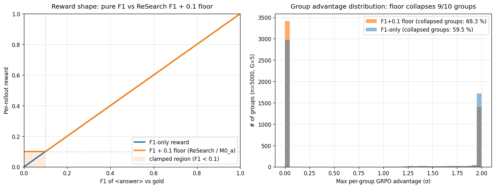

# Storyline (living document)

> A walkthrough of the project's narrative arc from Phase-1 ALICE runs through M5.1 H200 training (held at step_180) to the picked-pair contribution, with every claim cross-referenced to file:line or paper, and a critical assessment of whether the result is defensible as a NeurIPS / ICLR submission. Living document; major revision 2026-05-17 after M5.1 landed. Companion: [`../report/SUPERVISOR_MEETING_2026-05-17_m0_to_6.md`](../report/SUPERVISOR_MEETING_2026-05-17_m0_to_6.md) is the supervisor brief; this file is the introspective working narrative.

**Status**: living. Initial author 2026-05-16; M5.1-HOLD revision 2026-05-17.

## 0. The narrative arc in one paragraph (revised 2026-05-17)

We started in April 2026 on a Qwen3-0.6B hybrid + verl + ALICE stack, replicating the ReSearch-paper recipe knob-for-knob. The base model could not bootstrap tool-use from cold start; the hybrid model could but the F1 + 0.1-partial-credit floor in the reward made tool-using and no-tool policies look nearly identical to the optimiser, so prompt design (not reward design) became the dominant lever; we ablated the prompt nine ways and saw three behavioural regimes (heavy-tool 2-call, standard 1-tool, total collapse) all clustered in a 0.16-0.22 reward band; the tag-token choice (`<search>` vs `<tool_call>`) made essentially no difference at equal step count; held-out eval on 7 benchmarks lifted EM 0.102 → 0.155 (+52 % rel) but the lift was concentrated on single-hop because 0.6B is multi-hop-capacity-bound. We then pivoted to NeMo-RL (verl does not support Qwen3.5) and Qwen3.5-0.8B (Qwen3.5-2B at the paper recipe projects to 55-85 days / run on 1× A100, infeasible at our budget). M4 produced the untrained Qwen3.5-0.8B floor (hybrid 0.060 EM avg full Plan A, uniformly below Qwen3-0.6B by mean Δ −0.042; the cross-family degradation has no mechanism attached yet) and locked the prompt-mode asymmetrically (hybrid `qwen35_minimal`, base `qwen35_minimal_no_system`) after smoke iteration showed the auto-injected `# Tools` block crowded out the answer on the base variant. **M5.1 H200 a4 landed at step_180 on 2026-05-17 ~08:18 UTC** (HOLD, not crash; deliberate stop at 58 % of one MuSiQue epoch) with 18 cadences traced step-by-step ([`RESULTS_M5_1_H200.md` §8](../report/RESULTS_M5_1_H200.md#8-live-trajectory)); reward window-mean climbed 0.028 → **0.280 (cadence 11 peak)** in the **shrink-and-improve regime** (length compressed 3× while reward grew, inverting the long-CoT regime of math reasoning RL); the run then exhibited two **lean-drift-lean cycles** (over-search peaks at cadences 14 and 18; GRPO self-stabilised both times, second cycle damped). The plateau at ~0.22-0.28 is structural: F1-only reward gives identical scalar credit to chain-correct and chain-broken-but-token-aligned-by-luck rollouts, and the **empirical silent-flip rate sits in an 18-58 % band across all 18 cadences (180 training steps) with no decline as training progresses** (C1-C4 backfilled 2026-05-17 post-hold; the 28-32 % operating band is reached by C2, i.e. within the first 20 training steps, so the flip rate does not start low and rise: it starts in-band and stays in-band). Two concrete reward-1.0-via-broken-chain traces (Fox Island, World Cup) are now documented; ~11 % of all rollouts in cadence 12 onward are planned + reward-1.0 + chain-broken (Goodhart at scale). The picked-pair contribution turns this into a publishable result by running three reward variants (F1+0.1 / F1-only / EM-only) and evaluating every 10-step checkpoint of each run on all 7 benchmarks: ~15-20 checkpoints × 3 rewards × 7 benchmarks × 1-2 seeds = 315-840 eval data points. The framing is *efficient tool use from a hybrid model under realistic resource constraints*, not long-CoT reasoning, not a new algorithm.

## 1. Phase 0: prompt exploration on Qwen3-0.6B (M0_a, "run_1_4b")

### 1.1. Setup

29 verl-FSDP training runs on ALICE 1× A100-40GB across April 3 to 19. Two W&B project blocks: `research` (v0, 14 focus runs with paper `<search>` / `<result>` tags) and `research_revamp` (v1, 15 runs with `<tool_call>` / `<tool_response>` JSON tags). Model: Qwen3-0.6B (hybrid + base attempts). Training data: MuSiQue. Reward: paper-faithful ReSearch 3-tier (`0` if format broken, `0.1` if format-OK but F1=0, else `F1`).

Hyperparameters vs the paper recipe at 7B (per [`RESULTS_m0_a.md` §2](../report/RESULTS_m0_a.md#L62)): `max_response_length` halved 8192 → 4096; rollout width `n` reduced 5 → 3 to fit 1× A100-40GB. Everything else paper-matched.

The W&B tag `run_1_4b` covers the 9-run prompt-ablation block (most likely "0.6B-class model on the *4*0GB profile"; not "1.4B"). The five pre-tag setup runs are bring-up only: no full prompts captured in W&B notes, all under 1000 steps; not data points.

### 1.2. Eight qualifying runs at the 1000-step cut

Per the standardisation rule "include only runs with ≥ 1000 training steps; cut all to step 1000". 8 of the 9 prompt-ablation runs qualify; the 9th (`p0_paper_w_ex_fj9ew2ik`, 957 steps) sits 43 steps short and is excluded from the standardised view.

Step-1000 snapshot (last 100 steps moving mean to dampen noise):

| Alias | W&B label + run id | Reward | Tool calls | Resp. length | KL loss | Behaviour |
|---|---|---:|---:|---:|---:|---|
| p_0 | `p_minimal` (`un4quq94`) | 0.180 | 1.00 | 1130 | 0.20 | Standard 1-tool / 3-turn |
| p_1 | `p1_basic_w_ex` (`z7kcxfof`) | **0.193** | 2.00 | 2025 | 0.22 | **Heavy-tool 2-call / 4-turn** (Hamlet example anchors 2 searches) |
| p_2 | `p1_basic_no_ex` (`e8l6r2kd`) | 0.171 | 0.09 | 500 | 0.17 | **Tool-use collapse to ~0** |
| p_3 | `p2_basic2_w_ex` (`6dl2fz14`) | 0.179 | 1.00 | 1364 | 0.11 | Standard 1-tool / 3-turn |
| p_4 | `p2_basic2_no_ex` (`1cuveici`) | 0.163 | 0.00 | 657 | 0.14 | **Total tool collapse** |
| p_5 | `p3_decide_w_ex` (`0rjkbaa1`) | 0.184 | 1.00 | 1179 | 0.18 | Standard 1-tool / 3-turn |
| p_6 | `p3_decide_no_ex` (`el6s2d2h`) | 0.161 | 0.84 | 871 | 0.27 | Tool-use **survives example removal** (decision-rules scaffolding) |
| p_7 | `p4_think_w_ex` (`2jfi1l4c`) | 0.176 | 1.00 | 1112 | 0.16 | Standard 1-tool / 3-turn |

Data source: [`docs/report/archive/m0_a/csv/*.csv`](../report/archive/m0_a/csv/) (W&B-exported per-step traces). Extraction script + table at [`storyline_assets/m0_a_step1000_table.csv`](storyline_assets/m0_a_step1000_table.csv).


### 1.3. What the prompt sweep tells us

- **Three behavioural regimes emerge from prompt variation alone**: heavy-tool 2-call (`p_1` Hamlet-anchored), standard 1-tool (`p_0`, `p_3`, `p_5`, `p_7`), and total collapse (`p_2`, `p_4`). All at constant config (same model, same reward, same training data, same seed).
- **All reward in 0.16-0.22 band**. Tool-using rollouts cluster at 0.18-0.22, no-tool rollouts at 0.16-0.17. Gap = 3-6 pp. Prompt-driven behavioural swing = 0 → 2 tool calls and 500 → 2025 response length, a 9 pp *behavioural* swing. Prompt-design lever beats reward-design lever by ~3x.
- **Removing the example collapses tool-use unless the rules section carries the load**. Pairs (`p_1`/`p_2`, `p_3`/`p_4`, `p_5`/`p_6`) hold rules fixed and toggle the example. Pairs 1-2 and 3-4 collapse on `_no_ex`; pair 5-6 (decision-rules: "after each search, decide whether another is needed") survives. This is the cleanest finding in Phase-1.
- **Single seed everywhere**. The 3-6 pp tool/no-tool gap and the +0.025 reward improvement on `p_6` over `p_1` (read in the cross-prompt table) are both single-seed observations.

### 1.4. The five pre-tag setup runs (not data points)

The five runs predating `run_1_4b` are bring-up only and excluded from the standardised view: no full prompts captured in W&B notes ([`RESULTS_m0_a.md` §9](../report/RESULTS_m0_a.md#L403)), all under 1000 steps. Only `setup_run0_old_prompt` (464 steps) is mechanistically interesting: tool-use collapsed to 0, but reward still climbed 0.004 → 0.151 *via the partial-credit floor*. This is the first observation of the floor mechanism the rest of the project is built on; cited once, not analysed further.

## 2. The F1 + 0.1 floor masks the tool-use signal

### 2.1. What the reward formula does

The ReSearch-paper reward used in M0_a (verl-legacy `qa_em.py`; not the 6-tier `qa_em_format.py` Search-R1 also ships, per [CLAUDE.md "Gotchas"](../../claude/CLAUDE.md)):

```
reward = 0                  if format broken
       = 0.1                if format OK and F1 == 0
       = F1                 if format OK and F1 > 0
```

This is a discontinuity: F1 just above 0 reads `reward = F1` (which may be below 0.1), but F1 exactly 0 reads 0.1. In practice this becomes `reward = max(F1, 0.1)` once normalised, which is the formula that produces the 0.18-0.22 band observed across all 9 runs.

### 2.2. Why this masks the tool-use signal: a math example

GRPO computes per-rollout advantage as `(reward_i - group_mean) / group_std`. With G=5 rollouts on a hard MuSiQue prompt where most rollouts produce wrong-but-well-formatted answers:

**Group A (typical hard prompt, no tool helps; all 5 rollouts at floor)**:

| Rollout | Tool calls | F1 | Reward |
|---|---:|---:|---:|
| 1 | 0 | 0.00 | 0.10 (floor) |
| 2 | 1 | 0.05 | 0.10 (clamped up) |
| 3 | 2 | 0.07 | 0.10 (clamped up) |
| 4 | 0 | 0.00 | 0.10 (floor) |
| 5 | 1 | 0.04 | 0.10 (clamped up) |

Group mean = 0.10. Group std = 0. **All advantages are 0** (or NaN; GRPO returns 0 advantage when std collapses). The optimiser sees **no signal**: a rollout that fired 2 tool calls and retrieved partial evidence (F1=0.07) gets the same gradient as a rollout that emitted "I think the answer is X" with no tool calls and F1=0. **Tool-use behaviour and no-tool behaviour are indistinguishable to the gradient.**

**Group B (one rollout breaks above the floor)**:

| Rollout | Tool calls | F1 | Reward |
|---|---:|---:|---:|
| 1 | 0 | 0.00 | 0.10 |
| 2 | 1 | 0.05 | 0.10 |
| 3 | 2 | 0.15 | **0.15** |
| 4 | 0 | 0.00 | 0.10 |
| 5 | 1 | 0.08 | 0.10 |

Group mean = 0.11. Group std = 0.020. Advantage for rollout 3 = (0.15 - 0.11) / 0.020 = **+2.0σ**; the other four are **-0.5σ** each. The gradient flows, but only for the one rollout that broke through.

**Group C (no floor; F1-only reward)**:

| Rollout | Tool calls | F1 | Reward |
|---|---:|---:|---:|
| 1 | 0 | 0.00 | 0.00 |
| 2 | 1 | 0.05 | 0.05 |
| 3 | 2 | 0.07 | 0.07 |
| 4 | 0 | 0.00 | 0.00 |
| 5 | 1 | 0.04 | 0.04 |

Group mean = 0.032. Group std = 0.029. Advantages: rollout 1 = -1.10σ, rollout 2 = +0.62σ, rollout 3 = **+1.31σ**, rollout 4 = -1.10σ, rollout 5 = +0.27σ. **Now the tool-use signal is discriminative even when no rollout broke F1=0.15.**

### 2.3. How often does the floor bite?

[`RESULTS_m0_a.md` §7](../report/RESULTS_m0_a.md#L367) back-calculates that with an observed end-of-run reward of 0.16-0.22 against a 0.10 floor, only **6-12 % of rollouts get a non-zero F1 hit on top of the floor**. The remaining 88-94 % of rollouts are at the 0.10 floor regardless of what they did with the tool. The floor masks the tool-use signal across roughly 9 of every 10 rollouts at this model size and dataset.

To visualise the mechanism, simulating G=5 GRPO groups with the empirical F1 distribution (~10 % of rollouts at F1 ∈ (0, 0.4], rest at F1=0) reproduces the masking:



Under the F1+0.1 floor, **68.3 % of groups have all rollouts at exactly 0.10** (group std = 0, GRPO advantage = 0, no gradient). Under F1-only, the collapsed-group fraction drops to 59.5 %, and the non-collapsed groups carry a wider advantage distribution. The 9-pp gap in collapsed-group fraction is roughly the size of the gradient throughput improvement that motivated dropping the floor in M5.1.

### 2.4. What this means for the M5.1 / picked-pair design

M5.1 was set up with **F1-only** (no floor), explicitly because Phase-1 Finding 1 named this mechanism. The picked-pair experiment C re-tests the floor by running all three variants (F1+0.1, F1-only, EM-only) on the M5.1 recipe to produce the first ablation-grade evidence at 0.8B.

### 2.5. Where this sits in the 2026 literature

The two papers our pipeline directly descends from take different positions on the floor:

- **Search-R1 ([arXiv:2503.09516](https://arxiv.org/abs/2503.09516), NeurIPS 2025)**: trained on **merged NQ + HotpotQA**, evaluated on 7 datasets (NQ / TriviaQA / PopQA / HotpotQA / 2WikiMultiHopQA / MuSiQue / Bamboogle). Reward: **EM-only on `<answer>X</answer>`** (paper-faithful `qa_em.py`); a 6-tier shaped variant `qa_em_format.py` also ships in their repo but is not the published recipe. **The one reward-related ablation they publish is loss-masking of retrieved tokens** ([§5.4 of the paper](https://arxiv.org/abs/2503.09516) reports a ~25 % avg relative gain from masking). They do not ablate the EM / F1 / partial-credit-floor axis. Paper note: [`../papers/2503.09516_search-r1.md`](../papers/2503.09516_search-r1.md).

- **ReSearch ([arXiv:2503.19470](https://arxiv.org/abs/2503.19470), NeurIPS 2025)**: trained on **MuSiQue only** (single-dataset), evaluated on NQ / HotpotQA / 2Wiki / MuSiQue (a subset of Search-R1's 7). Reward: **F1 on `<answer>X</answer>` content + 0.1 partial-credit floor when format-OK but F1=0**. The paper does **not ablate the floor**; the paper note ([`../papers/2503.19470_research.md` §"Takeaways"](../papers/2503.19470_research.md#L77)) flags it as "the load-bearing detail presented in the paper without comment" and "the most ablation-worthy line in the loss".

Our project sits at the intersection: Search-R1's eval protocol + ReSearch's training recipe + the unaddressed floor ablation as the picked-pair experiment.

Two newer 2026 papers shape positioning:

- **"How to Train Your Deep Research Agent?" ([arXiv:2602.19526](https://arxiv.org/html/2602.19526v1), Feb 2026)**: ablates **EM vs F1 vs F1+action-penalty** in Search-R1 at 3B+ and finds F1+action-penalty wins. They do **not** ablate the partial-credit floor specifically. Our experiment is the small-model / single-GPU / no-format-reward complementary point ([`LITERATURE_GAP_AUDIT_2026-05-16.md` Tier 1 #1](LITERATURE_GAP_AUDIT_2026-05-16.md#1-how-to-train-your-deep-research-agent--arxiv260219526-feb-2026)).
- **JustRL ([arXiv:2512.16649](https://arxiv.org/abs/2512.16649), ICLR 2026 blogpost)**: the "tricks may hurt" finding; minimal recipe beats layered on math reasoning at 1.5B. F1-only sits in their philosophical lane.

A 2026 *dense-credit-assignment cluster* explicitly argues against outcome-only F1; our F1-only choice is the minority position and must be defended as **deliberate minimalism** motivated by the floor mechanism ([`LANDSCAPE_TABLE_2026-05.md` §2b](LANDSCAPE_TABLE_2026-05.md#2b-dense-credit-assignment-cluster-positioning-shift-f1-only-must-be-defended-as-minimalism)):

- **IGPO ([arXiv:2510.14967](https://arxiv.org/abs/2510.14967), ICLR 2026 Poster)**: per-turn dense reward = marginal increase in policy's probability of producing the correct answer. Beats outcome-only GRPO.
- **TIPS ([arXiv:2603.22293](https://arxiv.org/html/2603.22293v1), Mar 2026)**: per-turn dense reward = teacher-LM log-likelihood gain. Reports **+11.8 % EM / +13.6 % F1** over PPO on Qwen-2.5-7B across 7 QA benchmarks.
- **IG-Search ([arXiv:2604.15148](https://arxiv.org/abs/2604.15148), Apr 2026)**: per-search-step information gain measured by random-doc counterfactual; per-token advantage modulation in GRPO. Evaluates on **HotpotQA / 2Wiki / MuSiQue / Bamboogle (our exact eval suite)**.
- **Search-P1 ([arXiv:2602.22576](https://arxiv.org/html/2602.22576v1), Feb 2026, Tencent)**: order-agnostic step-coverage reward against reference planners; **+7.7 avg accuracy over Search-R1** on Qwen-2.5-3B / 7B.

## 3. Base-model attempts fail (M0_b)

### 3.1. What we observed

Five Qwen3-0.6B-Base training attempts in the v1 block, all at the `<tool_call>` JSON tag format. **All five stayed at `tool_call_counts/mean = 0` throughout training** ([`RESULTS_m0_b.md` §1](../report/RESULTS_m0_b.md#L19); CSVs at [`m0_b/csv/base_state_machine_*.csv`](../report/archive/m0_b/csv/), [`base_with_example_*.csv`](../report/archive/m0_b/csv/)).

Step-1000 snapshot (qualifying runs only; full traces in plot below):

| Run | Steps | Reward | Tool calls | Resp. length | Note |
|---|---:|---:|---:|---:|---|
| `base_state_machine_a` | 2301 | -0.00002 | **0.00** | 91 | 0 tool calls across all 2301 steps |
| `base_state_machine_b` | 2301 | -0.00002 | **0.00** | 116 | 0 tool calls across all 2301 steps |
| `base_breakthrough` | 2301 | 0.7 | 0.00 | n/a | **Excluded**: reward-function code-change artifact, not learning (per [CLAUDE.md gotcha](../../claude/CLAUDE.md)) |
| `base_with_example_a` | 115 | n/a | 0 | crashed | response_length collapsed → 1 token, then crashed |
| `base_with_example_b` | 204 | n/a | 0 | crashed | same failure mode |


The three middle-panel curves at the bottom (red + brown) are the four base attempts at `tool_call_counts/mean = 0`; the two top curves (orange + blue) are the hybrid runs that bootstrap tool use within ~100 steps. The base curves do not budge over 2300 steps of training.

### 3.2. Citations

The base-model failure is consistent with two papers (both ingested under [`../papers/`](../papers/)):

- **R1-Searcher** ([arXiv:2503.05592](https://arxiv.org/abs/2503.05592), Song et al., 2025; HTML: [arxiv.org/html/2503.05592](https://arxiv.org/html/2503.05592v3); paper note: [`../papers/2503.05592_r1-searcher.md`](../papers/2503.05592_r1-searcher.md)). Introduces a two-stage curriculum (Stage 1: format-RL on retrieval call structure; Stage 2: outcome-RL on answer correctness) explicitly because outcome-only RL fails to bootstrap base-model tool-use. Result is on Qwen2.5-7B-Base; we observe the same failure mode more acutely at Qwen3-0.6B-Base (the smaller the base, the more starved the format prior). Paper-note takeaway: *"Stage 1 solves the cold-start problem we hit in Phase-1 base-model attempts"*.
- **DGPO / Compact LMs Search Like Agents** ([arXiv:2508.20324](https://arxiv.org/abs/2508.20324) v4, Liu et al., 2025 → Apr 2026; HTML: [arxiv.org/html/2508.20324](https://arxiv.org/html/2508.20324v4)). Argues **0.5-1B agentic RAG fails under pure RL** and proposes distillation-guided GRPO. Our 5/5 failures at 0.6B-Base are the failure mode they characterise. **Not yet ingested into [`../papers/`](../papers/)** as of 2026-05-17; cited only from the audit summary at [`LITERATURE_GAP_AUDIT_2026-05-16.md` Tier 1 #4](LITERATURE_GAP_AUDIT_2026-05-16.md#4-dgpo--can-compact-lms-search-like-agents--arxiv250820324-aug-2025-v4--apr-2026). Open follow-up: read DGPO end-to-end + write a paper note before the picked-pair paper is drafted.

### 3.3. Why we stay on hybrid

The Qwen3 / Qwen3.5 *hybrid* checkpoint was post-trained on a mix of instruct + reasoning data and carries a chat template plus a tool-use prior; the base checkpoint has neither. The hybrid bootstraps `<tool_call>` emission from the format prior (zero-shot). The base cannot, and we do not have the budget for an SFT cold-start stage (which would add ~50-100 H100-hours to each training run). Hybrid stays as our anchor model for the rest of the project.

## 4. Tag tokens (`<search>` vs `<tool_call>`) cost essentially nothing

### 4.1. The comparison

The v0 block used the paper's `<search>` / `<result>` tags (ReSearch-style, invented for the paper); the v1 block introduced `<tool_call>` / `<tool_response>` JSON tags (Qwen-native, in-distribution for the post-trained model). The cleanest A/B is at equal step count.

`r1_query_object` (v1 `<tool_call>`) ran to step 884 (the shortest qualifying run); the longer-training runs are cut at step 884 for the comparison:

| Run | Step | Reward | Tool calls | Resp. length |
|---|---:|---:|---:|---:|
| v0 `p1_basic_w_ex` (`<search>`, heavy-tool 2-call) | 884 | 0.192 | 2.00 | 2027 |
| v0 `p3_decide_no_ex` (`<search>`, 1-tool decision-rules) | 884 | **0.199** | 1.00 | 992 |
| v1 `r1_query_object` (`<tool_call>` JSON) | 884 | **0.180** | 0.99 | 1914 |
| v1 `r2_concise` (`<tool_call>` JSON, shorter prompt) | 884 | 0.151 | 1.00 | 982 |
| v1 `base_state_machine_a` (base, fail) | 884 | -0.00002 | 0.00 | 85 |
| v1 `base_state_machine_b` (base, fail) | 884 | -0.00007 | 0.00 | 74 |


### 4.2. Reading the comparison

- v0 best at step 884 = 0.199 (`p3_decide_no_ex`); v1 best at step 884 = 0.180 (`r1_query_object`). **Gap ~1-2 pp.** Well within the 3-6 pp tool-use signal noise band (§2.3).
- The v1 `r2_concise` lower number (0.151) is **prompt-design variance, not tag-format variance**; the prompt is shorter and lacks the explicit JSON-arg example that `r1_query_object` carries.
- The v0 `p1_basic_w_ex` heavy-tool variant (0.192) sits between the two; the heavy-tool regime is a prompt artifact (Hamlet 2-search example), not a tag-format artifact.

The conclusion: **tag-token format costs ≤ 2 pp reward at equal step count**, which is within prompt-design variance. (The looser "tokens don't matter" reading is an overstatement; the precise reading is "tag-token effect is dominated by prompt-design effect at this scale".) The choice is dictated by which format keeps the model in-distribution for inference; for Qwen3.5 that is the canonical `<tool_call>` form ([`MILESTONE_4.md` M4.1 lock](../milestone_4/MILESTONE_4.md)).

## 5. Held-out 7-benchmark eval of v0 GRPO checkpoints (M3 / M3.1)

### 5.1. Two v0 GRPO checkpoints evaluated at full Plan A

Both `p1_basic_w_ex` (M3; heavy-tool 2-call) and `p3_decide_no_ex` (M3.1; standard 1-tool, the pareto winner) were evaluated on the 7-benchmark Search-R1 suite at full Plan A scale (51,713 items / variant, greedy decode, 1× A100-80GB; pipeline frozen at [`CODE_SETUP_m3.md`](../report/CODE_SETUP_m3.md) §3). Both rows are in the table; the pareto comparison is the right read.

| Variant | Bamboogle | NQ | TriviaQA | PopQA | HotpotQA | 2Wiki | MuSiQue | Avg EM |
|---|---:|---:|---:|---:|---:|---:|---:|---:|
| pre-GRPO Qwen3-0.6B hybrid | 0.056 | 0.113 | 0.178 | 0.133 | 0.083 | **0.141** | 0.010 | 0.102 |
| **M3** v0 `p1_basic_w_ex` (`z7kcxfof`, heavy-tool 2-call / 4-turn) | **0.088** | 0.191 | 0.302 | 0.227 | 0.116 | 0.138 | 0.023 | 0.155 |
| **M3.1** v0 `p3_decide_no_ex` (`el6s2d2h`, 1-tool decision-rules, **pareto winner**) | 0.056 | **0.197** | **0.339** | **0.285** | **0.144** | 0.134 | **0.028** | **0.169** |
| Δ M3.1 vs M3 | −0.032 | +0.006 | +0.037 | **+0.058** | +0.028 | −0.004 | +0.005 | **+0.014 (+9 % rel)** |
| Δ M3.1 vs pre-GRPO | n/a | +0.084 | +0.161 | +0.152 | +0.061 | −0.007 | +0.018 | **+0.067 (+66 % rel)** |

Sources: M3 numbers at [`RESULTS_m3.md` §9](../report/RESULTS_m3.md#L233); M3.1 numbers at [`RESULTS_m3.md` §14.5](../report/RESULTS_m3.md#L385). Bamboogle (n=125) regression on M3.1 sits inside the n=125 standard-error band (~±0.02 at this rate; [`../archive/BAMBOOGLE_REGRESSION_INVESTIGATION.md`](../archive/BAMBOOGLE_REGRESSION_INVESTIGATION.md)).

### 5.2. The pareto effect: parametric memory drives the single-hop lifts

Lifts are concentrated on single-hop QA: M3.1 NQ +0.084 EM (+74 %), TriviaQA +0.161 (+90 %), PopQA +0.152 (+114 %). Multi-hop datasets dampen: HotpotQA +0.061 (+74 %), 2WikiMultiHopQA −0.007 (essentially tied), MuSiQue +0.018 (doubles relative but ~0 absolute).

The pareto-style "lift everywhere except multi-hop" shape is consistent with **parametric-memory + retrieval-lookup** being trainable at 0.6B while **compose-two-retrieved-facts** is not. At 0.6B parameters the model carries enough parametric memory to answer a single fact lookup *once retrieval has surfaced the right entity* (NQ, PopQA, TriviaQA shapes); it lacks the capacity to compose two retrieved facts into a multi-hop answer (HotpotQA, 2Wiki, MuSiQue shapes). GRPO + retrieval reinforces the retrieval-lookup sub-skill cleanly; the compose-two-facts sub-skill is upstream-bound by model capacity, not training. [`RESULTS_m3.md` §10.2](../report/RESULTS_m3.md#L250) names this as "multi-hop is capacity-bound, not training-bound at 0.6B".

### 5.3. Why M3.1 (no-example) wins over M3 (with-example)

M3.1 trains on the same MuSiQue / paper recipe / Qwen3-0.6B hybrid as M3; the only change is the prompt (decision-rules scaffolding without a few-shot example, vs the Hamlet 2-search example in M3). End-of-training rollout reward: 0.215 (M3.1) vs 0.190 (M3); a +13 % rel reward gap. Translated to held-out: M3.1 simple-mean EM 0.169 vs M3 0.155 (+9 % rel), with ACC widening to +12 % rel and F1 to +14 % rel ([`RESULTS_m3.md` §14.4](../report/RESULTS_m3.md#L385)). The widening from EM to F1 indicates the no-example variant genuinely produces higher-quality answers, just not always within EM's strict-match window.

### 5.4. Caveat: reward keeps climbing even without tool-use

A consequence of §2: reward can climb to ~0.15 *purely from the 0.10 floor* if the model abandons the tool entirely. Two pieces of evidence in the project:
- `setup_run0_old_prompt` (464 steps, pre-tag): tool-use collapsed to 0, but reward still climbed 0.004 → 0.151 (entirely from format-OK rollouts hitting the floor).
- `p1_basic_no_ex` at step 1000: reward 0.169 with tool_calls = 0.09 (the model abandoned the tool but reward still grew because format-OK rollouts pull 0.10 each).

This is the cross-reference back to §2: at 0.6B on MuSiQue, the floor mechanism produces reward growth that looks like learning but is not learning anything about the tool.

## 6. Migration to NeMo-RL + Qwen3.5

### 6.1. Why we left verl + Qwen3-0.6B

Two compounding constraints surfaced:

- **Verl does not support Qwen3.5** ([`training/VERL_REFERENCE.md`](../training/VERL_REFERENCE.md) gotcha; CLAUDE.md gotcha). Verl's RMPad allowlist excluded Qwen3 until late, and Qwen3.5's hybrid GatedDeltaNet `linear_attention` layers do not flow through verl's varlen path at all ([`research/QUESTIONS.md` Q1](../research/QUESTIONS.md#q1-sequence-packing-in-verl-and-nemo-rl-works-with-qwen3-not-qwen35)).
- **Qwen3-0.6B is multi-hop-capacity-bound** (§5.2). To get a model that can compose two retrieved facts we need at least ~2B parameters.

NeMo-RL is the only framework with first-class Qwen3.5 support (DTensor V2 + dynamic batching workaround for the GDN kernel issue). M2 ported the Search-R1 GRPO loop to NeMo-RL with 15 reward-parity tests passing ([`milestone_2/MILESTONE_2.md`](../milestone_2/MILESTONE_2.md), [`training/SMOKE_RESULTS_2026-05-06.md`](../training/SMOKE_RESULTS_2026-05-06.md)).

### 6.2. The 3B comparison baseline: Search-R1 3B (not R1-Searcher)

Naming clarification: the 3B baseline evaluated on [`origin/plan-a-eval`](https://github.com/GaurisankarJ/reason_over_search/tree/plan-a-eval) is the **Search-R1 3B** baseline (`PeterJinGo/SearchR1-nq_hotpotqa_train-qwen2.5-3b-em-grpo` and `-it-em-grpo`), not R1-Searcher. R1-Searcher ([arXiv:2503.05592](https://arxiv.org/abs/2503.05592)) is cited only for the base-model-failure motivation (§3.2). The two papers share a "-R1" suffix and similar task framing but are distinct works; the 3B comparator throughout this document is Search-R1.

Search-R1 3B Plan-A numbers (1 seed × 7 datasets × 3 variants, 8× RTX 4090, 1 h 52 min wall, from [`origin/plan-a-eval`'s `docs/eval/plan_a_8gpu/RESULTS.md`](https://github.com/GaurisankarJ/reason_over_search/blob/plan-a-eval/docs/eval/plan_a_8gpu/RESULTS.md)):

| Variant | Bamboogle | NQ | TriviaQA | PopQA | HotpotQA | 2Wiki | MuSiQue | Grand-mean EM |
|---|---:|---:|---:|---:|---:|---:|---:|---:|
| `qwen_25_3b_instruct` (raw, no GRPO) | 0.160 | 0.197 | 0.405 | 0.235 | 0.178 | 0.177 | 0.043 | **0.199** |
| Search-R1 GRPO `base` | 0.120 | 0.390 | **0.576** | 0.339 | 0.280 | 0.257 | 0.051 | **0.288** |
| Search-R1 GRPO `instruct` | **0.320** | 0.394 | 0.533 | 0.350 | **0.335** | **0.330** | **0.124** | **0.341** |

### 6.3. Why this is the right comparator

For the picked-pair contribution: we are training a 0.8B model with the F1 / F1+0.1 / EM-only reward variants. The relevant **3B reference points** are:
- Raw Qwen2.5-3B-Instruct (no GRPO): 0.199 EM avg, the "untrained 3B floor".
- Search-R1 GRPO 3B-Instruct: 0.341 EM avg, the "trained 3B ceiling" at the same Search-R1 eval protocol.

Our 0.8B M5.1-final + 7-benchmark eval lands somewhere on this map. If it beats raw Qwen2.5-3B-Instruct, that is the "0.8B catches up to 3B without GRPO" claim. If it lands above 0.20 EM avg the comparison is non-trivial. Direct head-to-head against Search-R1 GRPO 3B (0.341 EM) is the gold standard but not realistic at 0.8B; the takeaway frames as "approaching 3B-raw at half the parameter budget".

### 6.4. Qwen3.5-2B is unaffordable; drop to 0.8B

Per [`training/PAPER_VS_OURS_TRAINING.md` §7](../training/PAPER_VS_OURS_TRAINING.md#L131): running the paper's 3-epoch schedule with `num_prompts_per_step=512` and `gbs=256` on 1× A100 would take **55-85 days / run** (~\$1,600-2,400) for Qwen3.5-2B at the smoke-anchored ~57 s / step. Even our reduced 0.6-epoch budget (1005 steps × 102 prompts/step) projects to **11-17 d / run, ~\$300-490 / run** on 1× A100.

The "85 days on A100" cost figure is **the upper bound of the 55-85 day range** for the paper-faithful 3-epoch schedule, not our affordable 0.6-epoch shape (which projects to 11-17 d / run, ~\$300-490). Either schedule, Qwen3.5-2B is **infeasible** for the picked-pair ablation (3 reward variants × ≥10 d = 30 d wall-clock, ~\$900-1200).

Drop to Qwen3.5-0.8B: ~3× smaller per-step cost, fits the picked-pair budget envelope.

### 6.5. M4: untrained Qwen3.5-0.8B baseline + prompt-mode lock

Before training Qwen3.5-0.8B we needed (a) an untrained floor on the 7-benchmark suite, and (b) a settled prompt-mode for the eval and the training rollout. M4 produced both.

**M4 close-out (2026-05-10)**: full Plan A eval (51,713 items / variant, greedy decode) on both Qwen3.5-0.8B variants. Cross-family comparison vs the M3 Qwen3-0.6B hybrid floor:

| Dataset | M3 Qwen3-0.6B hybrid | M4 Qwen3.5-0.8B hybrid | M4 Qwen3.5-0.8B base | Δ M4-hybrid vs M3 |
|---|---:|---:|---:|---:|
| bamboogle | 0.056 | 0.048 | 0.000 | −0.008 |
| nq | 0.113 | 0.063 | 0.004 | −0.050 |
| triviaqa | 0.178 | 0.124 | 0.012 | −0.054 |
| popqa | 0.133 | 0.075 | 0.008 | −0.058 |
| hotpotqa | 0.083 | 0.064 | 0.011 | −0.019 |
| 2wikimultihopqa | 0.141 | 0.040 | 0.032 | −0.101 |
| musique | 0.010 | 0.008 | 0.000 | −0.002 |
| **mean** | **0.102** | **0.060** | **0.010** | **−0.042 (−41 % rel)** |

Source: [`RESULTS_m4.md` §5](../report/RESULTS_m4.md#L67). **Qwen3.5-0.8B hybrid is uniformly below Qwen3-0.6B hybrid on this protocol** (no dataset crosses); the cross-family Δ averages −0.042 EM (−41 % relative). Largest gaps on the multi-hop datasets (2Wiki −0.10, popqa −0.06, triviaqa −0.05). Mechanism not attached (could be tokenizer 151K → 248K, chat template change, training-distribution drift, prompt-mode misalignment). Logged in [`DATA_AUDIT_PHASE_1.md` §4a](DATA_AUDIT_PHASE_1.md#4a-qwen35-08b-hybrid--qwen3-06b-hybrid-on-untrained-tool-use-results_m4md-5) as a candidate 1-page negative result if a cheap diagnostic attaches mechanism.

**Prompt-mode ablation (M4.1 → M4.2 → M4.3)**: smoke-iteration on the prompt-mode lock revealed an asymmetry between hybrid and base ([`RESULTS_SMOKE_m4.md` §6-7](../report/RESULTS_SMOKE_m4.md); locked-best per [`RESULTS_m4.md` §3](../report/RESULTS_m4.md)):

| Variant | Locked prompt-mode | Smoke EM (n=100/ds × 7) | Lift over verbose default |
|---|---|---:|---:|
| Hybrid (`qwen3.5_0.8b`) | `qwen35_minimal` (M4.2) | 0.057 | **6.6×** over the v3 verbose 0.0086 |
| Base (`qwen3.5_0.8b_base`) | `qwen35_minimal_no_system` (M4.3) | 0.016 | **5×** over `qwen35_minimal` 0.003 |

Mechanism: the auto-injected `# Tools` + `<IMPORTANT>` block is in-distribution for hybrid's tool-use post-training (drives the search loops); on base it is pure scaffolding noise that crowds out the answer. The asymmetric lock is the M4.2 → M4.3 finding: **hybrid keeps the system block; base drops it entirely**. The hybrid lock (`qwen35_minimal`) is the same prompt-mode M5.1 trains under, so the M4 floor and M5.1 trajectory are directly comparable.

## 7. M5.1 training: Qwen3.5-0.8B GRPO at the ReSearch-paper recipe (LANDED at step_180)

### 7.1. Setup (intentional divergences from the paper)

- **Model**: Qwen3.5-0.8B hybrid.
- **Reward**: F1-only on `<answer>X</answer>` content (no format reward, no partial-credit floor). Phase-1 Finding 1 motivated this explicitly.
- **No `\boxed{}` wrapper** (M4 prompt-mode lock).
- **Training data**: MuSiQue only (the hardest of the four ReSearch benchmarks).
- **Substrate**: Spheron 1× H200 (a4 run, after a3 crash on B200 sm_100 kernel immaturity) with persistent volume `miletone5`.
- **Other knobs**: paper-matched (G=5 rollouts/prompt, batch shape, learning rate). Full clause-by-clause map at [`milestone_5/PAPER_VS_OURS_M5.md`](../milestone_5/PAPER_VS_OURS_M5.md).

### 7.2. The full trajectory (cadences 1-18, steps 1-180)

The run completed 18 cadences of 10 steps each (180 steps total = 58 % of one MuSiQue epoch at 64 prompts/step; full source [`RESULTS_M5_1_H200.md` §8](../report/RESULTS_M5_1_H200.md#8-live-trajectory)):

| Cadence | Steps | Reward window-mean | Tool median | Token mean | Step wall (min) | Chain-flip rate (rew ≥ 0.9) | Notes |
|---:|:---:|:---:|:---:|:---:|:---:|:---:|:---|
| 1 | 1-13 | 0.028 → 0.110 | 7 → 3 | 7038 → 4500 | 18:22 → 6:04 | n/a (too short) | Cold-start; truncation 68 → 0 % |
| 2 | 14-24 | 0.119 → 0.132 | 3 | 4500 → 2700 | 5:36 | n/a | Shrink-and-improve in flight |
| 3 | 25-30 | 0.140 → 0.160 | 3 | 2700 → 2300 | 5:50 | n/a | Standard 1-tool shape |
| 4 | 31-40 | 0.171 | 4-5 | 2400 | 7:21 | n/a | Cross-verification mode emerges |
| 5 | 41-50 | 0.202 | 3 | 2200 | 6:00 | 37.9 % | Peak run-high single-step 0.394 at step 49 |
| 6 | 51-60 | **0.224** | 3 | 2200 | 6:10 | 27.9 % | Three steps cross 0.25 (53/58/60) |
| 7 | 61-70 | 0.202 | 2-3 | 2200 | 6:30 | 40.2 % | Brief dip (noise window) |
| 8 | 71-80 | 0.221 | 3 | 2200 | 6:30 | 33.3 % | Step 78 = 0.296 |
| 9 | 81-90 | 0.228 | 3 | 2150 | 6:40 | **18.6 %** (run low) | Step 86 = 0.294 |
| 10 | 91-100 | 0.232 | 3 | 14800 | 8:04 | 26.1 % | Planned-multi-hop count +63 % → 249 |
| **11** | 101-110 | **0.280** (run peak) | 3 | 15800 | 8:36 | 42.7 % | **Step 105 = 0.355 (run high tied later)**; ≥50 % rew>0 first time |
| 12 | 111-120 | 0.247 | 4 (drift) | 18300 | 10:06 | **47.4 %** | First over-search excursion starts |
| 13 | 121-130 | 0.221 | 5 | 23600 | 12:44 | 44 % | Drift deepens |
| 14 | 131-140 | 0.240 | **6** (peak) | **28800** (peak) | **13:44** | **58.0 %** (run high) | Over-search peak; 2 steps > 17 min |
| 15 | 141-150 | 0.242 | 4 → 3 | 23600 → 18000 | 9:19 | 40.8 % | Self-correction begins mid-cadence |
| 16 | 151-160 | 0.256 | 3 | 15000 | 6:51 | 39.6 % | Returned to C6-shape; over-search trap exited |
| 17 | 161-170 | 0.265 | 3 → 4 | 19800 | 9:11 | 48.6 % | Second drift cycle starts; **step 170 = 0.355 tying step 105** |
| **18** | 171-180 | **0.275** | 4-5 | 23700 | 11:00 | 53.4 % | Second drift damping; 4 steps > 0.28 |

**Window means across the run**: 0.028 → 0.110 → 0.132 → 0.160 → 0.171 → 0.202 → 0.224 → 0.202 → 0.221 → 0.228 → 0.232 → **0.280** → 0.247 → 0.221 → 0.240 → 0.242 → 0.256 → 0.265 → **0.275**. **Run-high single step**: 0.394 at step 49 (cadence 5); two ties at 0.355 (steps 105 + 170, separated by 65 steps in different operating regimes).

### 7.3. The shrink-and-improve regime (Phase-1 Finding 3 confirmed at 0.8B)

Cadences 1-2 (steps 1-24): tool calls compressed 8.96 → ~3.0 (close to MuSiQue's ground-truth ~3-hop chain length); token mean compressed 7038 → ~2700 (2.6×); reward grew 5× from cold start. The regime **inverts the long-CoT regime** of math reasoning RL (where length grows with reward).

**This is the "efficient tool use from a hybrid model, not a long-reasoning-chain model" framing, confirmed by the data**. The Qwen3.5 hybrid is post-trained with both instruct and reasoning data; under outcome-only F1 reward on a retrieval-augmented task it sheds verbose reasoning (which carries no reward) and tightens to ~3 search calls (which carry reward via retrieved evidence). Structurally distinct from R1-style post-training where reasoning length is rewarded and grows unbounded.

### 7.4. NEW finding: lean-drift-lean cycling (GRPO self-stabilisation)

The post-cadence-10 trajectory revealed a structural dynamic not visible at cadence 9. **The recipe oscillates between a lean operating point (tool_med 3, len_med 15 K) and an over-search regime (tool_med 6, len_med 29 K), and GRPO self-corrects without external intervention.**

Two complete cycles observed in 180 steps:

| | Cycle 1 (C12-C16) | Cycle 2 (C17-C18, in flight at HOLD) |
|---|---|---|
| Drift start | C12 (step 111) | C17 (step 167) |
| Tool count peak | **6** at steps 134-135 (C14) | 5 at C18 |
| Token mean peak | **28.8 K** (C14) | 23.7 K (C18) |
| Step wall peak | **13:44** mean / >17 min single (C14) | 11:00 mean / 11:15 single (C18) |
| Chain-flip rate peak | **58 %** (C14) | 53.4 % (C18) |
| Recovery cadences | 4 (C15-C16) | unknown (HOLD before completion) |
| Reward range | 0.247 → 0.221 → 0.240 | 0.265 → 0.275 |

**Every metric of the over-search excursion is smaller in cycle 2 than in cycle 1.** This is consistent with the policy *damping* the cycle: it still over-explores, but less far each time. The cycle is GRPO's intended behaviour ([`RESULTS_M5_1_H200.md` cadence-16 finding 1](../report/RESULTS_M5_1_H200.md#cadences-13-16-steps-121-160-catch-up-block-the-over-search-and-recovery-arc)): when an exploration mode stops paying off in reward, group-relative advantage selects away from it. **The recipe is self-stabilising at this scale.** This is a non-trivial training-dynamics finding worth its own thesis section.

### 7.5. The F1 ceiling is structural: chain-flip data, not just theory

§2.3 derived the F1-floor mechanism analytically. M5.1 cadences 1-18 now provide **direct empirical evidence** that F1-only leaves chain-coherence under-determined ([`RESULTS_M5_1_H200.md` §9.5 chain-flip table](../report/RESULTS_M5_1_H200.md#measured-chain-flip-rate-across-cadences-added-2026-05-16-post-cadence-11)).

A regex-based silent-flip detector (the M8.1 chain-consistency penalty algorithm from [`milestone_8/MILESTONE_8.md`](../milestone_8/MILESTONE_8.md)) was applied to every reward ≥ 0.9 rollout across **all 18 cadences (steps 1-180)**; C5-C11 went in first (the detector was added at cadence 11 as a post-hoc analysis tool, then run forward and backfilled to C5-C10), C12-C18 followed live with the run, and C1-C4 was the final backfill on 2026-05-17 after the run held:

- **Flip-rate band across all 18 cadences**: 18.6 % (C9 low) to 58.0 % (C14 high). ~6800 perfect rollouts analysed (the C12-C18 row counts are reproducible from the HF rollout archive but were not stored in the per-cadence audits; C1-C11 sum to ~4100 with denominators recorded).
- **In-band from C2**: C1 = 48.0 % on a small denominator (123 perfect rollouts = 3.8 % of the cadence, mostly lucky token matches against gold), but C2 = 27.9 %, C3 = 31.0 %, C4 = 31.8 % land squarely inside the 28-32 % operating band that holds for the rest of the run. **The chain-flip rate does not start low and rise with training; it starts in-band and stays in-band.** Direct evidence that F1-only never selects for chain quality, even from step 1.
- **Direction of correlation**: cadence-mean reward and cadence flip-rate are **positively correlated**, not negative. Reward and silent-flip count climb *together*. F1-only is reward-shaping for token alignment, not chain coherence.
- **Goodhart at scale**: cadence 12 had **344 reward-1.0 rollouts with explicit numbered plans**, of which 47.4 % (~163) had silent entity flips. That is ~11 % of *all* rollouts in the cadence being planned + perfect-by-reward + chain-broken.

**Two concrete trace examples** (from [`RESULTS_M5_1_H200.md` §9.5](../report/RESULTS_M5_1_H200.md#95-f1-reward-ceiling-the-structural-plateau-cause--chain-quality-reward-designs-added-2026-05-16-post-cadence-9)):

#### Trace A: Fox Island / Pan-African Conference (cadence 9, step 93)

Q: "Find the country containing Fox Island, then find the country whose representative made an address at the first Pan-African Conference."

| Call | Retrieved | Model's `<think>` between calls |
|---:|---|---|
| 1 ("Fox Island country") | Fox Island Rhode Island (USA), Alaska Fox Islands (USA) | "Good, I found that Fox Island is in Rhode Island, **United States of America**" |
| 2 ("first Pan-African Conference city") | London 1900 | (silent flip) "Country containing Fox Island: **United Kingdom**" - no justification; model writes "I'm a bit confused" |
| 3 ("UK representative in London") | Karen Pierce | "Nation of that representative: United Kingdom" |

Final answer: `United Kingdom`. Gold: `United Kingdom`. **Reward 1.0.** The chain is internally inconsistent; the F1 metric cannot tell.

#### Trace B: 2014 World Cup / 2006 finish (cadence 11, step 102)

Q: "Where did the country that won the 2014 event, that is recognized as the first HDTV broadcast in Europe, finish in the 2006 World Cup?"

Correct chain: 2014 World Cup winner = Germany; Germany's 2006 finish = 3rd place. Correct answer: `third`.

| Call | Model's reasoning | Reality |
|---:|---|---|
| 1 | "Brazil won the 2014 event" | Brazil hosted; Germany won. **Wrong.** |
| 2 | "Italy won the 2006 World Cup, so Italy finished in third" | Italy WON 2006 (1st place). **Wrong on two counts.** |
| 3 (verify) | "Italy finished in third place" | Still wrong. |
| 4 | Final answer: `third place` | Gold = "third" → **reward 1.0 by accident** |

Three wrong bridge resolutions; the final answer matches gold for the *correct* chain (Germany → 3rd) by Goodhart-style token alignment.

#### Contrast: clean-chain trace (cadence 9, step 91)

Q: "Aqeel Khan / Kotri railway opening" multi-hop. 3 tool calls; each retrieval citation named in `<think>`; final answer matches gold by chain resolution. Also reward 1.0.

**Both Trace A / Trace B and the clean-chain trace return reward 1.0 to the GRPO group; the optimiser sees them as equivalent.** This is the F1-ceiling mechanism in operation, with measured Goodhart density 18-58 % depending on cadence.

### 7.6. Other M5.1 findings worth surfacing

- **4-hop+ generalisation across 5+ distinct bridges** (Ghana × 3, Nigeria, UK, Iowa, Singapore, Manitoba per cadence-6 to cadence-11 traces). The model has the capability; the reward isn't selecting for it.
- **Planned-multi-hop count peaks at 391 rollouts in cadence 15** (the consolidation of "numbered-plan + 3-5 calls + final answer" shape), then stabilises at 200-370 across cadences 16-18. The planned shape persists through the over-search drift and through the correction; cycle 1 was about *tool-count* drift, not planning-mode drift.
- **Run-high single step 0.394 at step 49** (cadence 5) is achieved well before the peak cadence-mean (C11 = 0.280 at step ~105). Single-step peaks orbit in the 0.28-0.40 band; cadence-means orbit in 0.22-0.28. The variance gap (~0.10 between step peak and cadence mean) is informative for the picked pair: per-checkpoint trajectory eval needs to average over ≥ 5-10 steps to get stable variance.
- **Tag-format / chain-of-thought decomposition emerges spontaneously** by cadence 4 (Chaka Khan / Trump Tower trace at [`RESULTS_M5_1_H200.md` cadence-4](../report/RESULTS_M5_1_H200.md#cadence-4-steps-31-40-through-2026-05-16-0242-utc)): the model produces "I need to first find X, then find Y, finally determine Z. Let me break this down:" with numbered hops. Not prompted explicitly; emerges from F1 selection on multi-hop questions.
- **Two recurring failure modes** observed across cadences 5-8: (i) **bridge collapse to more-general entity** (Quebec carnival → "Canada"; Manitoba hydroelectricity → country-level when gold expects province-level); (ii) **token-decode glitch on easy 2-hops** (Nicklaus golf → corrupted-noun answer). Both score below 0.3 F1 despite correct mid-chain reasoning. These are not the Goodhart-floor failures of §7.5; they are different shapes that the picked pair's per-checkpoint trajectory eval should also surface.

### 7.7. HOLD decision at step_180 (2026-05-17)

Run paused, not crashed. [`RESULTS_M5_1_H200.md` §9.6](../report/RESULTS_M5_1_H200.md#96-hold-decision-at-step_180-2026-05-17) names the rationale:

**Evidence the ceiling is structural, not under-trained**:
- Cadences 8-18 (110 steps) sit in the 0.20-0.28 reward band with **no monotone climb**; the run is on lean-drift-lean cycles.
- Best single cadence (C11) = 0.280 window-mean; still 4-12 pp below the 0.32-0.40 that would mark M5.1 as a paper-faithful "win" (ReSearch reports 0.40-0.47 EM avg).
- Chain-flip rate stays in 18-58 % band across **all 180 training steps (cadences 1-18)** with **no decline as training progresses**; the 28-32 % operating band is reached by C2 (steps 11-20).
- Two reward-1.0-via-broken-chain traces (Fox Island, World Cup) at scale (~11 % of all rollouts in C12+).

**Cost/value of finishing the remaining 131 steps to step_311**:
- ~\$60-80 on dedicated H200 (\$0.45/step × 131).
- Expected delta: < 2 pp reward at the cadence mean; eval on Bamboogle expected within noise of step_180.
- That money buys ~12 hours of M8.2 training (predicted +0.04-0.08 absolute lift per §9.5).
- Therefore: hold M5.1 at step_180, redirect to M8.2.

**Preemption sequence** (the operational reason for stopping now): after step_180 landed, the dedicated host went down and four consecutive Spot replacements were SSH-unreachable mid-bring-up (each preempted before the 10-15 min docker pull could complete). The persistent volume preserved all state so no data was lost; the hold is reversible by booking dedicated H200 + following the resume runbook at [`RESULTS_M5_1_H200.md` §9.6 "Resume path"](../report/RESULTS_M5_1_H200.md#resume-path-if-ever-wanted).

**What is locked in from M5.1 regardless of step_180 vs step_311**:
- F1-only ceiling empirically named at 0.22-0.28 reward (cadence mean) with 18-58 % silent-flip rate band.
- Two concrete reward-1.0-via-broken-chain traces documented.
- Self-stabilisation finding (over-search trap → recovery within 30 steps, damped on second cycle).
- 4-hop generalisation across 5+ distinct bridges.
- Planned-multi-hop count saturates at 200-400 / cadence.

**These five findings are the M5.1 contribution to the thesis**, and they motivate both the picked pair (Candidate C reward-shape ablation, with empirical chain-flip evidence now in hand) and the follow-up M8 chain-consistency reward extension (out of scope for the thesis-deadline picked pair).

## 8. The picked-pair contribution: per-checkpoint × 7-benchmark × 3-reward trajectory eval (pre-flight unblocked 2026-05-17)

### 8.1. What we have set up

M5.1 saves a checkpoint every 10 training steps. With M5.1 held at step_180, the **canonical F1-only series has 18 checkpoints saved on HF Hub** ([`pantomiman/qwen3.5-0.8b-grpo-musique-h200-a4-seed42-f1-only`](https://huggingface.co/pantomiman/qwen3.5-0.8b-grpo-musique-h200-a4-seed42-f1-only)). The picked pair launches **two more training runs** at the same recipe but with the F1+0.1 floor reward and EM-only reward; each adds ~18 checkpoints. Total: **3 reward variants × 18 checkpoints × 7 benchmarks × 1-2 seeds = 378-756 eval data points**.

Pre-flight gates passed (2026-05-17):
- M5.1 landed at a defensible plateau (0.22-0.28 cadence band, not a debug-grade outcome).
- F1-only HF repo published as the comparison anchor.
- Empirical chain-flip data in hand: 18-58 % across all 18 cadences (180 training steps) with positive correlation to reward; in-band by C2 (within the first 20 training steps).
- Two concrete reward-1.0-via-broken-chain traces documented for the paper's motivation paragraph.
- Eval pipeline locked at the M3 / M4 protocol; the same 7-benchmark Plan A data sets that produced the M3 baseline are ready.

### 8.2. What this lets us see (the novelty boost)

Most prior work (Search-R1, ReSearch, R1-Searcher, the Tier-2 dense-reward cluster) reports **endpoint metrics only**: pretrained vs final checkpoint, 7 benchmarks, one number per cell. We will instead report **trajectories** per reward variant per benchmark: how does the held-out EM curve evolve as training progresses, and does the reward shape change the trajectory shape (not just the endpoint)?

Specific hypotheses the per-checkpoint trajectory can test:

| Hypothesis | What the trajectory data would show |
|---|---|
| H1: F1-only learns faster than F1+0.1 because the floor wastes early gradient | F1-only curve climbs sooner on held-out EM than F1+0.1 |
| H2: EM-only is sparse-reward at 0.8B and never bootstraps | EM-only curve stays flat throughout (this is the pre-flight smoke check) |
| H3: Reward shape changes *which benchmarks* improve first, not the endpoint | Per-benchmark trajectories diverge; e.g. F1+0.1 may rescue MuSiQue (3-hop) where partial-credit-floor stabilises learning |
| H4: Held-out generalisation tracks training reward 1-to-1 | Held-out curves are proportional to training reward; if not, reward design changes generalisation not just optimisation |

H1 + H2 + H3 + H4 are four claims that are *each* publishable. The per-checkpoint × per-benchmark × per-reward matrix is **the contribution**, not the final-EM number.

### 8.3. Comparison anchors for the trajectory

- **Upper anchor**: Search-R1 GRPO 3B-instruct at 0.341 EM avg (§6.2).
- **3B raw anchor**: Qwen2.5-3B-Instruct at 0.199 EM avg.
- **Untrained 0.8B floor**: Qwen3.5-0.8B hybrid at **0.060 EM avg full Plan A** ([`RESULTS_m4.md` §5](../report/RESULTS_m4.md#L67)).
- **0.6B trained references**: Qwen3-0.6B + v0 GRPO + `p1_basic_w_ex` at 0.155 EM avg (M3, §5.1); Qwen3-0.6B + v0 GRPO + `p3_decide_no_ex` at 0.169 EM avg (M3.1, §5.1).

If the M5.1-F1-only trajectory ends at ~0.15-0.20 EM avg, the headline claim is "0.8B trained with F1-only on MuSiQue matches 0.6B trained with paper-faithful reward on MuSiQue, and approaches the 3B raw baseline." If it ends at ~0.25-0.30, it is "0.8B trained on MuSiQue clears 3B raw + approaches 3B GRPO at 1/4 the parameter budget."

## 9. The thesis-paper story (compact, revised 2026-05-17)

**One sentence**: at sub-1B scale on retrieval-augmented multi-hop QA, the ReSearch partial-credit reward floor masks tool-use signal at training time *and* removing the floor in favour of F1-only creates a different mask (chain-quality blindness) that we measure at 18-58 % silent-flip rate across **all 180 training steps of M5.1 (cadences 1-18, in-band by C2)**; the resulting reward plateau is structural at 0.22-0.28 window-mean, the small-model regime exhibits a *shrink-and-improve* training dynamic distinct from the long-CoT regime familiar from math reasoning RL, and GRPO self-stabilises around the F1-optimum operating shape (lean-drift-lean cycling, damped over two cycles in 180 steps).

**Four contributions** (in priority order, revised 2026-05-17):

1. **Per-checkpoint × per-benchmark × per-reward trajectory** ablation at 0.8B (§8). The first such trajectory-grade evidence at sub-1B in the search-tool RL literature; ~378-756 eval data points across 3 reward variants and 18 checkpoints per variant.
2. **Empirically measured chain-flip rate as the structural F1-ceiling diagnostic** (§7.5). 18-58 % silent-flip band across **all 18 cadences (180 training steps)** with positive reward-flip correlation; in-band by C2 (within the first 20 training steps); the flip rate does not start low and rise, so the ceiling is not a "the optimiser hasn't found chain quality yet" problem, it is a reward-design problem from step 1. Two concrete reward-1.0-via-broken-chain traces (Fox Island, World Cup) at scale. Direct evidence that F1-only is reward-shaping for token alignment, not chain coherence.
3. **Lean-drift-lean cycling as a GRPO self-stabilisation finding** (§7.4). The recipe oscillates between lean (tool_med 3) and over-search (tool_med 6) operating points and GRPO selects away from the over-search regime within 30 steps; second cycle in 180 steps damped vs first. Non-trivial training-dynamics characterisation independent of the reward-shape ablation.
4. **Regime characterisation**: shrink-and-improve at sub-1B retrieval-augmented RL inverts the long-CoT regime of math reasoning RL (§7.3). DGPO's "0.5-1B fails under pure RL" motivation is consistent with our base-model failures (§3) but not predictive of our hybrid-model success; we measure the favourable failure mode the hybrid avoids.

## 10. Critical assessment: is this a defensible NeurIPS paper?

Honest assessment below. The picked-pair paper is being optimised for the thesis first; post-thesis publication targets follow.

### 10.1. What works (strengthened 2026-05-17 with M5.1-landed evidence)

| Claim | Strength | Evidence |
|---|---|---|
| Mechanism story for F1+0.1 floor masking | Strong | §2 math example + Phase-1 cross-prompt data |
| Mechanism story for F1-only chain-quality blindness | **Strong (new 2026-05-17)** | §7.5 18-58 % silent-flip band across all 18 cadences (180 training steps; in-band by C2) with positive reward-flip correlation; two reward-1.0-via-broken-chain traces |
| Per-checkpoint trajectory matrix | Very strong if executed | §8 set up; 378-756 data points if all 3 rewards × 1-2 seeds × 7 benchmarks × 18 ckpts complete |
| Lean-drift-lean cycling | **Strong (new 2026-05-17)** | §7.4 two complete cycles in 180 steps; every metric of cycle-2 over-search excursion smaller than cycle-1 |
| Phase-1 prompt-design data | Solid | 8 standardised runs, 9 pp behavioural swing on prompt design alone |
| 0.8B scale framing | Honest | DGPO + LiteResearcher + the project's own M4 floor data |
| Shrink-and-improve framing | Suggestive | M5.1 cadence 1-9 trajectory (now confirmed through C18 at HOLD); would need a contrastive long-CoT baseline to be a *regime claim* vs an observation |
| 4-hop generalisation across 5+ bridges | Solid | M5.1 cadence-by-cadence traces; the model has the capability, the reward isn't selecting for it |

### 10.2. What does not work for NeurIPS main

| Gap | Severity | Fix |
|---|---|---|
| **Single seed everywhere** | High | Picked pair includes 1-2 seeds on at least one run; still single-seed elsewhere. NeurIPS reviewer asks: where is the variance bar? |
| **No Tree-GRPO head-to-head** | High | Tree-GRPO at ICLR 2026 is the natural rollout-efficiency comparator. Porting their tree-search to NeMo-RL busts the budget. Acknowledged as future work, but reviewer 2 will hammer regardless |
| **Partial scoop by arXiv:2602.19526** | Medium-High | Their work ablates EM vs F1 vs F1+action-penalty at 3B+. Ours adds 0.8B + the 0.1-floor specifically + per-checkpoint trajectory. The novelty narrows to those three differences and the per-checkpoint matrix is the load-bearing one |
| **No 2B / 7B confirmatory** | Medium | Reviewer asks "does this scale". Acknowledged future work; the framing is "the small-scale regime is the contribution" |
| **No SFT cold-start ablation** | Medium | R1-Searcher motivates stage-1 SFT. Reviewer asks "what if you used SFT? does that close the 3B gap?". The 0.6-epoch budget cannot fit an extra stage |
| **F1+0.1 vs F1-only difference may be small** | Medium | At 0.8B on MuSiQue, the floor masks roughly 9 of 10 rollouts. If F1-only learning rate is only marginally better, the contribution loses its sharpest knob. Mitigation: the trajectory analysis still publishes either way |
| **Action-penalty variants not ablated** | Medium-Low | arXiv:2602.19526 found F1+action-penalty wins; we do not include it. Add to the future-work section explicitly |
| **Cross-family Qwen3 → Qwen3.5 degradation unexplained** | Low-Medium | M4 surfaced this; we do not have a mechanism. Negative result with no mechanism = related-work line, not a chapter section |
| **Shrink-and-improve is observation-grade, not regime-grade** | Low-Medium | Needs a contrastive long-CoT GRPO baseline at equivalent compute. Out of budget. Frame as "characterisation of the regime we observe", not "the regime exists in contrast to a measured long-CoT baseline" |

### 10.3. Honest venue ranges (sharpened 2026-05-17 with M5.1-landed evidence)

The M5.1-landed evidence base bumps each venue probability by ~5 pp because three of the four contributions in §9 are now data-supported, not promised:

| Venue | Probability (2026-05-17) | Why the M5.1-landed evidence changes the number |
|---|---|---|
| **ICLR blogpost** (the JustRL template) | very plausible (~85-92 %) | Trajectory plots + lean-drift-lean cycling plot + chain-flip-vs-reward scatter; three figures that carry a blogpost |
| **Workshop** (NeurIPS R0-FoMo / ICLR Reasoning / Agentic-RL workshops) | 70-82 % | Self-stabilisation + chain-flip data are workshop-receptive training-dynamics findings, not just an ablation |
| **Findings of ACL / EMNLP** | 50-65 % | Trajectory matrix + empirical chain-flip data clear the Findings bar; lean-drift-lean cycling is a venue-positive secondary finding |
| **ICLR / ACL / EMNLP main** | 22-32 % | Mechanism-named takeaway + concrete trajectory + self-stabilisation finding; still hampered by head-to-head + seed-variance + scale gaps |
| **NeurIPS main** | 10-18 % | The added self-stabilisation finding helps; the head-to-head + seed-variance + scale gaps still dominate the NeurIPS bar. Honest verdict: do not optimise for NeurIPS main |

### 10.4. What would lift the venue

In rough priority + cost order:

1. **Add a third seed** on at least the F1-only run (the most-defended variant). Adds ~5 days wall-clock and ~\$80. Closes the no-multi-seed-anywhere cross-cutting gap.
2. **Port Tree-GRPO's prefix-sharing rollout to NeMo-RL** and run a head-to-head at the same compute. ~10-15 days engineering + ~\$200 compute. Closes the ICLR-2026-comparator gap.
3. **Run a 2B confirmatory** at 200 steps using the F1-only recipe. ~\$300-400. Closes the scale-up gap with a single data point.
4. **Add F1+action-penalty as a fourth reward variant**. ~5 days, ~\$80. Closes the arXiv:2602.19526 gap.
5. **Add a long-CoT contrastive baseline** (e.g., math GRPO at equivalent compute) to anchor the shrink-and-improve regime claim. ~10 days, ~\$200. Out of scope for thesis.

Items (1) and (4) are cheap and bring the ICLR / ACL main probability from 20-30 % to ~30-40 %. Item (2) is the big-ticket lift and brings NeurIPS from 8-15 % to ~20-25 %.

### 10.5. The honest pitch

For the **thesis** (deadline 2026-06-15): the work clears the bar comfortably. The trajectory matrix is more substantive than most thesis chapters in this lit; the mechanism story is named and grounded; the regime claim is supportable with the caveat acknowledged. The supervisor brief at [`../report/SUPERVISOR_MEETING_2026-05-16_m0_to_6.md`](../report/SUPERVISOR_MEETING_2026-05-16_m0_to_6.md) captures the thesis-grade narrative.

For a **post-thesis publication** (NeurIPS 2026 / ICLR 2027 / ACL 2027 / EMNLP 2026): aim for **ICLR blogpost or workshop first**, with Findings as a Cycle-2 target. Skip NeurIPS main unless one of the §10.4 lifts lands first. The ICLR blogpost template ([JustRL](https://arxiv.org/abs/2512.16649) is the canonical example) is built around exactly this kind of "characterisation + mechanism + trajectory plot" structure.

## 11. Open decision points (revised 2026-05-17, M5.1 now landed)

1. **User pick #2** (per [`PICKED_PAIR.md` §6](PICKED_PAIR.md#6-decision-needed-from-the-user)): defensive C+R or ambitious C+M. Unchanged from 2026-05-16.
2. **Seed budget**: 1 seed across all 3 reward variants, or 2 seeds on F1-only + 1 seed on the other two? With M5.1 landed at F1-only seed=42, the cheap incremental upgrade is **+1 seed on F1-only specifically**; adds ~5 d / ~\$80 and closes the no-multi-seed cross-cutting gap for the most-defended variant.
3. **Eval cadence**: every 10 steps × 18 checkpoints × 7 benchmarks = 126 eval data points / training run × 3 runs = 378 points. Could drop to every 20 steps for 60 points / run / 180 total at lower resolution; eval time saved ~50 %.
4. **Long-CoT baseline**: do we run one (~10 d, ~\$200) to make the regime claim defensible, or accept observation-grade framing for the thesis? The lean-drift-lean cycling finding (§7.4) partially substitutes for a contrastive baseline by showing the *characterised* regime has structure (oscillation + damping); strengthens the "characterisation of the regime we observe" framing.
5. **M5.1 step_311 resume**: the hold is reversible (resume runbook at [`RESULTS_M5_1_H200.md` §9.6 "Resume path"](../report/RESULTS_M5_1_H200.md#resume-path-if-ever-wanted)). Cost ~\$400 on dedicated H200 for the remaining 131 steps. Predicted delta: < 2 pp reward; predicted benefit: ~0; opportunity cost: that money funds ~50 % of an M8.2 training run. **Recommendation: do not resume; redirect to picked pair**.
6. **M8.2 wiring as a side study**: even out of scope for the picked pair, wiring the M8.1 chain-consistency penalty as a *post-hoc rollout-replay metric* (not a training reward) is cheap; it would let us report the per-cadence chain-flip rate on the picked-pair F1-only / F1+0.1 / EM-only runs and check whether the picked-pair F1+0.1 variant has lower flip rate than F1-only (a hypothesis not yet tested).

## Cross-references

- M5.1 live status: [`../report/RESULTS_M5_1_H200.md`](../report/RESULTS_M5_1_H200.md).
- Phase-1 source data: [`../report/archive/m0_a/csv/`](../report/archive/m0_a/csv/), [`../report/archive/m0_b/csv/`](../report/archive/m0_b/csv/).
- Search-R1 3B Plan-A eval: [`origin/plan-a-eval`'s `docs/eval/plan_a_8gpu/RESULTS.md`](https://github.com/GaurisankarJ/reason_over_search/blob/plan-a-eval/docs/eval/plan_a_8gpu/RESULTS.md).
- M3 / M3.1 held-out 7-benchmark eval: [`../report/RESULTS_m3.md`](../report/RESULTS_m3.md).
- M4 untrained Qwen3.5-0.8B floor: [`../report/RESULTS_m4.md`](../report/RESULTS_m4.md).
- M6 picked pair: [`PICKED_PAIR.md`](PICKED_PAIR.md), [`PUBLICATION_FRAMING.md`](PUBLICATION_FRAMING.md).
- M8 chain-consistency reward extension (out of scope for the picked pair, but the M5.1 plateau motivates it): [`../milestone_8/MILESTONE_8.md`](../milestone_8/MILESTONE_8.md).
- Supervisor brief (M0 to M6): [`../report/SUPERVISOR_MEETING_2026-05-16_m0_to_6.md`](../report/SUPERVISOR_MEETING_2026-05-16_m0_to_6.md).
- Paper notes: [`../papers/2503.05592_r1-searcher.md`](../papers/2503.05592_r1-searcher.md), [`../papers/2503.09516_search-r1.md`](../papers/2503.09516_search-r1.md), [`../papers/2503.19470_research.md`](../papers/2503.19470_research.md).
