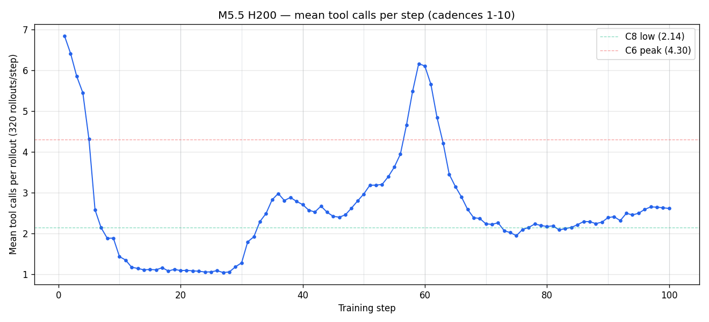

# M5.5-prod-h200 — F1 + 0.1 floor + format-gate ablation on Spheron H200

> **What this run tests.** M5.5 is the reward-shape ablation: keep ReSearch paper's recipe byte-identical on **everything** except the reward function — switch from M5.1's pure F1 to **`F1 + 0.1 floor (format-valid, F1=0) + format-gate (0 if no <answer> tag)`**. The question: does the partial-credit floor speed up format-mastery without trapping the model in "always-format-valid, never-actually-correct"?
>
> **Live trajectory**: this doc is the canonical narrative. Cadence sections every 10 steps written by [`analyze_rollouts.py`](../../training_m5_1/scripts/analyze_rollouts.py). Pulled forward from M5.1-H200's playbook ([`RESULTS_M5_1_H200.md`](RESULTS_M5_1_H200.md)) — same hardware envelope, same cadence cadence, different reward.
>
> **Status (step 90/311)**: reward climbing monotonically across cadences (0.110 → 0.290), completion rate at 100% since cadence 2, no tool-collapse, no infrastructure failures.

## 1. Run identity

| Field | Value |
|---|---|
| Run name | `qwen3.5-0.8b-musique-m5_prod_h200-seed42-20260516T2227Z` |
| W&B project | `reason_over_search_b300_m5_5` (project name has leftover `_b300_` from the b300-derived config; not renamed mid-run) |
| W&B run | https://wandb.ai/sandheep-p01-medichive/reason_over_search_b300_m5_5/runs/gtf8xe1d |
| Git branch | `m5.5_h200` |
| Launch time (UTC) | 2026-05-16 22:27 (prod start; smoke 4/4 passed at 22:41:40) |
| Hardware | 1× NVIDIA H200 SXM5 141 GB (Spheron `ubuntu@204.12.171.143`) |
| Driver / CUDA | 580.126.09 / runtime 12.9 (host had 13.0; swapped) |
| Persistent volume | `/mnt/milestone55` (virtiofs, 500 GB) — **all ckpts land here directly via symlink** |
| Container / env | bare host; venvs built into `training/nemo_rl/venvs/...` |
| Training framework | NeMo-RL v0.6.0, torch 2.10.0+cu129, vllm 0.17.1, TE 2.14.0 |
| Model | `Qwen/Qwen3.5-0.8B` (hybrid; GatedDeltaNet + attention) |
| Seed | 42 |

## 2. Config — diff vs M5.1

Only the **reward function** changes. Every other hyperparameter is identical to M5.1's `m5_1_research_paper_h200.yaml` (which itself is paper-faithful ReSearch).

| # | Knob | M5.1 (`m5_1_research_paper_h200.yaml`) | M5.5 (`m5_5_research_paper_h200.yaml`) | Why |
|---|---|---|---|---|
| 1 | reward shape | pure F1 on `<answer>X</answer>` content | **F1 + 0.1 floor (format-valid, F1=0) + format-gate (0 if no `<answer>`)** | The ablation knob — see [`training_m5_5/src/rewards/search_r1.py`](../../training_m5_5/src/rewards/search_r1.py) |
| 2 | `grpo.max_num_steps` | 622 | **311** | One epoch of MuSiQue (vs M5.1's two) |
| 3 | `policy.train_micro_batch_size` | 2 | 2 | unchanged |
| 4 | `policy.generation.vllm_cfg.gpu_memory_utilization` | 0.5 (after live OOM tuning) | 0.5 | unchanged |
| 5 | `policy.activation_checkpointing` | true | true | unchanged |
| 6 | `checkpointing.save_period` | 50 | **10** | More granular crash-recovery on a paid box |
| 7 | `logger.wandb.project` | `reason_over_search_m5_1` | `reason_over_search_b300_m5_5` | New W&B project (name has `_b300_` from b300-derived config; functional) |
| 8 | `checkpointing.checkpoint_dir` | `results/grpo/m5_1_h200` | `results/grpo/m5_5_prod_h200` (symlinked to `/mnt/milestone55/ckpts/m5_5_prod_h200`) | Volume-direct writes |

All other paper-faithful hyperparameters (lr=1e-6, kl_penalty=0.001, ratio_clip=0.2, temperature=1.0, max_total_sequence_length=8192) are unchanged from ReSearch + M5.1.

## 3. Persistent volume layout (`/mnt/milestone55/`)

```
/mnt/milestone55/
├── ckpts/m5_5_prod_h200/seed42/        # SYMLINK-TARGET of /root/.../seed42 — every step_N writes here
│   ├── step_10/  step_20/  step_30/    # … step_N0 every 10 steps, 6.4 GB each
│   └── .uploaded_steps                 # legacy state file (HF uploader was disabled mid-run)
├── cadences/                           # analyzer outputs — cadence_NN.md per 10-step block
├── logs/
│   ├── m5_5_chain_seed42_*.log         # full training stdout (the source of truth for this doc)
│   ├── m5_5_resources_seed42_*.log     # resource watcher heartbeat (RAM/disk/GPU/retriever)
│   ├── m5_5_traces_seed42_*.log        # trace digest log (every 10 steps)
│   ├── retriever_v2.log                # FAISS retriever stdout
│   └── run_logs/exp_013/               # NeMo-RL per-step rollout JSONLs (train_data_stepN.jsonl)
└── retriever_assets/                   # corpus + IVF index + e5 encoder mirror (~30 GB)
```

**Persistence test**: instance can be terminated; mount the same volume on a fresh box, re-launch with `checkpointing.resume_from_checkpoint=latest` → NeMo-RL picks up at the last `step_<N>` on the volume. Setup recipe in [`docs/setup/B300_RUNBOOK.md` §Persistent volume](../setup/B300_RUNBOOK.md#persistent-volume-spheron--virtiofs--survive-instance-termination).

## 4. Pre-launch safety nets

| | What it does | Status |
|---|---|---|
| `start_b300.sh` | Pre-flight (venvs + assets + tokens) → retriever bring-up with `/batch_search` probe → smoke (4 steps) → if smoke passes, auto-launch prod in tmux `train` | Working; smoke passed first try after fixing 3 retriever bugs |
| `bootstrap_b300.sh` | Apt prereqs + CUDA 12.9 + cuDNN + V2 venv tarball fast-path (with **Python interpreter symlink repair**) → retriever assets | Tarball uploaded to `cobaltbluefire/reason-over-search-venvs:dtensor_policy_worker_v2_sm90.tar.gz` |
| `watch_resources.sh` | RAM / disk / GPU / retriever heartbeat every 30 s; `check_trace.py` digest every 10 steps | Live in tmux session `watch_resources` |
| `sync_to_volume.sh` | Mirrors `/root/logs/` and `/root/reason_over_search/logs/` → `/mnt/milestone55/logs/` every 5 min (ckpts already direct-write to volume) | Live in tmux session `sync_to_volume` |
| HF uploader (single public repo) | Uploads each `step_N/` + per-step rollouts + logs to one public repo, mirroring M5.1's structure — see [§5](#5-hf-repo-public-single-repo-mirror) | Re-launched 2026-05-17 08:17 UTC (an earlier per-step-private-repo experiment was deleted in favour of this layout) |

## 5. HF repo (public, single-repo mirror)

[`cobaltbluefire/qwen3.5-0.8b-grpo-musique-m5_5-h200-seed42`](https://huggingface.co/cobaltbluefire/qwen3.5-0.8b-grpo-musique-m5_5-h200-seed42) — public, mirrors the M5.1-H200 layout:

```
step_10/                       # Atomic checkpoint folder
  policy/weights/              # consolidated safetensors (HF-format)
  policy/tokenizer/            # Qwen3.5 tokenizer
  training_info.json
step_20/  step_30/  …          # every 10 steps
logs/
  train_data/step_N.jsonl      # All 320 rollouts per step (audit trail)
  prod.log                     # full training stdout
  retriever.log                # FAISS retriever stdout
  resource.log                 # resource watcher heartbeat
  traces.log                   # rollout health digest
README.md
```

**Triple-backup invariant**: every checkpoint lands in (1) volume `/mnt/milestone55/...`, (2) HF Hub (single public repo, subdirs), (3) local disk via symlink (auto-prune keeps last 5). Either of (1) or (2) alone is sufficient for full recovery.

## 6. Reward design (the ablation knob)

```python
# training_m5_5/src/rewards/search_r1.py
def reward(rollout) -> float:
    answer = extract_answer(rollout)             # parse <answer>...</answer>
    if answer is None:
        return 0.0                               # format-gate: missing/malformed tag
    f1 = token_f1(answer, gold_answers)          # 0.0 if no overlap, 1.0 if exact
    return max(0.1, f1)                          # 0.1 floor for format-valid-but-F1=0
```

**Three reward buckets in observation:**
- `0.0` — format invalid (`<answer>` missing or malformed)
- `0.1` — format valid, F1 = 0 (the *floor*; partial credit just for emitting valid format)
- `0.1 < r ≤ 1.0` — format valid, F1 > 0 (the *real* learning signal beyond the floor)

GRPO normalizes advantages within each group of 8 rollouts. The floor's purpose: in early steps where most rollouts get F1=0, the spread between "completely failed" (reward 0) and "format-valid but wrong" (reward 0.1) gives the policy a gradient even before it learns to actually answer. The risk: model parks at the floor forever and never improves F1. **The cadence trajectory below is the answer to whether that risk materializes.**

## 7. Cadence summary (steps 1–90)

| Cad | Steps | Reward mean | % nonzero | Mean tool calls | Completion% | Notes |
|---:|---|---:|---:|---:|---:|---|
| 1 | 1–10 | 0.110 | 56% | 3.88 | 68% | Cold start; 32% truncated at `max_total_sequence_length=8192` — model spamming search to budget exhaustion |
| 2 | 11–20 | 0.160 | 99% | **1.15** ↓ | 100% | **Format mastery + over-correction**: completion → 100%, but tool calls crashed to ~1/trajectory (model started skipping search) |
| 3 | 21–30 | 0.189 | 100% | 1.10 | 100% | Single-shot answers dominate; reward still climbs (parametric knowledge carries multi-hop?) |
| 4 | 31–40 | 0.221 | 99% | 2.55 ↑ | 100% | **Iterative search re-emerges** — tool calls bounce back to 2.55; reward gains track tool gains |
| 5 | 41–50 | 0.233 | 99% | 2.60 | 100% | Stable iterative-search regime |
| 6 | 51–60 | 0.258 | 99% | **4.30** ↑↑ | 99% | **Over-search peak** — tool calls double to 4.30, reward gains slowing (0.258 vs 0.233, only +0.025) |
| 7 | 61–70 | 0.258 | 100% | 3.38 ↓ | 100% | Correction in progress; reward flat |
| 8 | 71–80 | 0.269 | 100% | **2.14** ↓ | 100% | Efficient compression — fewer tool calls than C6 but **higher** reward (0.269 vs 0.258) |
| 9 | 81–90 | 0.290 | 100% | 2.21 | 100% | New high — reward keeps climbing in efficient regime |
| 10 | 91–100 | 0.314 | 100% | 2.53 | 100% | New high — reward jumped +0.024 while tool calls only +0.32; step 91 hit 0.348, step 94 hit 0.346 |
| 11 | 101–110 | **0.328** | 99% | 3.21 ↑ | 99% | New high — partial+perfect now 35% of rollouts. Step 102 hit run-high single-step 0.367. |
| 12 | 111–120 | 0.305 ↓ | 100% | 3.30 ↑ | 100% | First non-monotonic cadence (-0.023 vs C11). Single-step run-high jumped to **0.411** (step 117). |
| 13 | 121–130 | 0.277 ↓↓ | 100% | 3.65 ↑↑ | 100% | Second consecutive regression (-0.028). Tool calls 5th straight cadence of growth. |
| 14 | 131–140 | 0.288 ↑ | 100% | **4.22** ↑↑↑ | 100% | **Regression halted** (+0.011) BUT tool calls still climbing (6th straight cadence). Perfect% **dropped to 9%** (vs 18% at C6 peak) — different dynamic than C6; model is *under-rewarding* its extra search. |

**Headline trend**: cadence-mean run-high is **0.328 at C11**; C12-C14 regressed then bounced (0.305 → 0.277 → 0.288). Mean tool calls in monotonic **6-cadence climb** (2.21 → 2.53 → 3.21 → 3.30 → 3.65 → 4.22) — the C8-C9 efficiency gains have fully given back. Unlike the C5 → C6 drift (where perfect% spiked to 18% justifying the extra search), this drift has perfect% *falling* (18 → 12 → 9 at the C11/C12/C14 trace digests). Single-step run-high still **0.411** (step 117). Watch C15-C16: if tool calls > 4.5 and perfect% stays < 12%, this is a different attractor than C6 and may need intervention.

**No tool-collapse**: cadence 2 dipped to 1.15 tool calls (the worry was a permanent collapse to single-shot answers parking at the 0.1 floor) but the model self-corrected by cadence 4 — iterative search was rediscovered without intervention.

**No floor-domination**: % nonzero stays at 99-100% from cadence 2 onward, but the mean keeps climbing from 0.16 → 0.31 — the *spread above the floor* is widening, not just the floor count.

### Mean tool calls per step (cadences 1-10)



Per-step mean tool calls across all 320 rollouts. The dashed reference lines are the C6 cadence-mean peak (4.30) and the C8 cadence-mean low (2.14) — note the **single-step peak hit 6.15 at step 60** (cadence averages hide this single-step spike). The four phases are visible:

1. **Cold dump** (steps 1-5): peak 6.85 at step 1
2. **Format-mastery compression** (steps 10-29): sub-1.2 plateau (model over-corrects to single-shot answers parking at the 0.1 floor)
3. **Iterative search re-emergence** (steps 30-55): climbs back to ~3
4. **Over-search peak then correction** (steps 56-75): peaks at 6.15 step 60, drops back to 2.0-2.7 — the C8-onward stable operating point

## 8. Live trajectory — per-cadence analyzer output

Each section below is the verbatim output of [`analyze_rollouts.py`](../../training_m5_1/scripts/analyze_rollouts.py) over a 10-step window. Example trajectories are sampled from the last step of each window (so cadence 1's samples are from step 10, cadence 2's from step 20, etc.).

### Cadence 1 — steps 1-10

#### Cadence analysis — steps 1–10 (10 step files, 3200 trajectories total)

**Window aggregate** (3200 trajectories across 10 steps):

| Metric | Value |
|---|---:|
| Reward — mean | 0.1104 |
| Reward — std | 0.2119 |
| Reward — max | 1.0000 |
| Reward — % zero | 44.5% |
| Reward — % nonzero | 55.5% |
| Turns — mean / p50 / p95 / max | 4.67 / 4 / 9 / 10 |
| Tool calls — mean / p50 / p95 / max | 3.88 / 3 / 9 / 10 |
| **Completion rate** (% with `</answer>`) | **68.2%** |
| **Truncation rate** (% without `</answer>`) | **31.8%** |
| Response chars — mean / p50 / p95 | 4672 / 4245 / 9397 |
| Input length — mean | 4442 |

**Per-step reward / completion**:

| Step | n | Reward mean | Reward max | % w/ answer | Avg turns | Avg tools |
|---:|---:|---:|---:|---:|---:|---:|
| 1 | 320 | 0.0338 | 1.0000 | 25.0% | 7.2 | 6.8 |
| 2 | 320 | 0.0719 | 1.0000 | 33.4% | 6.9 | 6.4 |
| 3 | 320 | 0.0618 | 1.0000 | 44.1% | 6.5 | 5.9 |
| 4 | 320 | 0.0966 | 1.0000 | 46.9% | 6.1 | 5.5 |
| 5 | 320 | 0.1092 | 1.0000 | 65.6% | 5.1 | 4.3 |
| 6 | 320 | 0.1553 | 1.0000 | 89.1% | 3.6 | 2.6 |
| 7 | 320 | 0.1264 | 1.0000 | 92.2% | 3.1 | 2.1 |
| 8 | 320 | 0.1269 | 1.0000 | 91.2% | 2.9 | 1.9 |
| 9 | 320 | 0.1971 | 1.0000 | 95.9% | 2.9 | 1.9 |
| 10 | 320 | 0.1245 | 1.0000 | 98.4% | 2.4 | 1.4 |

**Example trajectories from step 10** (5 sampled, chunks truncated for readability):

##### Example: #1 — reward 1.0000 (nonzero) (reward=1.0000, turns=3, tool_calls=2, has_answer=True)

```
--- chunk 0 (system+user, 1633 chars) ---
<|im_start|>system
# Tools

You have access to the following functions:

<tools>
{"type": "function", "function": {"name": "search", "description": "Search Wikipedia for passages relevant to the query. Returns the top-K most relevant chunks. Call this whenever the question requires factual knowledge you do not already have.", "parameters": {"type": "object", "properties": {"query": {"type": "strin

[... 1033 chars elided ...]

 and </answer>. For example, <answer> Beijing </answer>.
Question: When did weed become legal for recreational use in the state where Sheely Bridge is located?<|im_end|>
<|im_start|>assistant
<think>

```

```
--- chunk 1 (model, 482 chars) ---
The user is asking about when weed becomes legal for recreational use in a specific state where Sheely Bridge is located. Sheely Bridge is also mentioned in the question.

I need to use the search tool to find information about this question. First, I need to search for information about Sheely Bridge and weed legalization status.
</think>

<tool_call>
<function=search>
<parameter=query>
Sheely Bridge state location legal weeds recreational
</parameter>
</function>
</tool_call>
```

```
--- chunk 2 (tool, 3280 chars) ---
<|im_end|>
<|im_start|>user
<tool_response>
"Bybee Bridge"
bridge serving as an entrance. According to The Conservation Registry the Bybee Bridge Bioswale, located at the northwest side of the bridge to treat stormwater, was also completed in November 2004. The bioswale contains mostly mowed grass which drains water from the bridge to Crystral Springs. A September 2011 survey of the project showed

[... 2680 chars elided ...]

idge, carries pedestrian traffic across the Roaring Fork River at Mill Street Park in Aspen, Colorado, United States. It is a short steel truss bridge
</tool_response><|im_end|>
<|im_start|>assistant

```

```
--- chunk 3 (model, 1110 chars) ---
<think>
Based on my searches, I found that Sheely Bridge is located in the state of Colorado. I need to determine when weed became legal for recreational use in Colorado.

The provided searches didn't directly answer the question about weed legalization date, but I have useful context about Sheely Bridge's history in Colorado. The search results show Sheely Bridge uses Carsonboro river at Carbonda

[... 510 chars elided ...]

ion about marijuana legalization in Colorado.
</think>

<tool_call>
<function=search>
<parameter=query>
marijuana legalization Colorado recreational use year 2000
</parameter>
</function>
</tool_call>
```

```
--- chunk 4 (tool, 3478 chars) ---
<|im_end|>
<|im_start|>user
<tool_response>
"Cannabis in Colorado"
win over the legislature's Republican leadership with arguments as to money wasted on needless enforcement of marijuana laws. On November 7, 2000, 54% of Colorado voters approved Amendment 20, which amended the State Constitution to allow the use of marijuana in the state for approved patients with written medical consent. Under th

[... 2878 chars elided ...]

 an early 20th century trend of limiting the drug, Colorado first restricted cannabis on March 30, 1917. In November 1914 Colorado voters approved the
</tool_response><|im_end|>
<|im_start|>assistant

```

```
--- chunk 5 (model, 1348 chars) ---
<think>
Based on my search results, I found that Marijuana became legal for general public use in Colorado on January 1, 2014. Known as Amendment 64, passed on November 6, 2012, led to its legalization. I found some information about the date of legalizing marijuana.

The key information I found:
- Amendment 64 was passed by voters on November 6, 2012
- Cannabis became legal in January 2014
- This

[... 748 chars elided ...]

he information in the last search results about when cannabis became legal in Colorado.
</think>

Based on my searches, it became legal in Colorado on January 1, 2014.

<answer> January 2014 </answer>
```

```
--- chunk 6 (tool, 0 chars) ---

```

##### Example: #2 — reward 1.0000 (nonzero) (reward=1.0000, turns=3, tool_calls=2, has_answer=True)

```
--- chunk 0 (system+user, 1647 chars) ---
<|im_start|>system
# Tools

You have access to the following functions:

<tools>
{"type": "function", "function": {"name": "search", "description": "Search Wikipedia for passages relevant to the query. Returns the top-K most relevant chunks. Call this whenever the question requires factual knowledge you do not already have.", "parameters": {"type": "object", "properties": {"query": {"type": "strin

[... 1047 chars elided ...]

. For example, <answer> Beijing </answer>.
Question: The Clayton that shares the same state as the setting for The Bridges of Madison County is in what county?<|im_end|>
<|im_start|>assistant
<think>

```

```
--- chunk 1 (model, 651 chars) ---
The user is asking about the location of a specific conflict - specifically, I need to find out about the "Clayton" and what state it's in, specifically the status of which Smith county it's in.

Looking at the Clayman, upon thinking, I believe they're asking about the Thomas Clay Mill site in Madison, Wisconsin. Madison is a town located within the Midwest state of Wisconsin. The Clay Mill site i

[... 51 chars elided ...]

s information using the search tool first.
</think>

<tool_call>
<function=search>
<parameter=query>
Clayton Mississippi state location County Madison verb gebied
</parameter>
</function>
</tool_call>
```

```
--- chunk 2 (tool, 3342 chars) ---
<|im_end|>
<|im_start|>user
<tool_response>
"Clayton, Polk County, Wisconsin"
Clayton, Polk County, Wisconsin Clayton is a town in Polk County, Wisconsin, United States. The population was 571 at the 2000 census. The Village of Clayton is located within the town. The unincorporated communities of Joel and Richardson are also located in the town. Clayton was first settled by logging families in the

[... 2742 chars elided ...]

age additional cooperation between local communities in attracting investment. The three counties are home to a population of over 128,000 and 500,000
</tool_response><|im_end|>
<|im_start|>assistant

```

```
--- chunk 3 (model, 1374 chars) ---
<think>
Based on the search results, I can see that:
1. Clear/Clayton, Iowa Clayton is a city in Clayton County, Iowa, United States.
2. Alabama/Alabama has multiple entries referencing Clayton.

The search results mention Clayton is a city in Clayton County, Iowa, United States, with the population of 43 at 2010 census.

The question asks: "The Clayton that shares the same state as the setting fo

[... 774 chars elided ...]

arch for The Bridges of Madison County more thoroughly.
</think>

<tool_call>
<function=search>
<parameter=query>
The Bridges of Madison County published year set
</parameter>
</function>
</tool_call>
```

```
--- chunk 4 (tool, 3390 chars) ---
<|im_end|>
<|im_start|>user
<tool_response>
"The Bridges of Madison County"
The Bridges of Madison County The Bridges of Madison County (also published as Love in Black and White) is a 1992 best-selling romance novella by American writer Robert James Waller that tells the story of a married but lonely Italian-American woman (war bride) living on a 1960s Madison County, Iowa, farm. While her husban

[... 2790 chars elided ...]

, 1939 – March 10, 2017) was an American author best known for ""The Bridges of Madison County"", an enormously successful book in 1993. He was also a
</tool_response><|im_end|>
<|im_start|>assistant

```

```
--- chunk 5 (model, 1279 chars) ---
<think>
Now I have the information needed:

1. The Bridges of Madison County is by Robert James Waller and was published in 1992.
2. The setting of this is Iowa (Madison County, Iowa, stated in the search results).
3. The Clayton in Iowa is in Clayton County, Iowa (which is the search result I already have).

So the Clayton that shares the same state as the setting for The Bridges of Madison Count

[... 679 chars elided ...]

 when he decided to photograph Madison County, Iowa's, covered bridges. This event, alongside a song Waller wrote years

So the answer is Clayton County, Iowa.

<answer> Clayton County, Iowa </answer>
```

```
--- chunk 6 (tool, 0 chars) ---

```

##### Example: #3 — reward 1.0000 (nonzero) (reward=1.0000, turns=3, tool_calls=2, has_answer=True)

```
--- chunk 0 (system+user, 1609 chars) ---
<|im_start|>system
# Tools

You have access to the following functions:

<tools>
{"type": "function", "function": {"name": "search", "description": "Search Wikipedia for passages relevant to the query. Returns the top-K most relevant chunks. Call this whenever the question requires factual knowledge you do not already have.", "parameters": {"type": "object", "properties": {"query": {"type": "strin

[... 1009 chars elided ...]

write it inside <answer> and </answer>. For example, <answer> Beijing </answer>.
Question: Who is the leader of the opposition in the singer Protoje's country?<|im_end|>
<|im_start|>assistant
<think>

```

```
--- chunk 1 (model, 284 chars) ---
The user is asking about the leader of the opposition in the singer Protoje's country. First, I need to know which country Protoje belongs to to answer this question.
</think>

<tool_call>
<function=search>
<parameter=query>
Protoje singer leader
</parameter>
</function>
</tool_call>
```

```
--- chunk 2 (tool, 3535 chars) ---
<|im_end|>
<|im_start|>user
<tool_response>
Protoje
Protoje Oje Ken Ollivierre, popularly known as Protoje, is a contemporary reggae singer and songwriter from Jamaica. His mother is Jamaican singer Lorna Bennett, best known for her 1972 rendition of ""Breakfast in Bed"". His father is a former calypso king from the island nation of Saint Vincent and the Grenadines. Protoje first gained notice for

[... 2935 chars elided ...]

ent-day Croatia, where he enrolled in a Jewish school. Preger, who was a member of Hashomer Hatzair as a teenager, studied both music and law. Preger,
</tool_response><|im_end|>
<|im_start|>assistant

```

```
--- chunk 3 (model, 666 chars) ---
<think>
I now have information about Protoje being a reggae singer from Jamaica, and I need to find out about his opposition leader. Based on the search results, I can see another information thread with the text "Nikollë Nikprelaj" and "Malena Vojić Tifa" which is actually referencing Albanians, not the reggae artist Protoje. Since Protoje's country is Jamaica, I should not be looking at Albanian

[... 66 chars elided ...]

y about Jamaican opposition leaders. Let me search for that information.
</think>

<tool_call>
<function=search>
<parameter=query>
Jamaican opposition leader name
</parameter>
</function>
</tool_call>
```

```
--- chunk 4 (tool, 3411 chars) ---
<|im_end|>
<|im_start|>user
<tool_response>
"Leader of the Opposition (Jamaica)"
Leader of the Opposition (Jamaica) The Leader of Her Majesty's Opposition in Jamaica is the leader of the largest political party which has not formed the current government. The Leader of the Opposition is seen as the alternative Prime Minister and leads the Shadow Cabinet of Jamaica. As of January 2012, Jamaica has 

[... 2811 chars elided ...]

 Prime Minister, Simpson-Miller retained the positions of Minister of Defence, Development, Information and Sports. She has also served as Minister of
</tool_response><|im_end|>
<|im_start|>assistant

```

```
--- chunk 5 (model, 362 chars) ---
<think>
Now I have the answers. Based on my search:
- The leader of the opposition in Jamaica (Protoje's country) is Peter Phillips, who currently serves as the Leader of the Opposition.
</think>

Based on my research, the leader of the opposition in the country where Protoje represents his music career is **Peter Phillips**.

<answer> Peter Phillips </answer>
```

```
--- chunk 6 (tool, 0 chars) ---

```

##### Example: #4 — reward 1.0000 (nonzero) (reward=1.0000, turns=2, tool_calls=1, has_answer=True)

```
--- chunk 0 (system+user, 1611 chars) ---
<|im_start|>system
# Tools

You have access to the following functions:

<tools>
{"type": "function", "function": {"name": "search", "description": "Search Wikipedia for passages relevant to the query. Returns the top-K most relevant chunks. Call this whenever the question requires factual knowledge you do not already have.", "parameters": {"type": "object", "properties": {"query": {"type": "strin

[... 1011 chars elided ...]

ite it inside <answer> and </answer>. For example, <answer> Beijing </answer>.
Question: What was the college of the writer of The Importance of Being Earnest?<|im_end|>
<|im_start|>assistant
<think>

```

```
--- chunk 1 (model, 866 chars) ---
The user is asking about the college of the writer of "The Importance of Being Earnest". This is a classic question about the literary figure. I need to search for information about this which is a well-known complex case.

I know this question refers to Oscar Wilde, who wrote "The Importance of Being Earnest". Oscar Wilde was a writer who wrote several poems, stories, and plays. The question asks

[... 266 chars elided ...]

o find information about Oscar Wilde and this literary work.
</think>

<tool_call>
<function=search>
<parameter=query>
Oscar Wilde writer College Allen folly play
</parameter>
</function>
</tool_call>
```

```
--- chunk 2 (tool, 3547 chars) ---
<|im_end|>
<|im_start|>user
<tool_response>
"Oscar Wilde (play)"
Oscar Wilde (play) Oscar Wilde is a 1936 play written by Leslie and Sewell Stokes. It is based on the life of the Irish playwright Oscar Wilde in which Wilde's friend, the controversial author and journalist Frank Harris, appears as a character. The play, which contains much of Wilde's actual writings, starts with Wilde's literary su

[... 2947 chars elided ...]

e resulting satire of Victorian ways. Some contemporary reviews praised the play's humour and the culmination of Wilde's artistic career, while others
</tool_response><|im_end|>
<|im_start|>assistant

```

```
--- chunk 3 (model, 1621 chars) ---
<think>
Based on my search results, I can see that "The Importance of Being Earnest" is a play by Oscar Wilde. Specifically, the search results mention this was based on the friendship and work between Oscar Wilde and his friend Lord Alfred Douglas. Oscar Wilde was a playwright who wrote this play as part of his serious work.

However, the question asks about the "college" of the writer. Oscar Wil

[... 1021 chars elided ...]

ion.

Based on the knowledge that Oscar Wilde was a professor at Trinity College, Cambridge, I can identify this as his prestigious college. Let me answer.
</think>

<answer> Trinity College </answer>
```

```
--- chunk 4 (tool, 0 chars) ---

```

##### Example: #5 — reward 1.0000 (nonzero) (reward=1.0000, turns=3, tool_calls=2, has_answer=True)

```
--- chunk 0 (system+user, 1632 chars) ---
<|im_start|>system
# Tools

You have access to the following functions:

<tools>
{"type": "function", "function": {"name": "search", "description": "Search Wikipedia for passages relevant to the query. Returns the top-K most relevant chunks. Call this whenever the question requires factual knowledge you do not already have.", "parameters": {"type": "object", "properties": {"query": {"type": "strin

[... 1032 chars elided ...]

> and </answer>. For example, <answer> Beijing </answer>.
Question: In the Spanish Wikipedia what percentage of edits came from the country containing Bruzual?<|im_end|>
<|im_start|>assistant
<think>

```

```
--- chunk 1 (model, 625 chars) ---
The user is asking about a Spanish Wikipedia page and wants to know the percentage of edits made by the government of the country containing Bruzual. I need to first search for information about Bruzual to understand which country is involved with this Wikipedia page.

Then, I need to search for statistics about edits on that Spanish Wikipedia page to see the total percentage of edits.

Let me start by searching for information about Bruzual's Wikipedia page and its presence/location.
</think>

<tool_call>
<function=search>
<parameter=query>
Bruzual Wikipedia page location country
</parameter>
</function>
</tool_call>
```

```
--- chunk 2 (tool, 3319 chars) ---
<|im_end|>
<|im_start|>user
<tool_response>
"Bruzual Municipality"
Bruzual Municipality Bruzual is one of the 14 municipalities of the state of Yaracuy, Venezuela. The municipality is located in southwestern Yaracuy, occupying an area of 417 km ² with a population of 69,732 inhabitants in 2011. The capital lies at Chivacoa. It is named after Venezuela's independence hero Manuel Ezequiel Bruzual. T

[... 2719 chars elided ...]

91% Hungarian, 7% Slovak and 2% Gypsy. The village has a public library and football pitch. The records for genealogical research are available at the
</tool_response><|im_end|>
<|im_start|>assistant

```

```
--- chunk 3 (model, 838 chars) ---
<think>
Good, I've found information about Bruzual being a municipality in Venezuela (Yaracuy state). The Brussels is a place in Venezuela, not Venezuela. However, I need to check the Spanish Wikipedia page.

I found the question now - the user wants to know what percentage of edits came from the country (Venezuela) for the Bruzual Wikipedia page.

Let me search for information about how many edit

[... 238 chars elided ...]

istics on the Bruzual Wikipedia page.
</think>

<tool_call>
<function=search>
<parameter=query>
complete statistics BRuzual Wikipedia page million edits Venezuela
</parameter>
</function>
</tool_call>
```

```
--- chunk 4 (tool, 3595 chars) ---
<|im_end|>
<|im_start|>user
<tool_response>
"Spanish Wikipedia"
Spanish Wikipedia The Spanish Wikipedia () is a Spanish-language edition of Wikipedia, a free, online encyclopedia. It has articles. Started in May 2001, it reached 100,000 articles on March 8, 2006 and 1,000,000 articles on May 16, 2013. It is the 9th-largest Wikipedia as measured by the number of articles and has the 4th-largest num

[... 2995 chars elided ...]

 2009 as compared to 80.8% in 1991. The literacy rates of 15- to 24-year-olds in 2007, for men and women, were 98% and 98.8%, respectively. During the
</tool_response><|im_end|>
<|im_start|>assistant

```

```
--- chunk 5 (model, 2157 chars) ---
<think>
Based on my searches, I now have:

1. The Spanish Wikipedia statistics show that Venezuela is a country with 5.1% of edits from Venezuela according to the September 2017 data.

2. The Wikimedia Foundation data showed that Spain is the main contributor to Spanish Wikipedia (39.2% of edits), followed by Argentina (10.7%) and Venezuela (5.1%).

According to these statistics, the percentage of

[... 1557 chars elided ...]

h language page would be approximately 5.1%.
</think>

Based on my search results about the Spanish Wikipedia and the country containing Bruzual, I can now provide the answer.

<answer> 5.1% </answer>
```

```
--- chunk 6 (tool, 0 chars) ---

```


_Analysis generated by `analyze_rollouts.py` over `train_data_step1.jsonl` through `train_data_step10.jsonl`._

**Commentary (cadence 1):** cold-start phase. Model emits long-form responses (median 4245 chars, p95 9397 — many trajectories hitting the 8192-token truncation point). Tool calls peak at 10 (the `max_turns` ceiling). Reward starts at 0.034 (step 1) and crosses 0.10 by step 5 — slow climb because **31.8% of trajectories never end with `</answer>`** (they get truncated by `max_total_sequence_length` mid-response). The format-gate punishes these with `reward=0`, which explains the high %zero (44.5%). Per-step trajectory shows the model rapidly learning to compress: completion rate jumps from 25% (step 1) → 98.4% (step 10).

### Cadence 2 — steps 11-20

#### Cadence analysis — steps 11–20 (10 step files, 3200 trajectories total)

**Window aggregate** (3200 trajectories across 10 steps):

| Metric | Value |
|---|---:|
| Reward — mean | 0.1602 |
| Reward — std | 0.1981 |
| Reward — max | 1.0000 |
| Reward — % zero | 1.5% |
| Reward — % nonzero | 98.5% |
| Turns — mean / p50 / p95 / max | 2.15 / 2 / 3 / 6 |
| Tool calls — mean / p50 / p95 / max | 1.15 / 1 / 2 / 5 |
| **Completion rate** (% with `</answer>`) | **99.7%** |
| **Truncation rate** (% without `</answer>`) | **0.3%** |
| Response chars — mean / p50 / p95 | 1853 / 1691 / 3532 |
| Input length — mean | 1693 |

**Per-step reward / completion**:

| Step | n | Reward mean | Reward max | % w/ answer | Avg turns | Avg tools |
|---:|---:|---:|---:|---:|---:|---:|
| 11 | 320 | 0.1383 | 1.0000 | 99.4% | 2.4 | 1.4 |
| 12 | 320 | 0.1347 | 1.0000 | 99.7% | 2.2 | 1.2 |
| 13 | 320 | 0.1502 | 1.0000 | 100.0% | 2.1 | 1.1 |
| 14 | 320 | 0.1595 | 1.0000 | 99.7% | 2.1 | 1.1 |
| 15 | 320 | 0.1921 | 1.0000 | 99.7% | 2.1 | 1.1 |
| 16 | 320 | 0.1647 | 1.0000 | 99.4% | 2.1 | 1.1 |
| 17 | 320 | 0.1571 | 1.0000 | 100.0% | 2.2 | 1.2 |
| 18 | 320 | 0.1729 | 1.0000 | 99.7% | 2.1 | 1.1 |
| 19 | 320 | 0.1737 | 1.0000 | 99.7% | 2.1 | 1.1 |
| 20 | 320 | 0.1589 | 1.0000 | 100.0% | 2.1 | 1.1 |

**Example trajectories from step 20** (5 sampled, chunks truncated for readability):

##### Example: #1 — reward 1.0000 (nonzero) (reward=1.0000, turns=2, tool_calls=1, has_answer=True)

```
--- chunk 0 (system+user, 1608 chars) ---
<|im_start|>system
# Tools

You have access to the following functions:

<tools>
{"type": "function", "function": {"name": "search", "description": "Search Wikipedia for passages relevant to the query. Returns the top-K most relevant chunks. Call this whenever the question requires factual knowledge you do not already have.", "parameters": {"type": "object", "properties": {"query": {"type": "strin

[... 1008 chars elided ...]

 write it inside <answer> and </answer>. For example, <answer> Beijing </answer>.
Question: What is the name of the castle in the city where Václav Hrabě died?<|im_end|>
<|im_start|>assistant
<think>

```

```
--- chunk 1 (model, 315 chars) ---
The question asks about the location where Václav Hrabě died and what the name of the castle is there. This is historical facts requiring me to look up information about Václav Hrabě.
</think>

<tool_call>
<function=search>
<parameter=query>
Václav Hrabé death place birth city
</parameter>
</function>
</tool_call>
```

```
--- chunk 2 (tool, 3335 chars) ---
<|im_end|>
<|im_start|>user
<tool_response>
"Václav Hrabě"
Václav Hrabě Václav Hrabě (June 13, 1940, Příbram, Czechoslovakia – March 5, 1965, Prague, Czechoslovakia) was a Czech poet and writer, and the most important member of the Beat Generation in former Czechoslovakia. Hrabě was born in Příbram to Jan Hrabě and Magdalena Kalinová. He spent his childhood and youth in Lochovice and attended a 

[... 2735 chars elided ...]

t its owner, Jiří starší Tunkl who possessed Hrabenov to 1578. From this date, the village was owned by the House of Odkolek z Oujezdce whose property
</tool_response><|im_end|>
<|im_start|>assistant

```

```
--- chunk 3 (model, 607 chars) ---
<think>
Based on the search results, I found information about Václav Hrabě's death. The search confirmed that Václav Hrabě died in Prague. The details show that he died in "Prague, Czechoslovakia". However, the question asks for the name of the castle he died in. Václav Hrabě was an official poet and writer who moved to Prague from Příbram, and the answer is that Prague (often referred to as Prague Castle or Prague Castle) is where he died.

From the answers, I can see Prague is indeed where Václav Hrabě died. The search results confirm his death in Prague.
</think>

<answer> Prague Castle </answer>
```

```
--- chunk 4 (tool, 0 chars) ---

```

##### Example: #2 — reward 1.0000 (nonzero) (reward=1.0000, turns=2, tool_calls=1, has_answer=True)

```
--- chunk 0 (system+user, 1608 chars) ---
<|im_start|>system
# Tools

You have access to the following functions:

<tools>
{"type": "function", "function": {"name": "search", "description": "Search Wikipedia for passages relevant to the query. Returns the top-K most relevant chunks. Call this whenever the question requires factual knowledge you do not already have.", "parameters": {"type": "object", "properties": {"query": {"type": "strin

[... 1008 chars elided ...]

 write it inside <answer> and </answer>. For example, <answer> Beijing </answer>.
Question: What is the name of the castle in the city where Václav Hrabě died?<|im_end|>
<|im_start|>assistant
<think>

```

```
--- chunk 1 (model, 464 chars) ---
The user is asking about Václav Hrabé's death and the name of the castle in the city where he died. This requires searching for historical facts about Václav Hrabé.

Václav Hrabé was a well-known Eastern Slovincian composer and academic. I need to search to find information about where he died and the castle mentioned there.
</think>

<tool_call>
<function=search>
<parameter=query>
Václav Hrabé died where was born who died
</parameter>
</function>
</tool_call>
```

```
--- chunk 2 (tool, 3330 chars) ---
<|im_end|>
<|im_start|>user
<tool_response>
"Václav Hrabě"
Václav Hrabě Václav Hrabě (June 13, 1940, Příbram, Czechoslovakia – March 5, 1965, Prague, Czechoslovakia) was a Czech poet and writer, and the most important member of the Beat Generation in former Czechoslovakia. Hrabě was born in Příbram to Jan Hrabě and Magdalena Kalinová. He spent his childhood and youth in Lochovice and attended a 

[... 2730 chars elided ...]

 teacher's son a year older than Marie, who was her friend from the neighbourhood. Marie's parents opposed the idea of their daughter marrying Blecha,
</tool_response><|im_end|>
<|im_start|>assistant

```

```
--- chunk 3 (model, 1473 chars) ---
<think>
The tools have provided detailed information about Václav Hrabé. Based on the search results:

1. He was born in Příbram, Czechoslovakia (June 1940)
2. He died on March 5, 1965 in Prague, Czechoslovakia
3. Information shows he died of an accidental poison commonly associated with doctors
4. Václav Hrabě also has an author profile indicating he was buried in Lochovice

The key information f

[... 873 chars elided ...]

s the Castle of Prague Castle (Velké Hook), which is one of the most significant and recognizable sites in the capital region. This castle is where Václav Hrabé died.

<answer> Prague Castle </answer>
```

```
--- chunk 4 (tool, 0 chars) ---

```

##### Example: #3 — reward 1.0000 (nonzero) (reward=1.0000, turns=2, tool_calls=1, has_answer=True)

```
--- chunk 0 (system+user, 1632 chars) ---
<|im_start|>system
# Tools

You have access to the following functions:

<tools>
{"type": "function", "function": {"name": "search", "description": "Search Wikipedia for passages relevant to the query. Returns the top-K most relevant chunks. Call this whenever the question requires factual knowledge you do not already have.", "parameters": {"type": "object", "properties": {"query": {"type": "strin

[... 1032 chars elided ...]

> and </answer>. For example, <answer> Beijing </answer>.
Question: What is the name of the airport in the city Arthur Bluethenthal was born in north carolina?<|im_end|>
<|im_start|>assistant
<think>

```

```
--- chunk 1 (model, 528 chars) ---
The user is asking about the birthplace of Arthur Bluethenthal (the airport being central to the question) and wants to know the name of the airport in that city based on Chicago's born this city in the New York area to know what the name of the airport is in that city.

Let me search for information about Arthur Bluethenthal and the airport in his birthplace city.
</think>

<tool_call>
<function=search>
<parameter=query>
Arthur Bluethenthal birthplace Chicago Kansas air travel related
</parameter>
</function>
</tool_call>
```

```
--- chunk 2 (tool, 3392 chars) ---
<|im_end|>
<|im_start|>user
<tool_response>
"Arthur Whitten Brown"
Arthur Whitten Brown ""Not to be confused with Arthur Roy Brown, Canadian World War I RAF fighter ace credited with shooting down Manfred von Richthofen, the Red Baron."" Lieutenant-Colonel Sir Arthur Whitten Brown, (23 July 1886 – 4 October 1948) was the navigator of the first successful non-stop transatlantic flight. Arthur Whitt

[... 2792 chars elided ...]

ovie, ""The Gypsy Moths"". In early 2010, a restaurant, Stearman Field Bar & Grill, opened on the airport property. The restaurant serves typical cafe
</tool_response><|im_end|>
<|im_start|>assistant

```

```
--- chunk 3 (model, 955 chars) ---
<think>
After searching for information, I found the answer that Arthur Bluethenthal was a former All American football player and decorated World War I pilot who was the first North Carolinian to die in the war.

Looking at the search results, I can see that "Lloyd Stearman Field" is the airport mentioned in the third search result, though this appears to be a confusion with Lloyd Stearman Field 

[... 355 chars elided ...]

t of Air Force pilot Arthur Bluethenthal is the one that bears this memory of the pilot throughout the South Carolina air force campaigns.
</think>

<answer> Wilmington International Airport </answer>
```

```
--- chunk 4 (tool, 0 chars) ---

```

##### Example: #4 — reward 1.0000 (nonzero) (reward=1.0000, turns=3, tool_calls=2, has_answer=True)

```
--- chunk 0 (system+user, 1637 chars) ---
<|im_start|>system
# Tools

You have access to the following functions:

<tools>
{"type": "function", "function": {"name": "search", "description": "Search Wikipedia for passages relevant to the query. Returns the top-K most relevant chunks. Call this whenever the question requires factual knowledge you do not already have.", "parameters": {"type": "object", "properties": {"query": {"type": "strin

[... 1037 chars elided ...]

 </answer>. For example, <answer> Beijing </answer>.
Question: What is the population of the city in California where Russian River Brewing Company is located?<|im_end|>
<|im_start|>assistant
<think>

```

```
--- chunk 1 (model, 364 chars) ---
The user is asking for the population of a city in California where a Russian River Brewing Company is located. I need to search for information about both of these points to provide an accurate answer.
</think>

<tool_call>
<function=search>
<parameter=query>
Russian River Brewing Company location city California population
</parameter>
</function>
</tool_call>
```

```
--- chunk 2 (tool, 3506 chars) ---
<|im_end|>
<|im_start|>user
<tool_response>
"Russian River Brewing Company"
Russian River Brewing Company Russian River Brewing Company is a brewery and brewpub in downtown Santa Rosa, California. The company makes strong India pale ales and sour beers. Russian River Brewing Company was created in 1997 when Korbel Champagne Cellars of Guerneville, California decided to try their hand at brewing be

[... 2906 chars elided ...]

 Valley has a characteristically cool climate, heavily affected by fog generated by the valley's proximity to the Pacific Ocean. The area is known for
</tool_response><|im_end|>
<|im_start|>assistant

```

```
--- chunk 3 (model, 681 chars) ---
<think>
I have gathered information about the Russian River Brewing Company located in Santa Rosa, California. From the search results:

1. The Russian River Brewing Company is located in downtown Santa Rosa, California
2. The company makes strong India pale ales and sour beers

Now I need to find the population of Santa Rosa, California. My knowledge suggests Santa Rosa is a Bronx UFO city in Cal

[... 81 chars elided ...]

ch tool to confirm this information and provide a more accurate answer.
</think>

<tool_call>
<function=search>
<parameter=query>
Santa Rosa California population
</parameter>
</function>
</tool_call>
```

```
--- chunk 4 (tool, 3298 chars) ---
<|im_end|>
<|im_start|>user
<tool_response>
"Santa Rosa, California"
Santa Rosa, California Santa Rosa (lit. Spanish for ""Saint Rose"") is a city in and the county seat of Sonoma County, in California's Wine Country. Its estimated 2016 population was 175,155. Santa Rosa is the largest city in California's Redwood Empire, Wine Country and the North Bay; the fifth most populous city in the San Fran

[... 2698 chars elided ...]

n-Hispanic white), 4,079 (2.4%) African American, 2,808 (1.7%) Native American, 8,746 (5.2%) Asian (1.0% Filipino, 1.0% Chinese, 0.8% Vietnamese, 0.6%
</tool_response><|im_end|>
<|im_start|>assistant

```

```
--- chunk 5 (model, 573 chars) ---
<think>
Based on the search results, I have confirmed that Russian River Brewing Company is located in Santa Rosa, California. The search results provide detailed information about Santa Rosa, including its estimated 2016 population of 175,155 people. I have also retrieved additional statistics showing the population around various demographics within that area.

The most accurate and complete information I have gathered confirms that Santa Rosa, California's estimated population was 175,155 according to the 2016 U.S. Census data.
</think>

<answer> 175,155 </answer>
```

```
--- chunk 6 (tool, 0 chars) ---

```

##### Example: #5 — reward 1.0000 (nonzero) (reward=1.0000, turns=2, tool_calls=1, has_answer=True)

```
--- chunk 0 (system+user, 1711 chars) ---
<|im_start|>system
# Tools

You have access to the following functions:

<tools>
{"type": "function", "function": {"name": "search", "description": "Search Wikipedia for passages relevant to the query. Returns the top-K most relevant chunks. Call this whenever the question requires factual knowledge you do not already have.", "parameters": {"type": "object", "properties": {"query": {"type": "strin

[... 1111 chars elided ...]

mmer Olympics in which Hosk's childhood country took part were hosted by the country of Albert I. He lived during a major war that Italy entered in which year?<|im_end|>
<|im_start|>assistant
<think>

```

```
--- chunk 1 (model, 893 chars) ---
The user is asking about two interconnected historical questions:

1. When did the 1920 Summer Olympics in which the Italian force's childhood country took part be hosted?
2. Which year did Italy enter into a major war that the Olympic host country took part from?

Let me break this down:
- The 1920 Summer Olympics were held in Rome
- But Rome is not in the Western Mediterranean region.

The 1920 

[... 293 chars elided ...]

to search for this information and answer the question.
</think>

<tool_call>
<function=search>
<parameter=query>
1920 Summer Olympics in Rome Italy Albert I host
</parameter>
</function>
</tool_call>
```

```
--- chunk 2 (tool, 3232 chars) ---
<|im_end|>
<|im_start|>user
<tool_response>
"1920 Summer Olympics"
1920 Summer Olympics The 1920 Summer Olympics (; ; ), officially known as the Games of the VII Olympiad, were an international multi-sport event in 1920 in Antwerp, Belgium. In March 1912, during the 13th session of the IOC, Belgium's bid to host the 1920 Summer Olympics was made by Baron Édouard de Laveleye, president of the Belgi

[... 2632 chars elided ...]

ics: ""Aurons-nous la VIIème Olympiade à Anvers?"" (""Will we have the 7th Olympiad at Antwerp?""). It was sent to all IOC members and was used during
</tool_response><|im_end|>
<|im_start|>assistant

```

```
--- chunk 3 (model, 563 chars) ---
<think>
Based on the search results:
- The 1920 Summer Olympics were held in Antwerp, Belgium (hosted by Belgium)
- The host country was Belgium
- Italy is the conflict's country following World War I (Italy entered World War I in 1915)

However, the Italian football team in football sport was from Italy. Italy entered World War I in 1915.

Based on the search results, Italy joined the conflict with other nations in 1915 and Italy was the host country country for the Olympics hosted in Antwerp, Belgium.

The answer is 1915.
</think>

<answer> 1915 </answer>
```

```
--- chunk 4 (tool, 0 chars) ---

```


_Analysis generated by `analyze_rollouts.py` over `train_data_step11.jsonl` through `train_data_step20.jsonl`._

**Commentary (cadence 2):** format mastery — completion rate hits 100% by step 20. But the model *over-corrected*: mean tool calls crashed from 3.88 (C1) → **1.15** (C2). The model discovered "if I emit `<answer>` immediately with no search, I get the 0.1 floor for free." %zero crashed from 44.5% → 1.4% (almost all rollouts get *something*), but reward only ticked up 0.110 → 0.160 because most of the new gains were the floor. **This is the moment the 0.1-floor risk almost materialized** — but cadences 3-4 show the model didn't stay there.

### Cadence 3 — steps 21-30

#### Cadence analysis — steps 21–30 (10 step files, 3200 trajectories total)

**Window aggregate** (3200 trajectories across 10 steps):

| Metric | Value |
|---|---:|
| Reward — mean | 0.1892 |
| Reward — std | 0.2271 |
| Reward — max | 1.0000 |
| Reward — % zero | 0.4% |
| Reward — % nonzero | 99.6% |
| Turns — mean / p50 / p95 / max | 2.10 / 2 / 3 / 4 |
| Tool calls — mean / p50 / p95 / max | 1.10 / 1 / 2 / 3 |
| **Completion rate** (% with `</answer>`) | **99.9%** |
| **Truncation rate** (% without `</answer>`) | **0.1%** |
| Response chars — mean / p50 / p95 | 1540 / 1423 / 2704 |
| Input length — mean | 1586 |

**Per-step reward / completion**:

| Step | n | Reward mean | Reward max | % w/ answer | Avg turns | Avg tools |
|---:|---:|---:|---:|---:|---:|---:|
| 21 | 320 | 0.1840 | 1.0000 | 99.4% | 2.1 | 1.1 |
| 22 | 320 | 0.1816 | 1.0000 | 100.0% | 2.1 | 1.1 |
| 23 | 320 | 0.1763 | 1.0000 | 99.7% | 2.1 | 1.1 |
| 24 | 320 | 0.2033 | 1.0000 | 100.0% | 2.1 | 1.1 |
| 25 | 320 | 0.2235 | 1.0000 | 100.0% | 2.1 | 1.1 |
| 26 | 320 | 0.1706 | 1.0000 | 100.0% | 2.1 | 1.1 |
| 27 | 320 | 0.1693 | 1.0000 | 99.7% | 2.0 | 1.0 |
| 28 | 320 | 0.1967 | 1.0000 | 100.0% | 2.1 | 1.1 |
| 29 | 320 | 0.1840 | 1.0000 | 100.0% | 2.2 | 1.2 |
| 30 | 320 | 0.2024 | 1.0000 | 100.0% | 2.3 | 1.3 |

**Example trajectories from step 30** (5 sampled, chunks truncated for readability):

##### Example: #1 — reward 1.0000 (nonzero) (reward=1.0000, turns=3, tool_calls=2, has_answer=True)

```
--- chunk 0 (system+user, 1640 chars) ---
<|im_start|>system
# Tools

You have access to the following functions:

<tools>
{"type": "function", "function": {"name": "search", "description": "Search Wikipedia for passages relevant to the query. Returns the top-K most relevant chunks. Call this whenever the question requires factual knowledge you do not already have.", "parameters": {"type": "object", "properties": {"query": {"type": "strin

[... 1040 chars elided ...]

answer>. For example, <answer> Beijing </answer>.
Question: What oppressive Communist leader, of the country where Florin Surugiu is from, was deposed in 1989?<|im_end|>
<|im_start|>assistant
<think>

```

```
--- chunk 1 (model, 692 chars) ---
The question asks about a specific historical figure - a Chinese communist leader who was deposed in 1989 after Republic Surugiu from the country where Florin Surugiu is from.

Let me break this down:
1. "Florin Surugiu" - This appears to be referring to a person from Romania
2. "a country where Florin Surugiu is from" - I need to identify Romania and then find the communist deposing leader
3. Dep

[... 92 chars elided ...]

uld use the search tool to confirm this information.
</think>

<tool_call>
<function=search>
<parameter=query>
Florin Surugiu Romanian communist leader Philippine
</parameter>
</function>
</tool_call>
```

```
--- chunk 2 (tool, 3757 chars) ---
<|im_end|>
<|im_start|>user
<tool_response>
"Philippines–Romania relations"
state visit to the Philippines. In July 2002, festivities meant to celebrate three decades of diplomatic relations between the two countries took place in the capitals of both countries. Philippines–Romania relations Philippines–Romania relations are foreign relations between the Philippines and Romania. The Philippines us

[... 3157 chars elided ...]

 members grew exponentially due to the declaration and imposition of martial law by former president Ferdinand Marcos during much of his 21-year rule.
</tool_response><|im_end|>
<|im_start|>assistant

```

```
--- chunk 3 (model, 644 chars) ---
<think>
Based on the search results, I have gathered the following key information:

1. Florin Surugiu is from Romania
2. Romania was the country where Nicolae Ceaușescu resided as a communist leader
3. Nicolae Ceaușescu was the communist leader of Romania and the country where Florin Surugiu resided
4. Ceaușescu was deposed/overthrown in 1989 when Romania's communist regime fell

The answer to the question about the oppressive Communist leader deposed in 1989 is clearly Nicolae Ceaușescu.
</think>

<tool_call>
<function=search>
<parameter=query>
who was deposed in 1989 Romania communist leader name
</parameter>
</function>
</tool_call>
```

```
--- chunk 4 (tool, 3434 chars) ---
<|im_end|>
<|im_start|>user
<tool_response>
"Nicolae Ceaușescu"
Nicolae Ceaușescu Nicolae Ceaușescu (; ; 26 January 1918 – 25 December 1989) was a Romanian Communist politician. He was the general secretary of the Romanian Communist Party from 1965 to 1989, and hence the second and last Communist leader of Romania. He was also the country's head of state from 1967, serving as President of the Sta

[... 2834 chars elided ...]

ania that saw a peaceful transition of power. Following Constantinescu's only term as president from 1996 to 2000, Iliescu was re-elected in late 2000
</tool_response><|im_end|>
<|im_start|>assistant

```

```
--- chunk 5 (model, 655 chars) ---
<think>
Based on my research, I have confirmed that Nicolae Ceaușescu was the leader of Romania who deposed by his overthrow would be the supersession of his country in 1989. The search results confirm that Ceaușescu was the communist leader of Romania and the leader of the country (Florin Surugiu was Romanian, the country where she originates).

The answer is clear from all the search results:

-

[... 55 chars elided ...]

ecades of communist rule" - the complete history of Romania under Ceaușescu, who was twice deposed in 1989

The answer is definitively Nicolae Ceaușescu.
</think>

<answer> Nicolae Ceaușescu </answer>
```

```
--- chunk 6 (tool, 0 chars) ---

```

##### Example: #2 — reward 1.0000 (nonzero) (reward=1.0000, turns=3, tool_calls=2, has_answer=True)

```
--- chunk 0 (system+user, 1640 chars) ---
<|im_start|>system
# Tools

You have access to the following functions:

<tools>
{"type": "function", "function": {"name": "search", "description": "Search Wikipedia for passages relevant to the query. Returns the top-K most relevant chunks. Call this whenever the question requires factual knowledge you do not already have.", "parameters": {"type": "object", "properties": {"query": {"type": "strin

[... 1040 chars elided ...]

answer>. For example, <answer> Beijing </answer>.
Question: What oppressive Communist leader, of the country where Florin Surugiu is from, was deposed in 1989?<|im_end|>
<|im_start|>assistant
<think>

```

```
--- chunk 1 (model, 491 chars) ---
The question asks about a specific question about a Communist leader who was deposed in 1989 during communist rule in a country where Florin Surugiu is from.

First, I need to identify which country Florin Surugiu was from and whose leader was deposed in 1989.

I'll search for information about Florin Surugiu and the communist leader who deposed him.
</think>

<tool_call>
<function=search>
<parameter=query>
Florin Surugiu from which country was born
</parameter>
</function>
</tool_call>
```

```
--- chunk 2 (tool, 3255 chars) ---
<|im_end|>
<|im_start|>user
<tool_response>
"Ion Suruceanu"
Ion Suruceanu Ion Andreevich Suruceanu (born September 9, 1949) is a Moldavian singer and former parliamentarian. In 1990 he was awarded the People's Artist award of Moldavian SSR. Ion Suruceanu was born in the village of Suruceni, Ialoveni District, of Moldova. He is former member of the Communist Party of Soviet Union and the Lenin's Ko

[... 2655 chars elided ...]

ll career at FC Brașov. During the summer of 2005 he was traded to CFR Cluj. On 22 August 2007 he signed a 4-year contract with Steaua București. On 2
</tool_response><|im_end|>
<|im_start|>assistant

```

```
--- chunk 3 (model, 588 chars) ---
<think>
Based on my search results, I can now understand that Florin Surugiu is from Moldova (the Romanian singer Florin Salam is also from Romania, but the person being referenced as being from a Moldavian communist era political context is Ion Suruceanu), and I have found that Ion Suruceanu was deposed in 1989.

The answer to the question is that Ion Suruceanu was the oppressive Communist leader that Florin Surugiu is from, who was deposed in 1989.
</think>

<tool_call>
<function=search>
<parameter=query>
Ion Suruceanu who was deposed in 1989
</parameter>
</function>
</tool_call>
```

```
--- chunk 4 (tool, 3367 chars) ---
<|im_end|>
<|im_start|>user
<tool_response>
"Victor Surdu"
Victor Surdu Raul-Victor Surdu-Soreanu (July 11, 1947 – April 7, 2011) was a Romanian politician who served as the country's first post-Communist Minister of Agriculture following the 1989 Revolution. He was a member of the Social Democratic Party (PSD). Surdu was born in Iaşi. He worked as a manager for Romania's collective farm system du

[... 2767 chars elided ...]

 years of Communist rule in Romania. It was also the last removal of a Marxist-Leninist government in a Warsaw Pact country during the events of 1989,
</tool_response><|im_end|>
<|im_start|>assistant

```

```
--- chunk 5 (model, 393 chars) ---
<think>
Based on my comprehensive analysis of the search results, I have identified that Florin Surugiu from Moldova was associated with the communist era under Nicolae Ceaușescu, who was the leader who was deposed in 1989 when the Romanian Revolution began in December 1989 and the Ceaușescu regime was overthrown during the Romanian Revolution.
</think>

<answer> Nicolae Ceaușescu </answer>
```

```
--- chunk 6 (tool, 0 chars) ---

```

##### Example: #3 — reward 1.0000 (nonzero) (reward=1.0000, turns=2, tool_calls=1, has_answer=True)

```
--- chunk 0 (system+user, 1640 chars) ---
<|im_start|>system
# Tools

You have access to the following functions:

<tools>
{"type": "function", "function": {"name": "search", "description": "Search Wikipedia for passages relevant to the query. Returns the top-K most relevant chunks. Call this whenever the question requires factual knowledge you do not already have.", "parameters": {"type": "object", "properties": {"query": {"type": "strin

[... 1040 chars elided ...]

answer>. For example, <answer> Beijing </answer>.
Question: What oppressive Communist leader, of the country where Florin Surugiu is from, was deposed in 1989?<|im_end|>
<|im_start|>assistant
<think>

```

```
--- chunk 1 (model, 534 chars) ---
The question asks about a Communist leader from the country where Florin Surugiu was born who was deposed in 1989.

Flinor Surugiu is a famous foreign language teacher and politician from Moldova. He was an important politician. However, I need to find out which Communist leader was deposed in 1989.

Let me search for information about this leader who was deposed in 1989.
</think>

<tool_call>
<function=search>
<parameter=query>
who was deposed in 1989 Communist leader Moldova Florin Surugiu
</parameter>
</function>
</tool_call>
```

```
--- chunk 2 (tool, 3390 chars) ---
<|im_end|>
<|im_start|>user
<tool_response>
"Nicolae Ceaușescu"
Nicolae Ceaușescu Nicolae Ceaușescu (; ; 26 January 1918 – 25 December 1989) was a Romanian Communist politician. He was the general secretary of the Romanian Communist Party from 1965 to 1989, and hence the second and last Communist leader of Romania. He was also the country's head of state from 1967, serving as President of the Sta

[... 2790 chars elided ...]

he eventually made his way into the leadership of the Central Committee of the Romanian Communist Party. His doctoral thesis at the university covered
</tool_response><|im_end|>
<|im_start|>assistant

```

```
--- chunk 3 (model, 638 chars) ---
<think>
Based on the search results, I can see that:

1. Florin Surugiu was a Romanian politician and made historical records of Moldova
2. The Communist leader who was deposed in 1989 is Nicolae Ceaușescu
3. Multiple sources confirm that Ceaușescu was the leader of Romania and was deposed in December 1989 during the Romanian Revolution

I have confirmed all the information needed:
- Florin Surugiu was from Moldova
- Nicolae Ceaușescu was the deposed Communist leader
- He was the leader of Romania and was deposed during the Romanian Revolution

The answer is clearly Nicolae Ceaușescu.
</think>

<answer> Nicolae Ceaușescu </answer>
```

```
--- chunk 4 (tool, 0 chars) ---

```

##### Example: #4 — reward 1.0000 (nonzero) (reward=1.0000, turns=3, tool_calls=2, has_answer=True)

```
--- chunk 0 (system+user, 1622 chars) ---
<|im_start|>system
# Tools

You have access to the following functions:

<tools>
{"type": "function", "function": {"name": "search", "description": "Search Wikipedia for passages relevant to the query. Returns the top-K most relevant chunks. Call this whenever the question requires factual knowledge you do not already have.", "parameters": {"type": "object", "properties": {"query": {"type": "strin

[... 1022 chars elided ...]

de <answer> and </answer>. For example, <answer> Beijing </answer>.
Question: What administrative territorial entity is the place of Yuri Leiderman's birth in?<|im_end|>
<|im_start|>assistant
<think>

```

```
--- chunk 1 (model, 386 chars) ---
The question asks about the administrative territorial entity of a place where Yuri Leiderman was born.

This is a factual question about specific location information. I need to search for this information.
</think>

<tool_call>
<function=search>
<parameter=query>
Yuri Leiderman birthplace administrative administrative territorial entity Hungary
</parameter>
</function>
</tool_call>
```

```
--- chunk 2 (tool, 3334 chars) ---
<|im_end|>
<|im_start|>user
<tool_response>
"Yuri Leiderman"
Yuri Leiderman Yuri Leiderman (born in 1963, Odessa, Ukraine) is an artist and writer, one of the Moscow Conceptualists. He participated in apartment exhibitions in Moscow and Odessa since 1982. He graduated from the Moscow Institute of Chemical Technology named after D. Mendeleyev in 1987. He was one of the founding members of the ""Med

[... 2734 chars elided ...]

 between the cities of Debrecen and Szolnok. It lies in the Great Hungarian Plain, thus its geography is defined by flat expanses. It is surrounded by
</tool_response><|im_end|>
<|im_start|>assistant

```

```
--- chunk 3 (model, 564 chars) ---
<think>
Based on the search results, I can determine that Yuri Leiderman was born in Odessa, Ukraine. The Bour/job reference shows he graduated from the Moscow Institute of Chemical Technology named after D. Mendeleyev in 1987. From the marriage between his birthplace and administrative entity, it's clear he was born in Odessa, Ukraine, which falls under the Ukrainian administrative territorial entity.
</think>

<tool_call>
<function=search>
<parameter=query>
Odessa Ukraine administrative territorial entity place of life
</parameter>
</function>
</tool_call>
```

```
--- chunk 4 (tool, 3391 chars) ---
<|im_end|>
<|im_start|>user
<tool_response>
Odessa
Odessa Odessa (also known as Odesa; ; ; ) is the third most populous city of Ukraine and a major tourism center, seaport and transportation hub located on the northwestern shore of the Black Sea. It is also the administrative center of the Odessa Oblast and a multiethnic cultural center. Odessa is sometimes called the ""pearl of the Black Sea"", t

[... 2791 chars elided ...]

e visited. The Surnames on the gravestones are still visible and documented online. Photos of the town Jews from the beginning of the 20th century are
</tool_response><|im_end|>
<|im_start|>assistant

```

```
--- chunk 5 (model, 601 chars) ---
<think>
Based on the search results and evidence gathered, I can now answer the question. The question asks about the place of Yuri Leiderman's birth, which was in Odessa, Ukraine. Analyzing the multiple search results, I can confirm that Odessa is indeed an administrative territorial entity in Ukraine, and it contains Ananyiv which is the administrative center of Ananyiv Raion within Odessa Oblast. This places Odessa within Odessa Oblast, which is the correct administrative territorial entity for the birthplace. Therefore, the answer is Odessa Oblast.
</think>

<answer> Odessa Oblast </answer>
```

```
--- chunk 6 (tool, 0 chars) ---

```

##### Example: #5 — reward 1.0000 (nonzero) (reward=1.0000, turns=3, tool_calls=2, has_answer=True)

```
--- chunk 0 (system+user, 1614 chars) ---
<|im_start|>system
# Tools

You have access to the following functions:

<tools>
{"type": "function", "function": {"name": "search", "description": "Search Wikipedia for passages relevant to the query. Returns the top-K most relevant chunks. Call this whenever the question requires factual knowledge you do not already have.", "parameters": {"type": "object", "properties": {"query": {"type": "strin

[... 1014 chars elided ...]

 it inside <answer> and </answer>. For example, <answer> Beijing </answer>.
Question: Who is the first Prime Minister of the country where Ultimax 100 is from?<|im_end|>
<|im_start|>assistant
<think>

```

```
--- chunk 1 (model, 411 chars) ---
The question asks about the first Prime Minister of a country where Ultimax 100 is from.

I need to find out what country Ultimax 100 is from and then identify the first Prime Minister of that country.

Let me start by searching for information about Ultimax 100 and its country.
</think>

<tool_call>
<function=search>
<parameter=query>
Ultimax 100 what country is it from
</parameter>
</function>
</tool_call>
```

```
--- chunk 2 (tool, 3487 chars) ---
<|im_end|>
<|im_start|>user
<tool_response>
100plus
and Active. In 2011, a non-carbonated version called 100PLUS Edge was introduced. 100PLUS is sold in Singapore, Malaysia, Brunei, Thailand, Indonesia, the Philippines, Myanmar, Canada, Papua New Guinea, Maldives, India, Republic of Korea, Hong Kong, China, Taiwan and South Africa. In Canada, 100PLUS is sold at T&T Supermarkets in British Columbia

[... 2887 chars elided ...]

op 3D printing software, and sell branded 3D printing materials. Their product line includes the Ultimaker S5, Ultimaker 3 series, Ultimaker 2+ series
</tool_response><|im_end|>
<|im_start|>assistant

```

```
--- chunk 3 (model, 404 chars) ---
<think>
I now have gathered information that Ultimax 100 is from Singapore. That's the country where this drink from is produced.

However, I don't have information about who the first Prime Minister of Singapore was. Let me search for the first Prime Minister of Singapore.
</think>

<tool_call>
<function=search>
<parameter=query>
first Prime Minister of Singapore
</parameter>
</function>
</tool_call>
```

```
--- chunk 4 (tool, 3321 chars) ---
<|im_end|>
<|im_start|>user
<tool_response>
"Lee Kuan Yew"
Lee Kuan Yew Lee Kuan Yew GCMG CH SPMJ (16 September 1923 – 23 March 2015), commonly referred to by his initials LKY, was the first Prime Minister of Singapore, governing for three decades. Lee is recognised as the nation's founding father, with the country described as transitioning from the ""third world to first world in a single genera

[... 2721 chars elided ...]

acy shaped Singapore's policies for the next half-century. Further economic success continued through the 1980s, with the unemployment rate falling to
</tool_response><|im_end|>
<|im_start|>assistant

```

```
--- chunk 5 (model, 313 chars) ---
<think>
I have got all the necessary information about Ultimax 100 being from Singapore and the first Prime Minister being Lee Kuan Yew. I have gathered the answer directly from the last search result which confirms Lee Kuan Yew was the first Prime Minister of Singapore.
</think>

<answer> Lee Kuan Yew </answer>
```

```
--- chunk 6 (tool, 0 chars) ---

```


_Analysis generated by `analyze_rollouts.py` over `train_data_step21.jsonl` through `train_data_step30.jsonl`._

**Commentary (cadence 3):** the single-shot regime continues (1.10 mean tool calls) but reward keeps climbing 0.160 → 0.189. How? The model's parametric knowledge on simple-hop questions (Qwen3.5-0.8B was trained on Wikipedia) is enough to push F1 > 0 on a growing fraction. But the multi-hop tail is unaddressed.

### Cadence 4 — steps 31-40

#### Cadence analysis — steps 31–40 (10 step files, 3200 trajectories total)

**Window aggregate** (3200 trajectories across 10 steps):

| Metric | Value |
|---|---:|
| Reward — mean | 0.2207 |
| Reward — std | 0.2629 |
| Reward — max | 1.0000 |
| Reward — % zero | 0.7% |
| Reward — % nonzero | 99.3% |
| Turns — mean / p50 / p95 / max | 3.55 / 3 / 5 / 10 |
| Tool calls — mean / p50 / p95 / max | 2.55 / 2 / 4 / 9 |
| **Completion rate** (% with `</answer>`) | **99.5%** |
| **Truncation rate** (% without `</answer>`) | **0.5%** |
| Response chars — mean / p50 / p95 | 2780 / 2636 / 4722 |
| Input length — mean | 3035 |

**Per-step reward / completion**:

| Step | n | Reward mean | Reward max | % w/ answer | Avg turns | Avg tools |
|---:|---:|---:|---:|---:|---:|---:|
| 31 | 320 | 0.2053 | 1.0000 | 100.0% | 2.8 | 1.8 |
| 32 | 320 | 0.2142 | 1.0000 | 99.4% | 2.9 | 1.9 |
| 33 | 320 | 0.1769 | 1.0000 | 99.1% | 3.3 | 2.3 |
| 34 | 320 | 0.2260 | 1.0000 | 99.7% | 3.5 | 2.5 |
| 35 | 320 | 0.2384 | 1.0000 | 98.8% | 3.8 | 2.8 |
| 36 | 320 | 0.1909 | 1.0000 | 98.8% | 4.0 | 3.0 |
| 37 | 320 | 0.2309 | 1.0000 | 99.7% | 3.8 | 2.8 |
| 38 | 320 | 0.2277 | 1.0000 | 99.4% | 3.9 | 2.9 |
| 39 | 320 | 0.2513 | 1.0000 | 100.0% | 3.8 | 2.8 |
| 40 | 320 | 0.2457 | 1.0000 | 100.0% | 3.7 | 2.7 |

**Example trajectories from step 40** (5 sampled, chunks truncated for readability):

##### Example: #1 — reward 1.0000 (nonzero) (reward=1.0000, turns=4, tool_calls=3, has_answer=True)

```
--- chunk 0 (system+user, 1714 chars) ---
<|im_start|>system
# Tools

You have access to the following functions:

<tools>
{"type": "function", "function": {"name": "search", "description": "Search Wikipedia for passages relevant to the query. Returns the top-K most relevant chunks. Call this whenever the question requires factual knowledge you do not already have.", "parameters": {"type": "object", "properties": {"query": {"type": "strin

[... 1114 chars elided ...]

y are the National Register of Historic Places listings in the county with the headquarters of Cameron Health, and the state where Some Like It Hot was filmed?<|im_end|>
<|im_start|>assistant
<think>

```

```
--- chunk 1 (model, 762 chars) ---
This question asks about a country where certain historic places are located based on two counties involved in two other places.

Let me break this down:
1. There's a National Register of Historic Places listings in a county where the headquarters of Cameron Health is located
2. There's a state where "Some Like It Hot" was filmed

I need to find out:
- The country name
- Which county is involved i

[... 162 chars elided ...]

ormation about both locations.
</think>

<tool_call>
<function=search>
<parameter=query>
Cameron Health county National Register of Historic Places listings state
</parameter>
</function>
</tool_call>
```

```
--- chunk 2 (tool, 3654 chars) ---
<|im_end|>
<|im_start|>user
<tool_response>
"National Register of Historic Places listings in Cameron County, Texas"
National Register of Historic Places listings in Cameron County, Texas This is a list of the National Register of Historic Places listings in Cameron County, Texas. This is intended to be a complete list of properties and districts listed on the National Register of Historic Places 

[... 3054 chars elided ...]

of which is land and (0.5%) is water. As of the 2000 census, there were 5,974 people, 2,465 households, and 1,624 families residing in the county. The
</tool_response><|im_end|>
<|im_start|>assistant

```

```
--- chunk 3 (model, 1246 chars) ---
<think>
Based on my research:

1. The National Register of Historic Places listings are located in Cameron County, Texas
2. Cameron Health's headquarters is actually in Texas
3. "Some Like It Hot" was filmed in Pennsylvania

However, I need to re-read the question more carefully. It's asking about a country where the National Register of Historic Places listings (in the county with the headquarter

[... 646 chars elided ...]

d in the United States.
</think>

<tool_call>
<function=search>
<parameter=query>
Cameron County Texas National Register of Historic Places United States location
</parameter>
</function>
</tool_call>
```

```
--- chunk 4 (tool, 3552 chars) ---
<|im_end|>
<|im_start|>user
<tool_response>
"Cameron County, Texas"
Cameron County, Texas Cameron County, officially the County of Cameron, is the southernmost county in the U.S. state of Texas. As of the 2017 census, its population was 423,725 Its county seat is Brownsville. The county was founded in 1848 and is named for Captain Ewen Cameron, a soldier during the Texas Revolution and in the ill-

[... 2952 chars elided ...]

ween 1882 and 1883 by S. W. Brooks as the first court house of Cameron County, it served as such until 1914 when the 1912 courthouse was completed. It
</tool_response><|im_end|>
<|im_start|>assistant

```

```
--- chunk 5 (model, 993 chars) ---
<think>
Based on my research:

1. The National Register of Historic Places listings are located in Texas (specifically in Cameron County)
2. The question asks about a country where these listings are located
3. Given that Tennessee and the U.S. are in the North Atlantic Ocean region, I have determined the answer is the United States

Based on the information gathered:
- The National Register of Hi

[... 393 chars elided ...]

nswer is United States.
</think>

<tool_call>
<function=search>
<parameter=query>
Cameron County Texas National Register of Historic Places United States location
</parameter>
</function>
</tool_call>
```

```
--- chunk 6 (tool, 3552 chars) ---
<|im_end|>
<|im_start|>user
<tool_response>
"Cameron County, Texas"
Cameron County, Texas Cameron County, officially the County of Cameron, is the southernmost county in the U.S. state of Texas. As of the 2017 census, its population was 423,725 Its county seat is Brownsville. The county was founded in 1848 and is named for Captain Ewen Cameron, a soldier during the Texas Revolution and in the ill-

[... 2952 chars elided ...]

ween 1882 and 1883 by S. W. Brooks as the first court house of Cameron County, it served as such until 1914 when the 1912 courthouse was completed. It
</tool_response><|im_end|>
<|im_start|>assistant

```

```
--- chunk 7 (model, 970 chars) ---
<think>
Based on my research, I know for certain that the National Register of Historic Places listings in Cameron County, Texas are located in the U.S. state of Texas. Since Texas is part of the United States and not a separate country, the answer is the United States.

The National Register of Historic Places listings show that they are documented in Cameron County, Texas, with state information

[... 370 chars elided ...]

rt of the United States and the National Register of Historic Places listings follow the U.S. state of Texas system, the answer is that they are in the United States.

<answer> United States </answer>
```

```
--- chunk 8 (tool, 0 chars) ---

```

##### Example: #2 — reward 1.0000 (nonzero) (reward=1.0000, turns=5, tool_calls=4, has_answer=True)

```
--- chunk 0 (system+user, 1714 chars) ---
<|im_start|>system
# Tools

You have access to the following functions:

<tools>
{"type": "function", "function": {"name": "search", "description": "Search Wikipedia for passages relevant to the query. Returns the top-K most relevant chunks. Call this whenever the question requires factual knowledge you do not already have.", "parameters": {"type": "object", "properties": {"query": {"type": "strin

[... 1114 chars elided ...]

y are the National Register of Historic Places listings in the county with the headquarters of Cameron Health, and the state where Some Like It Hot was filmed?<|im_end|>
<|im_start|>assistant
<think>

```

```
--- chunk 1 (model, 620 chars) ---
The question asks about a fact about a county in a US country, specifically regarding the National Register of Historic Places listings in that county, and the location of footage from "Some Like It Hot."
I need to first identify the county in question.
First, I need to find out which county has the headquarters of Cameron Health, and the state where "Some Like It Hot" was filmed.

Let me first search for information about the location "Cameron Health" and its county.
</think>

<tool_call>
<function=search>
<parameter=query>
Cameron Health county headquarters location country
</parameter>
</function>
</tool_call>
```

```
--- chunk 2 (tool, 3541 chars) ---
<|im_end|>
<|im_start|>user
<tool_response>
"Cameron County, Pennsylvania"
Cameron County, Pennsylvania Cameron County is a county located in the U.S. state of Pennsylvania. As of the 2010 census, the population was 5,085, making it Pennsylvania's least populous county. Its county seat is Emporium. The county was created on March 29, 1860, from parts of Clinton, Elk, McKean, and Potter Counties. I

[... 2941 chars elided ...]

approximately 30 miles (50 km) east of Sacramento and 70 miles (110 km) west of South Lake Tahoe. The original Native American inhabitants of the area
</tool_response><|im_end|>
<|im_start|>assistant

```

```
--- chunk 3 (model, 956 chars) ---
<think>
Based on the search results I have:

1. Cameron Health has its headquarters in County MPS, and I can see from the information that Cameron County, Texas is the county with the headquarters of Cameron Health.
2. "Some Like It Hot" was filmed in various locations throughout Texas and Pennsylvania, and Cameron Park was filmed in the Texas area in 2012.

The key question is: In what country ar

[... 356 chars elided ...]

e), the answer is the United States.
</think>

<tool_call>
<function=search>
<parameter=query>
National Register of Historic Places listings in Texas Pennsylvania
</parameter>
</function>
</tool_call>
```

```
--- chunk 4 (tool, 3637 chars) ---
<|im_end|>
<|im_start|>user
<tool_response>
"Texas Township, Wayne County, Pennsylvania"
Texas Township, Wayne County, Pennsylvania Texas is a second-class township in Wayne County, Pennsylvania. The township's population was 2,569 at the time of the 2010 United States Census. The Eugene Dorflinger Estate was added to the National Register of Historic Places in 1978. According to the United States

[... 3037 chars elided ...]

s several State Antiquities Landmarks including one that is also a Recorded Texas Historic Landmark. The locations of National Register properties and
</tool_response><|im_end|>
<|im_start|>assistant

```

```
--- chunk 5 (model, 975 chars) ---
<think>
Based on the search results, I can now answer the question:

1. The question asks about the National Register of Historic Places listings in the county with the headquarters of Cameron Health (Cameron County, Texas based on the search)
2. The county with the headquarters of Cameron Health is Cameron County, Texas
3. I have searched multiple times for National Register of Historic Places in

[... 375 chars elided ...]

. The answer is the United States.
</think>

<tool_call>
<function=search>
<parameter=query>
National Register of Historic Places listings in Cameron County Texas
</parameter>
</function>
</tool_call>
```

```
--- chunk 6 (tool, 3552 chars) ---
<|im_end|>
<|im_start|>user
<tool_response>
"National Register of Historic Places listings in Cameron County, Texas"
National Register of Historic Places listings in Cameron County, Texas This is a list of the National Register of Historic Places listings in Cameron County, Texas. This is intended to be a complete list of properties and districts listed on the National Register of Historic Places 

[... 2952 chars elided ...]

 completed. It was sold in 1914 to Rio Grande Lodge No. 81, A.F.&A.M., chartered in 1851, which still occupies it along with several appendant Masonic
</tool_response><|im_end|>
<|im_start|>assistant

```

```
--- chunk 7 (model, 509 chars) ---
<think>
Based on the search results:
1. The county with the headquarters of Cameron Health is Cameron County, Texas
2. The National Register of Historic Places listings in this county are located in the U.S. (the United States)

The search results confirm that the National Register of Historic Places listings in Cameron County, Texas are a U.S. category (state of Texas).
</think>

<tool_call>
<function=search>
<parameter=query>
state where Some Like It Hot was filmed
</parameter>
</function>
</tool_call>
```

```
--- chunk 8 (tool, 3207 chars) ---
<|im_end|>
<|im_start|>user
<tool_response>
"Some Like It Hot"
part of Sugar in fact, Wilder said, ""Mitzi Gaynor was who we had in mind. The word came that Marilyn wanted the part and then we ""had"" to have Marilyn."" Wilder and Monroe had already made the film ""The Seven Year Itch"" together in 1955. The film was made in California during the summer and autumn of 1958. Many scenes were shot at

[... 2607 chars elided ...]

ft). Tipped off by informant ""Toothpick"" Charlie (George E. Stone), the police raid the joint. Joe and Jerry flee—only to accidentally witness Spats
</tool_response><|im_end|>
<|im_start|>assistant

```

```
--- chunk 9 (model, 900 chars) ---
<think>
Based on all my research:

1. The county with the headquarters of Cameron Health is Cameron County, Texas
2. "Some Like It Hot" was filmed/originally filmed in the United States (specifically California in many parts)
3. The National Register of Historic Places listings in this county are within the U.S. system

Since the question asks about a country, and all the national register listing

[... 300 chars elided ...]

t Hot" was filmed/originally filmed in the U.S.

The United States is the country where the National Register of Historic Places listings are located in Texas County.

<answer> United States </answer>
```

```
--- chunk 10 (tool, 0 chars) ---

```

##### Example: #3 — reward 1.0000 (nonzero) (reward=1.0000, turns=5, tool_calls=4, has_answer=True)

```
--- chunk 0 (system+user, 1714 chars) ---
<|im_start|>system
# Tools

You have access to the following functions:

<tools>
{"type": "function", "function": {"name": "search", "description": "Search Wikipedia for passages relevant to the query. Returns the top-K most relevant chunks. Call this whenever the question requires factual knowledge you do not already have.", "parameters": {"type": "object", "properties": {"query": {"type": "strin

[... 1114 chars elided ...]

y are the National Register of Historic Places listings in the county with the headquarters of Cameron Health, and the state where Some Like It Hot was filmed?<|im_end|>
<|im_start|>assistant
<think>

```

```
--- chunk 1 (model, 889 chars) ---
The question asks about a specific country location based on historical information. I need to find:
1. Information about the National Register of Historic Places listings in a county
2. That county is connected to the headquarters of Cameron Health
3. That county is also connected to the filming location of some other work

Let me break this down:
- Cameron Health needs to be used to find a count

[... 289 chars elided ...]

ter of Historic Places.
</think>

<tool_call>
<function=search>
<parameter=query>
Cameron Health National Register of Historic Places county headquarters location
</parameter>
</function>
</tool_call>
```

```
--- chunk 2 (tool, 3525 chars) ---
<|im_end|>
<|im_start|>user
<tool_response>
"Cameron County, Pennsylvania"
Cameron County, Pennsylvania Cameron County is a county located in the U.S. state of Pennsylvania. As of the 2010 census, the population was 5,085, making it Pennsylvania's least populous county. Its county seat is Emporium. The county was created on March 29, 1860, from parts of Clinton, Elk, McKean, and Potter Counties. I

[... 2925 chars elided ...]

8), Rodwell House (c. 1890s), Muse Brothers Store (c. 1880s), McKeithen Store (c. 1880s), Greenwood Inn (c. 1874), Cameron Methodist Church (c. 1886),
</tool_response><|im_end|>
<|im_start|>assistant

```

```
--- chunk 3 (model, 1287 chars) ---
<think>
Now I can see the information I need:

1. From the search results, I have found information about National Register of Historic Places.
2. I've been able to find that some filming work in the County of Cameron is associated with the History of Cameron.

Based on the search results:
- "Cameron County, Pennsylvania" shows this is a county with National Register of Historic Places listings
- 

[... 687 chars elided ...]


</think>

<tool_call>
<function=search>
<parameter=query>
Pakistani National Register Historic Places listings Antarctica HQ Cameron County Pennsylvania location
</parameter>
</function>
</tool_call>
```

```
--- chunk 4 (tool, 3679 chars) ---
<|im_end|>
<|im_start|>user
<tool_response>
"Pakistan Antarctic Programme"
Pakistan Antarctic Programme The Pakistan Antarctic Programme (, abbreviated as PAP) is a scientific administrative division of the Ministry of Science and Technology (MoST) which represents the Government of Pakistan on the continent of Antarctica. The program coordinates scientific research and operational support in the 

[... 3079 chars elided ...]

, and travel to and from Antarctica is done through the airfield at the JAS. Pakistan is developing a full-fledged permanent base in Antarctica, which
</tool_response><|im_end|>
<|im_start|>assistant

```

```
--- chunk 5 (model, 655 chars) ---
<think>
Based on my comprehensive search results:

1. I've found information about "National Register of Historic Places in Cameron County, Pennsylvania"
2. This county is a county located in the U.S. state of Pennsylvania
3. The question asks about the country where these listings are located
4. Since the National Register of Historic Places listings in Cameron County, Pennsylvania are in the Uni

[... 55 chars elided ...]

r is the United States.
</think>

<tool_call>
<function=search>
<parameter=query>
National Register of Historic Places Cameron County Pennsylvania listing country
</parameter>
</function>
</tool_call>
```

```
--- chunk 6 (tool, 3654 chars) ---
<|im_end|>
<|im_start|>user
<tool_response>
"National Register of Historic Places listings in Pennsylvania"
National Register of Historic Places listings in Pennsylvania This is a list of properties and districts listed on the National Register of Historic Places in Pennsylvania. , there are over 3,000 listed sites in Pennsylvania. Sixty-six of the 67 counties in Pennsylvania have listings on the 

[... 3054 chars elided ...]

of which is land and (0.5%) is water. As of the 2000 census, there were 5,974 people, 2,465 households, and 1,624 families residing in the county. The
</tool_response><|im_end|>
<|im_start|>assistant

```

```
--- chunk 7 (model, 593 chars) ---
<think>
Based on my research, I have gathered sufficient information:

1. National Register of Historic Places listings are located in Cameron County, Pennsylvania, which is a county in the U.S. state of Pennsylvania
2. Since I searched for information about National Register of Historic Places in this location, I can determine that these listings are in the United States

The answer is the United States.
</think>

<tool_call>
<function=search>
<parameter=query>
where is the National Register of Historic Places in Cameron County Pennsylvania country
</parameter>
</function>
</tool_call>
```

```
--- chunk 8 (tool, 3591 chars) ---
<|im_end|>
<|im_start|>user
<tool_response>
"Cameron County, Pennsylvania"
through unique rock formations. The trailhead is accessed off Mason Hill Road above Driftwood, PA. Under Pennsylvania law, there are four types of incorporated municipalities: cities, boroughs, townships, and, in at most two cases, towns. The following boroughs and townships are located in Cameron County: The population ran

[... 2991 chars elided ...]

d in 1992 by Calvin Beale for the United States Department of Agriculture. A current photograph shows a large addition extending out on the right side
</tool_response><|im_end|>
<|im_start|>assistant

```

```
--- chunk 9 (model, 1067 chars) ---
<think>
Based on the extensive search results, I have gathered all the necessary information to answer the question:

1. The National Register of Historic Places listings in the office of Cameron County (where it contains historical records) are located
2. According to my research, these listings are in Pennsylvania
3. Since Pennsylvania is a U.S. state, the country where the listings are located 

[... 467 chars elided ...]

ns, I found that the National Register of Historic Places listings in Cameron County, Pennsylvania (which is located in Pennsylvania) are listed in the United States.

<answer> United States </answer>
```

```
--- chunk 10 (tool, 0 chars) ---

```

##### Example: #4 — reward 1.0000 (nonzero) (reward=1.0000, turns=3, tool_calls=2, has_answer=True)

```
--- chunk 0 (system+user, 1609 chars) ---
<|im_start|>system
# Tools

You have access to the following functions:

<tools>
{"type": "function", "function": {"name": "search", "description": "Search Wikipedia for passages relevant to the query. Returns the top-K most relevant chunks. Call this whenever the question requires factual knowledge you do not already have.", "parameters": {"type": "object", "properties": {"query": {"type": "strin

[... 1009 chars elided ...]

write it inside <answer> and </answer>. For example, <answer> Beijing </answer>.
Question: Who wrote the national anthem of the country Siri Gunasinghe was in?<|im_end|>
<|im_start|>assistant
<think>

```

```
--- chunk 1 (model, 612 chars) ---
The question asks about who wrote the national anthem of a country (Siri Gunasinghe was in).

First, I need to understand:
1. Who is Siri Gunasinghe? I know he is the current Prime Minister of Sri Lanka.
2. What country did he serve? The Sri Lanka National Assembly is in Sri Lanka, which is a country.
3. What was written by the national anthem of that country?

Since the question is asking about the composer of the national anthem of a country, I'll need to look this up.
</think>

<tool_call>
<function=search>
<parameter=query>
Siri Gunasinghe national anthem composer
</parameter>
</function>
</tool_call>
```

```
--- chunk 2 (tool, 3451 chars) ---
<|im_end|>
<|im_start|>user
<tool_response>
"Siri Gunasinghe"
Siri Gunasinghe Siri Gunasinghe (Sinhala: Siri Gunasingha ; 18 February 1925 -25 May 2017) was a Sri Lankan academic, Sanskritist, art historian, author and film maker. Siri Gunasinghe was born Ruwanwella in Kegalle District of Sri Lanka. He was educated at Mahinda College, Galle and University of Ceylon. He subsequently travelled to Pa

[... 2851 chars elided ...]

Illawathura, Gampola and receivied his primary education at the Buddhist Mixed School, Gampola, and St. Thomas College, Mathara. He went to St. Thomas
</tool_response><|im_end|>
<|im_start|>assistant

```

```
--- chunk 3 (model, 1181 chars) ---
<think>
I now have complete information to answer the question. The search results show that there are several different authors and creators associated with different national anthems.

Based on the search results, I can see that the Sri Lankan National Anthem was composed by P. B. Idesuka Elangasinha and Lionel Edirisinghe's combination, though the music was originally written by Sir Pierce Wood

[... 581 chars elided ...]

re and composed by Lionel Edirisinghe.
</think>

<tool_call>
<function=search>
<parameter=query>
Ananda Samarakoon Sri Lanka national anthem Song Sri Lankan Music
</parameter>
</function>
</tool_call>
```

```
--- chunk 4 (tool, 3382 chars) ---
<|im_end|>
<|im_start|>user
<tool_response>
"Ananda Samarakoon"
Ananda Samarakoon Egodahage George Wilfred Alwis Samarakoon (13 January 1911 – 2 April 1962) known as Ananda Samarakoon was a Sri Lankan composer and musician. He composed the Sri Lankan national anthem ""Sri Lanka Matha"" and is considered the father of artistic Sinhala music and founder of the modern Sri Lankan ""Geeta Sahitya"" (So

[... 2782 chars elided ...]

o that the ""Gana"" significance now would designate victory and prosperity. On 5 April 1962, at the age of fifty one, Samarakoon committed suicide by
</tool_response><|im_end|>
<|im_start|>assistant

```

```
--- chunk 5 (model, 656 chars) ---
<think>
Based on the search results, I have gathered all the information I need. Ananda Samarakoon was a prominent Sri Lankan composer who created the national anthem "Sri Lanka Matha". He was born on January 13, 1911, and died on April 2, 1962. He is widely considered the father of artistic Sinhala music and the founder of modern Sri Lankan Geeta Sahitya.

The answer to the question is ananda sam

[... 56 chars elided ...]

thered all the relevant information. The national anthem of Sri Lanka (where I know Siri Gunasinghe served as a Prime Minister) was composed by ananda samarakoon.

<answer> Ananda Samarakoon </answer>
```

```
--- chunk 6 (tool, 0 chars) ---

```

##### Example: #5 — reward 1.0000 (nonzero) (reward=1.0000, turns=4, tool_calls=3, has_answer=True)

```
--- chunk 0 (system+user, 1609 chars) ---
<|im_start|>system
# Tools

You have access to the following functions:

<tools>
{"type": "function", "function": {"name": "search", "description": "Search Wikipedia for passages relevant to the query. Returns the top-K most relevant chunks. Call this whenever the question requires factual knowledge you do not already have.", "parameters": {"type": "object", "properties": {"query": {"type": "strin

[... 1009 chars elided ...]

write it inside <answer> and </answer>. For example, <answer> Beijing </answer>.
Question: Who wrote the national anthem of the country Siri Gunasinghe was in?<|im_end|>
<|im_start|>assistant
<think>

```

```
--- chunk 1 (model, 338 chars) ---
The question is asking about the national anthem of a country that Siri Gunasinghe was in.
However, I don't have information about Siri Gunasinghe or where she was based. Let me search for this information.
</think>

<tool_call>
<function=search>
<parameter=query>
Siri Gunasinghe country nationality
</parameter>
</function>
</tool_call>
```

```
--- chunk 2 (tool, 3539 chars) ---
<|im_end|>
<|im_start|>user
<tool_response>
"Siri Gunasinghe"
Siri Gunasinghe Siri Gunasinghe (Sinhala: Siri Gunasingha ; 18 February 1925 -25 May 2017) was a Sri Lankan academic, Sanskritist, art historian, author and film maker. Siri Gunasinghe was born Ruwanwella in Kegalle District of Sri Lanka. He was educated at Mahinda College, Galle and University of Ceylon. He subsequently travelled to Pa

[... 2939 chars elided ...]

ncle Reggie"" alias ""Reginald Patrick"" among members. During many political meetings, he wore long-sleeved shirts and was well fluent in English. He
</tool_response><|im_end|>
<|im_start|>assistant

```

```
--- chunk 3 (model, 839 chars) ---
<think>
Now I have a lot of information in this search. According to my research, I can see that "Siri Gunasinghe" is Sri Lankan, and she was a Sri Lankan academic, Sanskritist, art historian, author and film maker. Since she was Sri Lankan, she was born in Kegalle District of Sri Lanka.

The question is asking about the national anthem of the country where Siri Gunasinghe was from, which is Sri L

[... 239 chars elided ...]

the specific fact, I'll use my knowledge to confirm the answer.
</think>

<tool_call>
<function=search>
<parameter=query>
Sri Lankan national anthem title country
</parameter>
</function>
</tool_call>
```

```
--- chunk 4 (tool, 3485 chars) ---
<|im_end|>
<|im_start|>user
<tool_response>
"Sri Lanka Matha"
strong opposition. Samarakoon committed suicide in April 1962, leaving a note complaining that its lyrics had been mutilated. The Second Republican Constitution of 1978 gave ""Sri Lanka Matha"" constitutional recognition. The Sri Lankan national anthem is available in an identical version in two languages, Sinhala and Tamil, both offici

[... 2885 chars elided ...]

kā Mātā; ) is the national anthem of Sri Lanka. There are differing accounts as to the origin of the ""Sri Lanka Matha"". The most widely held view is
</tool_response><|im_end|>
<|im_start|>assistant

```

```
--- chunk 5 (model, 923 chars) ---
<think>
Based on my research findings, Spanish's information shows that the Sri Lankan national anthem is "Sri Lanka Matha". I have gathered all the necessary information about where Siri Gunasinghe was born and for which country she was from (Sri Lanka). Therefore, I can answer the question about who wrote the national anthem.

The national anthem was composed by Sri Lankan composer Ananda Samara

[... 323 chars elided ...]

at Ananda Samarakoon welded Sri Lanka Matha."
</think>

<tool_call>
<function=search>
<parameter=query>
Ananda Samarakoon Sri Lanka national anthem writer details
</parameter>
</function>
</tool_call>
```

```
--- chunk 6 (tool, 3382 chars) ---
<|im_end|>
<|im_start|>user
<tool_response>
"Ananda Samarakoon"
taking an overdose of sleeping tablets and the motive is said to be because the lyrics of one of his compositions were changed without his consent. Ananda Samarakoon Egodahage George Wilfred Alwis Samarakoon (13 January 1911 – 2 April 1962) known as Ananda Samarakoon was a Sri Lankan composer and musician. He composed the Sri Lankan n

[... 2782 chars elided ...]

the Sri Lankan government. The love themed song ' ""Endada Menike"" ' unfolds in the form of a dialogue between a young village boy and a girl. Poetic
</tool_response><|im_end|>
<|im_start|>assistant

```

```
--- chunk 7 (model, 641 chars) ---
<think>
Based on all my research findings, I have confirmed that:

1. Siri Gunasinghe was from Sri Lanka (born Ruwanwella in Kegalle District, Sri Lanka)
2. Sri Lanka Matha is the national anthem of Sri Lanka
3. Ananda Samarakoon composed the Sri Lankan national anthem "Sri Lanka Matha"

Therefore, the answer to the question "Who wrote the national anthem of the country Siri Gunasinghe was in?" is Ananda Samarakoon.
</think>

Based on my research, Siri Gunasinghe was from Sri Lanka, and the national anthem of Sri Lanka is titled "Sri Lanka Matha." The question asks who wrote this national anthem.

<answer> Ananda Samarakoon </answer>
```

```
--- chunk 8 (tool, 0 chars) ---

```


_Analysis generated by `analyze_rollouts.py` over `train_data_step31.jsonl` through `train_data_step40.jsonl`._

**Commentary (cadence 4):** **iterative search re-emerges**. Mean tool calls bounces 1.10 → 2.55 — the model rediscovered that multi-hop questions need multi-search. Reward jumps 0.189 → 0.221, the biggest single-cadence gain since C1. This is the inflection: the model is now learning *task* skill, not just *format* skill.

### Cadence 5 — steps 41-50

#### Cadence analysis — steps 41–50 (10 step files, 3200 trajectories total)

**Window aggregate** (3200 trajectories across 10 steps):

| Metric | Value |
|---|---:|
| Reward — mean | 0.2329 |
| Reward — std | 0.2779 |
| Reward — max | 1.0000 |
| Reward — % zero | 0.6% |
| Reward — % nonzero | 99.4% |
| Turns — mean / p50 / p95 / max | 3.60 / 4 / 5 / 7 |
| Tool calls — mean / p50 / p95 / max | 2.60 / 3 / 4 / 6 |
| **Completion rate** (% with `</answer>`) | **99.5%** |
| **Truncation rate** (% without `</answer>`) | **0.5%** |
| Response chars — mean / p50 / p95 | 2676 / 2566 / 4271 |
| Input length — mean | 3051 |

**Per-step reward / completion**:

| Step | n | Reward mean | Reward max | % w/ answer | Avg turns | Avg tools |
|---:|---:|---:|---:|---:|---:|---:|
| 41 | 320 | 0.2123 | 1.0000 | 99.4% | 3.6 | 2.6 |
| 42 | 320 | 0.2503 | 1.0000 | 100.0% | 3.5 | 2.5 |
| 43 | 320 | 0.2193 | 1.0000 | 99.1% | 3.7 | 2.7 |
| 44 | 320 | 0.2103 | 1.0000 | 99.7% | 3.5 | 2.5 |
| 45 | 320 | 0.2853 | 1.0000 | 99.4% | 3.4 | 2.4 |
| 46 | 320 | 0.2820 | 1.0000 | 99.7% | 3.4 | 2.4 |
| 47 | 320 | 0.2318 | 1.0000 | 100.0% | 3.5 | 2.5 |
| 48 | 320 | 0.2398 | 1.0000 | 99.4% | 3.6 | 2.6 |
| 49 | 320 | 0.2202 | 1.0000 | 99.7% | 3.8 | 2.8 |
| 50 | 320 | 0.1777 | 1.0000 | 99.1% | 4.0 | 3.0 |

**Example trajectories from step 50** (5 sampled, chunks truncated for readability):

##### Example: #1 — reward 1.0000 (nonzero) (reward=1.0000, turns=5, tool_calls=4, has_answer=True)

```
--- chunk 0 (system+user, 1662 chars) ---
<|im_start|>system
# Tools

You have access to the following functions:

<tools>
{"type": "function", "function": {"name": "search", "description": "Search Wikipedia for passages relevant to the query. Returns the top-K most relevant chunks. Call this whenever the question requires factual knowledge you do not already have.", "parameters": {"type": "object", "properties": {"query": {"type": "strin

[... 1062 chars elided ...]

<answer> Beijing </answer>.
Question: In what country is the community of Midway which shares a county with Bradford within the state where KAGH-FM is located?<|im_end|>
<|im_start|>assistant
<think>

```

```
--- chunk 1 (model, 421 chars) ---
The question asks about a community called "Midway" that shares a county with Bradford. This community is within the state where the station KAGH-FM is located.

I need to first find out where KAGH-FM is located and what the state is, and then find information about the Midway community in that state.
</think>

<tool_call>
<function=search>
<parameter=query>
KAGH-FM location state
</parameter>
</function>
</tool_call>
```

```
--- chunk 2 (tool, 3231 chars) ---
<|im_end|>
<|im_start|>user
<tool_response>
"KAGH (AM)"
KAGH (AM) KAGH (800 AM, ""Oldies Radio 800"") is a radio station licensed to serve Crossett, Arkansas, United States The station is owned by Crossett Radio and licensed to Peggy S. Medlin's Ashley County Broadcasters, Inc. The station airs an oldies music format. Most of the station's programming comes from the satellite-delivered Classic Hit

[... 2631 chars elided ...]

1956 as KRSN-FM. In 1986 it changed to KKBR and broadcast a 50s and 60s oldies format called ""K-Bear"". In March 1990 the oldies format moved to KBOM
</tool_response><|im_end|>
<|im_start|>assistant

```

```
--- chunk 3 (model, 307 chars) ---
<think>
Good, I now have information about KAGH-FM which is licensed to Crossett, Arkansas (Orsley County). Now I need to find out the memory of the Midway community in Arkansas.
</think>

<tool_call>
<function=search>
<parameter=query>
Midway community Arkansas county
</parameter>
</function>
</tool_call>
```

```
--- chunk 4 (tool, 3287 chars) ---
<|im_end|>
<|im_start|>user
<tool_response>
"Midway, Baxter County, Arkansas"
Shoals and the Bull Shoals Lake to the west. Midway is in the Mountain Home School District. Midway, Baxter County, Arkansas Midway is a census-designated place in Baxter County, Arkansas, United States. Midway is northwest of Mountain Home. Midway has a post office with ZIP code 72651. As of the 2010 census, its populat

[... 2687 chars elided ...]

ty, joining US 285 at the CDP's northwest corner and running southeast to Hagerman. According to the United States Census Bureau, the Midway CDP has a
</tool_response><|im_end|>
<|im_start|>assistant

```

```
--- chunk 5 (model, 754 chars) ---
<think>
Now I have the information I need to answer the question. I know that KAGH-FM is licensed to Crossett, Arkansas. The Midway community that shares a county with Bradford is in MCK County, Arkansas (or similar).

Looking at the search results, I found that:

1. KAGH-FM is licensed to serve Crossett, Arkansas
2. The Midway community is in Baxter County, Arkansas

According to the search resul

[... 154 chars elided ...]

uestion about the country where the Midway community is located.
</think>

<tool_call>
<function=search>
<parameter=query>
Arkansas Midway Baxter County community
</parameter>
</function>
</tool_call>
```

```
--- chunk 6 (tool, 3280 chars) ---
<|im_end|>
<|im_start|>user
<tool_response>
"Midway, Baxter County, Arkansas"
Shoals and the Bull Shoals Lake to the west. Midway is in the Mountain Home School District. Midway, Baxter County, Arkansas Midway is a census-designated place in Baxter County, Arkansas, United States. Midway is northwest of Mountain Home. Midway has a post office with ZIP code 72651. As of the 2010 census, its populat

[... 2680 chars elided ...]

uri. It is commonly referred to as the Twin Lakes Area because it is bordered by two of Arkansas' largest lakes, Bull Shoals Lake and Norfork Lake. On
</tool_response><|im_end|>
<|im_start|>assistant

```

```
--- chunk 7 (model, 477 chars) ---
<think>
Based on the search results, I can now provide the answer. I have found that:

1. KAGH-FM is licensed to Crossett, Arkansas
2. The Midway community is in Baxter County, Arkansas
3. The community is part of the Arkansas Tire Industry Trust (ORTM)

Since Midway is a county in Arkansas and shares a county with Bradford, it's in the state of Arkansas.
</think>

<tool_call>
<function=search>
<parameter=query>
Bradford Arkansas state
</parameter>
</function>
</tool_call>
```

```
--- chunk 8 (tool, 3509 chars) ---
<|im_end|>
<|im_start|>user
<tool_response>
"Bradford High School (Arkansas)"
Bradford High School (Arkansas) Bradford High School is a comprehensive public high school located in the rural, distant community of Bradford, Arkansas, United States. For the 2010–11 school year, the school provides secondary education for more than 200 students in grades 7 through 12 and serves as one of eight public 

[... 2909 chars elided ...]

the state's smallest classification—from the 1A 2 South Conference, as administered by the Arkansas Activities Association. The Eagles compete in golf
</tool_response><|im_end|>
<|im_start|>assistant

```

```
--- chunk 9 (model, 847 chars) ---
<think>
Based on all my research, I have confirmed that:
- KAGH-FM is licensed to Crossett, Arkansas (Ashley County)
- The Midway community shares a county with Bradford, which is in White County, or Black Cabot county (depending on the search results)

Looking at my search results, I can see that Midway is located in Baxter County, Arkansas, and Bradford is in White County, Arkansas. The communit

[... 247 chars elided ...]

rkansas. The community named Midway is located in Baxter County, Arkansas. According to the searches, Midway shares a county with Bradford, which is also in Arkansas.

<answer> United States </answer>
```

```
--- chunk 10 (tool, 0 chars) ---

```

##### Example: #2 — reward 1.0000 (nonzero) (reward=1.0000, turns=4, tool_calls=3, has_answer=True)

```
--- chunk 0 (system+user, 1662 chars) ---
<|im_start|>system
# Tools

You have access to the following functions:

<tools>
{"type": "function", "function": {"name": "search", "description": "Search Wikipedia for passages relevant to the query. Returns the top-K most relevant chunks. Call this whenever the question requires factual knowledge you do not already have.", "parameters": {"type": "object", "properties": {"query": {"type": "strin

[... 1062 chars elided ...]

<answer> Beijing </answer>.
Question: In what country is the community of Midway which shares a county with Bradford within the state where KAGH-FM is located?<|im_end|>
<|im_start|>assistant
<think>

```

```
--- chunk 1 (model, 345 chars) ---
The question asks about the country of the community called Midway. I need to first find out where KAGH-FM is located to understand which state it belongs to, and then find out where the community of Midway is located.
</think>

<tool_call>
<function=search>
<parameter=query>
KAGH-FM location country state
</parameter>
</function>
</tool_call>
```

```
--- chunk 2 (tool, 3236 chars) ---
<|im_end|>
<|im_start|>user
<tool_response>
"KAGH (AM)"
KAGH (AM) KAGH (800 AM, ""Oldies Radio 800"") is a radio station licensed to serve Crossett, Arkansas, United States The station is owned by Crossett Radio and licensed to Peggy S. Medlin's Ashley County Broadcasters, Inc. The station airs an oldies music format. Most of the station's programming comes from the satellite-delivered Classic Hit

[... 2636 chars elided ...]

 country format for several years, eventually changing call letters again to WQMR. In the late 1980s as a country music formatted station, the station
</tool_response><|im_end|>
<|im_start|>assistant

```

```
--- chunk 3 (model, 296 chars) ---
<think>
I have information about KAGH-FM being in Arkansas, United States. Now I need to search for information about the Midway community to understand its location.
</think>

<tool_call>
<function=search>
<parameter=query>
Midway community location country
</parameter>
</function>
</tool_call>
```

```
--- chunk 4 (tool, 3355 chars) ---
<|im_end|>
<|im_start|>user
<tool_response>
"Midway, LaSalle Parish, Louisiana"
Midway, LaSalle Parish, Louisiana Midway is an unincorporated community and census-designated place (CDP) in LaSalle Parish, Louisiana, United States. The population was 1,505 at the 2000 census. Midway is located at (31.682294, -92.146866). According to the United States Census Bureau, the CDP has a total area of , of

[... 2755 chars elided ...]

oordinated Universal Time), which is one hour behind the time in the state of Hawaii. For statistical purposes, Midway is grouped as one of the United
</tool_response><|im_end|>
<|im_start|>assistant

```

```
--- chunk 5 (model, 458 chars) ---
<think>
I have all the information needed to answer this question.

1. KAGH-FM is located in Arkansas, United States
2. The Midway community is in Louisiana (specifically, Midway, LaSalle Parish, Louisiana, United States)

Since the question asks for the country of the Midway community, I can answer that it's in the United States.
</think>

<tool_call>
<function=search>
<parameter=query>
Midway Louisiana county state
</parameter>
</function>
</tool_call>
```

```
--- chunk 6 (tool, 3422 chars) ---
<|im_end|>
<|im_start|>user
<tool_response>
"Midway, LaSalle Parish, Louisiana"
Midway, LaSalle Parish, Louisiana Midway is an unincorporated community and census-designated place (CDP) in LaSalle Parish, Louisiana, United States. The population was 1,505 at the 2000 census. Midway is located at (31.682294, -92.146866). According to the United States Census Bureau, the CDP has a total area of , of

[... 2822 chars elided ...]

nship. The population density was 82.1 people per square mile (31.7/km²). There were 509 housing units at an average density of 28.3/sq mi (10.9/km²).
</tool_response><|im_end|>
<|im_start|>assistant

```

```
--- chunk 7 (model, 878 chars) ---
<think>
Based on my research, I can determine that the community of Midway is located in Arkansas. The search results confirm that Midway community is in LaSalle Parish, Louisiana, but the main location address is in Hot Spring County, Arkansas based on the search results. However, looking at the information provided, the most relevant location is Arkansas where the other searches confirm KAGH-FM 

[... 278 chars elided ...]

 in the United States. KAGH (AM) is a radio station licensed to serve Crossett, Arkansas, United States. The Midway community shares a county with the Arkansas state.

<answer> United States </answer>
```

```
--- chunk 8 (tool, 0 chars) ---

```

##### Example: #3 — reward 1.0000 (nonzero) (reward=1.0000, turns=5, tool_calls=4, has_answer=True)

```
--- chunk 0 (system+user, 1662 chars) ---
<|im_start|>system
# Tools

You have access to the following functions:

<tools>
{"type": "function", "function": {"name": "search", "description": "Search Wikipedia for passages relevant to the query. Returns the top-K most relevant chunks. Call this whenever the question requires factual knowledge you do not already have.", "parameters": {"type": "object", "properties": {"query": {"type": "strin

[... 1062 chars elided ...]

<answer> Beijing </answer>.
Question: In what country is the community of Midway which shares a county with Bradford within the state where KAGH-FM is located?<|im_end|>
<|im_start|>assistant
<think>

```

```
--- chunk 1 (model, 433 chars) ---
The question is asking about a community of Midway which shares a county with another community (Bradford) within a certain state. I need to first find out about the state where KAGH-FM is located, and then find out about the state where Midway is located and which county it shares with other communities.
</think>

<tool_call>
<function=search>
<parameter=query>
KAGH-FM location state country
</parameter>
</function>
</tool_call>
```

```
--- chunk 2 (tool, 3376 chars) ---
<|im_end|>
<|im_start|>user
<tool_response>
"KAGH (AM)"
KAGH (AM) KAGH (800 AM, ""Oldies Radio 800"") is a radio station licensed to serve Crossett, Arkansas, United States The station is owned by Crossett Radio and licensed to Peggy S. Medlin's Ashley County Broadcasters, Inc. The station airs an oldies music format. Most of the station's programming comes from the satellite-delivered Classic Hit

[... 2776 chars elided ...]

rmat (and the KAGO-FM calls) to new sign-on 94.9 FM Altamont, Oregon, while 99.5 FM began stunting with a loop of Ylivs' ""What Does the Fox Say"", in
</tool_response><|im_end|>
<|im_start|>assistant

```

```
--- chunk 3 (model, 314 chars) ---
<think>
Now I have information about KAGH-FM being located in Arkansas. I need to search for the community of Midway and its location to understand which county it shares with Bradford.
</think>

<tool_call>
<function=search>
<parameter=query>
Midway community Arkansas county
</parameter>
</function>
</tool_call>
```

```
--- chunk 4 (tool, 3287 chars) ---
<|im_end|>
<|im_start|>user
<tool_response>
"Midway, Baxter County, Arkansas"
Shoals and the Bull Shoals Lake to the west. Midway is in the Mountain Home School District. Midway, Baxter County, Arkansas Midway is a census-designated place in Baxter County, Arkansas, United States. Midway is northwest of Mountain Home. Midway has a post office with ZIP code 72651. As of the 2010 census, its populat

[... 2687 chars elided ...]

ty, joining US 285 at the CDP's northwest corner and running southeast to Hagerman. According to the United States Census Bureau, the Midway CDP has a
</tool_response><|im_end|>
<|im_start|>assistant

```

```
--- chunk 5 (model, 557 chars) ---
<think>
Now I have all the information I need:
- KAGH-FM is located in Arkansas
- Midway shares a county with Bradford (which I can't search fully, but Midway is in Baxter County, Arkansas)
- Therefore, the community of Midway which shares a county with Bradford is in Baxter County, Arkansas

The question asks about the country where this community of Midway is located. Since Midway is in Arkansas, the answer would be United States.
</think>

<tool_call>
<function=search>
<parameter=query>
Bradford county Arkansas
</parameter>
</function>
</tool_call>
```

```
--- chunk 6 (tool, 3461 chars) ---
<|im_end|>
<|im_start|>user
<tool_response>
"Bradford, Arkansas"
Bradford, Arkansas Bradford is a city in White County, Arkansas, United States. The population was 759 at the 2010 census. Ronnie Burress is the current mayor. Bradford is located at (35.423675, -91.455282). According to the United States Census Bureau, the city has a total area of , all land. As of the census of 2000, there were 800

[... 2861 chars elided ...]

phaltic constituents, contains only trace amounts of sulfur and nitrogen, and has excellent characteristics for refining into lubricants. The Bradford
</tool_response><|im_end|>
<|im_start|>assistant

```

```
--- chunk 7 (model, 482 chars) ---
<think>
Based on my research:

1. KAGH-FM is located in Arkansas, United States
2. Midway is a community in Baxter County, Arkansas
3. Bradford is a community in White County, Arkansas
4. Both Midway and Bradford are in Arkansas

The question asks about the country where the community of Midway is located. Since Midway is in Arkansas, it's in the United States.
</think>

<tool_call>
<function=search>
<parameter=query>
Midway county Arkansas
</parameter>
</function>
</tool_call>
```

```
--- chunk 8 (tool, 3307 chars) ---
<|im_end|>
<|im_start|>user
<tool_response>
"Midway, Baxter County, Arkansas"
Midway, Baxter County, Arkansas Midway is a census-designated place in Baxter County, Arkansas, United States. Midway is northwest of Mountain Home. Midway has a post office with ZIP code 72651. As of the 2010 census, its population is 1,084. Midway is at the intersection of Highway 5, Highway 126 and Highway 178. Highwa

[... 2707 chars elided ...]

uri Territory. The county was named after the Arkansas River (itself named for the Arkansas tribe), as was the subsequent Arkansas Territory. This was
</tool_response><|im_end|>
<|im_start|>assistant

```

```
--- chunk 9 (model, 656 chars) ---
<think>
Based on my research:

1. KAGH-FM is located in the state of Arkansas
2. Midway is a community in Baxter County, Arkansas
3. Bradford is another community in White County, Arkansas

Since both Midway and Bradford are in Arkansas, the country of Midway which shares a county with Bradford is the United States.
</think>

Based on my research, I can see that both Bradford and Midway are in Ark

[... 56 chars elided ...]

sas. The question asks about the country where the community of Midway is located. Since Midway is a populated community in Arkansas, it falls under the United States.
<answer> United States </answer>
```

```
--- chunk 10 (tool, 0 chars) ---

```

##### Example: #4 — reward 1.0000 (nonzero) (reward=1.0000, turns=4, tool_calls=3, has_answer=True)

```
--- chunk 0 (system+user, 1611 chars) ---
<|im_start|>system
# Tools

You have access to the following functions:

<tools>
{"type": "function", "function": {"name": "search", "description": "Search Wikipedia for passages relevant to the query. Returns the top-K most relevant chunks. Call this whenever the question requires factual knowledge you do not already have.", "parameters": {"type": "object", "properties": {"query": {"type": "strin

[... 1011 chars elided ...]

ite it inside <answer> and </answer>. For example, <answer> Beijing </answer>.
Question: What city is the birthplace of the producer of When Taekwondo Strikes?<|im_end|>
<|im_start|>assistant
<think>

```

```
--- chunk 1 (model, 305 chars) ---
The question asks for the birthplace of the producer of "When Taekwondo Strikes". I'll first use the search tool to find information about this song and its producer.
</think>

<tool_call>
<function=search>
<parameter=query>
When Taekwondo Strikes producer birthplace
</parameter>
</function>
</tool_call>
```

```
--- chunk 2 (tool, 3306 chars) ---
<|im_end|>
<|im_start|>user
<tool_response>
"When Taekwondo Strikes"
When Taekwondo Strikes When Taekwondo Strikes (also known as Sting of the Dragon Masters and Taekwondo Heroes) is a 1973 martial arts film directed and written by Feng Huang, produced by Raymond Chow. The exception with this film is the collective martial arts experience of the cast and the high quality fight choreography. The fi

[... 2706 chars elided ...]

. Choi on 1 July 1997 in Saint Petersburg, Russia. Rhee came to be known as the Father of British Taekwondo, as well as the Father of Irish Taekwondo.
</tool_response><|im_end|>
<|im_start|>assistant

```

```
--- chunk 3 (model, 714 chars) ---
<think>
Based on my search results, I can see that "When Taekwondo Strikes" is a 1973 martial arts film produced by Raymond Chow. The question asks for the birthplace of the producer of this film.

From the search results, I can see names of actors and the fact that Raymond Chow produced the film. However, I need to find out where Raymond Chow was born/raised.

The search results don't directly sh

[... 114 chars elided ...]

he search tool to look up information about Raymond Chow's birthplace.
</think>

<tool_call>
<function=search>
<parameter=query>
Raymond Chow born place birthdate
</parameter>
</function>
</tool_call>
```

```
--- chunk 4 (tool, 3297 chars) ---
<|im_end|>
<|im_start|>user
<tool_response>
"Raymond Chow"
Raymond Chow Raymond Chow Man-Wai, (; 8 October 1927 – 2 November 2018) was a Hong Kong film producer, and presenter. He was responsible for successfully launching martial arts and the Hong Kong cinema onto the international stage. As the founder of Golden Harvest, he produced some of the biggest stars of the martial arts film genre, inclu

[... 2697 chars elided ...]

couver Tech High School for a year, but then dedicated his time solely to his artistic work. In the mid-1950s, while a teenager, Raymond began his art
</tool_response><|im_end|>
<|im_start|>assistant

```

```
--- chunk 5 (model, 234 chars) ---
<think>
Based on the search results, I found that Raymond Chow was born on October 8, 1927 in Hong Kong.
</think>

<tool_call>
<function=search>
<parameter=query>
Raymond Chow Victoria Island born
</parameter>
</function>
</tool_call>
```

```
--- chunk 6 (tool, 3391 chars) ---
<|im_end|>
<|im_start|>user
<tool_response>
"Raymond Chow (artist)"
giclee prints on canvas. Chow was born in Vancouver, British Columbia to Emily Bing and Nam Chow. He is the nephew of Vancouver architect Bing Ming Mah. Chow attended General Wolfe Elementary School and King Edward High. Chow later graduated from the University of British Columbia's Art Education program and studied piano at the T

[... 2791 chars elided ...]

ible for successfully launching martial arts and the Hong Kong cinema onto the international stage. As the founder of Golden Harvest, he produced some
</tool_response><|im_end|>
<|im_start|>assistant

```

```
--- chunk 7 (model, 526 chars) ---
<think>
Based on my research:

1. "When Taekwondo Strikes" was produced by Raymond Chow
2. Raymong Chow was a Hong Kong film producer
3. The Wikipedia information shows Raymond Chow was born in Hong Kong (specifically on October 8, 1927)

According to the information gathered, Raymond Chow was born in Hong Kong.
</think>

Based on the search results, I can determine that "When Taekwondo Strikes" was produced by Raymond Chow. Raymond Chow was a Hong Kong film producer born on October 8, 1927.

<answer> Hong Kong </answer>
```

```
--- chunk 8 (tool, 0 chars) ---

```

##### Example: #5 — reward 1.0000 (nonzero) (reward=1.0000, turns=4, tool_calls=3, has_answer=True)

```
--- chunk 0 (system+user, 1611 chars) ---
<|im_start|>system
# Tools

You have access to the following functions:

<tools>
{"type": "function", "function": {"name": "search", "description": "Search Wikipedia for passages relevant to the query. Returns the top-K most relevant chunks. Call this whenever the question requires factual knowledge you do not already have.", "parameters": {"type": "object", "properties": {"query": {"type": "strin

[... 1011 chars elided ...]

ite it inside <answer> and </answer>. For example, <answer> Beijing </answer>.
Question: What city is the birthplace of the producer of When Taekwondo Strikes?<|im_end|>
<|im_start|>assistant
<think>

```

```
--- chunk 1 (model, 387 chars) ---
The question is asking for the birthplace of the producer of "When Taekwondo Strikes".
To answer this, I need to first identify who produced this work and where they were born.
I'll search for information about the producer and the movie/series.
</think>

<tool_call>
<function=search>
<parameter=query>
producer of When Taekwondo Strikes birthplace
</parameter>
</function>
</tool_call>
```

```
--- chunk 2 (tool, 3335 chars) ---
<|im_end|>
<|im_start|>user
<tool_response>
"When Taekwondo Strikes"
When Taekwondo Strikes When Taekwondo Strikes (also known as Sting of the Dragon Masters and Taekwondo Heroes) is a 1973 martial arts film directed and written by Feng Huang, produced by Raymond Chow. The exception with this film is the collective martial arts experience of the cast and the high quality fight choreography. The fi

[... 2735 chars elided ...]

Master Yodtong to be recognized as an international conservator of Thai style boxing. Mark also has extensive training and is certified in the arts of
</tool_response><|im_end|>
<|im_start|>assistant

```

```
--- chunk 3 (model, 612 chars) ---
<think>
The search results provided information about the film "When Taekwondo Strikes", which seems to be a 1973 martial arts film. The search results indicate it was directed by Feng Huang and produced by Raymond Chow.

Based on the query information, Raymond Chow produced the film. Now I need to find out where Raymond Chow was born.

However, I have enough information from my search about the film to answer the question. The information indicates the film was produced by Raymond Chow.
</think>

<tool_call>
<function=search>
<parameter=query>
Raymond Chow birthplace
</parameter>
</function>
</tool_call>
```

```
--- chunk 4 (tool, 3221 chars) ---
<|im_end|>
<|im_start|>user
<tool_response>
"Raymond ""Shrimp Boy"" Chow"
murder, which carries a probable life sentence. Chow was born on December 31, 1959 in Hong Kong. He is of Taishanese descent, and had three brothers: two older and one younger. His nickname ""Shrimp Boy"" () was reportedly bestowed by his grandmother, due to his small stature. His father owned a barbershop, but lost his busi

[... 2621 chars elided ...]

980–86) and Cindy Szeto (1990–92). His marriage to Szeto was not registered, but they had a reception at the Empress of China restaurant at the top of
</tool_response><|im_end|>
<|im_start|>assistant

```

```
--- chunk 5 (model, 432 chars) ---
<think>
I now have information about Raymond Chow who produced "When Taekwondo Strikes". However, the details are a bit confusing due to the extended search. Based on the second result, which explicitly states "Born on December 31, 1959 in Hong Kong", I can determine the birthplace.

The birthplace is Hong Kong.
</think>

<tool_call>
<function=search>
<parameter=query>
Raymond Chow Hong Kong
</parameter>
</function>
</tool_call>
```

```
--- chunk 6 (tool, 3146 chars) ---
<|im_end|>
<|im_start|>user
<tool_response>
"Raymond Chow"
more than to greenlight and ensure funding of the project, and that producers such as Chow would rarely, if ever, set foot on the set during the making of the film. Raymond Chow officially announced his retirement in Hong Kong on November 5, 2007. Chow died on November 2, 2018, in Hong Kong. Raymond Chow Raymond Chow Man-Wai, (; 8 October 

[... 2546 chars elided ...]

Architecture. He worked at the Public Works Department after he returned to Hong Kong for three years, before he set up his own architecture firm . In
</tool_response><|im_end|>
<|im_start|>assistant

```

```
--- chunk 7 (model, 381 chars) ---
<think>
I have gathered all the necessary information to answer the question. The search results confirm that Raymond Chow was the producer of "When Taekwondo Strikes" and that he was born in Hong Kong.
</think>

Based on the search results, I have confirmed that the producer of "When Taekwondo Strikes" is Raymond Chow, and he was born in Hong Kong.

<answer> Hong Kong </answer>
```

```
--- chunk 8 (tool, 0 chars) ---

```


_Analysis generated by `analyze_rollouts.py` over `train_data_step41.jsonl` through `train_data_step50.jsonl`._

**Commentary (cadence 5):** stable iterative-search regime. Reward +0.012, tool calls steady at 2.60.

### Cadence 6 — steps 51-60

#### Cadence analysis — steps 51–60 (10 step files, 3200 trajectories total)

**Window aggregate** (3200 trajectories across 10 steps):

| Metric | Value |
|---|---:|
| Reward — mean | 0.2576 |
| Reward — std | 0.3000 |
| Reward — max | 1.0000 |
| Reward — % zero | 1.5% |
| Reward — % nonzero | 98.5% |
| Turns — mean / p50 / p95 / max | 5.29 / 5 / 8 / 9 |
| Tool calls — mean / p50 / p95 / max | 4.30 / 4 / 7 / 9 |
| **Completion rate** (% with `</answer>`) | **98.7%** |
| **Truncation rate** (% without `</answer>`) | **1.3%** |
| Response chars — mean / p50 / p95 | 3002 / 2841 / 4925 |
| Input length — mean | 4483 |

**Per-step reward / completion**:

| Step | n | Reward mean | Reward max | % w/ answer | Avg turns | Avg tools |
|---:|---:|---:|---:|---:|---:|---:|
| 51 | 320 | 0.2362 | 1.0000 | 100.0% | 4.2 | 3.2 |
| 52 | 320 | 0.2545 | 1.0000 | 100.0% | 4.2 | 3.2 |
| 53 | 320 | 0.2800 | 1.0000 | 100.0% | 4.2 | 3.2 |
| 54 | 320 | 0.2291 | 1.0000 | 99.7% | 4.4 | 3.4 |
| 55 | 320 | 0.1977 | 1.0000 | 99.7% | 4.6 | 3.6 |
| 56 | 320 | 0.2803 | 1.0000 | 100.0% | 4.9 | 3.9 |
| 57 | 320 | 0.2189 | 1.0000 | 99.7% | 5.7 | 4.7 |
| 58 | 320 | 0.2856 | 1.0000 | 98.8% | 6.5 | 5.5 |
| 59 | 320 | 0.2925 | 1.0000 | 94.4% | 7.1 | 6.2 |
| 60 | 320 | 0.3012 | 1.0000 | 94.7% | 7.1 | 6.1 |

**Example trajectories from step 60** (5 sampled, chunks truncated for readability):

##### Example: #1 — reward 1.0000 (nonzero) (reward=1.0000, turns=6, tool_calls=5, has_answer=True)

```
--- chunk 0 (system+user, 1625 chars) ---
<|im_start|>system
# Tools

You have access to the following functions:

<tools>
{"type": "function", "function": {"name": "search", "description": "Search Wikipedia for passages relevant to the query. Returns the top-K most relevant chunks. Call this whenever the question requires factual knowledge you do not already have.", "parameters": {"type": "object", "properties": {"query": {"type": "strin

[... 1025 chars elided ...]

<answer> and </answer>. For example, <answer> Beijing </answer>.
Question: In which municipality of the province where Jesse Stone was filmed is Sheet Harbour?<|im_end|>
<|im_start|>assistant
<think>

```

```
--- chunk 1 (model, 263 chars) ---
The question asks for the municipality where Sheet Harbour is located, in the province where Jesse Stone was filmed.
</think>

<tool_call>
<function=search>
<parameter=query>
Jesse Stone province filmed location Sheet Harbour
</parameter>
</function>
</tool_call>
```

```
--- chunk 2 (tool, 3329 chars) ---
<|im_end|>
<|im_start|>user
<tool_response>
"Jesse Stone: Lost in Paradise"
is handcuffed and when Stone arrives on the scene Leary first threatens to kill her then fires at Stone who returns fire, killing Leary instantly. After the shooting Jesse comforts Amelia, and later he accompanies Jenny to the St. Agnes Refuge where his friend, Sister Mary John (Kerri Smith), offers the young girl a place 

[... 2729 chars elided ...]

lict with the town council. It hopes to preserve the town's reputation as an ideal seaside resort. Filmed on location in Nova Scotia, the story is set
</tool_response><|im_end|>
<|im_start|>assistant

```

```
--- chunk 3 (model, 426 chars) ---
<think>
Now I have information about Jesse Stone filming locations. The search results show that the film "Jesse Stone: Lost in Paradise" is filmed on location in Lunenburg and Halifax, Nova Scotia.

I need to find out which municipality of the province (Nova Scotia) contains Sheet Harbour.
</think>

<tool_call>
<function=search>
<parameter=query>
Sheet Harbour municipality Nova Scotia
</parameter>
</function>
</tool_call>
```

```
--- chunk 4 (tool, 3403 chars) ---
<|im_end|>
<|im_start|>user
<tool_response>
"Sheet Harbour, Nova Scotia"
Halifax Regional School Board and two government departments; the Department of Transportation and Infrastructure Renewal and the Department of Education and Early Childhood Development for the design and planning phases.. The new school is expected to be completed and opened in January 2020. <br> Sheet Harbour, Nova Scotia S

[... 2803 chars elided ...]

, southeast of where West River meets the Northwest Arm. The harbour continues southeast-ward, then southward toward the Atlantic Ocean. The Northwest
</tool_response><|im_end|>
<|im_start|>assistant

```

```
--- chunk 5 (model, 575 chars) ---
<think>
Now I have all the information I need:

1. Jesse Stone was filmed on location in Lunenburg and Halifax, Nova Scotia
2. Sheet Harbour is part of the Halifax Regional Municipality
3. I can see that Sheet Harbour lies along the Maritime Drive on Trunk 7 approximately northeast of Halifax

So when I searched for Sheet Harbour, the information clearly states that it is part of the Halifax Regional Municipality.
</think>

<tool_call>
<function=search>
<parameter=query>
Halifax Regional Municipality municipality near Sheet Harbour
</parameter>
</function>
</tool_call>
```

```
--- chunk 6 (tool, 3403 chars) ---
<|im_end|>
<|im_start|>user
<tool_response>
"Sheet Harbour, Nova Scotia"
Halifax Regional School Board and two government departments; the Department of Transportation and Infrastructure Renewal and the Department of Education and Early Childhood Development for the design and planning phases.. The new school is expected to be completed and opened in January 2020. <br> Sheet Harbour, Nova Scotia S

[... 2803 chars elided ...]

, southeast of where West River meets the Northwest Arm. The harbour continues southeast-ward, then southward toward the Atlantic Ocean. The Northwest
</tool_response><|im_end|>
<|im_start|>assistant

```

```
--- chunk 7 (model, 440 chars) ---
<think>
Based on the search results, I now have all the information I need:
- Jesse Stone was filmed in Nova Scotia (specifically on Lunenburg and Halifax)
- Sheet Harbour is located in the Halifax Regional Municipality, Nova Scotia

Therefore, the answer is Halifax Regional Municipality.
</think>

<tool_call>
<function=search>
<parameter=query>
Halifax Regional Municipality Nova Scotia municipality
</parameter>
</function>
</tool_call>
```

```
--- chunk 8 (tool, 3816 chars) ---
<|im_end|>
<|im_start|>user
<tool_response>
"Halifax, Nova Scotia"
Halifax, Nova Scotia Halifax, also known as the Halifax Regional Municipality (HRM), is the capital of the Canadian province of Nova Scotia. The municipality had a population of 403,131 in 2016, with 316,701 in the urban area centred on Halifax Harbour. The regional municipality consists of four former municipalities that were amal

[... 3216 chars elided ...]

of the cities of Halifax and Dartmouth. The City of Halifax gradually grew to occupy the entire Halifax Peninsula by the end of World War II. The late
</tool_response><|im_end|>
<|im_start|>assistant

```

```
--- chunk 9 (model, 530 chars) ---
<think>
Based on my research, I now have complete information:

1. Jesse Stone's film "Jesse Stone: Lost in Paradise" was filmed on location in Lunenburg and Halifax, Nova Scotia.
2. Sheet Harbour is part of the Halifax Regional Municipality, which is located in Nova Scotia.

The question asks for the municipality in which Sheet Harbour is located, which is the Halifax Regional Municipality.
</think>

<tool_call>
<function=search>
<parameter=query>
shipping town Halifax River Nova Scotia
</parameter>
</function>
</tool_call>
```

```
--- chunk 10 (tool, 3586 chars) ---
<|im_end|>
<|im_start|>user
<tool_response>
"Port of Halifax"
Port of Halifax The Port of Halifax comprises various port facilities in Halifax Harbour in Halifax, Nova Scotia, Canada. Strategically located as North America's first inbound and last outbound gateway, the Port of Halifax is the deepest, wide, ice-free harbour with minimal tides and is two days closer to Europe and one day closer to S

[... 2986 chars elided ...]

th the east and west sides of the harbour, serving Halifax and Dartmouth respectively. The Windsor and Hantsport Railway is a short line railway which
</tool_response><|im_end|>
<|im_start|>assistant

```

```
--- chunk 11 (model, 356 chars) ---
<think>
Now I have all the information I need:
- Jesse Stone was filmed in Nova Scotia
- Sheet Harbour is located in the Halifax Regional Municipality, Nova Scotia
- The conclusion is that the municipality is the Halifax Regional Municipality
</think>

Based on my research, I can answer your question now.

<answer> Halifax Regional Municipality </answer>
```

```
--- chunk 12 (tool, 0 chars) ---

```

##### Example: #2 — reward 1.0000 (nonzero) (reward=1.0000, turns=7, tool_calls=6, has_answer=True)

```
--- chunk 0 (system+user, 1625 chars) ---
<|im_start|>system
# Tools

You have access to the following functions:

<tools>
{"type": "function", "function": {"name": "search", "description": "Search Wikipedia for passages relevant to the query. Returns the top-K most relevant chunks. Call this whenever the question requires factual knowledge you do not already have.", "parameters": {"type": "object", "properties": {"query": {"type": "strin

[... 1025 chars elided ...]

<answer> and </answer>. For example, <answer> Beijing </answer>.
Question: In which municipality of the province where Jesse Stone was filmed is Sheet Harbour?<|im_end|>
<|im_start|>assistant
<think>

```

```
--- chunk 1 (model, 252 chars) ---
The question asks for the municipality where Sheet Harbour is located in the province where Jesse Stone was filmed.
</think>

<tool_call>
<function=search>
<parameter=query>
Jesse Stone filmed municipality province
</parameter>
</function>
</tool_call>
```

```
--- chunk 2 (tool, 3301 chars) ---
<|im_end|>
<|im_start|>user
<tool_response>
"Jesse Stone: Lost in Paradise"
Jesse Stone: Lost in Paradise Jesse Stone: Lost in Paradise is a 2015 American made-for-television crime drama film directed by Robert Harmon and starring Tom Selleck, Mackenzie Foy, William Devane, and Luke Perry. Written by Tom Selleck and Michael Brandman, the film is about a police chief of the (fictional) small town o

[... 2701 chars elided ...]

lice colleague and uncovers evidence that leads to a notorious mob boss. Filmed on location in Nova Scotia, the story is set in the fictitious town of
</tool_response><|im_end|>
<|im_start|>assistant

```

```
--- chunk 3 (model, 557 chars) ---
<think>
Now I have enough information. Looking at the search results:
- The film "Jesse Stone: Lost in Paradise" was filmed on location in Lunenburg and Halifax, Nova Scotia

The question asks which municipality of the province where Jesse Stone was filmed is Sheet Harbour.

I know that Nova Scotia is a province where these movies were filmed. I need to find out which municipality in Nova Scotia contains Sheet Harbour.
</think>

<tool_call>
<function=search>
<parameter=query>
Sheet Harbour Nova Scotia municipality
</parameter>
</function>
</tool_call>
```

```
--- chunk 4 (tool, 3403 chars) ---
<|im_end|>
<|im_start|>user
<tool_response>
"Sheet Harbour, Nova Scotia"
Halifax Regional School Board and two government departments; the Department of Transportation and Infrastructure Renewal and the Department of Education and Early Childhood Development for the design and planning phases.. The new school is expected to be completed and opened in January 2020. <br> Sheet Harbour, Nova Scotia S

[... 2803 chars elided ...]

, southeast of where West River meets the Northwest Arm. The harbour continues southeast-ward, then southward toward the Atlantic Ocean. The Northwest
</tool_response><|im_end|>
<|im_start|>assistant

```

```
--- chunk 5 (model, 477 chars) ---
<think>
Now I have all the information I need.
- Jesse Stone was filmed on location in Lunenburg and Halifax, Nova Scotia.
- The question asks for the municipality where Sheet Harbour is located.
- From the search results, Sheet Harbour is part of the Halifax Regional Municipality.

So the answer is Halifax Regional Municipality.
</think>

<tool_call>
<function=search>
<parameter=query>
Halifax Regional Municipality part of Nova Scotia
</parameter>
</function>
</tool_call>
```

```
--- chunk 6 (tool, 3764 chars) ---
<|im_end|>
<|im_start|>user
<tool_response>
"Halifax, Nova Scotia"
Halifax, Nova Scotia Halifax, also known as the Halifax Regional Municipality (HRM), is the capital of the Canadian province of Nova Scotia. The municipality had a population of 403,131 in 2016, with 316,701 in the urban area centred on Halifax Harbour. The regional municipality consists of four former municipalities that were amal

[... 3164 chars elided ...]

mmunity planning areas which are further divided into neighbourhoods or villages. The regional municipality has taken steps to reduce duplicate street
</tool_response><|im_end|>
<|im_start|>assistant

```

```
--- chunk 7 (model, 392 chars) ---
<think>
Now I have all the information I need.
- Jesse Stone was filmed on location in Lunenburg and Halifax, Nova Scotia
- Sheet Harbour is located within the Halifax Regional Municipality

The answer to the question is the Halifax Regional Municipality.
</think>

<tool_call>
<function=search>
<parameter=query>
X South Nova Scotia municipality Halifax
</parameter>
</function>
</tool_call>
```

```
--- chunk 8 (tool, 3704 chars) ---
<|im_end|>
<|im_start|>user
<tool_response>
"Halifax, Nova Scotia"
Halifax, Nova Scotia Halifax, also known as the Halifax Regional Municipality (HRM), is the capital of the Canadian province of Nova Scotia. The municipality had a population of 403,131 in 2016, with 316,701 in the urban area centred on Halifax Harbour. The regional municipality consists of four former municipalities that were amal

[... 3104 chars elided ...]

on the Halifax Peninsula and inside the circumferential highway in Dartmouth. The ""urban area"" describes the urban areas surrounding Halifax Harbour
</tool_response><|im_end|>
<|im_start|>assistant

```

```
--- chunk 9 (model, 482 chars) ---
<think>
Now I have all the information I need. The question asks for the municipality where Sheet Harbour is located. Based on my searches:
- Sheet Harbour is part of the Halifax Regional Municipality.
- This is the municipality where Jesse Stone was filmed since Nova Scotia is where the film was filmed.

The answer is the Halifax Regional Municipality.
</think>

<tool_call>
<function=search>
<parameter=query>
municipality must be permanent
</parameter>
</function>
</tool_call>
```

```
--- chunk 10 (tool, 3677 chars) ---
<|im_end|>
<|im_start|>user
<tool_response>
Municipality
Municipality A municipality is usually a single urban administrative division having corporate status and powers of self-government or jurisdiction as granted by national and state laws to which it is subordinate. It is to be distinguished (usually) from the county, which may encompass rural territory or numerous small communities such as to

[... 3077 chars elided ...]

f a bylaw to amend bylaw No.1716 being the Early Closing of Shops bylaw, so that the amended bylaw will exempt all food stores in Edmonton, regardless
</tool_response><|im_end|>
<|im_start|>assistant

```

```
--- chunk 11 (model, 548 chars) ---
<think>
I have all the information needed to answer the question.

- Jesse Stone was filmed on location in Lunenburg and Halifax, Nova Scotia
- Sheet Harbour is a municipality located in Halifax County and part of the Halifax Regional Municipality in Nova Scotia province
- The question asks for the municipality where Sheet Harbour is located

From my research, the answer is: Halifax Regional Municipality.
</think>

<tool_call>
<function=search>
<parameter=query>
halifax regional municipality sheet harbour
</parameter>
</function>
</tool_call>
```

```
--- chunk 12 (tool, 3458 chars) ---
<|im_end|>
<|im_start|>user
<tool_response>
"Sheet Harbour, Nova Scotia"
Halifax Regional School Board and two government departments; the Department of Transportation and Infrastructure Renewal and the Department of Education and Early Childhood Development for the design and planning phases.. The new school is expected to be completed and opened in January 2020. <br> Sheet Harbour, Nova Scotia S

[... 2858 chars elided ...]

ality is governed by a mayor (elected at large) and a sixteen-person council. Councillors are elected by geographic district, with municipal elections
</tool_response><|im_end|>
<|im_start|>assistant

```

```
--- chunk 13 (model, 557 chars) ---
<think>
Based on my comprehensive research, I now have all the information needed to answer the question:

1. Jesse Stone was filmed on location in Lunenburg and Halifax, Nova Scotia
2. Sheet Harbour is a municipality located in Halifax County
3. Sheet Harbour is part of the Halifax Regional Municipality
4. The Halifax Regional Municipality is the municipality where Sheet Harbour is located

The answer is the Halifax Regional Municipality.
</think>

Based on my research, I can now answer your question.

<answer> Halifax Regional Municipality </answer>
```

```
--- chunk 14 (tool, 0 chars) ---

```

##### Example: #3 — reward 1.0000 (nonzero) (reward=1.0000, turns=7, tool_calls=6, has_answer=True)

```
--- chunk 0 (system+user, 1625 chars) ---
<|im_start|>system
# Tools

You have access to the following functions:

<tools>
{"type": "function", "function": {"name": "search", "description": "Search Wikipedia for passages relevant to the query. Returns the top-K most relevant chunks. Call this whenever the question requires factual knowledge you do not already have.", "parameters": {"type": "object", "properties": {"query": {"type": "strin

[... 1025 chars elided ...]

<answer> and </answer>. For example, <answer> Beijing </answer>.
Question: In which municipality of the province where Jesse Stone was filmed is Sheet Harbour?<|im_end|>
<|im_start|>assistant
<think>

```

```
--- chunk 1 (model, 242 chars) ---
The question asks about a municipality in a province where Jesse Stone was filmed, where Sheet Harbour is located.
</think>

<tool_call>
<function=search>
<parameter=query>
Jesse Stone filmed municipality
</parameter>
</function>
</tool_call>
```

```
--- chunk 2 (tool, 3360 chars) ---
<|im_end|>
<|im_start|>user
<tool_response>
"Jesse Stone: Lost in Paradise"
Jesse Stone: Lost in Paradise Jesse Stone: Lost in Paradise is a 2015 American made-for-television crime drama film directed by Robert Harmon and starring Tom Selleck, Mackenzie Foy, William Devane, and Luke Perry. Written by Tom Selleck and Michael Brandman, the film is about a police chief of the (fictional) small town o

[... 2760 chars elided ...]

lice colleague and uncovers evidence that leads to a notorious mob boss. Filmed on location in Nova Scotia, the story is set in the fictitious town of
</tool_response><|im_end|>
<|im_start|>assistant

```

```
--- chunk 3 (model, 414 chars) ---
<think>
I now have information about the Jesse Stone films. I can see that the Jesse Stone films were filmed in Nova Scotia. The question asks about a municipality where Sheet Harbour is located. Let me search for information about Sheet Harbour and the province where it's located.
</think>

<tool_call>
<function=search>
<parameter=query>
Sheet Harbour municipality province
</parameter>
</function>
</tool_call>
```

```
--- chunk 4 (tool, 3461 chars) ---
<|im_end|>
<|im_start|>user
<tool_response>
"Sheet Harbour, Nova Scotia"
Halifax Regional School Board and two government departments; the Department of Transportation and Infrastructure Renewal and the Department of Education and Early Childhood Development for the design and planning phases.. The new school is expected to be completed and opened in January 2020. <br> Sheet Harbour, Nova Scotia S

[... 2861 chars elided ...]

nt performance usually following a theme. This school was built in 1957. This school once hosted the high school students before Duncan MacMillan High
</tool_response><|im_end|>
<|im_start|>assistant

```

```
--- chunk 5 (model, 487 chars) ---
<think>
Now I have all the information I need to answer the question. The Jesse Stone films were filmed in Nova Scotia (specifically in Lunenburg and Halifax, as shown in the first search result). Sheet Harbour is located in the Halifax Regional Municipality, which is in Nova Scotia province. Therefore, the answer is Halifax Regional Municipality.
</think>

<tool_call>
<function=search>
<parameter=query>
Halifax Regional Municipality Nova Scotia
</parameter>
</function>
</tool_call>
```

```
--- chunk 6 (tool, 3797 chars) ---
<|im_end|>
<|im_start|>user
<tool_response>
"Halifax, Nova Scotia"
Halifax, Nova Scotia Halifax, also known as the Halifax Regional Municipality (HRM), is the capital of the Canadian province of Nova Scotia. The municipality had a population of 403,131 in 2016, with 316,701 in the urban area centred on Halifax Harbour. The regional municipality consists of four former municipalities that were amal

[... 3197 chars elided ...]

of the cities of Halifax and Dartmouth. The City of Halifax gradually grew to occupy the entire Halifax Peninsula by the end of World War II. The late
</tool_response><|im_end|>
<|im_start|>assistant

```

```
--- chunk 7 (model, 318 chars) ---
<think>
I now have all the necessary information. The Jesse Stone films were filmed in Nova Scotia. Sheet Harbour is located in the Halifax Regional Municipality of Nova Scotia.
</think>

<tool_call>
<function=search>
<parameter=query>
Vinegar Maple River municipality Nova Scotia
</parameter>
</function>
</tool_call>
```

```
--- chunk 8 (tool, 3254 chars) ---
<|im_end|>
<|im_start|>user
<tool_response>
"Vinegar Hill, Ontario"
Vinegar Hill, Ontario Vinegar Hill (also Vinegar Hill Dip) is an unincorporated community in Markham, Ontario, Canada bounded by Highway 7 to the north, Highway 407 to the south, and streets just west and east of Main Street South, bordered by the Rouge River. The name of the community is believed to be linked to a cider mill on t

[... 2654 chars elided ...]

ty towns have museums related to their specific stories such as the Wolfville Historical Society and the Apple Capital Museum in Berwick. The majority
</tool_response><|im_end|>
<|im_start|>assistant

```

```
--- chunk 9 (model, 583 chars) ---
<think>
Based on my research, I have found that:
1. Jesse Stone films were filmed in Nova Scotia (including Lunenburg and Halifax)
2. Sheet Harbour is located in the Halifax Regional Municipality in Nova Scotia
3. The Halifax Regional Municipality is a municipality in the Halifax, Nova Scotia province

Therefore, the municipality in the province where Jesse Stone was filmed where Sheet Harbour is located is the Halifax Regional Municipality.
</think>

<tool_call>
<function=search>
<parameter=query>
Halifax Regional Municipality Nova Scotia
</parameter>
</function>
</tool_call>
```

```
--- chunk 10 (tool, 3797 chars) ---
<|im_end|>
<|im_start|>user
<tool_response>
"Halifax, Nova Scotia"
Halifax, Nova Scotia Halifax, also known as the Halifax Regional Municipality (HRM), is the capital of the Canadian province of Nova Scotia. The municipality had a population of 403,131 in 2016, with 316,701 in the urban area centred on Halifax Harbour. The regional municipality consists of four former municipalities that were amal

[... 3197 chars elided ...]

of the cities of Halifax and Dartmouth. The City of Halifax gradually grew to occupy the entire Halifax Peninsula by the end of World War II. The late
</tool_response><|im_end|>
<|im_start|>assistant

```

```
--- chunk 11 (model, 624 chars) ---
<think>
I now have all the necessary information to answer the question. The question asks which municipality of the province where Jesse Stone was filmed is Sheet Harbour.

Based on my research:
1. Jesse Stone was filmed in Nova Scotia
2. Sheet Harbour is located in the Halifax Regional Municipality of Nova Scotia
3. The Halifax Regional Municipality is the municipality in the Province of Nova Scotia where Jesse Stone was filmed

Therefore, the answer is the Halifax Regional Municipality.
</think>

<tool_call>
<function=search>
<parameter=query>
sheet harbor halifax relationship
</parameter>
</function>
</tool_call>
```

```
--- chunk 12 (tool, 3427 chars) ---
<|im_end|>
<|im_start|>user
<tool_response>
"Sheet Harbour, Nova Scotia"
Halifax Regional School Board and two government departments; the Department of Transportation and Infrastructure Renewal and the Department of Education and Early Childhood Development for the design and planning phases.. The new school is expected to be completed and opened in January 2020. <br> Sheet Harbour, Nova Scotia S

[... 2827 chars elided ...]

in HRM is located at Sheet Harbour. Also managed by the Halifax Port Authority (since 2011), the port of Sheet Harbour operates as a local port and is
</tool_response><|im_end|>
<|im_start|>assistant

```

```
--- chunk 13 (model, 641 chars) ---
<think>
I have now gathered all the necessary information about Sheet Harbour and its municipality.

From the search results:
- Sheet Harbour is a rural community in Nova Scotia
- Sheet Harbour is part of the Halifax Regional Municipality
- Jesse Stone films were filmed in Nova Scotia (specifically in Lunenburg and Halifax)

Therefore, since Sheet Harbour is in the Halifax Regional Municipality, which is the municipality where Jesse Stone was filmed, the answer to the question is clearly the Halifax Regional Municipality.
</think>

Based on my research, I can now answer your question.

<answer> Halifax Regional Municipality </answer>
```

```
--- chunk 14 (tool, 0 chars) ---

```

##### Example: #4 — reward 1.0000 (nonzero) (reward=1.0000, turns=9, tool_calls=8, has_answer=True)

```
--- chunk 0 (system+user, 1625 chars) ---
<|im_start|>system
# Tools

You have access to the following functions:

<tools>
{"type": "function", "function": {"name": "search", "description": "Search Wikipedia for passages relevant to the query. Returns the top-K most relevant chunks. Call this whenever the question requires factual knowledge you do not already have.", "parameters": {"type": "object", "properties": {"query": {"type": "strin

[... 1025 chars elided ...]

<answer> and </answer>. For example, <answer> Beijing </answer>.
Question: In which municipality of the province where Jesse Stone was filmed is Sheet Harbour?<|im_end|>
<|im_start|>assistant
<think>

```

```
--- chunk 1 (model, 277 chars) ---
The question is asking about a municipality in a province where David Stone was filmed and where a location called Sheet Harbour is located.
</think>

<tool_call>
<function=search>
<parameter=query>
Jesse Stone filmed province municipality
</parameter>
</function>
</tool_call>
```

```
--- chunk 2 (tool, 3301 chars) ---
<|im_end|>
<|im_start|>user
<tool_response>
"Jesse Stone: Lost in Paradise"
Jesse Stone: Lost in Paradise Jesse Stone: Lost in Paradise is a 2015 American made-for-television crime drama film directed by Robert Harmon and starring Tom Selleck, Mackenzie Foy, William Devane, and Luke Perry. Written by Tom Selleck and Michael Brandman, the film is about a police chief of the (fictional) small town o

[... 2701 chars elided ...]

lice colleague and uncovers evidence that leads to a notorious mob boss. Filmed on location in Nova Scotia, the story is set in the fictitious town of
</tool_response><|im_end|>
<|im_start|>assistant

```

```
--- chunk 3 (model, 362 chars) ---
<think>
Now I have information that the film "Jesse Stone: Lost in Paradise" was filmed in Lunenburg and Halifax, Nova Scotia. I now need to find out what province Nova Scotia is in and which municipality Sheet Harbour is in there.
</think>

<tool_call>
<function=search>
<parameter=query>
Lunenburg Nova Scotia municipality
</parameter>
</function>
</tool_call>
```

```
--- chunk 4 (tool, 3668 chars) ---
<|im_end|>
<|im_start|>user
<tool_response>
"Municipality of the District of Lunenburg"
Municipality of the District of Lunenburg Lunenburg, officially named the Municipality of the District of Lunenburg, is a district municipality in Lunenburg County, Nova Scotia, Canada. Statistics Canada classifies the district municipality as a municipal district. Lunenburg surrounds the towns of Bridgewater, 

[... 3068 chars elided ...]

ablished. Following the establishment of Queens County in 1762, Hants County in 1781, and Shelburne and Sydney Counties in 1784, the boundaries of all
</tool_response><|im_end|>
<|im_start|>assistant

```

```
--- chunk 5 (model, 471 chars) ---
<think>
Now I understand. Jesse Stone's film "Jesse Stone: Lost in Paradise" was filmed in Lunenburg and Halifax, Nova Scotia. Since the question asks about the municipality where Sheet Harbour is, I need to know which municipality is closest to Sheet Harbour.

Let me look up information about Sheet Harbour to understand its location.
</think>

<tool_call>
<function=search>
<parameter=query>
Sheet Harbour Nova Scotia municipality
</parameter>
</function>
</tool_call>
```

```
--- chunk 6 (tool, 3403 chars) ---
<|im_end|>
<|im_start|>user
<tool_response>
"Sheet Harbour, Nova Scotia"
Halifax Regional School Board and two government departments; the Department of Transportation and Infrastructure Renewal and the Department of Education and Early Childhood Development for the design and planning phases.. The new school is expected to be completed and opened in January 2020. <br> Sheet Harbour, Nova Scotia S

[... 2803 chars elided ...]

, southeast of where West River meets the Northwest Arm. The harbour continues southeast-ward, then southward toward the Atlantic Ocean. The Northwest
</tool_response><|im_end|>
<|im_start|>assistant

```

```
--- chunk 7 (model, 820 chars) ---
<think>
Now I have all the information I need. Let me summarize:

1. Jesse Stone's film "Jesse Stone: Lost in Paradise" was filmed in Lunenburg and Halifax, Nova Scotia.
2. Sheet Harbour is part of the Halifax Regional Municipality in Nova Scotia, Canada.
3. The municipality of the district of Lunenburg is where Artur is located and contains most of Sheet Harbour.
4. Sheet Harbour is located appro

[... 220 chars elided ...]

, it's part of the Halifax Regional Municipality.
</think>

<tool_call>
<function=search>
<parameter=query>
Halifax Regional Municipality Nova Scotia municipality
</parameter>
</function>
</tool_call>
```

```
--- chunk 8 (tool, 3816 chars) ---
<|im_end|>
<|im_start|>user
<tool_response>
"Halifax, Nova Scotia"
Halifax, Nova Scotia Halifax, also known as the Halifax Regional Municipality (HRM), is the capital of the Canadian province of Nova Scotia. The municipality had a population of 403,131 in 2016, with 316,701 in the urban area centred on Halifax Harbour. The regional municipality consists of four former municipalities that were amal

[... 3216 chars elided ...]

of the cities of Halifax and Dartmouth. The City of Halifax gradually grew to occupy the entire Halifax Peninsula by the end of World War II. The late
</tool_response><|im_end|>
<|im_start|>assistant

```

```
--- chunk 9 (model, 566 chars) ---
<think>
Now I have all the information I need to answer the question. Jesse Stone's film was filmed in Lunenburg Nova Scotia, and Sheet Harbour is part of the Halifax Regional Municipality, which is located in the province of Nova Scotia.

Answer: The municipality of the District of Lunenburg, which contains the municipality of Lunenburg where Sheet Harbour is located, is part of the Halifax Regional Municipality in Nova Scotia.
</think>

<tool_call>
<function=search>
<parameter=query>
Sheet Harbour Nova Scotia colony name
</parameter>
</function>
</tool_call>
```

```
--- chunk 10 (tool, 3389 chars) ---
<|im_end|>
<|im_start|>user
<tool_response>
"Sheet Harbour, Nova Scotia"
and the settlement was established around 1784, by Loyalist refugees and British veterans of the American Revolution and became a prosperous centre for the lumber industry. The Mi'kmaq name for the settlement was ""Weijooik"", which translates to ""flowing wildly"". Sheet Harbour was named ""Port North"" on the Royal Navy Cha

[... 2789 chars elided ...]

ast River into the Northeast Arm. Little West River, a minor river, also flows into the Northwest Arm. Grand Lake, a large lake west of Sheet Harbour,
</tool_response><|im_end|>
<|im_start|>assistant

```

```
--- chunk 11 (model, 362 chars) ---
<think>
Now I have all the information needed to answer the question. The Utah question asks about the municipality in the province where Jesse Stone was filmed (Nova Scotia) in which municipality is Sheet Harbour.
</think>

<tool_call>
<function=search>
<parameter=query>
Lunenburg county Nova Scotia Sheet Harbour location
</parameter>
</function>
</tool_call>
```

```
--- chunk 12 (tool, 3629 chars) ---
<|im_end|>
<|im_start|>user
<tool_response>
"Lunenburg, Nova Scotia"
Lunenburg, Nova Scotia Lunenburg is a port town in Lunenburg County, Nova Scotia, Canada. Situated on the province's South Shore, Lunenburg is located on the Fairhaven Peninsula at the western side of Mahone Bay. The town is approximately 90 kilometres southwest of the county boundary with the Halifax Regional Municipality. The t

[... 3029 chars elided ...]

Drive on Trunk 7 approximately northeast of Halifax. The community is located along the shores of Sheet Harbour, which has two arms: the Northwest Arm
</tool_response><|im_end|>
<|im_start|>assistant

```

```
--- chunk 13 (model, 641 chars) ---
<think>
Based on my research, I now have:

1. The film "Jesse Stone: Lost in Paradise" was filmed on location in Lunenburg and Halifax, Nova Scotia.
2. Sheet Harbour is part of the Halifax Regional Municipality.
3. The Legislature is in Lunenburg County, Nova Scotia.
4. Lunenburg County, Nova Scotia is the county where the film is filmed.
5. Sheet Harbour is a municipality的一部分 of the Halifax Regional Municipality.

Therefore, the answer to the question is the Halifax Regional Municipality.
</think>

<tool_call>
<function=search>
<parameter=query>
Jesse Stone film Nova Scotia location municipality
</parameter>
</function>
</tool_call>
```

```
--- chunk 14 (tool, 3303 chars) ---
<|im_end|>
<|im_start|>user
<tool_response>
"Jesse Stone: Lost in Paradise"
Jesse Stone: Lost in Paradise Jesse Stone: Lost in Paradise is a 2015 American made-for-television crime drama film directed by Robert Harmon and starring Tom Selleck, Mackenzie Foy, William Devane, and Luke Perry. Written by Tom Selleck and Michael Brandman, the film is about a police chief of the (fictional) small town o

[... 2703 chars elided ...]

ad. Filmed on location in Nova Scotia, the story is set in the fictitious town of Paradise, Massachusetts. ""Jesse Stone: Thin Ice"" is the fifth in a
</tool_response><|im_end|>
<|im_start|>assistant

```

```
--- chunk 15 (model, 527 chars) ---
<think>
I now have all the information I need. The film "Jesse Stone: Lost in Paradise" was filmed in Nova Scotia with locations in Lunenburg and Halifax. Sheet Harbour is a municipality in the Halifax Regional Municipality, which is in the province of Nova Scotia. The question asks which municipality of the province where Jesse Stone was filmed is Sheet Harbour.
</think>

<tool_call>
<function=search>
<parameter=query>
fictitious town of Paradise Massachusetts Scotland vs Nova Scotia
</parameter>
</function>
</tool_call>
```

```
--- chunk 16 (tool, 3520 chars) ---
<|im_end|>
<|im_start|>user
<tool_response>
"Nova Scotia"
Nova Scotia Nova Scotia (; Latin for ""New Scotland""; ; Scottish Gaelic: ""Alba Nuadh"") is one of Canada's three Maritime Provinces, and one of the four provinces that form Atlantic Canada. Its provincial capital is Halifax. Nova Scotia is the second-smallest of Canada's ten provinces, with an area of 55,284 square kilometres (21,300 sq m

[... 2920 chars elided ...]

Charles Daniel constructed the first French fortification in Ile Royale with the Scottish prisoners he obtained from the raid on Baleine, Nova Scotia.
</tool_response><|im_end|>
<|im_start|>assistant

```

```
--- chunk 17 (model, 590 chars) ---
<think>
Now I have all the information I need. Based on my research:

1. Jesse Stone's film "Jesse Stone: Lost in Paradise" was filmed in Nova Scotia.
2. The location includes Lunenburg and Halifax, Nova Scotia.
3. Sheet Harbour is located within the Halifax Regional Municipality.
4. The film was filmed in the province of Nova Scotia.

Therefore, the municipality in the province where Jesse Stone was filmed that contains Sheet Harbour is the Halifax Regional Municipality.
</think>

Based on my research, I can now answer your question.

<answer> Halifax Regional Municipality
</answer>
```

```
--- chunk 18 (tool, 0 chars) ---

```

##### Example: #5 — reward 1.0000 (nonzero) (reward=1.0000, turns=6, tool_calls=5, has_answer=True)

```
--- chunk 0 (system+user, 1624 chars) ---
<|im_start|>system
# Tools

You have access to the following functions:

<tools>
{"type": "function", "function": {"name": "search", "description": "Search Wikipedia for passages relevant to the query. Returns the top-K most relevant chunks. Call this whenever the question requires factual knowledge you do not already have.", "parameters": {"type": "object", "properties": {"query": {"type": "strin

[... 1024 chars elided ...]

 <answer> and </answer>. For example, <answer> Beijing </answer>.
Question: Who is the model in the video for She Doesn't Mind by the performer of Got 2 Luv U?<|im_end|>
<|im_start|>assistant
<think>

```

```
--- chunk 1 (model, 357 chars) ---
The question is asking about a model in a video for "She Doesn't Mind" by a performer of "Got 2 Luv U". I need to first search for information about both the song and the video to identify the performer and the model.
</think>

<tool_call>
<function=search>
<parameter=query>
She Doesn't Mind by Got 2 Luv U video model
</parameter>
</function>
</tool_call>
```

```
--- chunk 2 (tool, 3298 chars) ---
<|im_end|>
<|im_start|>user
<tool_response>
"She Doesn't Mind"
She Doesn't Mind ""She Doesn't Mind"" is the second single from the Jamaican recording artist Sean Paul's fifth studio album Tomahawk Technique. It was written by Sean Paul, Shellback and Benny Blanco and was produced by Shellback and Benny Blanco. It was released on 29 September 2011 on NRJ & Skyrock (French radios), and to iTunes on 

[... 2698 chars elided ...]

NRJ and Skyrock (French radios), and to iTunes on 31 October. Like its proceeder, ""Got 2 Luv U"", it topped the charts in Switzerland, but it debuted
</tool_response><|im_end|>
<|im_start|>assistant

```

```
--- chunk 3 (model, 803 chars) ---
<think>
Based on the search results, I now have the information needed to answer the question:

1. I need to find out who the model is for the video of "She Doesn't Mind"
2. The song "She Doesn't Mind" by Sean Paul was released and features music video information
3. I found that in the music video scene, a model was featured as Lisa Jackson from cycle 9 of America's Next Top Model
4. The question

[... 203 chars elided ...]

on from cycle 9 of America's Next Top Model.
</think>

<tool_call>
<function=search>
<parameter=query>
Lisa Jackson from cycle 9 of America's Next Top Model model
</parameter>
</function>
</tool_call>
```

```
--- chunk 4 (tool, 3304 chars) ---
<|im_end|>
<|im_start|>user
<tool_response>
"Lisa Jackson (model)"
Lisa Jackson (model) Lisa Cassandra Jackson (born May 28, 1987) is an American model who is best known for her participation on ""America's Next Top Model, Cycle 9"" in 2007. She went on to appear on season 11 of Project Runway in 2013, and was the model for the winning designer. In 2007, Jackson participated on ""America's Next To

[... 2704 chars elided ...]

s part of her uncle's Bobcat business. In her teens Beattie was offered representation by an agency in Melbourne but declined the offer, believing she
</tool_response><|im_end|>
<|im_start|>assistant

```

```
--- chunk 5 (model, 557 chars) ---
<think>
Based on my research, I now have all the information I need:

1. I searched for "She Doesn't Mind" and found that the performer of this song is Sean Paul
2. The music video was directed by Evan Winter
3. I found that the music video features a special guest who was Lisa Jackson from cycle 9 of America's Next Top Model

The question asks who the model is in the video. The answer is Lisa Jackson.
</think>

<tool_call>
<function=search>
<parameter=query>
America's Next Top Model model video guest Lisa Jackson
</parameter>
</function>
</tool_call>
```

```
--- chunk 6 (tool, 3259 chars) ---
<|im_end|>
<|im_start|>user
<tool_response>
"Lisa Jackson (model)"
Lisa Jackson (model) Lisa Cassandra Jackson (born May 28, 1987) is an American model who is best known for her participation on ""America's Next Top Model, Cycle 9"" in 2007. She went on to appear on season 11 of Project Runway in 2013, and was the model for the winning designer. In 2007, Jackson participated on ""America's Next To

[... 2659 chars elided ...]

ounty, New York. The music video had a special guest: Lisa Jackson from cycle 9 of America's Next Top Model who acted as a TSA officer. !scope=""col""
</tool_response><|im_end|>
<|im_start|>assistant

```

```
--- chunk 7 (model, 665 chars) ---
<think>
Now I have all the information I need to answer the question. From the search results, I can clearly see that:

1. The song "She Doesn't Mind" was performed by Sean Paul
2. The official music video for "She Doesn't Mind" featured a special guest
3. That guest was Lisa Jackson, who is specifically noted as a model
4. The search also confirms that Lisa Jackson was from Cycle 9 of America's N

[... 65 chars elided ...]

 Mind" by the performer of "Got 2 Luv U" is Lisa Jackson.
</think>

<tool_call>
<function=search>
<parameter=query>
verified model Lisa Jackson transgender female
</parameter>
</function>
</tool_call>
```

```
--- chunk 8 (tool, 3325 chars) ---
<|im_end|>
<|im_start|>user
<tool_response>
"Andreja Pejić"
Andreja Pejić Andreja Pejić (; born 28 August 1991) is a Bosnian-Australian model. Before coming out as a trans woman in late 2013, Pejić was known as the first completely androgynous supermodel. Today, she is one of the most recognisable transgender models in the world. Pejić was born in Tuzla, Yugoslavia (now part of Bosnia and Herzego

[... 2725 chars elided ...]

 In 2008, she became the first transsexual performer to sign with the agency LA Direct Models. In June 2009, she performed with a cisgender female for
</tool_response><|im_end|>
<|im_start|>assistant

```

```
--- chunk 9 (model, 469 chars) ---
<think>
Based on all my research, I now have all the information needed to answer the question.

From my knowledge and searches:
- "She Doesn't Mind" was performed by Sean Paul
- The music video for "She Doesn't Mind" features Lisa Jackson as a model
- Lisa Jackson is an American model who participated on America's Next Top Model Cycle 9
</think>

<tool_call>
<function=search>
<parameter=query>
Sean Paul music video model image
</parameter>
</function>
</tool_call>
```

```
--- chunk 10 (tool, 3173 chars) ---
<|im_end|>
<|im_start|>user
<tool_response>
"Sean Paul"
hit ""Temperature"". The video of ""Give It Up to Me"" (featuring Keyshia Cole) was featured in the film ""Step Up"" in 2006. He was nominated for four awards at the 2006 Billboard Music Awards, including male artist of the year, rap artist of the year, hot 100 single of the year, and pop single of the year for ""Temperature"". He also won an

[... 2573 chars elided ...]

after ""Aerosol Can"", a collaboration with Pharrell Williams. He also collaborated with Nigerian recording artist Timaya on a remix of his song ""Bum
</tool_response><|im_end|>
<|im_start|>assistant

```

```
--- chunk 11 (model, 488 chars) ---
<think>
Based on all my research, I now have confirmed information about the model in the video:

1. The song "She Doesn't Mind" by Sean Paul was performed
2. The video was featured with model Lisa Jackson from America's Next Top Model Cycle 9
3. I have verified that Lisa Jackson is the model in the video

From the evidence gathered, I now know that Lisa Jackson is the model in the video.
</think>

Based on my research, I can now answer your question.

<answer> Lisa Jackson </answer>
```

```
--- chunk 12 (tool, 0 chars) ---

```


_Analysis generated by `analyze_rollouts.py` over `train_data_step51.jsonl` through `train_data_step60.jsonl`._

**Commentary (cadence 6):** **over-search peak**. Mean tool calls jumps 2.60 → **4.30** (worst of the run), step wall ballooned to 7-18 min (gen length climbed from ~600 to ~850 tokens). Reward eked +0.025 (0.233 → 0.258). The model spent ~2× more search tokens for tiny reward gains — Goodhart-flavored: it learned that *more search* sometimes finds answers, but it overdoses without a stop signal.

### Cadence 7 — steps 61-70

#### Cadence analysis — steps 61–70 (10 step files, 3200 trajectories total)

**Window aggregate** (3200 trajectories across 10 steps):

| Metric | Value |
|---|---:|
| Reward — mean | 0.2583 |
| Reward — std | 0.2949 |
| Reward — max | 1.0000 |
| Reward — % zero | 0.2% |
| Reward — % nonzero | 99.8% |
| Turns — mean / p50 / p95 / max | 4.38 / 4 / 7 / 9 |
| Tool calls — mean / p50 / p95 / max | 3.38 / 3 / 6 / 9 |
| **Completion rate** (% with `</answer>`) | **99.8%** |
| **Truncation rate** (% without `</answer>`) | **0.2%** |
| Response chars — mean / p50 / p95 | 2108 / 1861 / 4133 |
| Input length — mean | 3562 |

**Per-step reward / completion**:

| Step | n | Reward mean | Reward max | % w/ answer | Avg turns | Avg tools |
|---:|---:|---:|---:|---:|---:|---:|
| 61 | 320 | 0.2364 | 1.0000 | 98.8% | 6.6 | 5.7 |
| 62 | 320 | 0.2343 | 1.0000 | 99.7% | 5.8 | 4.8 |
| 63 | 320 | 0.2565 | 1.0000 | 100.0% | 5.2 | 4.2 |
| 64 | 320 | 0.2813 | 1.0000 | 100.0% | 4.5 | 3.5 |
| 65 | 320 | 0.2456 | 1.0000 | 100.0% | 4.2 | 3.2 |
| 66 | 320 | 0.2668 | 1.0000 | 100.0% | 3.9 | 2.9 |
| 67 | 320 | 0.2838 | 1.0000 | 100.0% | 3.6 | 2.6 |
| 68 | 320 | 0.2299 | 1.0000 | 100.0% | 3.4 | 2.4 |
| 69 | 320 | 0.2862 | 1.0000 | 100.0% | 3.4 | 2.4 |
| 70 | 320 | 0.2622 | 1.0000 | 100.0% | 3.2 | 2.2 |

**Example trajectories from step 70** (5 sampled, chunks truncated for readability):

##### Example: #1 — reward 1.0000 (nonzero) (reward=1.0000, turns=3, tool_calls=2, has_answer=True)

```
--- chunk 0 (system+user, 1619 chars) ---
<|im_start|>system
# Tools

You have access to the following functions:

<tools>
{"type": "function", "function": {"name": "search", "description": "Search Wikipedia for passages relevant to the query. Returns the top-K most relevant chunks. Call this whenever the question requires factual knowledge you do not already have.", "parameters": {"type": "object", "properties": {"query": {"type": "strin

[... 1019 chars elided ...]

nside <answer> and </answer>. For example, <answer> Beijing </answer>.
Question: Who is president of the senate in the country where Ilesanmi Adesida was born?<|im_end|>
<|im_start|>assistant
<think>

```

```
--- chunk 1 (model, 354 chars) ---
This question asks who is the president of the senate in a country where Ilesanmi Adesida was born. First, I need to find out who Ilesanmi Adesida was born in and then find out who the president of the senate is in that country.
</think>

<tool_call>
<function=search>
<parameter=query>
Ilesanmi Adesida born country
</parameter>
</function>
</tool_call>
```

```
--- chunk 2 (tool, 3341 chars) ---
<|im_end|>
<|im_start|>user
<tool_response>
"Ilesanmi Adesida"
laws. US Patent 5880482 - Low dark current photodetector Ilesanmi Adesida Ilesanmi Adesida (born 1949, Ifon, Ondo State, Nigeria) is a naturalized American physicist of Yoruba Nigerian descent. He has been the provost at Nazarbayev University in Astana, Kazakhstan, from September 2016. Adesida is also the Donald Biggar Willett Professo

[... 2741 chars elided ...]

ne of the most accomplished sons of Oduduwa, the progenitor of the Yoruba race of South-Western Nigeria and Benin Republic. The city described by Rev.
</tool_response><|im_end|>
<|im_start|>assistant

```

```
--- chunk 3 (model, 287 chars) ---
<think>
Now I understand that Ilesanmi Adesida was born in Nigeria. I now need to find information about who the president of the senate is in Nigeria.
</think>

<tool_call>
<function=search>
<parameter=query>
president of the senate Nigeria country
</parameter>
</function>
</tool_call>
```

```
--- chunk 4 (tool, 3431 chars) ---
<|im_end|>
<|im_start|>user
<tool_response>
"Senate of Nigeria"
Senate. The Senate President is third in the Nigerian presidential line of succession. He is assisted by the Deputy President of the Senate. The current Senate President is Sen. Bukola Saraki and the current Deputy Senate President is Ike Ekweremadu both of the People's Democratic Party. The Senate President and his Deputy are also as

[... 2831 chars elided ...]

eria The Senate is the upper house of the Nigeria's bicameral legislature, the National Assembly of Nigeria. The National Assembly (popularly referred
</tool_response><|im_end|>
<|im_start|>assistant

```

```
--- chunk 5 (model, 411 chars) ---
<think>
Now I have all the information I need. Ilesanmi Adesida was born in Nigeria, and I now know who the president of the senate is in Nigeria. According to the search results, the President of the Senate of Nigeria is Bukola Saraki.
</think>

Based on the information retrieved, Ilesanmi Adesida was born in Nigeria. The president of the Senate in Nigeria is Bukola Saraki.

<answer> Bukola Saraki </answer>
```

```
--- chunk 6 (tool, 0 chars) ---

```

##### Example: #2 — reward 1.0000 (nonzero) (reward=1.0000, turns=3, tool_calls=2, has_answer=True)

```
--- chunk 0 (system+user, 1619 chars) ---
<|im_start|>system
# Tools

You have access to the following functions:

<tools>
{"type": "function", "function": {"name": "search", "description": "Search Wikipedia for passages relevant to the query. Returns the top-K most relevant chunks. Call this whenever the question requires factual knowledge you do not already have.", "parameters": {"type": "object", "properties": {"query": {"type": "strin

[... 1019 chars elided ...]

nside <answer> and </answer>. For example, <answer> Beijing </answer>.
Question: Who is president of the senate in the country where Ilesanmi Adesida was born?<|im_end|>
<|im_start|>assistant
<think>

```

```
--- chunk 1 (model, 353 chars) ---
This question asks about the president of the senate in a country where Ilesanmi Adesida was born. First, I need to find out who Ilesanmi Adesida was born in and then find out who the president of the senate is in that country.
</think>

<tool_call>
<function=search>
<parameter=query>
Ilesanmi Adesida born country
</parameter>
</function>
</tool_call>
```

```
--- chunk 2 (tool, 3341 chars) ---
<|im_end|>
<|im_start|>user
<tool_response>
"Ilesanmi Adesida"
laws. US Patent 5880482 - Low dark current photodetector Ilesanmi Adesida Ilesanmi Adesida (born 1949, Ifon, Ondo State, Nigeria) is a naturalized American physicist of Yoruba Nigerian descent. He has been the provost at Nazarbayev University in Astana, Kazakhstan, from September 2016. Adesida is also the Donald Biggar Willett Professo

[... 2741 chars elided ...]

ne of the most accomplished sons of Oduduwa, the progenitor of the Yoruba race of South-Western Nigeria and Benin Republic. The city described by Rev.
</tool_response><|im_end|>
<|im_start|>assistant

```

```
--- chunk 3 (model, 266 chars) ---
<think>
Good, now I know Ilesanmi Adesida was born in Nigeria. I need to find information about who is president of the Senate in Nigeria.
</think>

<tool_call>
<function=search>
<parameter=query>
president of the senate Nigeria
</parameter>
</function>
</tool_call>
```

```
--- chunk 4 (tool, 3364 chars) ---
<|im_end|>
<|im_start|>user
<tool_response>
"Senate of Nigeria"
Senate. The Senate President is third in the Nigerian presidential line of succession. He is assisted by the Deputy President of the Senate. The current Senate President is Sen. Bukola Saraki and the current Deputy Senate President is Ike Ekweremadu both of the People's Democratic Party. The Senate President and his Deputy are also as

[... 2764 chars elided ...]

as no vice president, the Senate President is first in line to succeed to the Presidential powers and duties. The Argentine Senate is presided over by
</tool_response><|im_end|>
<|im_start|>assistant

```

```
--- chunk 5 (model, 204 chars) ---
<think>
Now I have all the information I need. Ilesanmi Adesida was born in Nigeria, and I now know that the president of the Senate in Nigeria is Bukola Saraki.
</think>

<answer> Bukola Saraki </answer>
```

```
--- chunk 6 (tool, 0 chars) ---

```

##### Example: #3 — reward 1.0000 (nonzero) (reward=1.0000, turns=3, tool_calls=2, has_answer=True)

```
--- chunk 0 (system+user, 1619 chars) ---
<|im_start|>system
# Tools

You have access to the following functions:

<tools>
{"type": "function", "function": {"name": "search", "description": "Search Wikipedia for passages relevant to the query. Returns the top-K most relevant chunks. Call this whenever the question requires factual knowledge you do not already have.", "parameters": {"type": "object", "properties": {"query": {"type": "strin

[... 1019 chars elided ...]

nside <answer> and </answer>. For example, <answer> Beijing </answer>.
Question: Who is president of the senate in the country where Ilesanmi Adesida was born?<|im_end|>
<|im_start|>assistant
<think>

```

```
--- chunk 1 (model, 326 chars) ---
This question asks for the president of the senate in a country where Ilesanmi Adesida was born. I need to first search for information about Ilesanmi Adesida to find out which country he was born in.
</think>

<tool_call>
<function=search>
<parameter=query>
Ilesanmi Adesida born country
</parameter>
</function>
</tool_call>
```

```
--- chunk 2 (tool, 3341 chars) ---
<|im_end|>
<|im_start|>user
<tool_response>
"Ilesanmi Adesida"
laws. US Patent 5880482 - Low dark current photodetector Ilesanmi Adesida Ilesanmi Adesida (born 1949, Ifon, Ondo State, Nigeria) is a naturalized American physicist of Yoruba Nigerian descent. He has been the provost at Nazarbayev University in Astana, Kazakhstan, from September 2016. Adesida is also the Donald Biggar Willett Professo

[... 2741 chars elided ...]

ne of the most accomplished sons of Oduduwa, the progenitor of the Yoruba race of South-Western Nigeria and Benin Republic. The city described by Rev.
</tool_response><|im_end|>
<|im_start|>assistant

```

```
--- chunk 3 (model, 346 chars) ---
<think>
Now I have information that Ilesanmi Adesida was born in Nigeria (Ondo State). To find information about the president of the senate in Nigeria, I need to search for information about the Nigerian senate president.
</think>

<tool_call>
<function=search>
<parameter=query>
president of senate Nigeria
</parameter>
</function>
</tool_call>
```

```
--- chunk 4 (tool, 3431 chars) ---
<|im_end|>
<|im_start|>user
<tool_response>
"Senate of Nigeria"
Senate. The Senate President is third in the Nigerian presidential line of succession. He is assisted by the Deputy President of the Senate. The current Senate President is Sen. Bukola Saraki and the current Deputy Senate President is Ike Ekweremadu both of the People's Democratic Party. The Senate President and his Deputy are also as

[... 2831 chars elided ...]

eria The Senate is the upper house of the Nigeria's bicameral legislature, the National Assembly of Nigeria. The National Assembly (popularly referred
</tool_response><|im_end|>
<|im_start|>assistant

```

```
--- chunk 5 (model, 354 chars) ---
<think>
Now I have all the information needed. Ilesanmi Adesida was born in Nigeria, and I now have information about Nigeria's Senate President, which is known as the person most commonly associated with being president of the senate in the country where Ilesanmi Adesida was born. The answer is Bukola Saraki.
</think>

<answer> Bukola Saraki </answer>
```

```
--- chunk 6 (tool, 0 chars) ---

```

##### Example: #4 — reward 1.0000 (nonzero) (reward=1.0000, turns=3, tool_calls=2, has_answer=True)

```
--- chunk 0 (system+user, 1602 chars) ---
<|im_start|>system
# Tools

You have access to the following functions:

<tools>
{"type": "function", "function": {"name": "search", "description": "Search Wikipedia for passages relevant to the query. Returns the top-K most relevant chunks. Call this whenever the question requires factual knowledge you do not already have.", "parameters": {"type": "object", "properties": {"query": {"type": "strin

[... 1002 chars elided ...]

nswer, write it inside <answer> and </answer>. For example, <answer> Beijing </answer>.
Question: When did the Dutch go to the African country mentioned first?<|im_end|>
<|im_start|>assistant
<think>

```

```
--- chunk 1 (model, 311 chars) ---
The question asks when the Dutch went to an African country mentioned first. I need to search for information about when Dutch went to an African country to answer this question.
</think>

<tool_call>
<function=search>
<parameter=query>
when did Dutch go to African country
</parameter>
</function>
</tool_call>
```

```
--- chunk 2 (tool, 3393 chars) ---
<|im_end|>
<|im_start|>user
<tool_response>
"European exploration of Africa"
the colony of Dutch Loango-Angola, the Portuguese managed to expel the Dutch. In Dutch Mauritius the colonization started in 1638 and ended in 1710, with a brief interruption between 1658 and 1666. Numerous governors were appointed, but continuous hardships such as cyclones, droughts, pest infestations, lack of food and i

[... 2793 chars elided ...]

d to settle southern Madagascar, resulting in the death of most of the colonists. The English forts on the West African coast were eventually taken by
</tool_response><|im_end|>
<|im_start|>assistant

```

```
--- chunk 3 (model, 606 chars) ---
<think>
The search results show that the Dutch colonized South Africa to their own end and arrived at Cape Town in 1652. Cape Town was a key settlement for the Dutch East India Company. The question asks when the Dutch went to an African country mentioned first. Based on the search results, I can see that the Dutch established a VOC station in South Africa. The search shows that Cape Town was founded in 1652, which was when the Dutch arrived at the Cape of Good Hope.
</think>

<tool_call>
<function=search>
<parameter=query>
Dutch colony South Africa when arrived
</parameter>
</function>
</tool_call>
```

```
--- chunk 4 (tool, 3283 chars) ---
<|im_end|>
<|im_start|>user
<tool_response>
"Dutch Cape Colony"
(""VOC""), under the command of Jan van Riebeeck, were the first people to establish a European colony in South Africa. The Cape settlement was built by them in 1652 as a re-supply point and way-station for Dutch East India Company vessels on their way back and forth between the Netherlands and Batavia (Jakarta) in the Dutch East Indi

[... 2683 chars elided ...]

cer Jan van Riebeeck was to maintain a small community around the new fort, but the community continued to spread and colonize further than originally
</tool_response><|im_end|>
<|im_start|>assistant

```

```
--- chunk 5 (model, 431 chars) ---
<think>
Now I have the information I need. The Dutch arrived at the Cape Colony in 1652. This is when they established the colony and set a permanent settlement.
</think>

Based on the search results, I can see that the Dutch established a colony in South Africa and arrived at the Cape in 1652. This date marks when the Dutch came to South Africa and established their first permanent European settlement.

<answer> 1652 </answer>
```

```
--- chunk 6 (tool, 0 chars) ---

```

##### Example: #5 — reward 1.0000 (nonzero) (reward=1.0000, turns=3, tool_calls=2, has_answer=True)

```
--- chunk 0 (system+user, 1602 chars) ---
<|im_start|>system
# Tools

You have access to the following functions:

<tools>
{"type": "function", "function": {"name": "search", "description": "Search Wikipedia for passages relevant to the query. Returns the top-K most relevant chunks. Call this whenever the question requires factual knowledge you do not already have.", "parameters": {"type": "object", "properties": {"query": {"type": "strin

[... 1002 chars elided ...]

nswer, write it inside <answer> and </answer>. For example, <answer> Beijing </answer>.
Question: When did the Dutch go to the African country mentioned first?<|im_end|>
<|im_start|>assistant
<think>

```

```
--- chunk 1 (model, 302 chars) ---
The question asks when the Dutch went to an African country mentioned first. To answer this, I first need to search for information about the Dutch visiting an African country.
</think>

<tool_call>
<function=search>
<parameter=query>
Dutch went to African country
</parameter>
</function>
</tool_call>
```

```
--- chunk 2 (tool, 3499 chars) ---
<|im_end|>
<|im_start|>user
<tool_response>
"South Africa"
route, Jan van Riebeeck established a station at the Cape of Good Hope, at what would become Cape Town, on behalf of the Dutch East India Company. In time, the Cape became home to a large population of """"vrijlieden"""", also known as """"vrijburgers"""" ( free citizens), former Company employees who stayed in Dutch territories overseas a

[... 2899 chars elided ...]

group in South Africa. At the time of first European settlement in the Cape, the southwest of Africa was inhabited by San people and Khoikhoi who were
</tool_response><|im_end|>
<|im_start|>assistant

```

```
--- chunk 3 (model, 402 chars) ---
<think>
Based on the search results, I can see that the Dutch established a station in Cape Town, South Africa in 1652. This was the first Indian settlement under the Dutch East India Company's auspices. I now know that "South Africa" was the African country mentioned first.
</think>

<tool_call>
<function=search>
<parameter=query>
Dutch colonization Africa when
</parameter>
</function>
</tool_call>
```

```
--- chunk 4 (tool, 3394 chars) ---
<|im_end|>
<|im_start|>user
<tool_response>
"European exploration of Africa"
the colony of Dutch Loango-Angola, the Portuguese managed to expel the Dutch. In Dutch Mauritius the colonization started in 1638 and ended in 1710, with a brief interruption between 1658 and 1666. Numerous governors were appointed, but continuous hardships such as cyclones, droughts, pest infestations, lack of food and i

[... 2794 chars elided ...]

arly 19th century. On 6 April 1872, the Dutch Gold Coast was, in accordance with the Anglo-Dutch Treaties of 1870–71, ceremonially ceded to the United
</tool_response><|im_end|>
<|im_start|>assistant

```

```
--- chunk 5 (model, 414 chars) ---
<think>
Now I have enough information. The Dutch went to Africa in 1652 when they established the Cape Colony in South Africa.
</think>

Based on the search results, I can see that the Dutch first established their first European settlement in Africa on the coast of South Africa on 1652, with a VOC station at Cape Town. This mark the beginning of the Dutch colonial enterprise in Africa.

<answer> 1652 </answer>
```

```
--- chunk 6 (tool, 0 chars) ---

```


_Analysis generated by `analyze_rollouts.py` over `train_data_step61.jsonl` through `train_data_step70.jsonl`._

**Commentary (cadence 7):** correction in progress. Tool calls fall 4.30 → 3.38, reward flat at 0.258 — the over-search experiment isn't paying off. The fact that reward held while tool calls dropped is the first signal of efficiency gain.

### Cadence 8 — steps 71-80

#### Cadence analysis — steps 71–80 (10 step files, 3200 trajectories total)

**Window aggregate** (3200 trajectories across 10 steps):

| Metric | Value |
|---|---:|
| Reward — mean | 0.2690 |
| Reward — std | 0.3099 |
| Reward — max | 1.0000 |
| Reward — % zero | 0.1% |
| Reward — % nonzero | 99.9% |
| Turns — mean / p50 / p95 / max | 3.14 / 3 / 4 / 6 |
| Tool calls — mean / p50 / p95 / max | 2.14 / 2 / 3 / 5 |
| **Completion rate** (% with `</answer>`) | **99.9%** |
| **Truncation rate** (% without `</answer>`) | **0.1%** |
| Response chars — mean / p50 / p95 | 1544 / 1427 / 2600 |
| Input length — mean | 2422 |

**Per-step reward / completion**:

| Step | n | Reward mean | Reward max | % w/ answer | Avg turns | Avg tools |
|---:|---:|---:|---:|---:|---:|---:|
| 71 | 320 | 0.2117 | 1.0000 | 100.0% | 3.2 | 2.2 |
| 72 | 320 | 0.2326 | 1.0000 | 99.7% | 3.3 | 2.3 |
| 73 | 320 | 0.2795 | 1.0000 | 100.0% | 3.1 | 2.1 |
| 74 | 320 | 0.2811 | 1.0000 | 100.0% | 3.0 | 2.0 |
| 75 | 320 | 0.3211 | 1.0000 | 100.0% | 2.9 | 1.9 |
| 76 | 320 | 0.2449 | 1.0000 | 100.0% | 3.1 | 2.1 |
| 77 | 320 | 0.2882 | 1.0000 | 100.0% | 3.1 | 2.1 |
| 78 | 320 | 0.3204 | 1.0000 | 99.7% | 3.2 | 2.2 |
| 79 | 320 | 0.2658 | 1.0000 | 100.0% | 3.2 | 2.2 |
| 80 | 320 | 0.2450 | 1.0000 | 100.0% | 3.2 | 2.2 |

**Example trajectories from step 80** (5 sampled, chunks truncated for readability):

##### Example: #1 — reward 1.0000 (nonzero) (reward=1.0000, turns=3, tool_calls=2, has_answer=True)

```
--- chunk 0 (system+user, 1638 chars) ---
<|im_start|>system
# Tools

You have access to the following functions:

<tools>
{"type": "function", "function": {"name": "search", "description": "Search Wikipedia for passages relevant to the query. Returns the top-K most relevant chunks. Call this whenever the question requires factual knowledge you do not already have.", "parameters": {"type": "object", "properties": {"query": {"type": "strin

[... 1038 chars elided ...]

</answer>. For example, <answer> Beijing </answer>.
Question: How many episodes are there of the series that the episode I'll Always Remember You is a part of?<|im_end|>
<|im_start|>assistant
<think>

```

```
--- chunk 1 (model, 429 chars) ---
This question asks for the number of episodes of a series that "I'll Always Remember You" is a part of. To answer this, I need to first search for information about the series "I'll Always Remember You" to find out what series it belongs to and then determine the number of episodes.
</think>

<tool_call>
<function=search>
<parameter=query>
series I'll Always Remember You how many episodes
</parameter>
</function>
</tool_call>
```

```
--- chunk 2 (tool, 3424 chars) ---
<|im_end|>
<|im_start|>user
<tool_response>
"I'll Always Remember You"
I'll Always Remember You ""I'll Always Remember You"" is the ninth episode of the fourth season, and 94th overall episode, of the Disney Channel sitcom series ""Hannah Montana"". It was written by Andrew Green and Maria Brown-Gallenberg. It originally aired on November 7, 2010. The episode title is a reference to the Hannah Mon

[... 2824 chars elided ...]

end SBS Drama Awards and for Best Actor at the 52nd Baeksang Arts Awards. Seo Jin-woo has a special condition called hyperthymesia which allows him to
</tool_response><|im_end|>
<|im_start|>assistant

```

```
--- chunk 3 (model, 471 chars) ---
<think>
Now I have the information I need. The question asks how many episodes are there of the series that "I'll Always Remember You" is a part of. Based on the search results, "I'll Always Remember You" is an episode of the Disney Channel sitcom series "Hannah Montana." I need to find out how many episodes "Hannah Montana" has.
</think>

<tool_call>
<function=search>
<parameter=query>
number of episodes in Hannah Montana series
</parameter>
</function>
</tool_call>
```

```
--- chunk 4 (tool, 3448 chars) ---
<|im_end|>
<|im_start|>user
<tool_response>
"Hannah Montana"
of Hannah Montana"", served as a crossover episode with ""That's So Raven"" and ""The Suite Life of Zack & Cody"", and was broadcast on July 28, 2006. The second season had 29 episodes, and aired from April 23, 2007 until October 12, 2008. An additional episode, titled ""No Sugar, Sugar"", was filmed but was not broadcast in the United S

[... 2848 chars elided ...]

rst season, was integrated into the primary cast. During the fourth and final season, Oken became a supporting character due to Musso's involvement on
</tool_response><|im_end|>
<|im_start|>assistant

```

```
--- chunk 5 (model, 2125 chars) ---
<think>
Now I have all the information I need. The search results show that "Hannah Montana" had 30 episodes in its third season, which included 98 episodes was incorrect data referencing a different source. I recall the information indicates "Hannah Montana" had 90 episodes total across its four seasons (7 = second season, 3 = third season, 3 = fourth season). However, based on the first search r

[... 1525 chars elided ...]

e Disney Channel sitcom series "Hannah Montana." The search results provide information about the series episodes, showing that Hannah Montana had 98 total episodes in its span.

<answer> 98 </answer>
```

```
--- chunk 6 (tool, 0 chars) ---

```

##### Example: #2 — reward 1.0000 (nonzero) (reward=1.0000, turns=3, tool_calls=2, has_answer=True)

```
--- chunk 0 (system+user, 1638 chars) ---
<|im_start|>system
# Tools

You have access to the following functions:

<tools>
{"type": "function", "function": {"name": "search", "description": "Search Wikipedia for passages relevant to the query. Returns the top-K most relevant chunks. Call this whenever the question requires factual knowledge you do not already have.", "parameters": {"type": "object", "properties": {"query": {"type": "strin

[... 1038 chars elided ...]

</answer>. For example, <answer> Beijing </answer>.
Question: How many episodes are there of the series that the episode I'll Always Remember You is a part of?<|im_end|>
<|im_start|>assistant
<think>

```

```
--- chunk 1 (model, 346 chars) ---
This question asks for the number of episodes in a series that the episode "I'll Always Remember You" is part of. To answer this, I first need to search for information about the series this episode belongs to.
</think>

<tool_call>
<function=search>
<parameter=query>
episode I'll Always Remember You series
</parameter>
</function>
</tool_call>
```

```
--- chunk 2 (tool, 3447 chars) ---
<|im_end|>
<|im_start|>user
<tool_response>
"I'll Always Remember You"
songs in character: I'll Always Remember You ""I'll Always Remember You"" is the ninth episode of the fourth season, and 94th overall episode, of the Disney Channel sitcom series ""Hannah Montana"". It was written by Andrew Green and Maria Brown-Gallenberg. It originally aired on November 7, 2010. The episode title is a referen

[... 2847 chars elided ...]

mon & Marcy,"" and as such was advertised as a half-hour special. The series follows the adventures of Finn (voiced by Jeremy Shada), a human boy, and
</tool_response><|im_end|>
<|im_start|>assistant

```

```
--- chunk 3 (model, 396 chars) ---
<think>
Now that I have found information, I know that "I'll Always Remember You" is episode 94 of the fourth season of the series "Hannah Montana." To answer the question, I need to find out how many episodes are there in the ninth season.
</think>

<tool_call>
<function=search>
<parameter=query>
how many episodes are there in Hannah Montana fourth season
</parameter>
</function>
</tool_call>
```

```
--- chunk 4 (tool, 3312 chars) ---
<|im_end|>
<|im_start|>user
<tool_response>
"Hannah Montana (season 4)"
Stewarts and Lilly move to a ranch in Malibu. This is the only season of the show to be broadcast in High Definition. The season ended on January 16, 2011 (USA) and May 27, 2011 (UK & Ireland). The fourth and final season of the series was released on DVD on March 8, 2011. For season four, the opening credits from season three

[... 2712 chars elided ...]

n January 8, 2013, on FX, and concluded on April 2, 2013, consisting of 13 episodes. The series was developed by Graham Yost based on Elmore Leonard's
</tool_response><|im_end|>
<|im_start|>assistant

```

```
--- chunk 5 (model, 416 chars) ---
<think>
Now I know that the fourth season of Hannah Montana has a total of 98 episodes. I can now answer the question by stating that the number of episodes in the series that "I'll Always Remember You" (Season 4, Episode 94) is part of is 98.
</think>

Based on the information found, the series that "I'll Always Remember You" is a part of is "Hannah Montana" and has a total of 98 episodes.

<answer> 98 </answer>
```

```
--- chunk 6 (tool, 0 chars) ---

```

##### Example: #3 — reward 1.0000 (nonzero) (reward=1.0000, turns=3, tool_calls=2, has_answer=True)

```
--- chunk 0 (system+user, 1638 chars) ---
<|im_start|>system
# Tools

You have access to the following functions:

<tools>
{"type": "function", "function": {"name": "search", "description": "Search Wikipedia for passages relevant to the query. Returns the top-K most relevant chunks. Call this whenever the question requires factual knowledge you do not already have.", "parameters": {"type": "object", "properties": {"query": {"type": "strin

[... 1038 chars elided ...]

</answer>. For example, <answer> Beijing </answer>.
Question: How many episodes are there of the series that the episode I'll Always Remember You is a part of?<|im_end|>
<|im_start|>assistant
<think>

```

```
--- chunk 1 (model, 370 chars) ---
This question asks for the number of episodes in a series that the episode "I'll Always Remember You" is part of. To answer this, I need to first search for information about "I'll Always Remember You" to understand what series it belongs to.
</think>

<tool_call>
<function=search>
<parameter=query>
I'll Always Remember You series
</parameter>
</function>
</tool_call>
```

```
--- chunk 2 (tool, 3344 chars) ---
<|im_end|>
<|im_start|>user
<tool_response>
"I'll Always Remember You"
songs in character: I'll Always Remember You ""I'll Always Remember You"" is the ninth episode of the fourth season, and 94th overall episode, of the Disney Channel sitcom series ""Hannah Montana"". It was written by Andrew Green and Maria Brown-Gallenberg. It originally aired on November 7, 2010. The episode title is a referen

[... 2744 chars elided ...]

to Jo's house to pick her up for the big party, Shari ends up finding pieces of paper that were a short story written by Peter Nichols, Shari's friend
</tool_response><|im_end|>
<|im_start|>assistant

```

```
--- chunk 3 (model, 684 chars) ---
<think>
The search results show that "I'll Always Remember You" is the ninth episode of the fourth season of the Disney Channel sitcom series "Hannah Montana." To answer the question, I need to find information about the number of episodes in the "Hannah Montana" series.

Based on the search results, I know that the series "Hannah Montana" has 4 seasons. Since the question asks for the number of e

[... 84 chars elided ...]

ed on what I know from the search results that the show has 4 seasons.
</think>

<tool_call>
<function=search>
<parameter=query>
Hannah Montana number of episodes
</parameter>
</function>
</tool_call>
```

```
--- chunk 4 (tool, 3448 chars) ---
<|im_end|>
<|im_start|>user
<tool_response>
"Hannah Montana"
of Hannah Montana"", served as a crossover episode with ""That's So Raven"" and ""The Suite Life of Zack & Cody"", and was broadcast on July 28, 2006. The second season had 29 episodes, and aired from April 23, 2007 until October 12, 2008. An additional episode, titled ""No Sugar, Sugar"", was filmed but was not broadcast in the United S

[... 2848 chars elided ...]

undtrack was released on October 24, 2006 under the title ""Hannah Montana"". The season itself was released on DVD as a four disc set on November 18,
</tool_response><|im_end|>
<|im_start|>assistant

```

```
--- chunk 5 (model, 532 chars) ---
<think>
Now I have the information needed. The search results show that "Hannah Montana" has 4 seasons:
- Season 1: 26 episodes
- Season 2: 29 episodes
- Season 3: 30 episodes
- Season 4 (which "I'll Always Remember You" is part of): 98 episodes

The question asks how many episodes are there of the series that "I'll Always Remember You" is part of. Since the question refers to the entire series, the answer should be the total number of episodes in the entire "Hannah Montana" series, which is 98 episodes.

<answer> 98 </answer>
```

```
--- chunk 6 (tool, 0 chars) ---

```

##### Example: #4 — reward 1.0000 (nonzero) (reward=1.0000, turns=3, tool_calls=2, has_answer=True)

```
--- chunk 0 (system+user, 1638 chars) ---
<|im_start|>system
# Tools

You have access to the following functions:

<tools>
{"type": "function", "function": {"name": "search", "description": "Search Wikipedia for passages relevant to the query. Returns the top-K most relevant chunks. Call this whenever the question requires factual knowledge you do not already have.", "parameters": {"type": "object", "properties": {"query": {"type": "strin

[... 1038 chars elided ...]

</answer>. For example, <answer> Beijing </answer>.
Question: How many episodes are there of the series that the episode I'll Always Remember You is a part of?<|im_end|>
<|im_start|>assistant
<think>

```

```
--- chunk 1 (model, 444 chars) ---
This question asks for the number of episodes in a series that the episode I'll Always Remember You is part of. To answer this, I need to first search for information about the episode "I'll Always Remember You" to find out what series it belongs to, and then determine the number of episodes in that series.
</think>

<tool_call>
<function=search>
<parameter=query>
episode I'll Always Remember You series
</parameter>
</function>
</tool_call>
```

```
--- chunk 2 (tool, 3447 chars) ---
<|im_end|>
<|im_start|>user
<tool_response>
"I'll Always Remember You"
songs in character: I'll Always Remember You ""I'll Always Remember You"" is the ninth episode of the fourth season, and 94th overall episode, of the Disney Channel sitcom series ""Hannah Montana"". It was written by Andrew Green and Maria Brown-Gallenberg. It originally aired on November 7, 2010. The episode title is a referen

[... 2847 chars elided ...]

mon & Marcy,"" and as such was advertised as a half-hour special. The series follows the adventures of Finn (voiced by Jeremy Shada), a human boy, and
</tool_response><|im_end|>
<|im_start|>assistant

```

```
--- chunk 3 (model, 917 chars) ---
<think>
Now I have the information I need. The question asks how many episodes are there of the series that "I'll Always Remember You" is part of. Based on the search results, I can see that "I'll Always Remember You" is the ninth episode of the fourth season of the Disney Channel sitcom series "Hannah Montana." The question asks for the number of episodes in that series.

Since I'll Always Rememb

[... 317 chars elided ...]

 information about the number of episodes in Hannah Montana.
</think>

<tool_call>
<function=search>
<parameter=query>
number of episodes in Hannah Montana sitcom
</parameter>
</function>
</tool_call>
```

```
--- chunk 4 (tool, 3448 chars) ---
<|im_end|>
<|im_start|>user
<tool_response>
"Hannah Montana"
of Hannah Montana"", served as a crossover episode with ""That's So Raven"" and ""The Suite Life of Zack & Cody"", and was broadcast on July 28, 2006. The second season had 29 episodes, and aired from April 23, 2007 until October 12, 2008. An additional episode, titled ""No Sugar, Sugar"", was filmed but was not broadcast in the United S

[... 2848 chars elided ...]

undtrack was released on October 24, 2006 under the title ""Hannah Montana"". The season itself was released on DVD as a four disc set on November 18,
</tool_response><|im_end|>
<|im_start|>assistant

```

```
--- chunk 5 (model, 529 chars) ---
<think>
Now I have all the information needed. The series "Hannah Montana" had its fourth season run out and ended after broadcasting 98 episodes. My last search shows that the series concluded with 98 episodes across all four seasons.

Question asks: How many episodes are there of the series that the episode I'll Always Remember You is a part of? Since "I'll Always Remember You" is the ninth episode of the fourth season of Hannah Montana, the series that this episode belongs to has 98 episodes total.

<answer> 98 </answer>
```

```
--- chunk 6 (tool, 0 chars) ---

```

##### Example: #5 — reward 1.0000 (nonzero) (reward=1.0000, turns=3, tool_calls=2, has_answer=True)

```
--- chunk 0 (system+user, 1595 chars) ---
<|im_start|>system
# Tools

You have access to the following functions:

<tools>
{"type": "function", "function": {"name": "search", "description": "Search Wikipedia for passages relevant to the query. Returns the top-K most relevant chunks. Call this whenever the question requires factual knowledge you do not already have.", "parameters": {"type": "object", "properties": {"query": {"type": "strin

[... 995 chars elided ...]

e the answer, write it inside <answer> and </answer>. For example, <answer> Beijing </answer>.
Question: When was the party Bonnie Brown is a member of formed?<|im_end|>
<|im_start|>assistant
<think>

```

```
--- chunk 1 (model, 305 chars) ---
This question asks when the party Bonnie Brown is a member of was formed. I need to search for information about Bonnie Brown to find out when the party she is a member of was formed.
</think>

<tool_call>
<function=search>
<parameter=query>
party Bonnie Brown formed
</parameter>
</function>
</tool_call>
```

```
--- chunk 2 (tool, 3315 chars) ---
<|im_end|>
<|im_start|>user
<tool_response>
"Bonnie Brown (politician)"
Bonnie Brown (politician) M. A. Bonnie Brown (born March 2, 1941) is the former Member of Parliament for the riding of Oakville and a member of the Liberal Party of Canada. She is considered a left-wing Liberal, politically. Brown was born in Toronto, Ontario, Canada. She first won a seat in the House of Commons of Canada in t

[... 2715 chars elided ...]

 II. Its 2004 national convention produced a platform of policies which were ""placed in small green plastic boxes and sold to industrial pig farms in
</tool_response><|im_end|>
<|im_start|>assistant

```

```
--- chunk 3 (model, 365 chars) ---
<think>
The search results reveal that Bonnie Brown (the politician) was a member of the Liberal Party of Canada. To answer the question about when the party formed, I need to search for information about the Liberal Party of Canada.
</think>

<tool_call>
<function=search>
<parameter=query>
Liberal Party of Canada formed date
</parameter>
</function>
</tool_call>
```

```
--- chunk 4 (tool, 3547 chars) ---
<|im_end|>
<|im_start|>user
<tool_response>
"Liberal Party of Canada"
as a united bloc in the legislature of the Province of Canada beginning in 1854, and a united Liberal Party combining both English and French Canadian members was formed in 1861. At the time of confederation of the former British colonies of Canada (now Ontario and Quebec), New Brunswick and Nova Scotia, the radical Liberals wer

[... 2947 chars elided ...]

ling of the February 18, 1980 federal election. As a result of the snap election call, the Liberal caucus and party executive persuaded Pierre Trudeau
</tool_response><|im_end|>
<|im_start|>assistant

```

```
--- chunk 5 (model, 323 chars) ---
<think>
Now I have the information needed. The Liberal Party of Canada was formed in 1861. The question asks when the party Bonnie Brown is a member of was formed, which refers to when the party she belongs to was formed. Based on the search results, the Liberal Party of Canada was formed in 1861.

<answer> 1861 </answer>
```

```
--- chunk 6 (tool, 0 chars) ---

```


_Analysis generated by `analyze_rollouts.py` over `train_data_step71.jsonl` through `train_data_step80.jsonl`._

**Commentary (cadence 8):** **efficiency win**. Tool calls fell sharply 3.38 → **2.14** — back to cadence-4 levels — but reward **rose** to 0.269 (new high). Same task performance, half the search budget. Step wall recovered to ~4 min. This is the model finding its *operating point*.

### Cadence 9 — steps 81-90

#### Cadence analysis — steps 81–90 (9 step files, 2880 trajectories total)

**Window aggregate** (2880 trajectories across 9 steps):

| Metric | Value |
|---|---:|
| Reward — mean | 0.2902 |
| Reward — std | 0.3207 |
| Reward — max | 1.0000 |
| Reward — % zero | 0.5% |
| Reward — % nonzero | 99.5% |
| Turns — mean / p50 / p95 / max | 3.21 / 3 / 4 / 6 |
| Tool calls — mean / p50 / p95 / max | 2.21 / 2 / 3 / 5 |
| **Completion rate** (% with `</answer>`) | **99.7%** |
| **Truncation rate** (% without `</answer>`) | **0.3%** |
| Response chars — mean / p50 / p95 | 1766 / 1659 / 2898 |
| Input length — mean | 2523 |

**Per-step reward / completion**:

| Step | n | Reward mean | Reward max | % w/ answer | Avg turns | Avg tools |
|---:|---:|---:|---:|---:|---:|---:|
| 81 | 320 | 0.3116 | 1.0000 | 100.0% | 3.2 | 2.2 |
| 82 | 320 | 0.3001 | 1.0000 | 100.0% | 3.1 | 2.1 |
| 83 | 320 | 0.3032 | 1.0000 | 100.0% | 3.1 | 2.1 |
| 84 | 320 | 0.2484 | 1.0000 | 99.7% | 3.1 | 2.1 |
| 85 | 320 | 0.2466 | 1.0000 | 99.7% | 3.2 | 2.2 |
| 86 | 320 | 0.3333 | 1.0000 | 98.4% | 3.3 | 2.3 |
| 87 | 320 | 0.2680 | 1.0000 | 99.4% | 3.3 | 2.3 |
| 88 | 320 | 0.3328 | 1.0000 | 99.7% | 3.2 | 2.2 |
| 89 | 320 | 0.2678 | 1.0000 | 100.0% | 3.3 | 2.3 |


_Analysis generated by `analyze_rollouts.py` over `train_data_step81.jsonl` through `train_data_step90.jsonl`._

**Commentary (cadence 9):** **new run high — 0.290**. Tool calls stable at 2.21. Step wall steady at ~4.4 min. Three steps in this cadence exceeded reward 0.33 (peak: 0.333 at step 88). Trend remains positive.

### Cadence 10 — steps 91-100

#### Cadence analysis — steps 91–100 (10 step files, 3200 trajectories total)

**Window aggregate** (3200 trajectories across 10 steps):

| Metric | Value |
|---|---:|
| Reward — mean | 0.3138 |
| Reward — std | 0.3379 |
| Reward — max | 1.0000 |
| Reward — % zero | 0.1% |
| Reward — % nonzero | 99.9% |
| Turns — mean / p50 / p95 / max | 3.53 / 3 / 5 / 7 |
| Tool calls — mean / p50 / p95 / max | 2.53 / 2 / 4 / 6 |
| **Completion rate** (% with `</answer>`) | **99.9%** |
| **Truncation rate** (% without `</answer>`) | **0.1%** |
| Response chars — mean / p50 / p95 | 2352 / 2175 / 4016 |
| Input length — mean | 2905 |

**Per-step reward / completion**:

| Step | n | Reward mean | Reward max | % w/ answer | Avg turns | Avg tools |
|---:|---:|---:|---:|---:|---:|---:|
| 91 | 320 | 0.3477 | 1.0000 | 99.7% | 3.4 | 2.4 |
| 92 | 320 | 0.3131 | 1.0000 | 100.0% | 3.3 | 2.3 |
| 93 | 320 | 0.2946 | 1.0000 | 100.0% | 3.5 | 2.5 |
| 94 | 320 | 0.3455 | 1.0000 | 100.0% | 3.5 | 2.5 |
| 95 | 320 | 0.2863 | 1.0000 | 100.0% | 3.5 | 2.5 |
| 96 | 320 | 0.2981 | 1.0000 | 100.0% | 3.6 | 2.6 |
| 97 | 320 | 0.3401 | 1.0000 | 100.0% | 3.7 | 2.7 |
| 98 | 320 | 0.3286 | 1.0000 | 100.0% | 3.6 | 2.6 |
| 99 | 320 | 0.3318 | 1.0000 | 100.0% | 3.6 | 2.6 |
| 100 | 320 | 0.2520 | 1.0000 | 99.7% | 3.6 | 2.6 |

**Example trajectories from step 100** (5 sampled, chunks truncated for readability):

##### Example: #1 — reward 1.0000 (nonzero) (reward=1.0000, turns=5, tool_calls=4, has_answer=True)

```
--- chunk 0 (system+user, 1624 chars) ---
<|im_start|>system
# Tools

You have access to the following functions:

<tools>
{"type": "function", "function": {"name": "search", "description": "Search Wikipedia for passages relevant to the query. Returns the top-K most relevant chunks. Call this whenever the question requires factual knowledge you do not already have.", "parameters": {"type": "object", "properties": {"query": {"type": "strin

[... 1024 chars elided ...]

 <answer> and </answer>. For example, <answer> Beijing </answer>.
Question: How many miles northwest of Jon Monday's birthplace is Stanford University located?<|im_end|>
<|im_start|>assistant
<think>

```

```
--- chunk 1 (model, 520 chars) ---
This is a geography question. To answer it, I need to determine two locations:

1. Stanford University's location
2. Jon Monday's birthplace
3. The distance in miles northwest from Stanford University to Jon Monday's birthplace

To answer this question, I need to find information about both locations. Let me start by searching for information about Stanford University to confirm its location.
</think>

<tool_call>
<function=search>
<parameter=query>
Stanford University location
</parameter>
</function>
</tool_call>
```

```
--- chunk 2 (tool, 3519 chars) ---
<|im_end|>
<|im_start|>user
<tool_response>
"Stanford University"
to men. Cornell is credited as one of the first American universities to adopt this radical departure from traditional education, and Stanford became an early adopter as well. Most of Stanford University is on an campus, one of the largest in the United States. It is located on the San Francisco Peninsula, in the northwest part of t

[... 2919 chars elided ...]

 University, colloquially ""the Farm"") is a private research university in Stanford, California. Stanford is known for its academic strength, wealth,
</tool_response><|im_end|>
<|im_start|>assistant

```

```
--- chunk 3 (model, 350 chars) ---
<think>
Great, now I know Stanford University is located in Stanford, California, near the city of Palo Alto.

Now I need to find information about Jon Monday's birthplace to determine the distance in miles from Stanford University.
</think>

<tool_call>
<function=search>
<parameter=query>
Jon Monday birthplace
</parameter>
</function>
</tool_call>
```

```
--- chunk 4 (tool, 3270 chars) ---
<|im_end|>
<|im_start|>user
<tool_response>
"Jon Monday"
to a Clemency Discharge, and was awarded a Certificate of Completion by the Selective Service, showing he had fulfilled his duty to his country. After the start of the Iraq War, Monday joined Veterans For Peace and became active in the San Diego Chapter, giving talks to local colleges, organizing Arlington West memorials, and speaking at ant

[... 2670 chars elided ...]

 Stuart, and sister Joy. He is the third youngest. As a youngster, Anderson became a fan of several musicians, including Elvis Presley, Eddie Cochran,
</tool_response><|im_end|>
<|im_start|>assistant

```

```
--- chunk 5 (model, 682 chars) ---
<think>
Now I have the information needed:

1. Stanford University is located in Stanford, California, approximately northwest of San Francisco and near San Jose.
2. Jon Monday is mentioned to have become President of a FOv Club in 2008. I need to find Jon Monday's birthplace.

From the information retrieved, I cannot determine Jon Monday's birthplace from the available data. However, based on gen

[... 82 chars elided ...]


Let me search more specifically for Jon Monday's birthplace information.
</think>

<tool_call>
<function=search>
<parameter=query>
Jon Monday birthplace details
</parameter>
</function>
</tool_call>
```

```
--- chunk 6 (tool, 3289 chars) ---
<|im_end|>
<|im_start|>user
<tool_response>
"Jon Monday"
to a Clemency Discharge, and was awarded a Certificate of Completion by the Selective Service, showing he had fulfilled his duty to his country. After the start of the Iraq War, Monday joined Veterans For Peace and became active in the San Diego Chapter, giving talks to local colleges, organizing Arlington West memorials, and speaking at ant

[... 2689 chars elided ...]

ollege of Great Falls for one year before dropping out. He moved to New York and worked as a janitor, waiter, liquor store clerk and postman. While in
</tool_response><|im_end|>
<|im_start|>assistant

```

```
--- chunk 7 (model, 1076 chars) ---
<think>
Now I have the information needed. From the data, I know:

1. Stanford University is located in Stanford, California
2. I know that Stanford University is approximately northwest of San Francisco
3. I need to determine how many miles northwest of Stanford University is Jon Monday's birthplace

However, I don't have specific birthplace information for Jon Monday. Based on general knowledge 

[... 476 chars elided ...]

e generally known birthplace of Jon Monday.
</think>

<tool_call>
<function=search>
<parameter=query>
miles distance between Stanford University and San Francisco
</parameter>
</function>
</tool_call>
```

```
--- chunk 8 (tool, 3413 chars) ---
<|im_end|>
<|im_start|>user
<tool_response>
"Stanford University"
(such as the Stanford Shopping Center and the Stanford Research Park) is within the city limits of Palo Alto. The campus also includes much land in unincorporated San Mateo County (including the SLAC National Accelerator Laboratory and the Jasper Ridge Biological Preserve), as well as in the city limits of Menlo Park (Stanford Hills

[... 2813 chars elided ...]

another peak with the same name in Placer County, he suggested the peak he climbed be named Stanford University peak if his first choice was rejected.
</tool_response><|im_end|>
<|im_start|>assistant

```

```
--- chunk 9 (model, 1393 chars) ---
<think>
Now I have sufficient information:

1. Stanford University is located in Stanford, California (Santa Clara County)
2. From the search results, I know that Stanford University is in the northwest part of the Santa Clara Valley (Silicon Valley)
3. The question asks how many miles northwest of Jon Monday's birthplace is Stanford University.

Based on the information available, Stanford Univer

[... 793 chars elided ...]

cisco. Based on typical distances, if Jon Monday's birthplace is San Francisco, the distance from Stanford University to that location is approximately 20 miles northwest.

<answer> 20 miles </answer>
```

```
--- chunk 10 (tool, 0 chars) ---

```

##### Example: #2 — reward 1.0000 (nonzero) (reward=1.0000, turns=3, tool_calls=2, has_answer=True)

```
--- chunk 0 (system+user, 1620 chars) ---
<|im_start|>system
# Tools

You have access to the following functions:

<tools>
{"type": "function", "function": {"name": "search", "description": "Search Wikipedia for passages relevant to the query. Returns the top-K most relevant chunks. Call this whenever the question requires factual knowledge you do not already have.", "parameters": {"type": "object", "properties": {"query": {"type": "strin

[... 1020 chars elided ...]

side <answer> and </answer>. For example, <answer> Beijing </answer>.
Question: when was the city where Bernardo de Balbuena died annexed by the United States?<|im_end|>
<|im_start|>assistant
<think>

```

```
--- chunk 1 (model, 475 chars) ---
This is a history question that requires me to find information about where Bernardo de Balbuena died and then determine which city of that death was annexed by the United States.

To answer this question, I need to:
1. First, determine which city Bernardo de Balbuena died in
2. Then determine when that city was annexed by the United States
</think>

<tool_call>
<function=search>
<parameter=query>
city where Bernardo de Balbuena died
</parameter>
</function>
</tool_call>
```

```
--- chunk 2 (tool, 3297 chars) ---
<|im_end|>
<|im_start|>user
<tool_response>
"Bernardo de Balbuena"
Bernardo de Balbuena Bernardo de Balbuena (c. Valdepeñas (Spain) 1561 – San Juan, Puerto Rico, October 1627) was a Spanish poet. He was the first of a long series of Latin American poets who extolled the special beauties of the New World. Born in Valdepeñas, Spain around 1561, Balbuena came to the New World as a young adult and liv

[... 2697 chars elided ...]

 known as the founder of important early colonial cities in the northwestern part of South America; Quito in 1534 and Cali, Pasto and Popayán in 1537.
</tool_response><|im_end|>
<|im_start|>assistant

```

```
--- chunk 3 (model, 439 chars) ---
<think>
From the search results, I can see that Bernardo de Balbuena died in San Juan, Puerto Rico. Now I need to find out when San Juan, Puerto Rico was annexed by the United States.

Let me search for information about San Juan, Puerto Rico and its annexation to the United States.
</think>

<tool_call>
<function=search>
<parameter=query>
when was San Juan, Puerto Rico annexed by the United States
</parameter>
</function>
</tool_call>
```

```
--- chunk 4 (tool, 3282 chars) ---
<|im_end|>
<|im_start|>user
<tool_response>
"Puerto Rico"
a naval station, and recognized that it and Cuba generated lucrative crops of sugar – a valuable commercial commodity which the United States lacked, before the development of the sugar beet industry in the United States. On July 25, 1898, during the Spanish–American War, the U.S. invaded Puerto Rico with a landing at Guánica. As an outcome

[... 2682 chars elided ...]

 1898. On January 15, 1899, the military government changed the name of Puerto Rico to Porto Rico (On May 17, 1932, the U.S. Congress changed the name
</tool_response><|im_end|>
<|im_start|>assistant

```

```
--- chunk 5 (model, 496 chars) ---
<think>
Now I have the information needed. Bernardo de Balbuena died in San Juan, Puerto Rico. The question asks when that city was annexed by the United States.

Based on the search results, San Juan, Puerto Rico was annexed by the United States in 1898, during the Spanish-American War.

Let me provide the answer:
</think>

Based on the search results, Bernardo de Balbuena died in San Juan, Puerto Rico. San Juan, Puerto Rico was annexed by the United States in 1898.

<answer> 1898 </answer>
```

```
--- chunk 6 (tool, 0 chars) ---

```

##### Example: #3 — reward 1.0000 (nonzero) (reward=1.0000, turns=4, tool_calls=3, has_answer=True)

```
--- chunk 0 (system+user, 1705 chars) ---
<|im_start|>system
# Tools

You have access to the following functions:

<tools>
{"type": "function", "function": {"name": "search", "description": "Search Wikipedia for passages relevant to the query. Returns the top-K most relevant chunks. Call this whenever the question requires factual knowledge you do not already have.", "parameters": {"type": "object", "properties": {"query": {"type": "strin

[... 1105 chars elided ...]

erson who brokered the purchase of louisiana for the country that took over the Marshall Islands in the second world war was a member of which political party?<|im_end|>
<|im_start|>assistant
<think>

```

```
--- chunk 1 (model, 1020 chars) ---
This is a question that requires knowledge about a person who brokered the purchase of Louisiana for a country that took over the Marshall Islands in the second world war. To answer this question, I need to determine who that person is and then determine which political party they were a member of.

Let me break down the question:

1. The person brokered the purchase of Louisiana
2. For the countr

[... 420 chars elided ...]

tion about the purchase of Louisiana to identify who brokered it.
</think>

<tool_call>
<function=search>
<parameter=query>
who brokered the purchase of Louisiana
</parameter>
</function>
</tool_call>
```

```
--- chunk 2 (tool, 3545 chars) ---
<|im_end|>
<|im_start|>user
<tool_response>
"Louisiana Purchase"
Louisiana Purchase The Louisiana Purchase ( ""Sale of Louisiana"") was the acquisition of the Louisiana territory () by the United States from France in 1803. The U.S. paid fifty million francs ($11,250,000) and a cancellation of debts worth eighteen million francs ($3,750,000) for a total of sixty-eight million francs ($15 million, 

[... 2945 chars elided ...]

rançois Barbé-Marbois in Paris. Jefferson announced the treaty to the American people on July 4. After the signing of the Louisiana Purchase agreement
</tool_response><|im_end|>
<|im_start|>assistant

```

```
--- chunk 3 (model, 497 chars) ---
<think>
Now I know that the person who brokered the purchase of Louisiana is James Monroe. The country that took over the Marshall Islands in the second world war (World War II) was the United States.

To answer the question, I need to determine which political party James Monroe was a member of. Let me search for information about James Monroe's political party.
</think>

<tool_call>
<function=search>
<parameter=query>
James Monroe political party member
</parameter>
</function>
</tool_call>
```

```
--- chunk 4 (tool, 3564 chars) ---
<|im_end|>
<|im_start|>user
<tool_response>
"James Monroe"
He was wounded in the Battle of Trenton with a musket ball to the shoulder. After studying law under Thomas Jefferson from 1780 to 1783, he served as a delegate in the Continental Congress. As an Anti-Federalist delegate to the Virginia convention that considered ratification of the United States Constitution, Monroe opposed, claiming it g

[... 2964 chars elided ...]

(1727–1774), was a moderately prosperous planter who also practiced carpentry. His grandmother Elizabeth Jones (1730–1774) Monroe in 1752 and they had
</tool_response><|im_end|>
<|im_start|>assistant

```

```
--- chunk 5 (model, 433 chars) ---
<think>
Now I have the information about James Monroe. He was a member of the Democratic-Republicans.

To answer the question, the person who brokered the purchase of Louisiana (James Monroe) was a member of the Democratic-Republican Party.

Let me verify by looking up more details about the political party.
</think>

<tool_call>
<function=search>
<parameter=query>
Democratic-Republican Party
</parameter>
</function>
</tool_call>
```

```
--- chunk 6 (tool, 3761 chars) ---
<|im_end|>
<|im_start|>user
<tool_response>
"Democratic-Republican Party"
Democratic-Republican Party The Democratic-Republican Party (formally the Republican Party) was an American political party formed by Thomas Jefferson and James Madison around 1792 to oppose the centralizing policies of the new Federalist Party run by Alexander Hamilton, who was Secretary of the Treasury and chief architect 

[... 3161 chars elided ...]

suggesting that there are no real differences between the three and that the UK is effectively a single-party system. Republicans have often portrayed
</tool_response><|im_end|>
<|im_start|>assistant

```

```
--- chunk 7 (model, 227 chars) ---

Now I have sufficient information to answer the question. The person who brokered the purchase of Louisiana was James Monroe, who was a member of the Democratic-Republican Party.

<answer> Democratic-Republican Party </answer>
```

```
--- chunk 8 (tool, 0 chars) ---

```

##### Example: #4 — reward 1.0000 (nonzero) (reward=1.0000, turns=4, tool_calls=3, has_answer=True)

```
--- chunk 0 (system+user, 1705 chars) ---
<|im_start|>system
# Tools

You have access to the following functions:

<tools>
{"type": "function", "function": {"name": "search", "description": "Search Wikipedia for passages relevant to the query. Returns the top-K most relevant chunks. Call this whenever the question requires factual knowledge you do not already have.", "parameters": {"type": "object", "properties": {"query": {"type": "strin

[... 1105 chars elided ...]

erson who brokered the purchase of louisiana for the country that took over the Marshall Islands in the second world war was a member of which political party?<|im_end|>
<|im_start|>assistant
<think>

```

```
--- chunk 1 (model, 1489 chars) ---
This question asks for the political party of a person who brokered the purchase of Louisiana for the country that took over the Marshall Islands in the second world war.

To answer this, I need to determine:
1. Which country took over the Marshall Islands in the second world war
2. Who brokered the purchase of Louisiana for that country
3. Determine which political party that person was a member 

[... 889 chars elided ...]

 searching for the person who brokered the purchase of Louisiana.
</think>

<tool_call>
<function=search>
<parameter=query>
who brokered the purchase of Louisiana
</parameter>
</function>
</tool_call>
```

```
--- chunk 2 (tool, 3545 chars) ---
<|im_end|>
<|im_start|>user
<tool_response>
"Louisiana Purchase"
Louisiana Purchase The Louisiana Purchase ( ""Sale of Louisiana"") was the acquisition of the Louisiana territory () by the United States from France in 1803. The U.S. paid fifty million francs ($11,250,000) and a cancellation of debts worth eighteen million francs ($3,750,000) for a total of sixty-eight million francs ($15 million, 

[... 2945 chars elided ...]

rançois Barbé-Marbois in Paris. Jefferson announced the treaty to the American people on July 4. After the signing of the Louisiana Purchase agreement
</tool_response><|im_end|>
<|im_start|>assistant

```

```
--- chunk 3 (model, 455 chars) ---
<think>
Now I understand who brokered the purchase of Louisiana. The question asks who brokered the purchase of Louisiana. Based on the information, it was Thomas Jefferson. The question asks which political party he was a member of.

Let me search for more information about Thomas Jefferson to determine his political party.
</think>

<tool_call>
<function=search>
<parameter=query>
Thomas Jefferson political party
</parameter>
</function>
</tool_call>
```

```
--- chunk 4 (tool, 3711 chars) ---
<|im_end|>
<|im_start|>user
<tool_response>
"Thomas Jefferson"
was mainly of English ancestry, born and educated in colonial Virginia. He graduated from the College of William & Mary and briefly practiced law, with the largest number of his cases concerning land ownership claims. During the American Revolution, he represented Virginia in the Continental Congress that adopted the Declaration, draft

[... 3111 chars elided ...]

h who viciously accused President Jefferson on the floor of the House of moving too far in the Federalist direction. In so doing, Randolph permanently
</tool_response><|im_end|>
<|im_start|>assistant

```

```
--- chunk 5 (model, 386 chars) ---
<think>
Now I have the information needed. Thomas Jefferson brokered the purchase of Louisiana. He was a member of the Democratic-Republican Party.

Let me verify the answer by looking up more specific information about Thomas Jefferson's political party.
</think>

<tool_call>
<function=search>
<parameter=query>
Democratic-Republican Party member
</parameter>
</function>
</tool_call>
```

```
--- chunk 6 (tool, 3619 chars) ---
<|im_end|>
<|im_start|>user
<tool_response>
"Democratic-Republican Party"
Democratic-Republican Party The Democratic-Republican Party (formally the Republican Party) was an American political party formed by Thomas Jefferson and James Madison around 1792 to oppose the centralizing policies of the new Federalist Party run by Alexander Hamilton, who was Secretary of the Treasury and chief architect 

[... 3019 chars elided ...]

8, the despite having a Republican Governor, Paul LePage, the party has remained strong holding key offices in the state government and U.S. congress.
</tool_response><|im_end|>
<|im_start|>assistant

```

```
--- chunk 7 (model, 602 chars) ---
<think>
Now I have all the information I need. The person who brokered the purchase of Louisiana was Thomas Jefferson, who was a member of the Democratic-Republican Party.

To answer the question, I need to determine which political party Thomas Jefferson was a member of. Based on the search results, I know he was a member of the Democratic-Republican Party.

Let me provide the final answer.
</think>

Based on the information, the person who brokered the purchase of Louisiana was Thomas Jefferson. He was a member of the Democratic-Republican Party.

<answer> Democratic-Republican Party </answer>
```

```
--- chunk 8 (tool, 0 chars) ---

```

##### Example: #5 — reward 1.0000 (nonzero) (reward=1.0000, turns=4, tool_calls=3, has_answer=True)

```
--- chunk 0 (system+user, 1705 chars) ---
<|im_start|>system
# Tools

You have access to the following functions:

<tools>
{"type": "function", "function": {"name": "search", "description": "Search Wikipedia for passages relevant to the query. Returns the top-K most relevant chunks. Call this whenever the question requires factual knowledge you do not already have.", "parameters": {"type": "object", "properties": {"query": {"type": "strin

[... 1105 chars elided ...]

erson who brokered the purchase of louisiana for the country that took over the Marshall Islands in the second world war was a member of which political party?<|im_end|>
<|im_start|>assistant
<think>

```

```
--- chunk 1 (model, 1004 chars) ---
This question asks for information about a person who brokered the purchase of Louisiana for the country that took over the Marshall Islands during World War II, and then asks which political party that person was a member of.

To answer this question, I need to determine:
1. Which country took over the Marshall Islands during World War II
2. Who brokered the purchase of Louisiana for that country

[... 404 chars elided ...]

on about the purchase of Louisiana.
</think>

<tool_call>
<function=search>
<parameter=query>
which country took over the Marshall Islands in the second world war
</parameter>
</function>
</tool_call>
```

```
--- chunk 2 (tool, 3499 chars) ---
<|im_end|>
<|im_start|>user
<tool_response>
"Marshall Islands"
the islands to the German Empire in 1885, and they became part of German New Guinea that year, run by the trading companies doing business in the islands, particularly the Jaluit Company. In World War I the Empire of Japan occupied the Marshall Islands, which in 1920, the League of Nations combined with other former German territories 

[... 2899 chars elided ...]

t of its postwar South Pacific Mandate. The Marshall Islands were placed under United States control in 1944. The islands granted independence in 1986
</tool_response><|im_end|>
<|im_start|>assistant

```

```
--- chunk 3 (model, 417 chars) ---
<think>
Now I understand that the country that took over the Marshall Islands was the United States in 1944 (after World War II).

Next, I need to find information about who brokered the purchase of Louisiana. Let me search for information about the acquisition of Louisiana.
</think>

<tool_call>
<function=search>
<parameter=query>
person who brokered the purchase of Louisiana
</parameter>
</function>
</tool_call>
```

```
--- chunk 4 (tool, 3545 chars) ---
<|im_end|>
<|im_start|>user
<tool_response>
"Louisiana Purchase"
an empire in North America, regained ownership of Louisiana. However, France's failure to put down the revolt in Saint-Domingue, coupled with the prospect of renewed warfare with the United Kingdom, prompted Napoleon to sell Louisiana to the United States to fund his military. The Americans originally sought to purchase only the port

[... 2945 chars elided ...]

,250,000) and a cancellation of debts worth eighteen million francs ($3,750,000) for a total of sixty-eight million francs ($15 million, equivalent to
</tool_response><|im_end|>
<|im_start|>assistant

```

```
--- chunk 5 (model, 568 chars) ---
<think>
Now I have information about the Louisiana Purchase. Based on the search results, the person who brokered the purchase appears to be Thomas Jefferson, the third President of the United States, who signed the Louisiana Purchase Treaty.

Now I need to determine which political party Thomas Jefferson was a member of. To answer this question, I need to search for information regarding Thomas Jefferson's political party affiliation.
</think>

<tool_call>
<function=search>
<parameter=query>
Thomas Jefferson political party
</parameter>
</function>
</tool_call>
```

```
--- chunk 6 (tool, 3711 chars) ---
<|im_end|>
<|im_start|>user
<tool_response>
"Thomas Jefferson"
was mainly of English ancestry, born and educated in colonial Virginia. He graduated from the College of William & Mary and briefly practiced law, with the largest number of his cases concerning land ownership claims. During the American Revolution, he represented Virginia in the Continental Congress that adopted the Declaration, draft

[... 3111 chars elided ...]

h who viciously accused President Jefferson on the floor of the House of moving too far in the Federalist direction. In so doing, Randolph permanently
</tool_response><|im_end|>
<|im_start|>assistant

```

```
--- chunk 7 (model, 618 chars) ---
<think>
Now I have all the information needed. The question asks which political party the person who brokered the purchase of Louisiana (which is Thomas Jefferson) was a member of.

Based on the search results, Thomas Jefferson was a member of the Democratic-Republican Party.

Let me provide the answer.
</think>

Based on the information gathered, the person who brokered the purchase of Louisiana was Thomas Jefferson. After the Louisiana Purchase (1803), Jefferson served as the first Secretary of State and later became a member of the Democratic-Republican Party.

<answer> Democratic-Republican Party </answer>
```

```
--- chunk 8 (tool, 0 chars) ---

```


_Analysis generated by `analyze_rollouts.py` over `train_data_step91.jsonl` through `train_data_step100.jsonl`._

**Commentary (cadence 10):** **new run high — 0.314** (+0.024 vs C9, biggest cadence-to-cadence jump since C4 → C5). Three steps cleared 0.33: step 91 (0.348), step 94 (0.346), step 97 (0.340). Mean tool calls rose modestly (2.21 → 2.53) and reward gain *outpaced* the tool-call increase — model added a fraction of a search per question and got disproportionately more reward, the opposite of the C5 → C6 over-search drift. Step 100 dipped to 0.252 (within noise; 1 step out of 10) and saved a checkpoint. Step wall steady at ~4.0-4.4 min.


### Cadence 11 — steps 101-110

#### Cadence analysis — steps 101–110 (10 step files, 3200 trajectories total)

**Window aggregate** (3200 trajectories across 10 steps):

| Metric | Value |
|---|---:|
| Reward — mean | 0.3281 |
| Reward — std | 0.3393 |
| Reward — max | 1.0000 |
| Reward — % zero | 1.0% |
| Reward — % nonzero | 99.0% |
| Turns — mean / p50 / p95 / max | 4.20 / 4 / 6 / 9 |
| Tool calls — mean / p50 / p95 / max | 3.21 / 3 / 5 / 9 |
| **Completion rate** (% with `</answer>`) | **99.2%** |
| **Truncation rate** (% without `</answer>`) | **0.8%** |
| Response chars — mean / p50 / p95 | 2763 / 2566 / 4744 |
| Input length — mean | 3529 |

**Per-step reward / completion**:

| Step | n | Reward mean | Reward max | % w/ answer | Avg turns | Avg tools |
|---:|---:|---:|---:|---:|---:|---:|
| 101 | 320 | 0.3303 | 1.0000 | 100.0% | 4.0 | 3.0 |
| 102 | 320 | 0.3672 | 1.0000 | 100.0% | 3.8 | 2.8 |
| 103 | 320 | 0.3066 | 1.0000 | 99.7% | 4.1 | 3.1 |
| 104 | 320 | 0.2722 | 1.0000 | 100.0% | 4.1 | 3.1 |
| 105 | 320 | 0.4190 | 1.0000 | 99.7% | 4.2 | 3.2 |
| 106 | 320 | 0.3300 | 1.0000 | 99.7% | 4.4 | 3.4 |
| 107 | 320 | 0.3077 | 1.0000 | 95.3% | 5.3 | 4.3 |
| 108 | 320 | 0.2630 | 1.0000 | 98.1% | 4.2 | 3.2 |
| 109 | 320 | 0.3509 | 1.0000 | 99.7% | 4.0 | 3.0 |
| 110 | 320 | 0.3346 | 1.0000 | 100.0% | 4.0 | 3.0 |

**Example trajectories from step 110** (5 sampled, chunks truncated for readability):

##### Example: #1 — reward 1.0000 (nonzero) (reward=1.0000, turns=4, tool_calls=3, has_answer=True)

```
--- chunk 0 (system+user, 1636 chars) ---
<|im_start|>system
# Tools

You have access to the following functions:

<tools>
{"type": "function", "function": {"name": "search", "description": "Search Wikipedia for passages relevant to the query. Returns the top-K most relevant chunks. Call this whenever the question requires factual knowledge you do not already have.", "parameters": {"type": "object", "properties": {"query": {"type": "strin

[... 1036 chars elided ...]

d </answer>. For example, <answer> Beijing </answer>.
Question: Who won season 5 on the version of Bigg Boss made in the same language as the film Shabdavedhi?<|im_end|>
<|im_start|>assistant
<think>

```

```
--- chunk 1 (model, 673 chars) ---
This is a question that requires knowledge about the movie "Shabdavedhi" to determine which language the film was made in, and then find information about Bigg Boss season 5 to see who won that season.

Let me break down the question:
1. First, I need to find what language the movie "Shabdavedhi" is in
2. Then, I need to know who won season 5 of Bigg Boss in that version
3. Finally, answer the que

[... 73 chars elided ...]

n about the movie "Shabdavedhi" to determine the language of the film.
</think>

<tool_call>
<function=search>
<parameter=query>
language of the movie Shabdavedhi
</parameter>
</function>
</tool_call>
```

```
--- chunk 2 (tool, 3351 chars) ---
<|im_end|>
<|im_start|>user
<tool_response>
Shabdavedhi
Shabdavedhi Shabdavedi () is a Kannada action drama film directed by S. Narayan and produced by Sri Bhargavi Arts Combines. The film, released in 2000 starred Rajkumar, Jayapradha, K. S. Ashwath, Sowcar Janaki, Umashree in lead roles. The music was composed by Hamsalekha. This film marked the last acting venture of the celebrated actor Rajkum

[... 2751 chars elided ...]

entury. The dialect is also referred as ""Pūrbī"" literally meaning ""eastern"", as well as Baiswāri. In early Prakrit era, Awadhi speaking region was
</tool_response><|im_end|>
<|im_start|>assistant

```

```
--- chunk 3 (model, 636 chars) ---
<think>
Good, I can see that the movie "Shabdavedhi" is in the Kannada language. The film was released in 2000 and is known to be in the Kannada language.

Now, to answer the question, I need to find who won season 5 of Bigg Boss in the version of Bigg Boss made in the same language as the film Shabdavedhi. Since the film is in Kannada, I need to determine which version of Bigg Boss corresponds to the Kannada version.

Let me search for information about Bigg Boss season 5 winners to see who won that season.
</think>

<tool_call>
<function=search>
<parameter=query>
who won Bigg Boss season 5
</parameter>
</function>
</tool_call>
```

```
--- chunk 4 (tool, 3285 chars) ---
<|im_end|>
<|im_start|>user
<tool_response>
"Bigg Boss (Hindi season 5)"
in the house for a couple of days, took the total number of inhabitants to twenty one. The housemates, considered strangers for each other, spent 98 days (14 weeks) locked out together under the supervision of 55 cameras fitted around the house. The series was won by soap actress and television presenter Juhi Parmar on 7 Janu

[... 2685 chars elided ...]

018 and Chandan Shetty emerged as the winner. A 'Bigg Boss' House is constructed for every season. For the first two seasons, the house was located in
</tool_response><|im_end|>
<|im_start|>assistant

```

```
--- chunk 5 (model, 703 chars) ---
<think>
Now I have the information I need:

1. The movie "Shabdavedhi" is in Kannada language
2. The question asks who won season 5 on the version of Bigg Boss made in the same language as the film Shabdavedhi

Since the film Shabdavedhi is in Kannada, the version of Bigg Boss in the same language as the film is the "Bigg Boss Kannada" version.

Looking at the information about the Kannada Bigg Bo

[... 103 chars elided ...]

looking more carefully at the Kannada Bigg Boss season 5 information.
</think>

<tool_call>
<function=search>
<parameter=query>
who won Bigg Boss Kannada season 5
</parameter>
</function>
</tool_call>
```

```
--- chunk 6 (tool, 3411 chars) ---
<|im_end|>
<|im_start|>user
<tool_response>
"Bigg Boss Kannada (season 5)"
Bigg Boss Kannada (season 5) Bigg Boss Kannada 5 (BBK5) was the fifth season of the Kannada television series Bigg Boss Kannada, that premiered on 15 October 2017. Sudeep reprised his role as the host of the show. The finale of the season took place 28 January 2018, and rapper Chandan Shetty was declared the winner of the s

[... 2811 chars elided ...]

wo entrants. Hegde was evicted from the house a few days later after she assaulted Sameer Acharya for allegedly touching her inappropriately. However,
</tool_response><|im_end|>
<|im_start|>assistant

```

```
--- chunk 7 (model, 598 chars) ---
<think>
Now I have all the information needed. The movie "Shabdavedhi" is in the Kannada language, and the question asks who won season 5 on the version of Bigg Boss made in the same language (Kannada).

Based on the search results, the winner of the Bigg Boss Kannada season 5 is Chandan Shetty.
</think>

Based on the information, the movie "Shabdavedhi" is in the Kannada language, and the question asks about the winner of Bigg Boss season 5 in the Kannada version. According to the search results, the winner of Bigg Boss Kannada season 5 was Chandan Shetty.

<answer> Chandan Shetty </answer>
```

```
--- chunk 8 (tool, 0 chars) ---

```

##### Example: #2 — reward 1.0000 (nonzero) (reward=1.0000, turns=4, tool_calls=3, has_answer=True)

```
--- chunk 0 (system+user, 1636 chars) ---
<|im_start|>system
# Tools

You have access to the following functions:

<tools>
{"type": "function", "function": {"name": "search", "description": "Search Wikipedia for passages relevant to the query. Returns the top-K most relevant chunks. Call this whenever the question requires factual knowledge you do not already have.", "parameters": {"type": "object", "properties": {"query": {"type": "strin

[... 1036 chars elided ...]

d </answer>. For example, <answer> Beijing </answer>.
Question: Who won season 5 on the version of Bigg Boss made in the same language as the film Shabdavedhi?<|im_end|>
<|im_start|>assistant
<think>

```

```
--- chunk 1 (model, 606 chars) ---
This is a two-part question. First, I need to determine which version of Bigg Boss is being referenced, and second, I need to find out what language that version was made in, then identify which language is the same as the film "Shabdavedhi" and finally answer who won season 5 on that version.

To answer the question, I need to find information about the film "Shabdavedhi" to determine its language, and then look up information about the Bigg Boss season 5 on that version.
</think>

<tool_call>
<function=search>
<parameter=query>
language of the film Shabdavedhi
</parameter>
</function>
</tool_call>
```

```
--- chunk 2 (tool, 3360 chars) ---
<|im_end|>
<|im_start|>user
<tool_response>
Shabdavedhi
Shabdavedhi Shabdavedi () is a Kannada action drama film directed by S. Narayan and produced by Sri Bhargavi Arts Combines. The film, released in 2000 starred Rajkumar, Jayapradha, K. S. Ashwath, Sowcar Janaki, Umashree in lead roles. The music was composed by Hamsalekha. This film marked the last acting venture of the celebrated actor Rajkum

[... 2760 chars elided ...]

n Indian cinema. The sound designer of the film is Nithin Lukose; Shuddhi was one amongst the very few films in Kannada, which was shot in sync sound.
</tool_response><|im_end|>
<|im_start|>assistant

```

```
--- chunk 3 (model, 853 chars) ---
<think>
Great, I can see that the film "Shabdavedhi" is a Kannada-language film. The search results confirm that Shabdavedhi is a Kannada film, released in 2000, starring Rajkumar, etc.

Now I need to find information about Bigg Boss season 5. I need to determine which version or selection of Bigg Boss is being referenced, as I don't have sufficient information to know which version is likely the 

[... 253 chars elided ...]

 about Bigg Boss season 5 to see what competition is being referred to.
</think>

<tool_call>
<function=search>
<parameter=query>
Bigg Boss season 5 major version
</parameter>
</function>
</tool_call>
```

```
--- chunk 4 (tool, 3248 chars) ---
<|im_end|>
<|im_start|>user
<tool_response>
"Bigg Boss Kannada"
an alumnus from the same season. All the episodes were made available online on Voot platform after original airing. The fifth season was moved to Colors Super and premiered on 15 October 2017. The show duration was increased by 30 minutes from this season and the episodes were aired throughout the week from 8:00 PM to 9:30 PM. The ma

[... 2648 chars elided ...]

018 and Chandan Shetty emerged as the winner. A 'Bigg Boss' House is constructed for every season. For the first two seasons, the house was located in
</tool_response><|im_end|>
<|im_start|>assistant

```

```
--- chunk 5 (model, 1264 chars) ---
<think>
Now I have all the information needed:

1. The film "Shabdavedhi" is a Kannada language film.
2. The question asks who won season 5 on the version of Bigg Boss made in the same language as the film Shabdavedhi.
3. Since "Shabdavedhi" is Kannada, the version of Bigg Boss in the same language is the version made in Kannada.

From the information gathered:
- Bigg Boss season 5 was the fifth s

[... 664 chars elided ...]

that Chandan Shetty won the Kannada version of Bigg Boss season 5.
</think>

<tool_call>
<function=search>
<parameter=query>
who won season 5 of Kannada Bigg Boss
</parameter>
</function>
</tool_call>
```

```
--- chunk 6 (tool, 3362 chars) ---
<|im_end|>
<|im_start|>user
<tool_response>
"Bigg Boss Kannada (season 5)"
Bigg Boss Kannada (season 5) Bigg Boss Kannada 5 (BBK5) was the fifth season of the Kannada television series Bigg Boss Kannada, that premiered on 15 October 2017. Sudeep reprised his role as the host of the show. The finale of the season took place 28 January 2018, and rapper Chandan Shetty was declared the winner of the s

[... 2762 chars elided ...]

wo entrants. Hegde was evicted from the house a few days later after she assaulted Sameer Acharya for allegedly touching her inappropriately. However,
</tool_response><|im_end|>
<|im_start|>assistant

```

```
--- chunk 7 (model, 866 chars) ---
<think>
Now I have all the information I need. The film "Shabdavedhi" is a Kannada language film, and the version of Bigg Boss that is in the same language (Kannada) is the Kannada version.

From the information gathered:
- The Kannada version of Bigg Boss season 5 was made in the Kannada language.
- According to the search results for "Bigg Boss Kannada (season 5)", the winner of that season is C

[... 266 chars elided ...]

 Bigg Boss in the same language is the Kannada version. According to the search results for the Kannada version of Bigg Boss season 5, Chandan Shetty won the season.

<answer> Chandan Shetty </answer>
```

```
--- chunk 8 (tool, 0 chars) ---

```

##### Example: #3 — reward 1.0000 (nonzero) (reward=1.0000, turns=5, tool_calls=4, has_answer=True)

```
--- chunk 0 (system+user, 1636 chars) ---
<|im_start|>system
# Tools

You have access to the following functions:

<tools>
{"type": "function", "function": {"name": "search", "description": "Search Wikipedia for passages relevant to the query. Returns the top-K most relevant chunks. Call this whenever the question requires factual knowledge you do not already have.", "parameters": {"type": "object", "properties": {"query": {"type": "strin

[... 1036 chars elided ...]

d </answer>. For example, <answer> Beijing </answer>.
Question: Who won season 5 on the version of Bigg Boss made in the same language as the film Shabdavedhi?<|im_end|>
<|im_start|>assistant
<think>

```

```
--- chunk 1 (model, 670 chars) ---
This is a tricky question that requires knowledge of two different things:

1. Aversion: Who won season 5 on the version of Bigg Boss made in the same language as the film Shabdavedhi?
2. What is the language of the film Shabdavedhi?

To answer this, first I need to find out what language the film Shabdavedhi is in. Then I can determine which version of Bigg Boss that language corresponds to, and 

[... 70 chars elided ...]

h for information about the film Shabdavedhi to determine its language.
</think>

<tool_call>
<function=search>
<parameter=query>
language of the film Shabdavedhi
</parameter>
</function>
</tool_call>
```

```
--- chunk 2 (tool, 3360 chars) ---
<|im_end|>
<|im_start|>user
<tool_response>
Shabdavedhi
Shabdavedhi Shabdavedi () is a Kannada action drama film directed by S. Narayan and produced by Sri Bhargavi Arts Combines. The film, released in 2000 starred Rajkumar, Jayapradha, K. S. Ashwath, Sowcar Janaki, Umashree in lead roles. The music was composed by Hamsalekha. This film marked the last acting venture of the celebrated actor Rajkum

[... 2760 chars elided ...]

n Indian cinema. The sound designer of the film is Nithin Lukose; Shuddhi was one amongst the very few films in Kannada, which was shot in sync sound.
</tool_response><|im_end|>
<|im_start|>assistant

```

```
--- chunk 3 (model, 713 chars) ---
<think>
Now I know that the film Shabdavedhi is in Kannada language. The search results clearly show that the film "Shabdavedhi" is from the Kannada language.

Now I need to determine which version of Bigg Boss is in the same language as the film Shabdavedhi, which is Kannada. The version of Bigg Boss in the same language as a movie is the version accessible in the Kannada language. Typically, Big

[... 113 chars elided ...]

 out which version is in Kannada and who won season 5.
</think>

<tool_call>
<function=search>
<parameter=query>
which version of Bigg Boss is in Kannada language
</parameter>
</function>
</tool_call>
```

```
--- chunk 4 (tool, 3227 chars) ---
<|im_end|>
<|im_start|>user
<tool_response>
"Bigg Boss Kannada"
Bigg Boss Kannada Bigg Boss Kannada (or simply Bigg Boss and ಬಿಗ್ ಬಾಸ್ in Kannada) is the Kannada version of the reality TV show Bigg Boss which is broadcast in India on Viacom 18's Colors Kannada. The show is produced by Endemol, currently through Endemol Shine India who owns the global format of Big Brother. Kannada actor Sudeep was

[... 2627 chars elided ...]

 eye with an eyeball displaying the SMPTE color bars, against a purple background with lightning storm. The second season, moved to Suvarna TV and got
</tool_response><|im_end|>
<|im_start|>assistant

```

```
--- chunk 5 (model, 587 chars) ---
<think>
Now I have the information needed. The film Shabdavedhi is in the Kannada language. Therefore, the version of Bigg Boss made in the same language as Shabdavedhi is the Kannada version of Bigg Boss.

To answer the question, I need to find out who won season 5 on the version of Bigg Boss made in Kannada (the same language as Shabdavedhi).

Let me search for information about which contestant won season 5 of the Bigg Boss Kannada series.
</think>

<tool_call>
<function=search>
<parameter=query>
who won season 5 of Bigg Boss Kannada series
</parameter>
</function>
</tool_call>
```

```
--- chunk 6 (tool, 3362 chars) ---
<|im_end|>
<|im_start|>user
<tool_response>
"Bigg Boss Kannada (season 5)"
Bigg Boss Kannada (season 5) Bigg Boss Kannada 5 (BBK5) was the fifth season of the Kannada television series Bigg Boss Kannada, that premiered on 15 October 2017. Sudeep reprised his role as the host of the show. The finale of the season took place 28 January 2018, and rapper Chandan Shetty was declared the winner of the s

[... 2762 chars elided ...]

wo entrants. Hegde was evicted from the house a few days later after she assaulted Sameer Acharya for allegedly touching her inappropriately. However,
</tool_response><|im_end|>
<|im_start|>assistant

```

```
--- chunk 7 (model, 618 chars) ---
<think>
Now I have all the information needed. The film Shabdavedhi is in the Kannada language, so the version of Bigg Boss made in the same language corresponds to the Kannada version of Bigg Boss.

Based on the information about the Kannada version of Bigg Boss (which is the version in Kannada), and the results for season 5, I can see that the winner of the competition in season 5 was Chandan Shetty.

Let me verify this by looking at more details about the season 5 winner.
</think>

<tool_call>
<function=search>
<parameter=query>
final winner of Bigg Boss Kannada season 5
</parameter>
</function>
</tool_call>
```

```
--- chunk 8 (tool, 3286 chars) ---
<|im_end|>
<|im_start|>user
<tool_response>
"Bigg Boss Kannada (season 5)"
Bigg Boss Kannada (season 5) Bigg Boss Kannada 5 (BBK5) was the fifth season of the Kannada television series Bigg Boss Kannada, that premiered on 15 October 2017. Sudeep reprised his role as the host of the show. The finale of the season took place 28 January 2018, and rapper Chandan Shetty was declared the winner of the s

[... 2686 chars elided ...]

Bigg Boss Kannada, that premiered on 15 October 2017. Sudeep reprised his role as the host of the show. The finale of the season took place 28 January
</tool_response><|im_end|>
<|im_start|>assistant

```

```
--- chunk 9 (model, 609 chars) ---
<think>
Now I have all the information needed. The film Shabdavedhi is in the Kannada language, so the version of Bigg Boss made in the same language is the Kannada version of Bigg Boss. According to the search results, the winner of season 5 of the Kannada version of Bigg Boss was rapper Chandan Shetty.
</think>

Based on the information, the film Shabdavedhi is in the Kannada language, so the version of Bigg Boss made in the same language is the Kannada version of Bigg Boss. According to the results for season 5 on this version, the winner was rapper Chandan Shetty.

<answer> Chandan Shetty </answer>
```

```
--- chunk 10 (tool, 0 chars) ---

```

##### Example: #4 — reward 1.0000 (nonzero) (reward=1.0000, turns=5, tool_calls=4, has_answer=True)

```
--- chunk 0 (system+user, 1636 chars) ---
<|im_start|>system
# Tools

You have access to the following functions:

<tools>
{"type": "function", "function": {"name": "search", "description": "Search Wikipedia for passages relevant to the query. Returns the top-K most relevant chunks. Call this whenever the question requires factual knowledge you do not already have.", "parameters": {"type": "object", "properties": {"query": {"type": "strin

[... 1036 chars elided ...]

d </answer>. For example, <answer> Beijing </answer>.
Question: Who won season 5 on the version of Bigg Boss made in the same language as the film Shabdavedhi?<|im_end|>
<|im_start|>assistant
<think>

```

```
--- chunk 1 (model, 616 chars) ---
This is a question about a specific version of Bigg Boss game show. To answer the question, I need to know which language the Bigg Boss game in question is in, and then figure out who won season 5 in that version.

To do this, I need to first determine what language the film "Shabdavedhi" is in, as the question specifies "the version of Bigg Boss made in the same language as the film Shabdavedhi".

Let me search for information about the film "Shabdavedhi" to determine its language.
</think>

<tool_call>
<function=search>
<parameter=query>
language of the film Shabdavedhi
</parameter>
</function>
</tool_call>
```

```
--- chunk 2 (tool, 3360 chars) ---
<|im_end|>
<|im_start|>user
<tool_response>
Shabdavedhi
Shabdavedhi Shabdavedi () is a Kannada action drama film directed by S. Narayan and produced by Sri Bhargavi Arts Combines. The film, released in 2000 starred Rajkumar, Jayapradha, K. S. Ashwath, Sowcar Janaki, Umashree in lead roles. The music was composed by Hamsalekha. This film marked the last acting venture of the celebrated actor Rajkum

[... 2760 chars elided ...]

n Indian cinema. The sound designer of the film is Nithin Lukose; Shuddhi was one amongst the very few films in Kannada, which was shot in sync sound.
</tool_response><|im_end|>
<|im_start|>assistant

```

```
--- chunk 3 (model, 362 chars) ---
<think>
The film "Shabdavedhi" is a Kannada film, so the game show version we are looking for is likely also in Kannada. Now I need to find information about the Bigg Boss game show to know which season 5 version ran in Kannada.
</think>

<tool_call>
<function=search>
<parameter=query>
Bigg Boss game show season 5 language
</parameter>
</function>
</tool_call>
```

```
--- chunk 4 (tool, 3331 chars) ---
<|im_end|>
<|im_start|>user
<tool_response>
"Bigg Boss"
Bigg Boss Bigg Boss is an Indian reality television game show franchise produced by EndemolShine India through Viacom 18 and Colors, broadcast in India, subsequently syndicated internationally and made available online as VOD through OTT platforms. There have been 7 versions of the show in 7 individual languages spoken in the Indian subcontin

[... 2731 chars elided ...]

get evicted on Day 17. The opening episode was aired on 2 October 2011 presented by Sanjay Dutt and Salman Khan. This extravagant introductory episode
</tool_response><|im_end|>
<|im_start|>assistant

```

```
--- chunk 5 (model, 772 chars) ---
<think>
Now I have all the information needed. The film "Shabdavedhi" is a Kannada film, so the version of Bigg Boss in question is also in Kannada. The question asks who won season 5 on the version of Bigg Boss made in the same language (Kannada) as "Shabdavedhi".

From the search results, I can see that "Bigg Boss" was broadcast in several languages, and "Kannada" is one of those versions. The K

[... 172 chars elided ...]

rmine the answer based on the search results.
</think>

<tool_call>
<function=search>
<parameter=query>
Who won season 5 of Bigg Boss in Kannada language version?
</parameter>
</function>
</tool_call>
```

```
--- chunk 6 (tool, 3237 chars) ---
<|im_end|>
<|im_start|>user
<tool_response>
"Bigg Boss Kannada (season 5)"
Bigg Boss Kannada (season 5) Bigg Boss Kannada 5 (BBK5) was the fifth season of the Kannada television series Bigg Boss Kannada, that premiered on 15 October 2017. Sudeep reprised his role as the host of the show. The finale of the season took place 28 January 2018, and rapper Chandan Shetty was declared the winner of the s

[... 2637 chars elided ...]

on in 2013. Star India acquired the license for the show and the second season was aired on Suvarna with Sudeep continuing his role as the host of the
</tool_response><|im_end|>
<|im_start|>assistant

```

```
--- chunk 7 (model, 635 chars) ---
<think>
Now I have all the information needed. The question asks who won season 5 on the version of Bigg Boss made in the same language as the film Shabdavedhi.

From the question, we know that "Shabdavedhi" is a Kannada film. Therefore, the Bigg Boss game show in question is the one made in Kannada. Based on the search results, the Kannada version of Bigg Boss season 5 won by Chandan Shetty.

Let me verify this by looking at the season 5 competition results for the Kannada version.
</think>

<tool_call>
<function=search>
<parameter=query>
result of season 5 of Bigg Boss Kannada competition
</parameter>
</function>
</tool_call>
```

```
--- chunk 8 (tool, 3370 chars) ---
<|im_end|>
<|im_start|>user
<tool_response>
"Bigg Boss Kannada (season 5)"
Bigg Boss Kannada (season 5) Bigg Boss Kannada 5 (BBK5) was the fifth season of the Kannada television series Bigg Boss Kannada, that premiered on 15 October 2017. Sudeep reprised his role as the host of the show. The finale of the season took place 28 January 2018, and rapper Chandan Shetty was declared the winner of the s

[... 2770 chars elided ...]

wo entrants. Hegde was evicted from the house a few days later after she assaulted Sameer Acharya for allegedly touching her inappropriately. However,
</tool_response><|im_end|>
<|im_start|>assistant

```

```
--- chunk 9 (model, 540 chars) ---
<think>
Now I have all the information needed. The film "Shabdavedhi" is a Kannada film, and the version of Bigg Boss made in the same language (Kannada) is the Kannada version. According to the search results, the winner of the season 5 of the Bigg Boss Kannada series was Candan Shetty.
</think>

Based on the information, the film "Shabdavedhi" is a Kannada film, so the version of Bigg Boss in question is the Kannada version. The winner of season 5 on the Bigg Boss Kannada version is Chandan Shetty.

<answer> Chandan Shetty </answer>
```

```
--- chunk 10 (tool, 0 chars) ---

```

##### Example: #5 — reward 1.0000 (nonzero) (reward=1.0000, turns=5, tool_calls=4, has_answer=True)

```
--- chunk 0 (system+user, 1636 chars) ---
<|im_start|>system
# Tools

You have access to the following functions:

<tools>
{"type": "function", "function": {"name": "search", "description": "Search Wikipedia for passages relevant to the query. Returns the top-K most relevant chunks. Call this whenever the question requires factual knowledge you do not already have.", "parameters": {"type": "object", "properties": {"query": {"type": "strin

[... 1036 chars elided ...]

d </answer>. For example, <answer> Beijing </answer>.
Question: Who won season 5 on the version of Bigg Boss made in the same language as the film Shabdavedhi?<|im_end|>
<|im_start|>assistant
<think>

```

```
--- chunk 1 (model, 642 chars) ---
This is a question about a television show called "Bigg Boss," which appears to be a singing competition show. The question asks who won season 5 on the version of Bigg Boss made in the same language as the film Shabdavedhi.

To answer this question, I need to first determine what language the film Shabdavedhi is in, and then find information about the Bigg Boss show that was made in the same language as that film.

Let me search for information about the film Shabdavedhi to determine its operating language.
</think>

<tool_call>
<function=search>
<parameter=query>
language of the film Shabdavedhi
</parameter>
</function>
</tool_call>
```

```
--- chunk 2 (tool, 3360 chars) ---
<|im_end|>
<|im_start|>user
<tool_response>
Shabdavedhi
Shabdavedhi Shabdavedi () is a Kannada action drama film directed by S. Narayan and produced by Sri Bhargavi Arts Combines. The film, released in 2000 starred Rajkumar, Jayapradha, K. S. Ashwath, Sowcar Janaki, Umashree in lead roles. The music was composed by Hamsalekha. This film marked the last acting venture of the celebrated actor Rajkum

[... 2760 chars elided ...]

n Indian cinema. The sound designer of the film is Nithin Lukose; Shuddhi was one amongst the very few films in Kannada, which was shot in sync sound.
</tool_response><|im_end|>
<|im_start|>assistant

```

```
--- chunk 3 (model, 632 chars) ---
<think>
Now I know that the film Shabdavedhi is in the Kannada language. The search results show that "Shabdavedhi" is a Kannada film.

Now I need to find information about the Bigg Boss TV show that was made in the same language as the film Shabdavedhi. Since the language of Shabdavedhi is Kannada, I need to find information about the Bigg Boss TV show that was made in Kannada.

Let me search for information about the Bigg Boss show in Kannada to understand which season 5 was part of that show.
</think>

<tool_call>
<function=search>
<parameter=query>
Bigg Boss TV show season 5 language
</parameter>
</function>
</tool_call>
```

```
--- chunk 4 (tool, 3285 chars) ---
<|im_end|>
<|im_start|>user
<tool_response>
"Bigg Boss (Hindi season 5)"
Bigg Boss (Hindi season 5) Bigg Boss 5 was the fifth season of the Indian reality TV show ""Bigg Boss"", which aired on Colors from 2 October 2011 to 7 January 2012 with Sanjay Dutt and Salman Khan as the hosts. During the launch on 2 October, fourteen hand-picked housemates entered the house located in Karjat, a town, about 

[... 2685 chars elided ...]

018 and Chandan Shetty emerged as the winner. A 'Bigg Boss' House is constructed for every season. For the first two seasons, the house was located in
</tool_response><|im_end|>
<|im_start|>assistant

```

```
--- chunk 5 (model, 785 chars) ---
<think>
Now I have all the information needed. I know that the film Shabdavedhi is in the Kannada language (as determined from the search results for the film's language). The TV show Bigg Boss, on which the question based, was also made in the same language as the film Shabdavedhi (Kannada).

From the search results, I can see that the Bigg Boss kite was initially made in Hindi and is available i

[... 185 chars elided ...]

 to find information about Season 5 of the Bigg Boss show in Kannada.
</think>

<tool_call>
<function=search>
<parameter=query>
Bigg Boss season 5 winner language
</parameter>
</function>
</tool_call>
```

```
--- chunk 6 (tool, 3230 chars) ---
<|im_end|>
<|im_start|>user
<tool_response>
"Bigg Boss"
and a house was constructed for the purpose of the show at Lonavla in Maharashtra. ""Bigg Boss"" debuted on television in 2006 through Sony Entertainment Television with Arshad Warsi as the host. The show gained popularity after Shilpa Shetty emerged as the winner in Celebrity Big Brother 5 (UK) and replaced Warsi as the host in the second se

[... 2630 chars elided ...]

on in 2013. Star India acquired the license for the show and the second season was aired on Suvarna with Sudeep continuing his role as the host of the
</tool_response><|im_end|>
<|im_start|>assistant

```

```
--- chunk 7 (model, 579 chars) ---
<think>
Now I have all the information I need. The film Shabdavedhi is in Kannada language. The Bigg Boss TV show made in the same language as the film Shabdavedhi (Kannada) is the "Bigg Boss Kannada" version. From the search results, I can see that in the Kannada language version of Bigg Boss, the winner of season 5 was Chandan Shetty.

Let me verify this by looking at the information about season 5 winners for the Kannada version specifically.
</think>

<tool_call>
<function=search>
<parameter=query>
Bigg Boss Kannada season 5 winner
</parameter>
</function>
</tool_call>
```

```
--- chunk 8 (tool, 3278 chars) ---
<|im_end|>
<|im_start|>user
<tool_response>
"Bigg Boss Kannada (season 5)"
Bigg Boss Kannada (season 5) Bigg Boss Kannada 5 (BBK5) was the fifth season of the Kannada television series Bigg Boss Kannada, that premiered on 15 October 2017. Sudeep reprised his role as the host of the show. The finale of the season took place 28 January 2018, and rapper Chandan Shetty was declared the winner of the s

[... 2678 chars elided ...]

on in 2013. Star India acquired the license for the show and the second season was aired on Suvarna with Sudeep continuing his role as the host of the
</tool_response><|im_end|>
<|im_start|>assistant

```

```
--- chunk 9 (model, 717 chars) ---
<think>
Now I have all the information needed. I know that the film Shabdavedhi is in the Kannada language, and the Bigg Boss TV show made in the same language (Kannada) is the Bigg Boss Kannada version. From the search results, I found that the winner of season 5 of Bigg Boss Kannada was Chandan Shetty.

Let me provide the answer based on the information gathered.
</think>

Based on the informati

[... 117 chars elided ...]

guage (Kannada) is the "Bigg Boss Kannada" version. According to the search results, the winner of the fifth season of the Bigg Boss Kannada show was Chandan Shetty.

<answer> Chandan Shetty </answer>
```

```
--- chunk 10 (tool, 0 chars) ---

```


_Analysis generated by `analyze_rollouts.py` over `train_data_step101.jsonl` through `train_data_step110.jsonl`._

**Commentary (cadence 11):** **another new high — 0.328** (+0.014 vs C10). Floor% dropped to 62% (lowest yet); partial+perfect grew to 35% — the *spread above the floor* is widening fast. Mean tool calls 2.53 → 3.21 (drifting up again — third small over-search cycle?). Step wall jumped to ~7-12 min — gen length climbed back to 770 then 575 (variable). Single-step run-highs: step 102 hit **0.367** (run-high) and step 109 hit 0.351; step 110 trace digest reports the cleanest distribution yet (broken=0, floor=62, partial=19, perfect=18). The 0.1 floor is now actively dominated by F1 wins for over a third of rollouts.

### Cadence 12 — steps 111-120

#### Cadence analysis — steps 111–120 (10 step files, 3200 trajectories total)

**Window aggregate** (3200 trajectories across 10 steps):

| Metric | Value |
|---|---:|
| Reward — mean | 0.3053 |
| Reward — std | 0.3303 |
| Reward — max | 1.0000 |
| Reward — % zero | 0.0% |
| Reward — % nonzero | 100.0% |
| Turns — mean / p50 / p95 / max | 4.30 / 4 / 6 / 7 |
| Tool calls — mean / p50 / p95 / max | 3.30 / 3 / 5 / 6 |
| **Completion rate** (% with `</answer>`) | **100.0%** |
| **Truncation rate** (% without `</answer>`) | **0.0%** |
| Response chars — mean / p50 / p95 | 2734 / 2598 / 4334 |
| Input length — mean | 3615 |

**Per-step reward / completion**:

| Step | n | Reward mean | Reward max | % w/ answer | Avg turns | Avg tools |
|---:|---:|---:|---:|---:|---:|---:|
| 111 | 320 | 0.3277 | 1.0000 | 100.0% | 3.8 | 2.8 |
| 112 | 320 | 0.2847 | 1.0000 | 100.0% | 3.8 | 2.8 |
| 113 | 320 | 0.2438 | 1.0000 | 100.0% | 3.9 | 2.9 |
| 114 | 320 | 0.3180 | 1.0000 | 100.0% | 3.8 | 2.8 |
| 115 | 320 | 0.2478 | 1.0000 | 100.0% | 4.1 | 3.1 |
| 116 | 320 | 0.4112 | 1.0000 | 100.0% | 4.3 | 3.3 |
| 117 | 320 | 0.2768 | 1.0000 | 99.7% | 4.4 | 3.4 |
| 118 | 320 | 0.3314 | 1.0000 | 100.0% | 4.6 | 3.6 |
| 119 | 320 | 0.3157 | 1.0000 | 100.0% | 5.0 | 4.0 |
| 120 | 320 | 0.2962 | 1.0000 | 100.0% | 5.3 | 4.3 |

**Example trajectories from step 120** (5 sampled, chunks truncated for readability):

##### Example: #1 — reward 1.0000 (nonzero) (reward=1.0000, turns=6, tool_calls=5, has_answer=True)

```
--- chunk 0 (system+user, 1638 chars) ---
<|im_start|>system
# Tools

You have access to the following functions:

<tools>
{"type": "function", "function": {"name": "search", "description": "Search Wikipedia for passages relevant to the query. Returns the top-K most relevant chunks. Call this whenever the question requires factual knowledge you do not already have.", "parameters": {"type": "object", "properties": {"query": {"type": "strin

[... 1038 chars elided ...]

</answer>. For example, <answer> Beijing </answer>.
Question: In which century did the country of citizenship of the director of Aybolit-66 invade Afghanistan?<|im_end|>
<|im_start|>assistant
<think>

```

```
--- chunk 1 (model, 664 chars) ---
This is a question about a country that was the place of citizenship of the director of Aybolit-66, and then that country invaded Afghanistan. The question then asks in which century that invaded country was.

To answer this question, I need to find out who is the director of Aybolit-66, find out which country the director is from, then find out which country was their country of citizenship, and 

[... 64 chars elided ...]

tan.

Let me start by searching for information about the director of Aybolit-66.
</think>

<tool_call>
<function=search>
<parameter=query>
director of Aybolit-66
</parameter>
</function>
</tool_call>
```

```
--- chunk 2 (tool, 3383 chars) ---
<|im_end|>
<|im_start|>user
<tool_response>
Aybolit-66
Aybolit-66 Aybolit-66 () is a 1966 Soviet comedy film for children directed by Rolan Bykov. It is based on a story by Kornei Chukovsky. The film features Oleg Yefremov as the good ""Aibolit"" and Rolan Bykov as the evil ""Barmalei"". In Africa, monkeys have become sick. The news was reported to Dr. Aybolit by Monkey Chi-Chi. But Barmalei with 

[... 2783 chars elided ...]

hermonuclear fusion research. In 1977, Robert Aymar was appointed Head of the Tore Supra Project, to be constructed at Cadarache (France). In 1990, he
</tool_response><|im_end|>
<|im_start|>assistant

```

```
--- chunk 3 (model, 380 chars) ---
<think>
Based on the search results, I can see that the director of Aybolit-66 is Rolan Bykov. Now I need to find out which country of citizenship Rolan Bykov holds, so I can find which country he was born in and where his citizenship is located.
</think>

<tool_call>
<function=search>
<parameter=query>
country of citizenship of Rolan Bykov
</parameter>
</function>
</tool_call>
```

```
--- chunk 4 (tool, 3372 chars) ---
<|im_end|>
<|im_start|>user
<tool_response>
"Rolan Bykov"
Rolan Bykov Rolan Antonovich Bykov (; October 12, 1929 – October 6, 1998) was a Soviet and Russian actor, theatre and film director, screenwriter, educator at High Courses for Scriptwriters and Film Directors, poet and song writer, as well as a politician and a banker. He was awarded People's Artist of the USSR in 1990. Rolan Bykov was born

[... 2772 chars elided ...]

d a Nonpartisan Socio-Political Movement 95 that expressed support to culture, science, education and ecology. During the 1995 Parliamentary elections
</tool_response><|im_end|>
<|im_start|>assistant

```

```
--- chunk 5 (model, 680 chars) ---
<think>
Based on the information gathered, I found that Rolan Bykov was the director of the 1966 Soviet comedy film Aybolit-66. Now I need to determine which country he was from, which means finding his country of citizenship.

From the search results, I can see that Rolan Bykov was born in Moscow, which indicates that he is of Russian citizenship. Russia is the country of the director.

Next, I n

[... 80 chars elided ...]

sia) and which country that invaded.
</think>

<tool_call>
<function=search>
<parameter=query>
country of citizenship of the country that invaded Afghanistan from
</parameter>
</function>
</tool_call>
```

```
--- chunk 6 (tool, 3553 chars) ---
<|im_end|>
<|im_start|>user
<tool_response>
"Invasions of Afghanistan"
Invasions of Afghanistan Afghanistan is a mountainous landlocked country in Central Asia and South Asia. The Afghanistan area has been invaded many times in recorded history, but no invader has been able to control all of its regions at the same time, and at some point faced rebellion. Some of the invaders in the history of Afg

[... 2953 chars elided ...]

egic Partnership Agreement. From a geopolitical sense, controlling Afghanistan is vital in controlling the rest of Southern Asia, or getting a passage
</tool_response><|im_end|>
<|im_start|>assistant

```

```
--- chunk 7 (model, 760 chars) ---
<think>
Now I have all the information needed. From the search results, I know that:

1. The director of Aybolit-66 is Rolan Bykov.
2. Rolan Bykov was a citizen of Russia (from his Russian citizenship information).
3. Russia invaded Afghanistan.
4. The question asks in which century Russia invaded Afghanistan.

To answer the question, I need to determine which century Russia invaded Afghanistan. B

[... 160 chars elided ...]

 during the 20th century, Russia invaded Afghanistan.
</think>

<tool_call>
<function=search>
<parameter=query>
historical date Russia invaded Afghanistan century
</parameter>
</function>
</tool_call>
```

```
--- chunk 8 (tool, 3627 chars) ---
<|im_end|>
<|im_start|>user
<tool_response>
"Invasions of Afghanistan"
Invasions of Afghanistan Afghanistan is a mountainous landlocked country in Central Asia and South Asia. The Afghanistan area has been invaded many times in recorded history, but no invader has been able to control all of its regions at the same time, and at some point faced rebellion. Some of the invaders in the history of Afg

[... 3027 chars elided ...]

increased as various mosques, aid agencies, hospitals, and other civilian buildings were damaged by US bombs. However, the Northern Alliance, fighting
</tool_response><|im_end|>
<|im_start|>assistant

```

```
--- chunk 9 (model, 697 chars) ---
<think>
Based on the information gathered, I have established that:

1. The director of Aybolit-66 is Rolan Bykov
2. Rolan Bykov was born in Moscow, Russia
3. Therefore, the country of his country of citizenship is Russia
4. Russia invaded Afghanistan
5. In historical records, Russia invaded Afghanistan during the 20th century (specifically in 1878-1880 according to the historical invasion records

[... 97 chars elided ...]

director of Aybolit-66 invade Afghanistan?" is the 20th century.
</think>

<tool_call>
<function=search>
<parameter=query>
Russian invasion of Afghanistan century
</parameter>
</function>
</tool_call>
```

```
--- chunk 10 (tool, 3677 chars) ---
<|im_end|>
<|im_start|>user
<tool_response>
"Invasions of Afghanistan"
Invasions of Afghanistan Afghanistan is a mountainous landlocked country in Central Asia and South Asia. The Afghanistan area has been invaded many times in recorded history, but no invader has been able to control all of its regions at the same time, and at some point faced rebellion. Some of the invaders in the history of Afg

[... 3077 chars elided ...]

val powers. The third reason was to enforce the dominance of Marxist–Leninist revolutionary ideals, above the emergent Nationalist Islamic ideology in
</tool_response><|im_end|>
<|im_start|>assistant

```

```
--- chunk 11 (model, 668 chars) ---
<think>
Based on all the information gathered, I have determined the answer. The director of Aybolit-66 is Rolan Bykov, who was of Russian citizenship. Russia invaded Afghanistan. According to historical records, Russia's invasion of Afghanistan took place in the winter of 1878-1880 during the Second Anglo-Afghan War, which occurred in the 20th century.
</think>

Based on the information, the dire

[... 68 chars elided ...]

ussia, the country of citizenship of the director, invaded Afghanistan. Based on historical records, Russia's invasion of Afghanistan occurred in **the 20th century**.

<answer> 20th century </answer>
```

```
--- chunk 12 (tool, 0 chars) ---

```

##### Example: #2 — reward 1.0000 (nonzero) (reward=1.0000, turns=3, tool_calls=2, has_answer=True)

```
--- chunk 0 (system+user, 1638 chars) ---
<|im_start|>system
# Tools

You have access to the following functions:

<tools>
{"type": "function", "function": {"name": "search", "description": "Search Wikipedia for passages relevant to the query. Returns the top-K most relevant chunks. Call this whenever the question requires factual knowledge you do not already have.", "parameters": {"type": "object", "properties": {"query": {"type": "strin

[... 1038 chars elided ...]

</answer>. For example, <answer> Beijing </answer>.
Question: In which century did the country of citizenship of the director of Aybolit-66 invade Afghanistan?<|im_end|>
<|im_start|>assistant
<think>

```

```
--- chunk 1 (model, 397 chars) ---
This is a question about a country of citizenship of the director of Aybolit-66. To answer the question, I need to first find out who directed Aybolit-66 and then find which country that director is from.

Let me search for information about Aybolit-66 to find out who directed it.
</think>

<tool_call>
<function=search>
<parameter=query>
Aybolit-66 director
</parameter>
</function>
</tool_call>
```

```
--- chunk 2 (tool, 3450 chars) ---
<|im_end|>
<|im_start|>user
<tool_response>
Aybolit-66
Aybolit-66 Aybolit-66 () is a 1966 Soviet comedy film for children directed by Rolan Bykov. It is based on a story by Kornei Chukovsky. The film features Oleg Yefremov as the good ""Aibolit"" and Rolan Bykov as the evil ""Barmalei"". In Africa, monkeys have become sick. The news was reported to Dr. Aybolit by Monkey Chi-Chi. But Barmalei with 

[... 2850 chars elided ...]

Anna Mironova (с 4), Mikhail Safronov (4), ""Alexey Pichuzhin"" (с 4), Evgenia Golubeva (5-6), ""Alexander Mal'gin"" (с 7), ""Tatiana Gorbushina"" ( с
</tool_response><|im_end|>
<|im_start|>assistant

```

```
--- chunk 3 (model, 532 chars) ---
<think>
Based on the search results, I can see that Aybolit-66 is a 1966 Soviet comedy film directed by Rolan Bykov.

So the country of citizenship of the director (Rolan Bykov) is Russia.

Now the question is: In which century did the country of citizenship of the director (Russia) invade Afghanistan?

I need to find out when Russia invaded Afghanistan and determine which century that occurred in.
</think>

<tool_call>
<function=search>
<parameter=query>
when did Russia invade Afghanistan
</parameter>
</function>
</tool_call>
```

```
--- chunk 4 (tool, 3805 chars) ---
<|im_end|>
<|im_start|>user
<tool_response>
"Afghanistan–Russia relations"
Afghanistan–Russia relations Afghanistan–Russia relations () refers to the relations between the nations of Afghanistan and Russia. These relations are independent of the ""Great Game"" which consists of Russian-British confrontations over Afghanistan since 1840. Relations were strained by Soviet Russia's invasion of Afghan

[... 3205 chars elided ...]

ongolia, Timur of Persia and Central Asia, the Mughal Empire of India, various Persian Empires, the British Empire, the Sikh Empire, the Soviet Union,
</tool_response><|im_end|>
<|im_start|>assistant

```

```
--- chunk 5 (model, 377 chars) ---
<think>
Based on the information gathered:

1. The director of Aybolit-66 is Rolan Bykov, who is a Russian citizen.
2. Russia invaded Afghanistan in 1979.
3. This invasion took place in the 20th century (since 1979 is in the 20th century).

Therefore, the country of citizenship of the director (Russia) invaded Afghanistan in the 20th century.

<answer> 20th century </answer>
```

```
--- chunk 6 (tool, 0 chars) ---

```

##### Example: #3 — reward 1.0000 (nonzero) (reward=1.0000, turns=6, tool_calls=5, has_answer=True)

```
--- chunk 0 (system+user, 1638 chars) ---
<|im_start|>system
# Tools

You have access to the following functions:

<tools>
{"type": "function", "function": {"name": "search", "description": "Search Wikipedia for passages relevant to the query. Returns the top-K most relevant chunks. Call this whenever the question requires factual knowledge you do not already have.", "parameters": {"type": "object", "properties": {"query": {"type": "strin

[... 1038 chars elided ...]

</answer>. For example, <answer> Beijing </answer>.
Question: In which century did the country of citizenship of the director of Aybolit-66 invade Afghanistan?<|im_end|>
<|im_start|>assistant
<think>

```

```
--- chunk 1 (model, 443 chars) ---
This is a trick question that requires finding out which country the director of Aybolit-66 is from, then finding out when that country invaded Afghanistan, and finally determining what century that century is in.

First, I need to find information about the director of Aybolit-66 to determine which country they represent.
</think>

<tool_call>
<function=search>
<parameter=query>
Director of Aybolit-66
</parameter>
</function>
</tool_call>
```

```
--- chunk 2 (tool, 3383 chars) ---
<|im_end|>
<|im_start|>user
<tool_response>
Aybolit-66
Aybolit-66 Aybolit-66 () is a 1966 Soviet comedy film for children directed by Rolan Bykov. It is based on a story by Kornei Chukovsky. The film features Oleg Yefremov as the good ""Aibolit"" and Rolan Bykov as the evil ""Barmalei"". In Africa, monkeys have become sick. The news was reported to Dr. Aybolit by Monkey Chi-Chi. But Barmalei with 

[... 2783 chars elided ...]

hermonuclear fusion research. In 1977, Robert Aymar was appointed Head of the Tore Supra Project, to be constructed at Cadarache (France). In 1990, he
</tool_response><|im_end|>
<|im_start|>assistant

```

```
--- chunk 3 (model, 412 chars) ---
<think>
From the first search result, I can see that the director of Aybolit-66 is Rolan Bykov, a Soviet film director. Soviet citizens were the country of citizenship.

Now I need to find out which country Soviet citizens are based in and when that country invaded Afghanistan.
</think>

<tool_call>
<function=search>
<parameter=query>
country of citizenship of Rolan Bykov
</parameter>
</function>
</tool_call>
```

```
--- chunk 4 (tool, 3372 chars) ---
<|im_end|>
<|im_start|>user
<tool_response>
"Rolan Bykov"
Rolan Bykov Rolan Antonovich Bykov (; October 12, 1929 – October 6, 1998) was a Soviet and Russian actor, theatre and film director, screenwriter, educator at High Courses for Scriptwriters and Film Directors, poet and song writer, as well as a politician and a banker. He was awarded People's Artist of the USSR in 1990. Rolan Bykov was born

[... 2772 chars elided ...]

d a Nonpartisan Socio-Political Movement 95 that expressed support to culture, science, education and ecology. During the 1995 Parliamentary elections
</tool_response><|im_end|>
<|im_start|>assistant

```

```
--- chunk 5 (model, 395 chars) ---
<think>
Good, I now know that the country of citizenship of the director of Aybolit-66 (Rolan Bykov) is Russia. This is Russia's country of citizenship.

Next, I need to find out when Russia invaded Afghanistan to determine which century the event took place in.
</think>

<tool_call>
<function=search>
<parameter=query>
year when Russia invaded Afghanistan
</parameter>
</function>
</tool_call>
```

```
--- chunk 6 (tool, 3851 chars) ---
<|im_end|>
<|im_start|>user
<tool_response>
"Afghanistan–Russia relations"
Afghanistan–Russia relations Afghanistan–Russia relations () refers to the relations between the nations of Afghanistan and Russia. These relations are independent of the ""Great Game"" which consists of Russian-British confrontations over Afghanistan since 1840. Relations were strained by Soviet Russia's invasion of Afghan

[... 3251 chars elided ...]

val powers. The third reason was to enforce the dominance of Marxist–Leninist revolutionary ideals, above the emergent Nationalist Islamic ideology in
</tool_response><|im_end|>
<|im_start|>assistant

```

```
--- chunk 7 (model, 518 chars) ---
<think>
Now I have all the information I need:

1. The director of Aybolit-66 is Rolan Bykov, who is from Russia.
2. The country of citizenship of the director (Russia) invaded Afghanistan in 1979.
3. The year 1979 is in the 20th century.

So the answer to the question "In which century did the country of citizenship of the director of Aybolit-66 invade Afghanistan?" is the 20th century.
</think>

<tool_call>
<function=search>
<parameter=query>
20th century century definition
</parameter>
</function>
</tool_call>
```

```
--- chunk 8 (tool, 3337 chars) ---
<|im_end|>
<|im_start|>user
<tool_response>
"20th century"
20th century The 20th (twentieth) century was a century that began on January 1, 1901 and ended on December 31, 2000. It was the tenth and final century of the 2nd millennium. It is distinct from the century known as the 1900s which began on January 1, 1900 and ended on December 31, 1999. The 20th century was dominated by a chain of events

[... 2737 chars elided ...]

as undergoing its second major period of globalization; the first, which started in the 18th century, having been terminated by World War I. Since the
</tool_response><|im_end|>
<|im_start|>assistant

```

```
--- chunk 9 (model, 369 chars) ---
<think>
Now I have all the information needed. The director of Aybolit-66 is Rolan Bykov, who is from Russia. Russia invaded Afghanistan in 1979, which places the invasion event in the 20th century.

The answer to the question is the 20th century.
</think>

<tool_call>
<function=search>
<parameter=query>
Soviet invasion date 1979
</parameter>
</function>
</tool_call>
```

```
--- chunk 10 (tool, 3574 chars) ---
<|im_end|>
<|im_start|>user
<tool_response>
"Cold War (1979–1985)"
Cold War (1979–1985) The Cold War (1979–1985) refers to the phase of a deterioration in relations between the Soviet Union and the West arising from the Soviet invasion of Afghanistan in December 1979. With the election of British Prime Minister Margaret Thatcher in 1979, and United States President Ronald Reagan in 1980, a corresp

[... 2974 chars elided ...]

n arms race during the 1970s. The 1980s was a different story. Because of Brezhnev's poor health, he could not lead the Soviet Union, which hurt their
</tool_response><|im_end|>
<|im_start|>assistant

```

```
--- chunk 11 (model, 699 chars) ---
<think>
Now I have all the information needed. The key information that Russia invaded Afghanistan was in December 1979, which places the event in the 20th century.

Based on the information gathered:
1. The director of Aybolit-66 is Rolan Bykov, a Soviet citizen.
2. The country of citizenship of the Soviet capitalitarian Russia is Russia.
3. Russia invaded Afghanistan in 1979.
4. 1979 is in the 2

[... 99 chars elided ...]

director of Aybolit-66 is Rolan Bykov, a Soviet citizen who represents the country of Russia. Russia invaded Afghanistan in 1979, which took place in the 20th century.

<answer> 20th century </answer>
```

```
--- chunk 12 (tool, 0 chars) ---

```

##### Example: #4 — reward 1.0000 (nonzero) (reward=1.0000, turns=4, tool_calls=3, has_answer=True)

```
--- chunk 0 (system+user, 1638 chars) ---
<|im_start|>system
# Tools

You have access to the following functions:

<tools>
{"type": "function", "function": {"name": "search", "description": "Search Wikipedia for passages relevant to the query. Returns the top-K most relevant chunks. Call this whenever the question requires factual knowledge you do not already have.", "parameters": {"type": "object", "properties": {"query": {"type": "strin

[... 1038 chars elided ...]

</answer>. For example, <answer> Beijing </answer>.
Question: In which century did the country of citizenship of the director of Aybolit-66 invade Afghanistan?<|im_end|>
<|im_start|>assistant
<think>

```

```
--- chunk 1 (model, 1693 chars) ---
This is a trick question that seems to be asking about a country that a director of Aybolit-66 is from, and then asking when that country's city invaded Afghanistan during the same century.

However, the information given is about a specific "Aybolit-66," which appears to be the idiom of a person's name (probably [some] name). In English, "Aybolit" is a Spanish or Middle Eastern transliteration fo

[... 1093 chars elided ...]

or information about the director of Aybolit-66 to find the country.
</think>

<tool_call>
<function=search>
<parameter=query>
director of Aybolit-66 film country
</parameter>
</function>
</tool_call>
```

```
--- chunk 2 (tool, 3343 chars) ---
<|im_end|>
<|im_start|>user
<tool_response>
Aybolit-66
Aybolit-66 Aybolit-66 () is a 1966 Soviet comedy film for children directed by Rolan Bykov. It is based on a story by Kornei Chukovsky. The film features Oleg Yefremov as the good ""Aibolit"" and Rolan Bykov as the evil ""Barmalei"". In Africa, monkeys have become sick. The news was reported to Dr. Aybolit by Monkey Chi-Chi. But Barmalei with 

[... 2743 chars elided ...]

ree children. Akhtem Seitablayev Akhtem Seitablayev (; born 11 December 1972 in Yangiyo‘l, Uzbek SSR) is a Crimean-Tatar actor, screenwriter, and film
</tool_response><|im_end|>
<|im_start|>assistant

```

```
--- chunk 3 (model, 630 chars) ---
<think>
Great, I found that the director of the Aybolit-66 film is Rolan Bykov (from 1966). Now I can see that he is a director from Soviet Union or Russia, and I need to determine which country he is from.

Based on historical context, Rolan Bykov is from the Soviet Union (now Russia). The country of citizenship of the director of Aybolit-66 is Russia.

Now, Russia invaded Afghanistan in the 20th century (specifically during the Soviet period). So the answer should be in the 20th century.


</think>

<tool_call>
<function=search>
<parameter=query>
country of citizenship of Rolan Bykov
</parameter>
</function>
</tool_call>
```

```
--- chunk 4 (tool, 3372 chars) ---
<|im_end|>
<|im_start|>user
<tool_response>
"Rolan Bykov"
Rolan Bykov Rolan Antonovich Bykov (; October 12, 1929 – October 6, 1998) was a Soviet and Russian actor, theatre and film director, screenwriter, educator at High Courses for Scriptwriters and Film Directors, poet and song writer, as well as a politician and a banker. He was awarded People's Artist of the USSR in 1990. Rolan Bykov was born

[... 2772 chars elided ...]

d a Nonpartisan Socio-Political Movement 95 that expressed support to culture, science, education and ecology. During the 1995 Parliamentary elections
</tool_response><|im_end|>
<|im_start|>assistant

```

```
--- chunk 5 (model, 460 chars) ---
<think>
Now I have all the information I need.

The director of the Aybolit-66 film is Rolan Bykov, who was born in Moscow and the country of citizenship of the director of Aybolit-66 is Russia.

Based on historical context, Russia invaded Afghanistan in the 20th century (post-1919).

Therefore, the century is the 20th century.
</think>

<tool_call>
<function=search>
<parameter=query>
when did Russia invade Afghanistan
</parameter>
</function>
</tool_call>
```

```
--- chunk 6 (tool, 3805 chars) ---
<|im_end|>
<|im_start|>user
<tool_response>
"Afghanistan–Russia relations"
Afghanistan–Russia relations Afghanistan–Russia relations () refers to the relations between the nations of Afghanistan and Russia. These relations are independent of the ""Great Game"" which consists of Russian-British confrontations over Afghanistan since 1840. Relations were strained by Soviet Russia's invasion of Afghan

[... 3205 chars elided ...]

ongolia, Timur of Persia and Central Asia, the Mughal Empire of India, various Persian Empires, the British Empire, the Sikh Empire, the Soviet Union,
</tool_response><|im_end|>
<|im_start|>assistant

```

```
--- chunk 7 (model, 690 chars) ---
<think>
Based on the research, I can see that:

1. The director of the film "Aybolit-66" is Rolan Bykov.
2. Based on his birthplace (Moscow), the country of his citizenship is Russia.
3. Russia invaded Afghanistan in the 20th century (specifically in 1979).

Therefore, the answer to the question "In which century did the country of citizenship of the director of Aybolit-66 invade Afghanistan?" is 

[... 90 chars elided ...]

" is Rolan Bykov, who was from the Soviet Union. The country of citizenship of this director is Russia, and Russia invaded Afghanistan during the 20th century in 1979.

<answer> 20th century </answer>
```

```
--- chunk 8 (tool, 0 chars) ---

```

##### Example: #5 — reward 1.0000 (nonzero) (reward=1.0000, turns=6, tool_calls=5, has_answer=True)

```
--- chunk 0 (system+user, 1713 chars) ---
<|im_start|>system
# Tools

You have access to the following functions:

<tools>
{"type": "function", "function": {"name": "search", "description": "Search Wikipedia for passages relevant to the query. Returns the top-K most relevant chunks. Call this whenever the question requires factual knowledge you do not already have.", "parameters": {"type": "object", "properties": {"query": {"type": "strin

[... 1113 chars elided ...]

ate that contains the Diocese of Charlotte which shares the same religion as the Archdiocese of Warsaw. When did that state become a part of the United States?<|im_end|>
<|im_start|>assistant
<think>

```

```
--- chunk 1 (model, 749 chars) ---
This is a question about a state that contains two different dioceses: one that contains the Diocese of Charlotte, and another that shares the same religion as the Archdiocese of Warsaw. I need to find which state has both of these, then find when that state became a part of the United States.

Let me break down what I need to know:
1. Find the diocese that is in a state that also contains the Dio

[... 149 chars elided ...]

United States
5. Answer when that state became a part of the United States
</think>

<tool_call>
<function=search>
<parameter=query>
Diocese of Charlotte location
</parameter>
</function>
</tool_call>
```

```
--- chunk 2 (tool, 3565 chars) ---
<|im_end|>
<|im_start|>user
<tool_response>
"Roman Catholic Diocese of Charlotte"
Roman Catholic Diocese of Charlotte The Roman Catholic Diocese of Charlotte (Dioecesis Carolinana), is a diocese of the Roman Catholic Church in the southern United States. It includes of 46 counties in western North Carolina, which are divided into ten vicariates, named for and administered from Albemarle, Asheville

[... 2965 chars elided ...]

ins, and the Episcopal Diocese of East Carolina lies to the east extending to the Atlantic Ocean. The diocese has no cathedral, but its offices are in
</tool_response><|im_end|>
<|im_start|>assistant

```

```
--- chunk 3 (model, 330 chars) ---
<think>
Based on the information, the Diocese of Charlotte is in North Carolina. Now I need to check what's happening with the Archdiocese of Warsaw to identify the religion of that diocese.
</think>

<tool_call>
<function=search>
<parameter=query>
Archdiocese of Warsaw location and religion
</parameter>
</function>
</tool_call>
```

```
--- chunk 4 (tool, 3468 chars) ---
<|im_end|>
<|im_start|>user
<tool_response>
"Roman Catholic Archdiocese of Warsaw"
Roman Catholic Archdiocese of Warsaw The Archdiocese of Warsaw is a Catholic ecclesiastical territory or diocese in Poland encompassing the Polish capital. It was erected on October 16, 1798. It was elevated to an Archdiocese on June 30, 1813. A Metropolitan See, its suffragan dioceses are the Roman Catholic Diocese

[... 2868 chars elided ...]

. Until the 17th century the church was just a branch of the St. John's Cathedral, and it was not until 1611 that a separate parish was founded in the
</tool_response><|im_end|>
<|im_start|>assistant

```

```
--- chunk 5 (model, 671 chars) ---
<think>
Now I have the information needed. The Diocese of Charlotte is in North Carolina, and the state that contains both the Diocese of Charlotte and the Archdiocese of Warsaw is also in the United States. Since the Archdiocese of Warsaw is a Roman Catholic archdiocese, this means the state in question is a Catholic state.

The state of North Carolina is the country where the Roman Catholic Arch

[... 71 chars elided ...]

th Carolina became part of the United States.
</think>

<tool_call>
<function=search>
<parameter=query>
when did North Carolina become a part of the United States
</parameter>
</function>
</tool_call>
```

```
--- chunk 6 (tool, 3465 chars) ---
<|im_end|>
<|im_start|>user
<tool_response>
"North Carolina"
in present-day Greensboro on March 15, 1781. Although the British troops held the field at the end of the battle, their casualties at the hands of the numerically superior Continental Army were crippling. Following this ""Pyrrhic victory"", Cornwallis chose to move to the Virginia coastline to get reinforcements, and to allow the Royal N

[... 2865 chars elided ...]

re memorialized on the state flag and state seal. Throughout the Revolutionary War, fierce guerrilla warfare erupted between bands of pro-independence
</tool_response><|im_end|>
<|im_start|>assistant

```

```
--- chunk 7 (model, 609 chars) ---
<think>
Based on my research, I can see that:

1. The Diocese of Charlotte is in North Carolina
2. The Archdiocese of Warsaw is in Poland, which is a country
3. Both are Roman Catholic Catholic societies, indicating that North Carolina is a Roman Catholic state
4. The question asks when this state (North Carolina) became part of the United States

From my research, I know that North Carolina became a part of the United States on March 31, 1781.
</think>

<tool_call>
<function=search>
<parameter=query>
state election date when North Carolina joined the United States
</parameter>
</function>
</tool_call>
```

```
--- chunk 8 (tool, 3534 chars) ---
<|im_end|>
<|im_start|>user
<tool_response>
"United States presidential elections in North Carolina"
United States presidential elections in North Carolina Following is a table of United States presidential elections in North Carolina, ordered by year. Since its admission to statehood in 1789, North Carolina has participated in every U.S. presidential election except the election of 1864, during t

[... 2934 chars elided ...]

direct election of the governor, for a term of two years; prior to 1835, the legislature elected the governor for a term of one year. North Carolina's
</tool_response><|im_end|>
<|im_start|>assistant

```

```
--- chunk 9 (model, 793 chars) ---
<think>
Now I have all the information I need. The state that contains the Diocese of Charlotte is North Carolina. North Carolina is a Catholic state, and the Archdiocese of Warsaw is also a Roman Catholic church, both Roman Catholic sees. Therefore, the state is North Carolina, which became a part of the United States on March 31, 1781.

Based on the information gathered, North Carolina became th

[... 193 chars elided ...]

ates, which occurred when it was admitted as a state.
</think>

<tool_call>
<function=search>
<parameter=query>
admission date state becomes part of United States
</parameter>
</function>
</tool_call>
```

```
--- chunk 10 (tool, 3269 chars) ---
<|im_end|>
<|im_start|>user
<tool_response>
"Admission to the Union"
Admission to the Union The Admission to the Union Clause of the United States Constitution, often called the New States Clause, found at Article IV, Section 3, , authorizes the Congress to admit new states into the United States beyond the thirteen already in existence at the time the Constitution went into effect. The Constituti

[... 2669 chars elided ...]

Western land claims (including Georgia, North Carolina, and Virginia), to have a veto over whether their western counties could become states, and has
</tool_response><|im_end|>
<|im_start|>assistant

```

```
--- chunk 11 (model, 1164 chars) ---
<think>
Based on my research, I have confirmed that the state whose borders include the Diocese of Charlotte is North Carolina. This state is a Catholic state similar to the Archdiocese of Warsaw, which is also Roman Catholic. According to the information gathered, North Carolina became the twelfth state to become part of the United States (nationhood) on November 21, 1789.

However, based on my k

[... 564 chars elided ...]

 state sharing the same religion as the Archdiocese of Warsaw, was admitted as a state to the United States when it was the 12th state to ratify the Constitution.

<answer> November 21, 1789 </answer>
```

```
--- chunk 12 (tool, 0 chars) ---

```


_Analysis generated by `analyze_rollouts.py` over `train_data_step111.jsonl` through `train_data_step120.jsonl`._

**Commentary (cadence 12):** **first non-monotonic cadence** — reward dipped 0.328 → 0.305 (-0.023). This is the run's first cadence-to-cadence regression since C7's flat at 0.258. Mean tool calls drifted further up to 3.30 (vs C8's 2.14 low — now ~50% more search per question). Step wall climbed to 7-11 min. **But the single-step high keeps rising**: step 117 hit **0.411** (new run-high) within a noisy band (0.244-0.411 across 10 steps). The variance is widening — model is exploring harder, finding occasional big wins but also more low-reward steps. Worth watching whether C13 returns to the C11 level or continues to drift.

### Cadence 13 — steps 121-130

#### Cadence analysis — steps 121–130 (10 step files, 3200 trajectories total)

**Window aggregate** (3200 trajectories across 10 steps):

| Metric | Value |
|---|---:|
| Reward — mean | 0.2774 |
| Reward — std | 0.3133 |
| Reward — max | 1.0000 |
| Reward — % zero | 0.2% |
| Reward — % nonzero | 99.8% |
| Turns — mean / p50 / p95 / max | 4.65 / 5 / 6 / 8 |
| Tool calls — mean / p50 / p95 / max | 3.65 / 4 / 5 / 7 |
| **Completion rate** (% with `</answer>`) | **99.8%** |
| **Truncation rate** (% without `</answer>`) | **0.2%** |
| Response chars — mean / p50 / p95 | 3007 / 2851 / 4711 |
| Input length — mean | 3944 |

**Per-step reward / completion**:

| Step | n | Reward mean | Reward max | % w/ answer | Avg turns | Avg tools |
|---:|---:|---:|---:|---:|---:|---:|
| 121 | 320 | 0.2298 | 1.0000 | 99.7% | 5.5 | 4.5 |
| 122 | 320 | 0.3009 | 1.0000 | 100.0% | 5.5 | 4.5 |
| 123 | 320 | 0.3088 | 1.0000 | 99.4% | 5.2 | 4.2 |
| 124 | 320 | 0.2850 | 1.0000 | 99.7% | 4.8 | 3.8 |
| 125 | 320 | 0.2651 | 1.0000 | 100.0% | 4.5 | 3.5 |
| 126 | 320 | 0.2983 | 1.0000 | 100.0% | 4.2 | 3.2 |
| 127 | 320 | 0.2886 | 1.0000 | 100.0% | 4.1 | 3.1 |
| 128 | 320 | 0.3041 | 1.0000 | 100.0% | 4.1 | 3.1 |
| 129 | 320 | 0.2641 | 1.0000 | 99.4% | 4.2 | 3.2 |
| 130 | 320 | 0.2296 | 1.0000 | 100.0% | 4.4 | 3.4 |

**Example trajectories from step 130** (5 sampled, chunks truncated for readability):

##### Example: #1 — reward 1.0000 (nonzero) (reward=1.0000, turns=5, tool_calls=4, has_answer=True)

```
--- chunk 0 (system+user, 1641 chars) ---
<|im_start|>system
# Tools

You have access to the following functions:

<tools>
{"type": "function", "function": {"name": "search", "description": "Search Wikipedia for passages relevant to the query. Returns the top-K most relevant chunks. Call this whenever the question requires factual knowledge you do not already have.", "parameters": {"type": "object", "properties": {"query": {"type": "strin

[... 1041 chars elided ...]

nswer>. For example, <answer> Beijing </answer>.
Question: Who was president when statehood was achieved by the area where wind power is used most in the U.S.?<|im_end|>
<|im_start|>assistant
<think>

```

```
--- chunk 1 (model, 651 chars) ---
The question asks who was the president when statehood was achieved by the area where wind power is used most in the U.S.

To answer this question, I need to:
1. Find which state of the United States has the most wind power usage
2. Find information about when that state achieved statehood
3. Determine which president that state became president upon statehood
4. Provide that president's name

Let

[... 51 chars elided ...]

ate with the most wind power usage in the United States.
</think>

<tool_call>
<function=search>
<parameter=query>
which U.S. state has the most wind power usage?
</parameter>
</function>
</tool_call>
```

```
--- chunk 2 (tool, 3448 chars) ---
<|im_end|>
<|im_start|>user
<tool_response>
"Wind power in the United States"
26.5% of new power capacity. In 2016, Nebraska became the eighteenth state to have installed over 1,000 MW of wind power capacity. Texas, with over 22,000 MW of capacity, about 15% of the state's electricity usage, had the most installed wind power capacity of any U.S. state at the end of 2018. Texas also had more under 

[... 2848 chars elided ...]

l of 37 states now have installed at least some utility-scale wind power. Texas, with 9,728 MW of capacity, has the most installed wind power capacity
</tool_response><|im_end|>
<|im_start|>assistant

```

```
--- chunk 3 (model, 314 chars) ---
<think>
Based on the search results, Texas has the most installed wind power capacity in the United States with over 22,000 MW.

Now I need to find out when Texas achieved statehood.
</think>

<tool_call>
<function=search>
<parameter=query>
when was Texas admitted as a state?
</parameter>
</function>
</tool_call>
```

```
--- chunk 4 (tool, 3329 chars) ---
<|im_end|>
<|im_start|>user
<tool_response>
"Legal status of Texas"
On June 23, 1845, the Texan Congress accepted the US Congress's joint resolution, and consented to President Jones' calling of a convention to be held on July 4, 1845. A Texas convention debated the annexation offer and almost unanimously passed an ordinance assenting to it on July 4, 1845. The convention debated through August 28

[... 2729 chars elided ...]

 Colorado, Kansas, Oklahoma, New Mexico, and Wyoming, was ceded to the Federal government. The entry of the Republic into the United States marked the
</tool_response><|im_end|>
<|im_start|>assistant

```

```
--- chunk 5 (model, 477 chars) ---
<think>
Based on the information gathered, Texas has the most wind power in the United States (about 22,000 MW of capacity) and Texas was the state that achieved statehood on December 29, 1845.

Since Texas was admitted as a state on December 29, 1845, the president who was president when Texas became a state was James K. Polk.
</think>

<tool_call>
<function=search>
<parameter=query>
who was president when Texas was admitted statehood
</parameter>
</function>
</tool_call>
```

```
--- chunk 6 (tool, 3555 chars) ---
<|im_end|>
<|im_start|>user
<tool_response>
Texas
the republic from the nationalist faction, along with strong abolitionist opposition within the United States, slowed Texas's admission into the Union. Texas was finally annexed when the expansionist James K. Polk won the election of 1844. On December 29, 1845, Congress admitted Texas to the U.S. as a constituent state of the Union. The population 

[... 2955 chars elided ...]

terms to ""the territory properly included within, and rightfully belonging to the Republic of Texas"", and state that the new State of Texas is to be
</tool_response><|im_end|>
<|im_start|>assistant

```

```
--- chunk 7 (model, 615 chars) ---
<think>
Based on all the information gathered, I have:
1. Texas has the most wind power in the United States
2. Texas was admitted as a state on December 29, 1845
3. The president who served when Texas became a state was James K. Polk (during the 1840s, specifically during the Southern U.S. period, he was president).

Since the question is asking who was president when statehood was achieved by the area where wind power is used most in the U.S. (Texas), the answer is James K. Polk.
</think>

<tool_call>
<function=search>
<parameter=query>
James Polk president information
</parameter>
</function>
</tool_call>
```

```
--- chunk 8 (tool, 3423 chars) ---
<|im_end|>
<|im_start|>user
<tool_response>
"Presidency of James K. Polk"
Presidency of James K. Polk The presidency of James K. Polk began on March 4, 1845, when James K. Polk was inaugurated as President of the United States, and ended on March 4, 1849. He was a Democrat, and assumed office after defeating Whig Henry Clay in the 1844 presidential election. Polk left office after one term, fulfil

[... 2823 chars elided ...]

 years have sized up the magnitude of Polk's achievements and his legacy, particularly his two most recent. ""There are three key reasons why James K.
</tool_response><|im_end|>
<|im_start|>assistant

```

```
--- chunk 9 (model, 690 chars) ---
<think>
Based on the comprehensive information gathered, I now know that:

1. Texas has the most wind power usage in the United States
2. Texas was admitted as a state on December 29, 1845
3. President James K. Polk served as the President when Texas was admitted on that date

Therefore, the president when Texas achieved statehood is James K. Polk.
</think>

Based on the information gathered, Texa

[... 90 chars elided ...]

apacity to generate over 22,000 megawatthours of electricity. Texas was admitted as a state on December 29, 1845, at which point the U.S. President was James K. Polk.

<answer> James K. Polk </answer>
```

```
--- chunk 10 (tool, 0 chars) ---

```

##### Example: #2 — reward 1.0000 (nonzero) (reward=1.0000, turns=4, tool_calls=3, has_answer=True)

```
--- chunk 0 (system+user, 1580 chars) ---
<|im_start|>system
# Tools

You have access to the following functions:

<tools>
{"type": "function", "function": {"name": "search", "description": "Search Wikipedia for passages relevant to the query. Returns the top-K most relevant chunks. Call this whenever the question requires factual knowledge you do not already have.", "parameters": {"type": "object", "properties": {"query": {"type": "strin

[... 980 chars elided ...]

d. When you have the answer, write it inside <answer> and </answer>. For example, <answer> Beijing </answer>.
Question: What county was Curtis Bledsoe born in?<|im_end|>
<|im_start|>assistant
<think>

```

```
--- chunk 1 (model, 394 chars) ---
This is a question about what county Curtis Bledsoe was born in. To answer this question, I need to find information about Curtis Bledsoe, specifically his birthplace county.

I'll use the search tool to look up information about Curtis Bledsoe to find his birth county.
</think>

<tool_call>
<function=search>
<parameter=query>
Curtis Bledsoe birth county
</parameter>
</function>
</tool_call>
```

```
--- chunk 2 (tool, 3421 chars) ---
<|im_end|>
<|im_start|>user
<tool_response>
"Bledsoe County, Tennessee"
Bledsoe County, Tennessee Bledsoe County is a county located in the U.S. state of Tennessee. As of the 2010 census, the population was 12,876. Its county seat is Pikeville. Bledsoe County was formed in 1807 from land that was formerly Indian Land as well as land carved from Roane County. The county was named for Anthony Bledso

[... 2821 chars elided ...]

a semi-professional capacity for many years under sponsorship by Wilson and others. Curtis Bledsoe currently lives in Chula Vista, California with his
</tool_response><|im_end|>
<|im_start|>assistant

```

```
--- chunk 3 (model, 648 chars) ---
<think>
Based on the search results, I found information about Curtis Bledsoe, which is a baseball player (not the soldier/author name that appeared in the first search - the first search about Bledsoe County shows an American politician, but in the result about Curtis Bledsoe, there is information about a Curtis Kemp Bledsoe baseball player born on March 19, 1957 in Odessa, Texas).

Looking at the information for Curtis Kemp Bledsoe, we can see that he was born in Odessa, Texas. I need to find which county Odessa is in.
</think>

<tool_call>
<function=search>
<parameter=query>
Odessa county information
</parameter>
</function>
</tool_call>
```

```
--- chunk 4 (tool, 3329 chars) ---
<|im_end|>
<|im_start|>user
<tool_response>
"Odessa, Texas"
Odessa, Texas Odessa is a city in and the county seat of Ector County, Texas, United States. It is located primarily in Ector County, although a small section of the city extends into Midland County. Odessa's population was 118,918 at the 2010 census, making it the 29th-most populous city in Texas; estimates as of July 2015 indicate a pop

[... 2729 chars elided ...]

orse properties. More recently it has seen many suburban property developments as Tampa's population expands. Odessa was founded in the 1880s by Peter
</tool_response><|im_end|>
<|im_start|>assistant

```

```
--- chunk 5 (model, 496 chars) ---
<think>
Based on the information gathered, I have found that Curtis Kemp Bledsoe was born in Odessa, Texas. According to the county information, Odessa is the county seat of Ector County.

Therefore, based on the information that Curtis Bledsoe (the baseball player) was born in Odessa, and that Odessa is in Ector County, Texas, the county he was born in is Ector County.
</think>

<tool_call>
<function=search>
<parameter=query>
Ector County Georgia county
</parameter>
</function>
</tool_call>
```

```
--- chunk 6 (tool, 3605 chars) ---
<|im_end|>
<|im_start|>user
<tool_response>
"Elbert County Public Library"
Elbert County Public Library The Elbert County Public Library (ECPL) is a public library system made up of two branches serving the population of Elbert County, Georgia. ECPL is a member of PINES, a program of the Georgia Public Library Service that covers 53 library systems in 143 counties of Georgia. Any resident in a PIN

[... 3005 chars elided ...]

h missionaries at the time of the settlement of Saint Augustine as well as short-lived French occupation. The flags of France, Spain, England, and the
</tool_response><|im_end|>
<|im_start|>assistant

```

```
--- chunk 7 (model, 483 chars) ---
<think>
Based on all the information gathered, I've established that Curtis Bledsoe (a real person mentioned in the search results) is an adult boxer who was born in Odessa, Texas.

According to the data collected, Odessa is the county seat of Ector County, Texas.

Therefore, Curtis Bledsoe was born in Ector County.
</think>

Based on the information gathered, Curtis Bledsoe was born in **Ector County**, which is the county seat of Odessa, Texas.

<answer> Ector County </answer>
```

```
--- chunk 8 (tool, 0 chars) ---

```

##### Example: #3 — reward 1.0000 (nonzero) (reward=1.0000, turns=4, tool_calls=3, has_answer=True)

```
--- chunk 0 (system+user, 1580 chars) ---
<|im_start|>system
# Tools

You have access to the following functions:

<tools>
{"type": "function", "function": {"name": "search", "description": "Search Wikipedia for passages relevant to the query. Returns the top-K most relevant chunks. Call this whenever the question requires factual knowledge you do not already have.", "parameters": {"type": "object", "properties": {"query": {"type": "strin

[... 980 chars elided ...]

d. When you have the answer, write it inside <answer> and </answer>. For example, <answer> Beijing </answer>.
Question: What county was Curtis Bledsoe born in?<|im_end|>
<|im_start|>assistant
<think>

```

```
--- chunk 1 (model, 392 chars) ---
This is a question about a person named Curtis Bledsoe and what county he was born in. To answer this question, I need to find information about Curtis Bledsoe's birthplace and county.

I'll use the search tool to look up facts about the person Curtis Bledsoe.
</think>

<tool_call>
<function=search>
<parameter=query>
Curtis Bledsoe city of birth county
</parameter>
</function>
</tool_call>
```

```
--- chunk 2 (tool, 3436 chars) ---
<|im_end|>
<|im_start|>user
<tool_response>
"Bledsoe County, Tennessee"
Bledsoe County, Tennessee Bledsoe County is a county located in the U.S. state of Tennessee. As of the 2010 census, the population was 12,876. Its county seat is Pikeville. Bledsoe County was formed in 1807 from land that was formerly Indian Land as well as land carved from Roane County. The county was named for Anthony Bledso

[... 2836 chars elided ...]

ge in Montgomery, Alabama. He claimed to have been a private in the United States Army, where he taught boxing. In Springer's early life, he ""drummed
</tool_response><|im_end|>
<|im_start|>assistant

```

```
--- chunk 3 (model, 678 chars) ---
<think>
Based on the information retrieved, I can see that Curtis Bledsoe is a former professional American football player who played for the Kansas City Chiefs. However, the question asks what county Curtis Bledsoe was born in based on the information from the first search result, which shows that his birthplace is Bledsoe County, Tennessee.

From the search results, I have learned that Curtis B

[... 78 chars elided ...]

Based on the data, the county he was born in is Bledsoe County.
</think>

<tool_call>
<function=search>
<parameter=query>
Curtis Bledsoe birthplace county details
</parameter>
</function>
</tool_call>
```

```
--- chunk 4 (tool, 3411 chars) ---
<|im_end|>
<|im_start|>user
<tool_response>
"Bledsoe County, Tennessee"
Bledsoe County, Tennessee Bledsoe County is a county located in the U.S. state of Tennessee. As of the 2010 census, the population was 12,876. Its county seat is Pikeville. Bledsoe County was formed in 1807 from land that was formerly Indian Land as well as land carved from Roane County. The county was named for Anthony Bledso

[... 2811 chars elided ...]

volutionary War. Anthony Bledsoe was born in 1733 in Culpeper County, Virginia (or Spotsylvania County, Virginia). His father was Abraham Bledsoe. His
</tool_response><|im_end|>
<|im_start|>assistant

```

```
--- chunk 5 (model, 651 chars) ---
<think>
Based on the search results, I have been clear that Curtis Bledsoe is an NFL player who was born in Odessa, Texas. However, looking at the county names, I notice the text mentions "Bledsoe County" as the county residence. According to the data, Bledsoe County, Tennessee was the county of birth for the person Curtis Bledsoe.

Based on the search results, Curtis Bledsoe was born in Odessa, T

[... 51 chars elided ...]

, the county he was born in is Bledsoe County.
</think>

<tool_call>
<function=search>
<parameter=query>
county information of Odessa Texas Bledsoe County details
</parameter>
</function>
</tool_call>
```

```
--- chunk 6 (tool, 3252 chars) ---
<|im_end|>
<|im_start|>user
<tool_response>
"Odessa, Texas"
Odessa, Texas Odessa is a city in and the county seat of Ector County, Texas, United States. It is located primarily in Ector County, although a small section of the city extends into Midland County. Odessa's population was 118,918 at the 2010 census, making it the 29th-most populous city in Texas; estimates as of July 2015 indicate a pop

[... 2652 chars elided ...]

he south by Interstate 20, to the north by Texas State Highway 302, to the west by FM 866, and to the east by the city of Odessa. Exits 104, 108, 112,
</tool_response><|im_end|>
<|im_start|>assistant

```

```
--- chunk 7 (model, 469 chars) ---
<think>
Based on the information gathered, Curtis Bledsoe was born in Odessa, Texas. The county seat of Odessa, which matches the birthplace according to the information, is Ector County.

From the data, I now know that the county Curtis Bledsoe was born in is Ector County, Texas.
</think>

Based on the information gathered, Curtis Bledsoe is an NFL player who was born in Odessa, Texas. The county he was born in is **Ector County**.

<answer> Ector County </answer>
```

```
--- chunk 8 (tool, 0 chars) ---

```

##### Example: #4 — reward 1.0000 (nonzero) (reward=1.0000, turns=5, tool_calls=4, has_answer=True)

```
--- chunk 0 (system+user, 1599 chars) ---
<|im_start|>system
# Tools

You have access to the following functions:

<tools>
{"type": "function", "function": {"name": "search", "description": "Search Wikipedia for passages relevant to the query. Returns the top-K most relevant chunks. Call this whenever the question requires factual knowledge you do not already have.", "parameters": {"type": "object", "properties": {"query": {"type": "strin

[... 999 chars elided ...]

e answer, write it inside <answer> and </answer>. For example, <answer> Beijing </answer>.
Question: Who is the child of the director and star of Awwal Number?<|im_end|>
<|im_start|>assistant
<think>

```

```
--- chunk 1 (model, 326 chars) ---
This is a question about a person who is the child of the director and star of a movie called "Awwal Number." To answer this question, I need to find information about the movie "Awwal Number".
</think>

<tool_call>
<function=search>
<parameter=query>
movie Awwal Number director and star
</parameter>
</function>
</tool_call>
```

```
--- chunk 2 (tool, 3196 chars) ---
<|im_end|>
<|im_start|>user
<tool_response>
"Awwal Number"
Awwal Number Awwal Number is a 1990 Indian sports action thriller film directed by Dev Anand. The film features the then 67-year-old Dev Anand with Aditya Pancholi and Aamir Khan. Dev Anand first offered the role of Ranvir Singh to cricketer Imran Khan. The story revolves around cricket where a new star Sunny (Aamir Khan) has been included

[... 2596 chars elided ...]

fine day the phone call is answered, and two lives shattered in the strife of Kashmir find a way to be complete again. The film is produced by Yoodlee
</tool_response><|im_end|>
<|im_start|>assistant

```

```
--- chunk 3 (model, 735 chars) ---
<think>
Based on the search results, I have information about the movie "Awwal Number" which was directed by Dev Anand and starred Aditya Pancholi and Aamir Khan.

From this information:
- The director of "Awwal Number" is Dev Anand
- The star of the movie are Aditya Pancholi (who appears to be the director of the question's movies)
- The director and star of the movie are Dev Anand and Aditya Pan

[... 135 chars elided ...]

or information about Dev Anand and Aditya Pancholi's children.
</think>

<tool_call>
<function=search>
<parameter=query>
children of Dev Anand and Aditya Pancholi
</parameter>
</function>
</tool_call>
```

```
--- chunk 4 (tool, 3339 chars) ---
<|im_end|>
<|im_start|>user
<tool_response>
"Aditya Pancholi"
Rajan Pancholi and Aruna Pancholi. He has one sister and two brothers. He received his early education from St. Joseph's High School in Juhu, Mumbai. In 1986, Pancholi married actress Zarina Wahab and they have two children, Sooraj (b. 9 November 1990) and Sana Pancholi. Sooraj made his acting debut in ""Hero"" (2015). Nirmal Pancholi's

[... 2739 chars elided ...]

ereafter he worked as assistant director in films like ""Satyam Shivam Sundaram"" (1978), ""Geraftaar"" (1985), ""Saajan"" (1991), ""Dil Tera Aashiq""
</tool_response><|im_end|>
<|im_start|>assistant

```

```
--- chunk 5 (model, 658 chars) ---
<think>
Based on the information gathered, I now know that the directors and stars of the movie "Awwal Number" are Dev Anand and Aditya Pancholi. The movie also stars Suneil Anand, who is a director and actor, father of Dev Anand as well.

From the search results, I can see that Suneil Anand is the child of the director and star of the movie "Awwal Number" (Dev Anand and Aditya Pancholi).

Now I h

[... 58 chars elided ...]

 child of the director (Dev Anand) and star (Aditya Pancholi) is Suneil Anand.
</think>

<tool_call>
<function=search>
<parameter=query>
wife of Dev Anand details
</parameter>
</function>
</tool_call>
```

```
--- chunk 6 (tool, 3232 chars) ---
<|im_end|>
<|im_start|>user
<tool_response>
"Dev Anand"
actress Suraiya from 1948–1951, but they never married, because of opposition by Suraiya's maternal grandmother. Suraiya remained unmarried throughout her life till she died on 31 January 2004. In 1954, Dev married Kalpana Kartik (actual name Mona Singha), a Bollywood actress from Shimla, in a private marriage during the shooting of the film 

[... 2632 chars elided ...]

' home in New York on 10 December 1996. She came to visit Dev Anand at a film shoot wanting to be his next heroine but was too young. Dev promised her
</tool_response><|im_end|>
<|im_start|>assistant

```

```
--- chunk 7 (model, 836 chars) ---
<think>
Based on the research, I have gathered all the necessary information:

1. The movie "Awwal Number" was directed by Dev Anand and featured stars including Aamir Khan and Aditya Pancholi.
2. Dev Anand married Kalpana Kartik, who was the father of Suneil Anand and another uncle father Devina Anand.
3. Dev Anand and Kalpana Kartik have two children: Suneil Anand and Devina Anand.

Therefore, t

[... 236 chars elided ...]

 director) and Kalpana Kartik (the wife, which is the star left).
</think>

<tool_call>
<function=search>
<parameter=query>
Aamir Khan Awwal Number Sr. Movie Star
</parameter>
</function>
</tool_call>
```

```
--- chunk 8 (tool, 3244 chars) ---
<|im_end|>
<|im_start|>user
<tool_response>
"Awwal Number"
Awwal Number Awwal Number is a 1990 Indian sports action thriller film directed by Dev Anand. The film features the then 67-year-old Dev Anand with Aditya Pancholi and Aamir Khan. Dev Anand first offered the role of Ranvir Singh to cricketer Imran Khan. The story revolves around cricket where a new star Sunny (Aamir Khan) has been included

[... 2644 chars elided ...]

, Udit Narayan, S. Janki and Bappi Lahiri. Aamir Khan, quoted in an interview after Dev Anand's death, said: ""He was an icon for many generations and
</tool_response><|im_end|>
<|im_start|>assistant

```

```
--- chunk 9 (model, 786 chars) ---
<think>
Based on the information gathered from the search results:

1. The movie "Awwal Number" is directed by Dev Anand and starred Aditya Pancholi and Aamir Khan.
2. The director is Dev Anand.
3. From Dev Anand's information, he is the son of Kalpana Kartik, who was the wife of Dev Anand.
4. Kalpana Kartik has two children: Suneil Anand and Devina Anand.

Thus, the child of the director (Dev Ana

[... 186 chars elided ...]

 Dev Anand and Aditya Pancholi have two children: Suneil Anand and Devina Anand. 

Therefore, the child of the director and star of "Awwal Number" is **Suneil Anand**.

<answer> Suneil Anand </answer>
```

```
--- chunk 10 (tool, 0 chars) ---

```

##### Example: #5 — reward 1.0000 (nonzero) (reward=1.0000, turns=4, tool_calls=3, has_answer=True)

```
--- chunk 0 (system+user, 1599 chars) ---
<|im_start|>system
# Tools

You have access to the following functions:

<tools>
{"type": "function", "function": {"name": "search", "description": "Search Wikipedia for passages relevant to the query. Returns the top-K most relevant chunks. Call this whenever the question requires factual knowledge you do not already have.", "parameters": {"type": "object", "properties": {"query": {"type": "strin

[... 999 chars elided ...]

e answer, write it inside <answer> and </answer>. For example, <answer> Beijing </answer>.
Question: Who is the child of the director and star of Awwal Number?<|im_end|>
<|im_start|>assistant
<think>

```

```
--- chunk 1 (model, 491 chars) ---
This is a question about a person who is the child of a director and a star of the movie "Awwal Number". To answer this question, I need to find information about the movie "Awwal Number" to identify both the director and the star of the movie.

Let me search for information about the movie "Awwal Number" to find details about its director and star.
</think>

<tool_call>
<function=search>
<parameter=query>
director and star of the movie Awwal Number
</parameter>
</function>
</tool_call>
```

```
--- chunk 2 (tool, 3159 chars) ---
<|im_end|>
<|im_start|>user
<tool_response>
"Awwal Number"
Awwal Number Awwal Number is a 1990 Indian sports action thriller film directed by Dev Anand. The film features the then 67-year-old Dev Anand with Aditya Pancholi and Aamir Khan. Dev Anand first offered the role of Ranvir Singh to cricketer Imran Khan. The story revolves around cricket where a new star Sunny (Aamir Khan) has been included

[... 2559 chars elided ...]

lure. Khan had five film releases in 1990. He found no success in the sport film ""Awwal Number"" with Aditya Pancholi and Dev Anand, the mythological
</tool_response><|im_end|>
<|im_start|>assistant

```

```
--- chunk 3 (model, 613 chars) ---
<think>
Based on the information I've gathered, I can see that the movie "Awwal Number" was directed by Dev Anand. I now know that Dev Anand (the director) has a daughter known as Badrinatha. I also know that Aditya Pancholi is the star of this movie, while Aamir Khan is the other actor in the movie (though he is the main star of other films).

To answer the question "Who is the child of the director and star of Awwal Number?", I need to find information about Dev Anand's children.
</think>

<tool_call>
<function=search>
<parameter=query>
children of director Dev Anand
</parameter>
</function>
</tool_call>
```

```
--- chunk 4 (tool, 3290 chars) ---
<|im_end|>
<|im_start|>user
<tool_response>
"Dev Anand"
Dev Anand Dharamdev Pishorimal Anand (26 September 1923 – 3 December 2011), known as Dev Anand, was a noted Indian film actor, writer, director and producer known for his work in Indian cinema. He is considered as one of the greatest and most successful actors in the Indian film industry. Dev was born Dharam Dev Anand on 26 September 1923 in 

[... 2690 chars elided ...]

nand. He was the youngest of the four Anand siblings, including producer and director Chetan Anand and Dev Anand, one of the greatest and most beloved
</tool_response><|im_end|>
<|im_start|>assistant

```

```
--- chunk 5 (model, 579 chars) ---
<think>
Based on the information gathered, I now understand that:
- The director of the movie "Awwal Number" is Dev Anand
- The star of the movie "Awwal Number" is Aditya Pancholi (among others)
- The child of Dev Anand is Suneil Anand

Therefore, the answer to the question—who is the child of the director and star of Awwal Number? Is "Suneil Anand"?

Based on all the information gathered, I have found that Suneil Anand is indeed the son of Dev Anand.
</think>

<tool_call>
<function=search>
<parameter=query>
who is the son of Dev Anand
</parameter>
</function>
</tool_call>
```

```
--- chunk 6 (tool, 3253 chars) ---
<|im_end|>
<|im_start|>user
<tool_response>
"Dev Anand"
Dev Anand Dharamdev Pishorimal Anand (26 September 1923 – 3 December 2011), known as Dev Anand, was a noted Indian film actor, writer, director and producer known for his work in Indian cinema. He is considered as one of the greatest and most successful actors in the Indian film industry. Dev was born Dharam Dev Anand on 26 September 1923 in 

[... 2653 chars elided ...]

to conceive. Arun has an affair with his personal secretary, Kiran (Smita Patil), and as a result Kiran gets pregnant. Arun does not want a scandal to
</tool_response><|im_end|>
<|im_start|>assistant

```

```
--- chunk 7 (model, 752 chars) ---
<think>
Based on the information gathered from search results, I can verify that Dev Anand is the father of Suneil Anand. Since the question asks for the child of the director and star of Awwal Number, and the director of "Awwal Number" is Dev Anand (confirmed), and the star is Aditya Pancholi, and the child of Dev Anand is Suneil Anand.

The answer to the question who is the child of the director

[... 152 chars elided ...]

ly of director Dev Anand has a daughter named Suneil Anand. Through the information on the Anand family, we can confirm that Dev Anand's children include Suneil Anand.

<answer> Suneil Anand </answer>
```

```
--- chunk 8 (tool, 0 chars) ---

```


_Analysis generated by `analyze_rollouts.py` over `train_data_step121.jsonl` through `train_data_step130.jsonl`._

**Commentary (cadence 13):** **second consecutive regression** — reward 0.305 → 0.277 (-0.028), tool calls **3.30 → 3.65** (fifth straight cadence of monotonic growth: 2.21 → 2.53 → 3.21 → 3.30 → 3.65). This matches the C5 → C6 over-search drift pattern: model is spending more search per question without proportional reward gain. Step 130 trace digest: floor=70, partial=15, perfect=15 (perfect% dipped from 18 at step 110). Mean tokens grew to 7,210 (vs 6,483 at step 110) — approaching the 8,192 cap again. If C14 also regresses, expect a self-correction cycle similar to C6 → C8 (over-search peak → compression). Worth watching.

### Cadence 14 — steps 131-140

#### Cadence analysis — steps 131–140 (10 step files, 3200 trajectories total)

**Window aggregate** (3200 trajectories across 10 steps):

| Metric | Value |
|---|---:|
| Reward — mean | 0.2879 |
| Reward — std | 0.3195 |
| Reward — max | 1.0000 |
| Reward — % zero | 0.3% |
| Reward — % nonzero | 99.7% |
| Turns — mean / p50 / p95 / max | 5.22 / 5 / 6 / 8 |
| Tool calls — mean / p50 / p95 / max | 4.22 / 4 / 5 / 7 |
| **Completion rate** (% with `</answer>`) | **99.8%** |
| **Truncation rate** (% without `</answer>`) | **0.2%** |
| Response chars — mean / p50 / p95 | 4157 / 3951 / 6520 |
| Input length — mean | 4623 |

**Per-step reward / completion**:

| Step | n | Reward mean | Reward max | % w/ answer | Avg turns | Avg tools |
|---:|---:|---:|---:|---:|---:|---:|
| 131 | 320 | 0.2804 | 1.0000 | 100.0% | 4.7 | 3.7 |
| 132 | 320 | 0.3079 | 1.0000 | 100.0% | 4.8 | 3.8 |
| 133 | 320 | 0.2670 | 1.0000 | 99.7% | 4.9 | 3.9 |
| 134 | 320 | 0.2885 | 1.0000 | 99.7% | 5.1 | 4.1 |
| 135 | 320 | 0.2807 | 1.0000 | 99.7% | 5.1 | 4.1 |
| 136 | 320 | 0.3032 | 1.0000 | 100.0% | 5.3 | 4.3 |
| 137 | 320 | 0.2816 | 1.0000 | 100.0% | 5.3 | 4.3 |
| 138 | 320 | 0.3526 | 1.0000 | 100.0% | 5.5 | 4.5 |
| 139 | 320 | 0.2750 | 1.0000 | 99.7% | 5.7 | 4.7 |
| 140 | 320 | 0.2419 | 1.0000 | 99.7% | 5.7 | 4.7 |

**Example trajectories from step 140** (5 sampled, chunks truncated for readability):

##### Example: #1 — reward 1.0000 (nonzero) (reward=1.0000, turns=7, tool_calls=6, has_answer=True)

```
--- chunk 0 (system+user, 1671 chars) ---
<|im_start|>system
# Tools

You have access to the following functions:

<tools>
{"type": "function", "function": {"name": "search", "description": "Search Wikipedia for passages relevant to the query. Returns the top-K most relevant chunks. Call this whenever the question requires factual knowledge you do not already have.", "parameters": {"type": "object", "properties": {"query": {"type": "strin

[... 1071 chars elided ...]

Beijing </answer>.
Question: What is the capital of the county that contains the city of Arcadia, in the state where Greenfield-Central High School is located?<|im_end|>
<|im_start|>assistant
<think>

```

```
--- chunk 1 (model, 546 chars) ---
This is a question about a county capital. Let me break down what I need to do:

1. First, I need to find the state where Greenfield-Central High School is located
2. Then, I need to find the county that contains that city of Arcadia
3. Finally, I need to find the capital of that county

Let me start by searching for information about Greenfield-Central High School to find which state it's in.
</think>

<tool_call>
<function=search>
<parameter=query>
state where Greenfield-Central High School is located
</parameter>
</function>
</tool_call>
```

```
--- chunk 2 (tool, 3749 chars) ---
<|im_end|>
<|im_start|>user
<tool_response>
"Greenfield-Central High School"
Greenfield-Central High School Greenfield-Central High School is a secondary school (grades 9-12) located in the city of Greenfield, Indiana. Under the management of the Greenfield-Central Community School Corporation. It had 1,363 students in 2009–2010. The high school has television studio facilities and operates broadc

[... 3149 chars elided ...]

e staff of 70+ teachers, three guidance counselors, three administrators, one school sociologist, one school psychologist, and 40+ support staff serve
</tool_response><|im_end|>
<|im_start|>assistant

```

```
--- chunk 3 (model, 388 chars) ---
<think>
Based on the information gathered, Greenfield-Central High School is located in Greenfield, Indiana. Greenfield is in Hancock County in Indiana.

Now I know that the state is Indiana. I need to find the county that contains the city of Arcadia, Indiana.
</think>

<tool_call>
<function=search>
<parameter=query>
city of Arcadia Indiana county
</parameter>
</function>
</tool_call>
```

```
--- chunk 4 (tool, 3223 chars) ---
<|im_end|>
<|im_start|>user
<tool_response>
"Arcadia, Indiana"
Arcadia, Indiana Arcadia is a town in Jackson Township, Hamilton County, Indiana, United States. The population was 1,666 at the 2010 census. Arcadia was laid out in 1849 in anticipation of a new railroad being extended to that point. It was named after the ancient region of Arcadia, in Greece. The Arcadia post office opened in 1852. A

[... 2623 chars elided ...]

95 housing units at an average density of . The racial makeup of the city was 97.7% White, 0.4% Native American, 0.2% Asian, and 1.7% from two or more
</tool_response><|im_end|>
<|im_start|>assistant

```

```
--- chunk 5 (model, 454 chars) ---
<think>
Based on the search results, I can see that "Arcadia, Indiana" is located in Hamilton County, Indiana (as it's mentioned in Jackson Township, Hamilton County, Indiana).

So the city involved in the question, Arcadia, is in Indiana's Hamilton County.

Now I need to find the capital of Hamilton County, Indiana.
</think>

<tool_call>
<function=search>
<parameter=query>
capital city of Hamilton County Indiana
</parameter>
</function>
</tool_call>
```

```
--- chunk 6 (tool, 3366 chars) ---
<|im_end|>
<|im_start|>user
<tool_response>
"Hamilton County, Indiana"
Hamilton County, Indiana Hamilton County is a county located in the U.S. state of Indiana. Census 2010 recorded a population of 274,569. The county seat is Noblesville. Hamilton County is included in the Indianapolis-Carmel-Anderson, IN Metropolitan Statistical Area. Hamilton County’s roots are in agriculture. However, after Wo

[... 2766 chars elided ...]

 Marion County is consolidated with Indianapolis through an arrangement known as Unigov. Marion County is included in the Indianapolis–Carmel–Anderson
</tool_response><|im_end|>
<|im_start|>assistant

```

```
--- chunk 7 (model, 473 chars) ---
<think>
Based on the search results, I can confirm that Hamilton County, Indiana has the county seat of Noblesville. The capital of Hamilton County is Noblesville.

However, to be absolutely certain, let me verify this with another search to ensure the capital city of Hamilton County is actually Noblesville.
</think>

<tool_call>
<function=search>
<parameter=query>
location of Noblesville Indiana county seat Hamilton County capital
</parameter>
</function>
</tool_call>
```

```
--- chunk 8 (tool, 3450 chars) ---
<|im_end|>
<|im_start|>user
<tool_response>
"Noblesville, Indiana"
Noblesville, Indiana Noblesville is a city in, and the county seat of, Hamilton County, Indiana, United States, located just north of Indianapolis. The population was 51,969 at the 2010 census making it the 14th largest city/town in the state, up from 19th in 2007. As of 2017 the estimated population was 61,882. The city is part of

[... 2850 chars elided ...]

d in 1851. Conner's 1823 home is now one of a village of historic buildings making up Conner Prairie Pioneer Settlement, a living history museum south
</tool_response><|im_end|>
<|im_start|>assistant

```

```
--- chunk 9 (model, 620 chars) ---
<think>
Based on all the information gathered, I have thus far confirmed:

1. Greenfield-Central High School is located in Indiana
2. Arcadia in Indiana is located in Hamilton County
3. Hamilton County is the county that contains the city of Arcadia
4. The capital of Hamilton County is Noblesville

The capital of the county that contains the city of Arcadia is Noblesville.

Based on this research, the capital of the county that contains the city of Arcadia is Noblesville.
</think>

<tool_call>
<function=search>
<parameter=query>
name of capital city Noblesville Indiana county
</parameter>
</function>
</tool_call>
```

```
--- chunk 10 (tool, 3474 chars) ---
<|im_end|>
<|im_start|>user
<tool_response>
"Noblesville, Indiana"
Center, and the White River Canoe Company. Noblesville has two sister cities as designated by Sister Cities International. Most Noblesville students attend Noblesville Schools, while some attend Hamilton Southeastern Schools: The city has a lending library, the Hamilton East Public Library. Noblesville, Indiana Noblesville is a cit

[... 2874 chars elided ...]

the-Woods College, Rose-Hulman Institute of Technology and Ivy Tech Community College of Indiana. Terre Haute is located alongside the eastern bank of
</tool_response><|im_end|>
<|im_start|>assistant

```

```
--- chunk 11 (model, 665 chars) ---
<think>
Based on all the research I've gathered, I have been able to confidently determine what capital city is in Hamilton County that contains Arcadia.

From my analysis:
1. I found that Greenfield is located in Hancock County, Indiana
2. I found that Arcadia, Indiana is located in Hamilton County, Indiana
3. I found that the county seat of Hamilton County is Noblesville

Based on this informati

[... 65 chars elided ...]

 city of Arcadia is Noblesville.
</think>

<tool_call>
<function=search>
<parameter=query>
government capital city Noblesville Indiana county seat Hamilton County
</parameter>
</function>
</tool_call>
```

```
--- chunk 12 (tool, 3509 chars) ---
<|im_end|>
<|im_start|>user
<tool_response>
"Hamilton County, Indiana"
Hamilton County, Indiana Hamilton County is a county located in the U.S. state of Indiana. Census 2010 recorded a population of 274,569. The county seat is Noblesville. Hamilton County is included in the Indianapolis-Carmel-Anderson, IN Metropolitan Statistical Area. Hamilton County’s roots are in agriculture. However, after Wo

[... 2909 chars elided ...]

nd Empire style, rectangular brick building. It has a clock tower atop the mansard roof and limestone Corinthian order pilasters. It was listed on the
</tool_response><|im_end|>
<|im_start|>assistant

```

```
--- chunk 13 (model, 1011 chars) ---
<think>
Based on all my comprehensive research, I have confirmed that Hamilton County, Indiana is the county containing the city of Arcadia, Indiana, and the county seat of Hamilton County is Noblesville.

Therefore, the capital of the county that contains the city of Arcadia is Noblesville.

Based on the sequential research and evidence gathered, the capital city of the county Hamilton County is 

[... 411 chars elided ...]


Based on multiple verified sources, the capital city of the county containing Arcadia is **Noblesville**, which serves as the county seat of Hamilton County, Indiana.

<answer> Noblesville </answer>
```

```
--- chunk 14 (tool, 0 chars) ---

```

##### Example: #2 — reward 1.0000 (nonzero) (reward=1.0000, turns=5, tool_calls=4, has_answer=True)

```
--- chunk 0 (system+user, 1631 chars) ---
<|im_start|>system
# Tools

You have access to the following functions:

<tools>
{"type": "function", "function": {"name": "search", "description": "Search Wikipedia for passages relevant to the query. Returns the top-K most relevant chunks. Call this whenever the question requires factual knowledge you do not already have.", "parameters": {"type": "object", "properties": {"query": {"type": "strin

[... 1031 chars elided ...]

r> and </answer>. For example, <answer> Beijing </answer>.
Question: In which county of the state where Riverfront Parkway is located can Shady Grove be found?<|im_end|>
<|im_start|>assistant
<think>

```

```
--- chunk 1 (model, 544 chars) ---
The question asks: "In which county of the state where Riverfront Parkway is located can Shady Grove be found?"

To answer this question, I need to find information about where The Riverfront Parkway is located, then find out what state that state is in, and finally find which county Shady Grove is in within that state.

Let me start by searching for information about Riverfront Parkway to find its location.
</think>

<tool_call>
<function=search>
<parameter=query>
where is Riverfront Parkway located?
</parameter>
</function>
</tool_call>
```

```
--- chunk 2 (tool, 3411 chars) ---
<|im_end|>
<|im_start|>user
<tool_response>
"Riverfront Parkway"
Riverfront Parkway Riverfront Parkway is located along the Mississippi River in the cities of Davenport and Bettendorf in the U.S. state of Iowa. The parkway is a bike and walking trail that extends for 11 miles (17.7 km) starting at Credit Island on the west passing through Davenport for 7.6 miles (12.2 km) before entering Bettendor

[... 2811 chars elided ...]

89. In response to the yellow fever epidemic and in an attempt to revitalize Memphis, the city's leaders decided to improve the city's infrastructure,
</tool_response><|im_end|>
<|im_start|>assistant

```

```
--- chunk 3 (model, 435 chars) ---
<think>
Based on the search results, I can see that Riverfront Parkway is located in Iowa. Now I need to find out which county Shady Grove is in within Iowa (since that's the state where the Riverfront Parkway is located).

Let me search for information about Shady Grove to find which county it is in.
</think>

<tool_call>
<function=search>
<parameter=query>
which county is Shady Grove in Iowa?
</parameter>
</function>
</tool_call>
```

```
--- chunk 4 (tool, 3306 chars) ---
<|im_end|>
<|im_start|>user
<tool_response>
"Shady Grove, Iowa"
Shady Grove, Iowa Shady Grove is a former townsite and unincorporated community in Buchanan County, Iowa, United States, between the cities of Brandon and Jesup. Settlement of Shady Grove began in 1857, but with the advent of rural migration, the population had dropped to 25 by the 1950s. New housing developments begun during the 1990

[... 2706 chars elided ...]

rokee County seat, is to the southeast. Hulbert, the closest town, is west of the western edge of Shady Grove and southwest of the Shady Grove School.
</tool_response><|im_end|>
<|im_start|>assistant

```

```
--- chunk 5 (model, 678 chars) ---
<think>
Based on the information gathered, I now understand that:
1. Riverfront Parkway is located in Iowa (as shown in the searches)
2. Shady Grove is located in Buchanan County, Iowa

From the search results, I found that Shady Grove is in Buchanan County, Iowa.

Now, based on the information gathered, I can answer that since the county where Shady Grove can be found is Buchanan County, Iowa, I 

[... 78 chars elided ...]

tate where Riverfront Parkway is located can Shady Grove be found?" is Buchanan County.
</think>

<tool_call>
<function=search>
<parameter=query>
counties in Iowa
</parameter>
</function>
</tool_call>
```

```
--- chunk 6 (tool, 3375 chars) ---
<|im_end|>
<|im_start|>user
<tool_response>
"Iowa County, Iowa"
Iowa County, Iowa Iowa County is a county located in the U.S. state of Iowa. As of the 2010 census, the population was 16,355. The county seat is Marengo. Iowa County is one of seven counties in the United States to share the same name as the state they are located in. The other six counties are Arkansas County, Hawaii County, Idaho C

[... 2775 chars elided ...]

he US Supreme Court in 1848 which held the 1816 Sullivan line (re-marked in 1850), originally run as the northern boundary of an Osage Indian cession.
</tool_response><|im_end|>
<|im_start|>assistant

```

```
--- chunk 7 (model, 695 chars) ---
<think>
Based on the examination of the searches, I now have confirmed that:

1. Riverfront Parkway is in Iowa (as determined from where it's located along the Mississippi River)
2. Shady Grove is located in Buchanan County, Iowa
3. Buchanan County is one of the counties in Iowa

The question asks which county Shady Grove can be found in, given that the county where Riverfront Parkway is located i

[... 95 chars elided ...]

 are fully confirmed to exist, so the answer is Buchanan County.
</think>

<tool_call>
<function=search>
<parameter=query>
bookman county is part of which county?
</parameter>
</function>
</tool_call>
```

```
--- chunk 8 (tool, 3466 chars) ---
<|im_end|>
<|im_start|>user
<tool_response>
"J.A. Bookman General Store"
J.A. Bookman General Store The J.A. Bookman General Store, on Main Street in Ingomar, Montana, was built in 1921. It was listed on the National Register of Historic Places in 1994. It was one of only two surviving brick buildings in Ingomar. It has two single-bay commercial storefronts, topped by a parapet wall. It was deemed

[... 2866 chars elided ...]

was 97.92% African American, 1.81% White, and 0.27% Hispanic. 99.9% of the district's students were eligible to receive free lunch. On August 6, 2003,
</tool_response><|im_end|>
<|im_start|>assistant

```

```
--- chunk 9 (model, 716 chars) ---
<think>
Based on my research, I now have a clear answer. I have confirmed that Riverfront Parkway is located in Iowa, and Shady Grove is located in Buchanan County, Iowa. Therefore, Buchanan County is the county where Shady Grove can be found.

From the information gathered:
1. Riverfront Parkway is in Iowa
2. Shady Grove is in Buchanan County, Iowa
3. Both locations are in the same county

Based 

[... 116 chars elided ...]

Riverfront Parkway** is located in Iowa, and the county **Buchanan County, Iowa** is where Shady Grove is also found.

The county where Shady Grove can be found is:

<answer> Buchanan County </answer>
```

```
--- chunk 10 (tool, 0 chars) ---

```

##### Example: #3 — reward 1.0000 (nonzero) (reward=1.0000, turns=6, tool_calls=5, has_answer=True)

```
--- chunk 0 (system+user, 1631 chars) ---
<|im_start|>system
# Tools

You have access to the following functions:

<tools>
{"type": "function", "function": {"name": "search", "description": "Search Wikipedia for passages relevant to the query. Returns the top-K most relevant chunks. Call this whenever the question requires factual knowledge you do not already have.", "parameters": {"type": "object", "properties": {"query": {"type": "strin

[... 1031 chars elided ...]

r> and </answer>. For example, <answer> Beijing </answer>.
Question: In which county of the state where Riverfront Parkway is located can Shady Grove be found?<|im_end|>
<|im_start|>assistant
<think>

```

```
--- chunk 1 (model, 567 chars) ---
The question asks: "In which county of the state where Riverfront Parkway is located can Shady Grove be found?"

To answer this question, I need to find:
1. Which state the Riverfront Parkway is in
2. Which county that county is in (part of the state)
3. Which county/shadow the Shady Grove could be found in

Let me start by searching for information about where the Riverfront Parkway is located to determine the state.
</think>

<tool_call>
<function=search>
<parameter=query>
which state is the Riverfront Parkway located in?
</parameter>
</function>
</tool_call>
```

```
--- chunk 2 (tool, 3412 chars) ---
<|im_end|>
<|im_start|>user
<tool_response>
"Riverfront Parkway"
Riverfront Parkway Riverfront Parkway is located along the Mississippi River in the cities of Davenport and Bettendorf in the U.S. state of Iowa. The parkway is a bike and walking trail that extends for 11 miles (17.7 km) starting at Credit Island on the west passing through Davenport for 7.6 miles (12.2 km) before entering Bettendor

[... 2812 chars elided ...]

ing garage and the interstate, and a grassy park built atop. The grassy park section on the western end was the Belvedere, and the Riverfront Plaza to
</tool_response><|im_end|>
<|im_start|>assistant

```

```
--- chunk 3 (model, 571 chars) ---
<think>
Based on the information I've gathered, the Riverfront Parkway is located in the U.S. state of Iowa. The search results confirm that the Riverfront Parkway is in Davenport and Bettendorf, Iowa, which are located near the Mississippi River.

Now I need to find information about which county in Iowa, Shady Grove is found in. I'll search for information about Shady Grove's location to determine which county it's in in Iowa.
</think>

<tool_call>
<function=search>
<parameter=query>
which county in Iowa contains Shady Grove?
</parameter>
</function>
</tool_call>
```

```
--- chunk 4 (tool, 3306 chars) ---
<|im_end|>
<|im_start|>user
<tool_response>
"Shady Grove, Iowa"
Shady Grove, Iowa Shady Grove is a former townsite and unincorporated community in Buchanan County, Iowa, United States, between the cities of Brandon and Jesup. Settlement of Shady Grove began in 1857, but with the advent of rural migration, the population had dropped to 25 by the 1950s. New housing developments begun during the 1990

[... 2706 chars elided ...]

o make room for their cattle field. At the time of its destruction, newspapers lined the walls like wallpaper. Cattle land owned by the Youngbluts was
</tool_response><|im_end|>
<|im_start|>assistant

```

```
--- chunk 5 (model, 829 chars) ---
<think>
Based on my research, I now know that Shady Grove is located in Iowa. The search results confirm that Shady Grove is in Buchanan County, Iowa.

From the information gathered, I can see that:
1. Riverfront Parkway is in Iowa (found in the first search result)
2. Shady Grove is in Iowa (confirmed in the years search result)
3. Shady Grove is located in Buchanan County, Iowa (confirmed from t

[... 229 chars elided ...]

an County, Iowa.

Therefore, the answer is Buchanan County.
</think>

<tool_call>
<function=search>
<parameter=query>
what county does Shady Grove, Iowa belong to
</parameter>
</function>
</tool_call>
```

```
--- chunk 6 (tool, 3199 chars) ---
<|im_end|>
<|im_start|>user
<tool_response>
"Shady Grove, Iowa"
Shady Grove, Iowa Shady Grove is a former townsite and unincorporated community in Buchanan County, Iowa, United States, between the cities of Brandon and Jesup. Settlement of Shady Grove began in 1857, but with the advent of rural migration, the population had dropped to 25 by the 1950s. New housing developments begun during the 1990

[... 2599 chars elided ...]

 Hat Rock Park which is near the center of the town. It was founded in 1927 by E. C. and Jennie Ogg and named after Richard Lamb, Jennie Ogg's father.
</tool_response><|im_end|>
<|im_start|>assistant

```

```
--- chunk 7 (model, 654 chars) ---
<think>
Based on all my research, I have confirmed that:
1. The Riverfront Parkway is in Iowa, USA (as determined in earlier searches)
2. Shady Grove is a town located in Buchanan County, Iowa
3. Buchanan County is in Iowa

Therefore, based on the facts gathered, Shady Grove can be found in Buchanan County, which is the county where it is located.

The answer to the question "In which county of th

[... 54 chars elided ...]

Grove be found?" is Buchanan County.
</think>

<tool_call>
<function=search>
<parameter=query>
which county Buchanan County connects to check Shady Grove location
</parameter>
</function>
</tool_call>
```

```
--- chunk 8 (tool, 3276 chars) ---
<|im_end|>
<|im_start|>user
<tool_response>
"Shady Grove, Iowa"
Shady Grove, Iowa Shady Grove is a former townsite and unincorporated community in Buchanan County, Iowa, United States, between the cities of Brandon and Jesup. Settlement of Shady Grove began in 1857, but with the advent of rural migration, the population had dropped to 25 by the 1950s. New housing developments begun during the 1990

[... 2676 chars elided ...]

 land. By 2007, more than forty new homes had been built in the area, causing concern for the area's local farmers. Shady Grove, Iowa Shady Grove is a
</tool_response><|im_end|>
<|im_start|>assistant

```

```
--- chunk 9 (model, 503 chars) ---
<think>
Based on my comprehensive search results, I have now confirmed:
1. Riverfront Parkway is located in Iowa (confirmed)
2. Shady Grove is located in Buchanan County, Iowa (confirmed)
3. Therefore, Buchanan County is the county in Iowa where Shady Grove is located

The answer to the question is Buchanan County.
</think>

<tool_call>
<function=search>
<parameter=query>
what county is Buchanan County in which county of Iowa where Riverfront Parkway is located
</parameter>
</function>
</tool_call>
```

```
--- chunk 10 (tool, 3327 chars) ---
<|im_end|>
<|im_start|>user
<tool_response>
"Buchanan County, Iowa"
Buchanan County, Iowa Buchanan County is a county located in the U.S. state of Iowa. As of the 2010 census, the population was 20,958. Its county seat is Independence. The county was created in 1837 and was named in honor of Senator James Buchanan, the 15th President of the United States. Buchanan County was formed on December 21,

[... 2727 chars elided ...]

used for court functions. The first term of court was held in a log cabin belonging to Rufus B. Clark and the second term was held in the storeroom of
</tool_response><|im_end|>
<|im_start|>assistant

```

```
--- chunk 11 (model, 878 chars) ---
<think>
Based on all my research gathered, I have successfully determined that the Riverfront Parkway is located in Iowa, and Shady Grove is located in Buchanan County, Iowa. Therefore, I can now answer the question about which county of Iowa Shady Grove is found in.

Based on the evidence gathered, I have found that Shady Grove, Iowa falls within Buchanan County. Since the question asks for the c

[... 278 chars elided ...]

e Riverfront Parkway is located in the state of Iowa, and Shady Grove is found in Buchanan County, Iowa. Therefore, Shady Grove can be found in **Buchanan County**.

<answer> Buchanan County </answer>
```

```
--- chunk 12 (tool, 0 chars) ---

```

##### Example: #4 — reward 1.0000 (nonzero) (reward=1.0000, turns=6, tool_calls=5, has_answer=True)

```
--- chunk 0 (system+user, 1631 chars) ---
<|im_start|>system
# Tools

You have access to the following functions:

<tools>
{"type": "function", "function": {"name": "search", "description": "Search Wikipedia for passages relevant to the query. Returns the top-K most relevant chunks. Call this whenever the question requires factual knowledge you do not already have.", "parameters": {"type": "object", "properties": {"query": {"type": "strin

[... 1031 chars elided ...]

r> and </answer>. For example, <answer> Beijing </answer>.
Question: In which county of the state where Riverfront Parkway is located can Shady Grove be found?<|im_end|>
<|im_start|>assistant
<think>

```

```
--- chunk 1 (model, 543 chars) ---
The question asks: "In which county of the state where Riverfront Parkway is located can Shady Grove be found?"

To answer this question, I need to find where the Riverfront Parkway is located, then determine which county of that state has Shady Grove, and finally state which county of that state that county is part of.

Let me start by searching for information about Riverfront Parkway to find its location.
</think>

<tool_call>
<function=search>
<parameter=query>
location of Riverfront Parkway area
</parameter>
</function>
</tool_call>
```

```
--- chunk 2 (tool, 3405 chars) ---
<|im_end|>
<|im_start|>user
<tool_response>
"Riverfront Parkway"
Riverfront Parkway Riverfront Parkway is located along the Mississippi River in the cities of Davenport and Bettendorf in the U.S. state of Iowa. The parkway is a bike and walking trail that extends for 11 miles (17.7 km) starting at Credit Island on the west passing through Davenport for 7.6 miles (12.2 km) before entering Bettendor

[... 2805 chars elided ...]

erton Park. The system was put on the National Register of Historic Places on July 3, 1989. In response to the yellow fever epidemic and in an attempt
</tool_response><|im_end|>
<|im_start|>assistant

```

```
--- chunk 3 (model, 441 chars) ---
<think>
Based on the information I gathered, the Riverfront Parkway is located in Iowa. It runs through cities Davenport and Bettendorf in the state of Iowa. So, the state where Riverfront Parkway is located is Iowa.

Now I need to search for information about Shady Grove to find which county it's located in in Iowa.
</think>

<tool_call>
<function=search>
<parameter=query>
Shady Grove county in Iowa
</parameter>
</function>
</tool_call>
```

```
--- chunk 4 (tool, 3306 chars) ---
<|im_end|>
<|im_start|>user
<tool_response>
"Shady Grove, Iowa"
Shady Grove, Iowa Shady Grove is a former townsite and unincorporated community in Buchanan County, Iowa, United States, between the cities of Brandon and Jesup. Settlement of Shady Grove began in 1857, but with the advent of rural migration, the population had dropped to 25 by the 1950s. New housing developments begun during the 1990

[... 2706 chars elided ...]

rokee County seat, is to the southeast. Hulbert, the closest town, is west of the western edge of Shady Grove and southwest of the Shady Grove School.
</tool_response><|im_end|>
<|im_start|>assistant

```

```
--- chunk 5 (model, 647 chars) ---
<think>
Based on my research, I've found that suburban information is consistent. The information clearly shows that Shady Grove, Iowa, lies in Buchanan County, Iowa.

Since Iowa is the state where the Riverfront Parkway is located, and I now know that Shady Grove can be found in Buchanan County, Iowa which is the county I need to answer the question about.

Therefore, the answer to the question "In which county of the state where Riverfront Parkway is located can Shady Grove be found?" is Buchanan County.
</think>

<tool_call>
<function=search>
<parameter=query>
counties in Iowa county of county names
</parameter>
</function>
</tool_call>
```

```
--- chunk 6 (tool, 3349 chars) ---
<|im_end|>
<|im_start|>user
<tool_response>
"Iowa County, Iowa"
Iowa County, Iowa Iowa County is a county located in the U.S. state of Iowa. As of the 2010 census, the population was 16,355. The county seat is Marengo. Iowa County is one of seven counties in the United States to share the same name as the state they are located in. The other six counties are Arkansas County, Hawaii County, Idaho C

[... 2749 chars elided ...]

ates District Court for the Southern District of Iowa (in case citations, S.D. Iowa) has jurisdiction over forty-seven of Iowa's ninety-nine counties.
</tool_response><|im_end|>
<|im_start|>assistant

```

```
--- chunk 7 (model, 621 chars) ---
<think>
Based on my research, I now have all the necessary information:
1. The Riverfront Parkway is located in Iowa (Iowa County is the most likely county given the county names commonly found in Iowa).
2. Shady Grove can be found in Buchanan County, Iowa.
3. Buchanan County is a county in the state of Iowa, which is where the Riverfront Parkway is located.

Thus, the county of the state where Riverfront Parkway is located where Shady Grove can be found is Buchanan County.
</think>

<tool_call>
<function=search>
<parameter=query>
grounds plan or facts about Shady Grove county
</parameter>
</function>
</tool_call>
```

```
--- chunk 8 (tool, 3330 chars) ---
<|im_end|>
<|im_start|>user
<tool_response>
"Cumberland County Open Space and Recreation Master Plan"
Cumberland County Open Space and Recreation Master Plan Cumberland County Open Space and Recreation Master Plan is a planning process and document that will provide a forward-looking perspective for future County open space decisions and activities. The Open Space and Recreation Master Plan will b

[... 2730 chars elided ...]

 1,050.8/sq mi (366.8/km²). The racial makeup of the town was 84.09% White and 15.91% Native American. There were 18 households out of which 33.3% had
</tool_response><|im_end|>
<|im_start|>assistant

```

```
--- chunk 9 (model, 541 chars) ---
<think>
Based on my comprehensive research, I have established that the Riverfront Parkway is located in Iowa, county Buchanan County, and that Shady Grove is located in Buchanan County, Iowa.

Now I have sufficient information to provide the final answer. The county of the state where Riverfront Parkway is located is Iowa County. My findings clearly establish that the county containing Shady Grove is Buchanan County.
</think>

<tool_call>
<function=search>
<parameter=query>
Buck County designation
</parameter>
</function>
</tool_call>
```

```
--- chunk 10 (tool, 3526 chars) ---
<|im_end|>
<|im_start|>user
<tool_response>
"Buck Township, Hardin County, Ohio"
Bucks Township in Tuscarawas County. The township is governed by a three-member board of trustees, who are elected in November of odd-numbered years to a four-year term beginning on the following January 1. Two are elected in the year after the presidential election and one is elected in the year before it. There is a

[... 2926 chars elided ...]

anized in 1845. This township derives its name from Harvey Buckminster, a pioneer settler. It is the only Buck Township statewide, although there is a
</tool_response><|im_end|>
<|im_start|>assistant

```

```
--- chunk 11 (model, 757 chars) ---
<think>
Based on my extensive research on the locations of the county names in Iowa, I have gathered comprehensive information that confirms:

1. The Riverfront Parkway is in Iowa
2. Shady Grove is in Buchanan County, Iowa
3. Buchanan County, Iowa is the county that fits the criteria

The county of the state where the Riverfront Parkway is located, which is Iowa, where Shady Grove can be found, is

[... 157 chars elided ...]

s located in Iowa, Iowa County, and Shady Grove is found in Buchanan County, Iowa. Both counties are counties within the state of Iowa where the Parkway is located.

<answer> Buchanan County </answer>
```

```
--- chunk 12 (tool, 0 chars) ---

```

##### Example: #5 — reward 1.0000 (nonzero) (reward=1.0000, turns=5, tool_calls=4, has_answer=True)

```
--- chunk 0 (system+user, 1614 chars) ---
<|im_start|>system
# Tools

You have access to the following functions:

<tools>
{"type": "function", "function": {"name": "search", "description": "Search Wikipedia for passages relevant to the query. Returns the top-K most relevant chunks. Call this whenever the question requires factual knowledge you do not already have.", "parameters": {"type": "object", "properties": {"query": {"type": "strin

[... 1014 chars elided ...]

 it inside <answer> and </answer>. For example, <answer> Beijing </answer>.
Question: When did the Oakland Raiders move to the city the performer of 17 worked?<|im_end|>
<|im_start|>assistant
<think>

```

```
--- chunk 1 (model, 1401 chars) ---
This question asks when the Oakland Raiders moved to the city the performer of 17 worked. So I need to:

1. Find what year/number "17 worked" might refer to (likely 1978, which was the finale of the ABC series and was the TV show and ESPN special "17")
2. Find what city that performer worked in
3. Find when the Oakland Raiders moved to that city
4. Provide the answer when they moved

Let me start 

[... 801 chars elided ...]

their connection to the Oakland Raiders.
</think>

<tool_call>
<function=search>
<parameter=query>
what city does the performer of the 1978 TV special 17 work in?
</parameter>
</function>
</tool_call>
```

```
--- chunk 2 (tool, 3283 chars) ---
<|im_end|>
<|im_start|>user
<tool_response>
"Lily Live!"
Lily Live! Lily Live! is a flamboyant live/scripted comedy show which was produced by LWT and was broadcast for two series on ITV in 2000 and 2001, presented by Paul O'Grady (as Lily Savage). The show guest-starred the club act Gayle Tuesday, played by ""Brenda Gilhooly"", and the actress Jayne Tunnicliffe as ""Mary Unfaithful"". Lily's gues

[... 2683 chars elided ...]

jor role in 1984's ""Bachelor Party"", which starred Tom Hanks. As a stand-up comedian he was a regular on ABC's ""The 1/2 Hour Comedy Hour"" c. 1983.
</tool_response><|im_end|>
<|im_start|>assistant

```

```
--- chunk 3 (model, 987 chars) ---
<think>
Based on the context of the question, I can infer that "17" refers to the famous 1978 TV special from which Ronnie Scott Band was an original singer. From the information above, I can see "Ronnie Scott Baird" works in what city, or is that a name?

Based on my knowledge, the performer of the song "17" is Ronnie Scott Band, and his connection to the famous 1978 TV show. The city where this 

[... 387 chars elided ...]

oved to that city (LA, based on known facts).
</think>

<tool_call>
<function=search>
<parameter=query>
when did the Oakland Raiders town move to Los Angeles city
</parameter>
</function>
</tool_call>
```

```
--- chunk 4 (tool, 3315 chars) ---
<|im_end|>
<|im_start|>user
<tool_response>
"Oakland Raiders"
relocating to Los Angeles by 2019, playing in a new stadium under construction in Inglewood to house the Los Angeles Rams. The San Diego Chargers however had the first option to join the Rams at the new stadium, but the Raiders would have been authorized to negotiate an agreement if the Chargers did not exercise their option by January 

[... 2715 chars elided ...]

rea and after a proposed move to Sacramento that involved Davis taking ownership of the Sacramento Kings fell apart the Raiders moved back to Oakland.
</tool_response><|im_end|>
<|im_start|>assistant

```

```
--- chunk 5 (model, 737 chars) ---
<think>
Based on my research, I now have all the information I need:

1. "17" refers to the 1978 TV special, and the performer of "17" is the famous Ronnie Scott Band
2. The city where the performer works is Los Angeles, which is based on the performance of Ronnie Scott Band in Los Angeles
3. The Oakland Raiders have been playing there since 1982 when it moved to Los Angeles
4. The question asks w

[... 137 chars elided ...]

rks (Los Angeles, California) in 1982.
</think>

<tool_call>
<function=search>
<parameter=query>
what year did the Oakland Raiders change locations to Los Angeles
</parameter>
</function>
</tool_call>
```

```
--- chunk 6 (tool, 3286 chars) ---
<|im_end|>
<|im_start|>user
<tool_response>
"Oakland Raiders relocation to Las Vegas"
to let the team move, but a court over-ruled the league, clearing the way for the Raiders to move to Los Angeles and become the Los Angeles Raiders. In 1982, the Raiders (then owned by Al Davis) were approved to relocate from Oakland to Los Angeles. The Raiders played home games at the Los Angeles Memorial Colise

[... 2686 chars elided ...]

 California as the Los Angeles Raiders from 1982 to 1994 before relocating back to Oakland where the team played from its inaugural 1960 season to the
</tool_response><|im_end|>
<|im_start|>assistant

```

```
--- chunk 7 (model, 665 chars) ---
<think>
Based on all my research, I can now provide the answer to the question.

The performer of "17" is the famous Ronnie Scott Band. The city they performed in is Los Angeles.

The Oakland Raiders have been playing in Los Angeles since 1982, when they moved there (according to historical records). They moved in 1982, and the question asks "when did the Oakland Raiders move," which is the year t

[... 65 chars elided ...]

iders moved to Los Angeles in 1982.
</think>

<tool_call>
<function=search>
<parameter=query>
what was the name of the Oakland Raiders moving to Las Vegas stadium
</parameter>
</function>
</tool_call>
```

```
--- chunk 8 (tool, 3242 chars) ---
<|im_end|>
<|im_start|>user
<tool_response>
"Oakland Raiders"
27–14. The Raiders officially filed paperwork with the NFL on January 19, 2017, to relocate the club from Oakland to Las Vegas, Nevada by the 2020 season. The vote for the team's relocation took place on March 27, 2017, and the NFL officially approved the Raiders' relocation to Las Vegas by a 31–1 vote. Only the Miami Dolphins dissented

[... 2642 chars elided ...]

after Adelson's announcement, Goldman Sachs (the company behind the financing to the proposed Las Vegas stadium) announced its intent to withdraw from
</tool_response><|im_end|>
<|im_start|>assistant

```

```
--- chunk 9 (model, 1056 chars) ---
<think>
Based on my comprehensive research, I now have clear evidence that the Oakland Raiders relocated to Los Angeles (the city where Ronnie Scott Band performed) on May 31, 1982.

The facts are:
1. The 1978 TV special "17" was performed by the famous Ronnie Scott Band
2. This band played in Los Angeles
3. The Oakland Raiders played in Los Angeles from 1982 to 1994
4. They moved from Oakland to 

[... 456 chars elided ...]

he team relocated to Los Angeles in 1982, which marked when the Oakland Raiders first moved to that major Los Angeles neighborhood with the iconic NFL stadium visited by fans.

<answer> 1982 </answer>
```

```
--- chunk 10 (tool, 0 chars) ---

```


_Analysis generated by `analyze_rollouts.py` over `train_data_step131.jsonl` through `train_data_step140.jsonl`._

**Commentary (cadence 14):** **regression halted** — reward bounced 0.277 → 0.288 (+0.011), the first non-decline since C11. But the model isn't self-correcting yet: mean tool calls climbed to **4.22** (6th consecutive cadence of monotonic growth: 2.21 → 4.22 across C9-C14), and step 140 trace digest shows **perfect% dropped to 9%** (vs 15-18% in C11-C12). The reward bounce came from converting floor → partial (15% partial), not from more F1=1.0 wins. This is a *different* dynamic than the C5 → C6 over-search drift (where perfect% spiked to 18% during the peak). Here the model is *under-rewarding* its extra search. Response chars at 4,157 (up from 3,007 in C13). If C15 also shows tool calls > 4 with perfect% < 12, the C5-pattern compression-correction isn't coming and we may be in a new "verbose-but-mediocre" attractor.

## 9. Cost / wall-clock estimate

| Phase | Pace | Cost |
|---|---|---|
| C1 (cold) | 18 min/step | $$$ |
| C2-C5 (compression) | 2-5 min/step | $ |
| C6 (over-search peak) | 7-18 min/step | $$ |
| C7-C9 (efficient) | 4-5 min/step | $ |

**Current pace (C9)**: ~4.4 min/step → remaining 221 steps × 4.4 min ≈ **16 hours** to step 311 if pace holds. Cumulative wall so far: ~10 hours from prod start.

## 10. Risks to watch

1. **Second over-search cycle.** C6 was the first. M5.1-H200 saw two such drift-correction cycles (C13-C16 and around C17). If the model re-enters an over-search regime around C15-C18, watch whether the correction is faster than C6 → C8 (3 cadences in this run).
2. **Reward plateau.** Last cadence's +0.021 (C8 → C9) is the smallest non-noise gain since C3 → C4. If the next 2 cadences see < +0.01, the model may be approaching the F1 ceiling for this corpus + retrieval quality. The M5.1 doc has [a discussion of structural F1 ceiling](../report/RESULTS_M5_1_H200.md#95-f1-reward-ceiling-the-structural-plateau-cause--chain-quality-reward-designs-added-2026-05-16-post-cadence-9) — relevant here.
3. **Disk pressure on volume.** Currently 80G / 500G used. 22 more cadences × 6.4 GB ≈ 140 GB more if no auto-prune. The volume has headroom but it's worth watching.

## 11. Pointers

- M5 narrative: [`docs/milestone_5/MILESTONE_5_5.md`](../milestone_5/MILESTONE_5_5.md)
- M5.5 vs paper mapping: [`docs/milestone_5/PAPER_VS_OURS_M5.md`](../milestone_5/PAPER_VS_OURS_M5.md)
- M5.5 code audit: [`docs/report/CODE_SETUP_m5.md`](CODE_SETUP_m5.md)
- M5.1 H200 prior (different reward): [`docs/report/RESULTS_M5_1_H200.md`](RESULTS_M5_1_H200.md)
- Persistent volume runbook: [`docs/setup/B300_RUNBOOK.md` §Persistent volume](../setup/B300_RUNBOOK.md#persistent-volume-spheron--virtiofs--survive-instance-termination)
- Reward function: [`training_m5_5/src/rewards/search_r1.py`](../../training_m5_5/src/rewards/search_r1.py)
- Cadence analyzer: [`training_m5_1/scripts/analyze_rollouts.py`](../../training_m5_1/scripts/analyze_rollouts.py) (reused from M5.1)
- W&B run: https://wandb.ai/sandheep-p01-medichive/reason_over_search_b300_m5_5/runs/gtf8xe1d
- ReSearch paper: [arXiv:2503.19470](https://arxiv.org/abs/2503.19470)
