# Results v0: First Ablation Block (W&B project `research`)

**Date compiled**: 2026-05-03  
**Source**: W&B project [`gaurisankarj1996-leiden-university/research`](https://wandb.ai/gaurisankarj1996-leiden-university/research)  
**Hardware (all runs)**: ALICE cluster, 1× A100 (mostly the `gpu_1_40gb` `x_min` profile).  
**Reward**: paper-faithful F1 + 0.1 partial-credit + 0 (no reward ablation in this block).  
**Note**: Qwen3-0.6B was retired after this block; subsequent work moved to Qwen3.5. This document is a closed record of what the Qwen3-0.6B block produced.

> **Bottom line up front**: the model does learn: rewards rise across all 9 prompt-ablation runs (`run_1_4b` tag). Final reward levels stay around 0.16 to 0.22. The single biggest behavioral lever in this block is **whether the prompt includes a few-shot example**: stripping the example from a weak rule-set (`p1_basic`, `p2_basic2`) causes the model to abandon the search tool entirely. A stronger rule-set (`p3_decide`) survives example removal and produces the best reward of the block (`p3_decide_no_ex` at 0.215).

---

## 1. Run roster (14 focus runs)

The W&B project has 26 runs in total; 12 post-`run_1_4b` runs are noise / aborted re-runs and are excluded.

| W&B id | Compact name | Date | Tags | Steps | Behavior summary |
|---|---|---|---|---:|---|
| `h3ga5d0w` | `setup_first_pipeline` | 2026-04-03 |   | 77 | first end-to-end run, no convergence |
| `0wx183ke` | `setup_run0_old_prompt` | 2026-04-05 | run0 | 464 | tool-use collapses; reward climbs via 0.1 floor |
| `1oku1vc8` | `setup_new_prompt_smoke` | 2026-04-05 |   | 41 | first rewrite smoke, too short |
| `ykxpxapv` | `setup_stable_regime` | 2026-04-05 | rollout_… | 164 | user-labeled "stable": 1-tool / 3-turn / ~1100 tok |
| `89yif4ob` | `setup_iter2_smoke` | 2026-04-06 |   | 125 | transition smoke |
| `fj9ew2ik` | `p0_paper_w_ex` | 2026-04-08 | run_1_4b | 957 | paper-like + example, standard 1-tool / 3-turn |
| `un4quq94` | `p_minimal` | 2026-04-08 | run_1_4b | 1547 | minimal paper-style, standard 1-tool / 3-turn |
| `z7kcxfof` | `p1_basic_w_ex` | 2026-04-06 | run_1_4b | 1046 | basic rules + example; **heavy-tool 2-call / 4-turn** |
| `e8l6r2kd` | `p1_basic_no_ex` | 2026-04-07 | run_1_4b | 1111 | basic rules, no example; **tool-use collapse to 0.08** |
| `6dl2fz14` | `p2_basic2_w_ex` | 2026-04-07 | run_1_4b | 1457 | basic rules v2 + example, standard |
| `1cuveici` | `p2_basic2_no_ex` | 2026-04-08 | run_1_4b | 1025 | basic rules v2, no example; **total tool-use collapse to 0.00** |
| `0rjkbaa1` | `p3_decide_w_ex` | 2026-04-08 | run_1_4b | 1503 | decision rules + example, standard |
| `el6s2d2h` | `p3_decide_no_ex` | 2026-04-09 | run_1_4b | 2280 | decision rules, no example; **best reward 0.215** |
| `2jfi1l4c` | `p4_think_w_ex` | 2026-04-09 | run_1_4b | 2280 | `<think>` tags + numbered procedure; second-best 0.212 |

> The W&B tag is `run_1_4b` (not `run_1_40b`). Most likely "0.6B-class model on the 4*0*GB profile" abbreviation.

---

## 2. Shared training configuration (across all 14 runs)

Pulled directly from W&B run config; identical across all 14 runs.

| Setting | Value |
|---|---|
| Model | `Qwen3-0.6B` (post-trained hybrid checkpoint, not `-Base`) |
| Algorithm | GRPO (`adv_estimator=grpo`) |
| KL control | `kl_ctrl.kl_coef=0.001`, `kl_loss_type=low_var_kl`, `kl_loss_coef=0.001` |
| Optimizer | AdamW, `lr=1e-06`, `weight_decay=0.01`, constant schedule |
| Reward | `re_search` reward manager (paper-faithful) |
| Train batch | `train_batch_size=4`, `ppo_mini_batch_size=4` |
| Sequence | `max_prompt_length=512`, `max_response_length=4096` |
| Rollout | `n=3`, `vllm.max_model_len=4608`, `enforce_eager=True`, `enable_chunked_prefill=True` |
| vLLM mem | `gpu_memory_utilization=0.56`, `max_num_seqs=4`, `max_num_batched_tokens=12288` |
| FSDP | `actor.param_offload=True`, `ref.param_offload=True` (single-GPU constraint) |
| Tokens / GPU | `ppo_max_token_len_per_gpu=18432`, `log_prob_max_token_len_per_gpu=18432` |
| Agent loop | `re_search_agent` (verl_latest async) |
| Search URL | `http://127.0.0.1:3005` (CPU FAISS retriever, `wiki18_100w_mini`) |
| Compile | `use_torch_compile=True`, `attn_implementation=sdpa` |
| Data | MuSiQue parquet (train + test), 9968 total training steps planned |
| Hardware | ALICE: 1 GPU per node, 1 node |

### Paper recipe vs. these runs (delta-only)

| Setting | Paper (single-node example) | These runs |
|---|---|---|
| GPUs | 4 (TP=2) | 1 (TP=1) |
| `train_batch_size` | 8 (example) / 256 (full) | 4 |
| `ppo_mini_batch_size` | 8 / 256 | 4 |
| `rollout.n` | 5 | 3 |
| `max_response_length` | 8192 | 4096 |
| `vllm.max_model_len` | (≥8704) | 4608 |
| `gpu_memory_utilization` | 0.6 | 0.56 |
| `param_offload` (actor) | False | True |
| Model | Qwen2.5-7B (Instruct or Base) | Qwen3-0.6B (hybrid) |

---

## 3. Per-run difference

The only thing that varied between `run_1_4b` runs was the **system-prompt template body**. The Hydra config field `prompt_template_name` reads `re_search_template_sys` for all of them; the actual string was edited in place between runs and recorded in the W&B `notes` field. The full prompt strings are reproduced inline in §6 below.

---

## 4. Combined view: reward focus

Single reward chart, all 9 prompt ablations, smoothed (window=20):

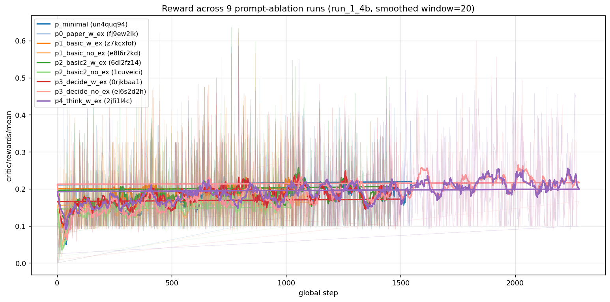

All 9 curves climb. None stalls. Best end-of-run mean rewards: `p3_decide_no_ex` (0.215) and `p4_think_w_ex` (0.212), both at 2280 steps. Worst: `p2_basic2_no_ex` (0.159), the run with total tool-use collapse. No runaway, no oscillation, no reward hacking visible.

---

## 5. Combined view: 12-panel grid for run_1_4b

Same 9 runs, all metrics overlaid:

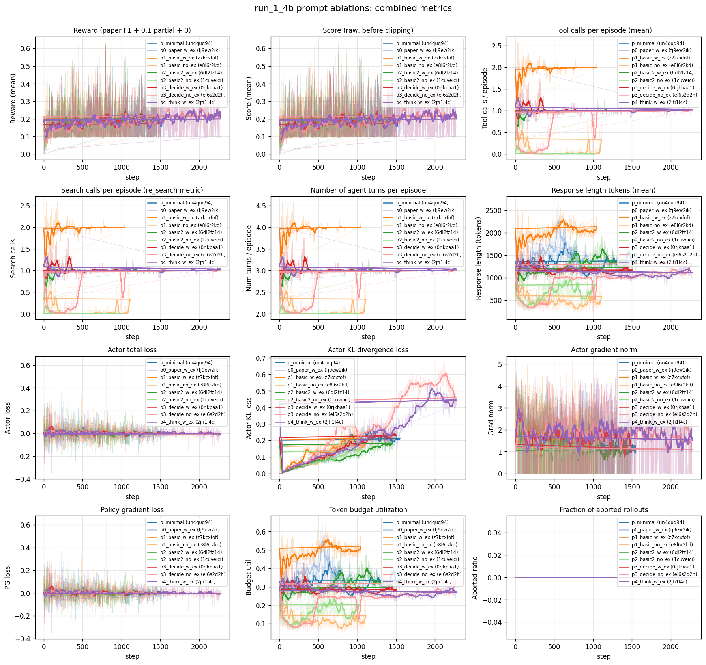

### What pops out

1. **Rewards converge into a tight band, 0.16 to 0.22.** First-decile to last-decile delta is +0.03 to +0.07 across all 9 runs. The model is learning, slowly.
2. **Three behavioral modes emerge**:
   - **Tool-using mode** (`p0_paper_w_ex`, `p2_basic2_w_ex`, `p3_decide_w_ex`, `p3_decide_no_ex`, `p4_think_w_ex`, `p_minimal`): tool calls ≈ 1.0, num turns ≈ 3.0, response length ≈ 1100 to 1400 tokens.
   - **Heavy-tool mode** (`p1_basic_w_ex` only): tool calls ≈ 2.0, num turns ≈ 4.0, response length ≈ 2050.
   - **Tool-skipping collapse** (`p1_basic_no_ex`, `p2_basic2_no_ex` only): tool calls → 0, num turns = 2.0 (think + answer only), response length ≈ 480 to 640.
3. **The reward gap between modes is small**: tool-using ≈ 0.18 to 0.22, no-tool collapse ≈ 0.16. The 0.1 partial-credit floor is doing most of the work; see §7.
4. **Actor losses and KL look healthy**: no NaN, no blow-up. Gradient norm bounded; KL slowly grows as policy diverges from reference (expected on-policy GRPO behavior).
5. **Aborted ratio is essentially zero**: rollout pipeline is stable.

---

## 6. Per-run details: prompt + plot

Each run is shown with the prompt body it used and its 12-panel plot. Order is roughly increasing rules-richness, with example-pair groupings.

---

### `p_minimal` (un4quq94)

**Closest variant to the upstream paper template; one paragraph, no rules section.**

```text
You are a helpful assistant that can answer the given question with the help of the Wikipedia search tool.
You can invoke the Wikipedia search tool to search for factual information about specific topics if needed.
The search query and result are enclosed within <search> </search> and <result> </result> tags respectively,
and the final answer is enclosed within <answer> </answer> tags.
For example, <search>search query here</search> <result>search result here</result>
<answer>The final answer is \[ \boxed{answer here} \]</answer>.
In the last part of the answer, the final exact answer is enclosed within \boxed{} with LaTeX format.
```

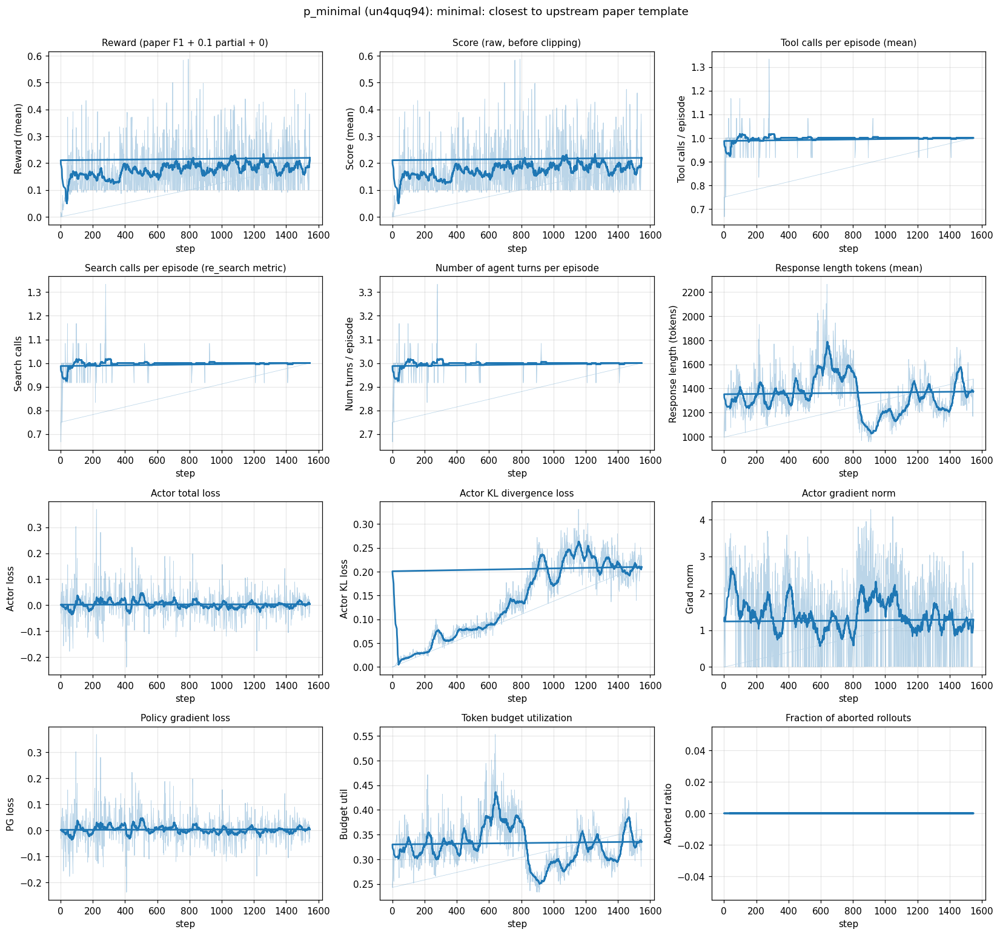

Standard mode: 1 tool call, 3 turns, ~1348 token responses. End-of-run reward 0.189. No collapse, no surprises; this run is the closest direct comparison to a paper-faithful template.

---

### `p0_paper_w_ex` (fj9ew2ik)

**Paper-like rules with a different (capital-of-France) example.**

```text
You are a helpful assistant who can answer questions using a Wikipedia search tool.
You can call the search tool by writing: <search> your query </search>
You will receive the result in: <result> your search result </result>
Use the search tool to obtain the information needed for the answer.
Rely on the search results rather than parametric knowledge.
After using the search results if needed, provide the final answer in the format:
<answer>The final answer is \[ \boxed{answer here} \] </answer>.
For example:
Question: What is the capital of France?
<search>capital of France</search>
<result>The capital of France is Paris.</result>
<answer>The final answer is \[ \boxed{Paris} \]</answer>
```

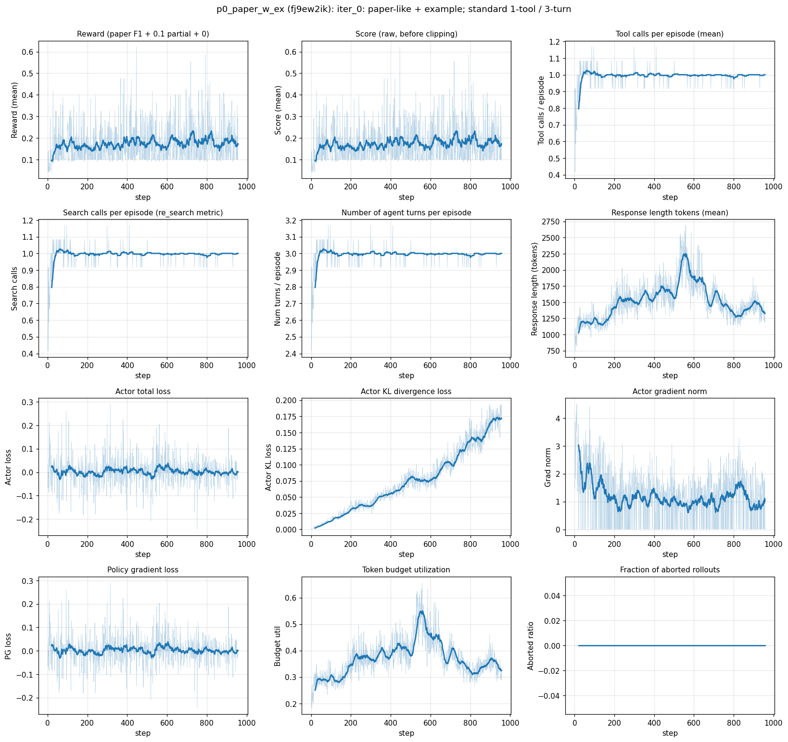

Standard mode: 1 tool call, 3 turns, ~1425 token responses. End-of-run reward 0.181. The capital-of-France example is single-hop, simpler than the multi-hop Hamlet example used in iter_1+; behavior is the same standard 1-tool / 3-turn pattern.

---

### `p1_basic_w_ex` (z7kcxfof)

**Basic rules + Hamlet (multi-hop) example.**

```text
You are a helpful assistant who can answer questions using multiple Wikipedia search tool calls.
You can call the search tool by writing: <search> your query </search>
You will receive the result in: <result> your search result </result>
Use the search tool to obtain the information needed for the answer.
Answers should be based on the search results.
You may use the search tool multiple times if needed before giving the final answer.
Provide the final answer in the format: <answer>The final answer is \[ \boxed{answer here} \]</answer>.
For example:
Question: What is the nationality of the author of Hamlet?
<search>Hamlet</search>
<result>The Tragedy of Hamlet was written by William Shakespeare.</result>
<search>William Shakespeare</search>
<result>William Shakespeare was an English playwright.</result>
<answer>The final answer is \[ \boxed{English} \]</answer>
```

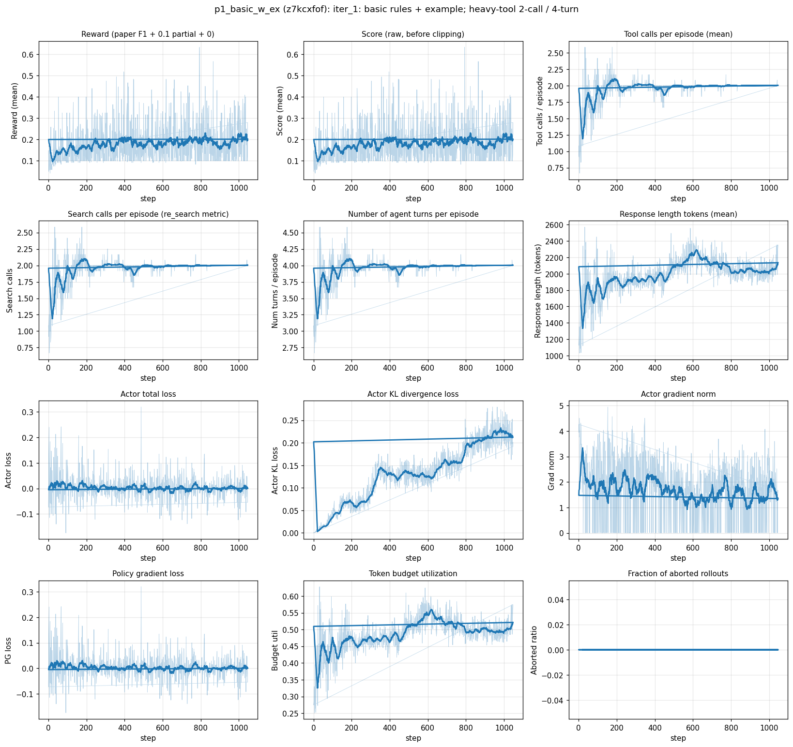

**Heavy-tool mode**: 2 tool calls, 4 turns, ~2047 token responses. End-of-run reward 0.190. The 2-search Hamlet example seems to anchor the model on imitating "always do 2 searches"; this is the only run that converges on 2-call behavior.

---

### `p1_basic_no_ex` (e8l6r2kd)

**Same rules as `p1_basic_w_ex`, example removed.**

```text
You are a helpful assistant who can answer questions using multiple Wikipedia search tool calls.
You can call the search tool by writing: <search> your query </search>
You will receive the result in: <result> your search result </result>
Use the search tool to obtain the information needed for the answer.
Answers should be based on the search results.
You may use the search tool multiple times if needed before giving the final answer.
Provide the final answer in the format: <answer>The final answer is \[ \boxed{answer here} \]</answer>.
```

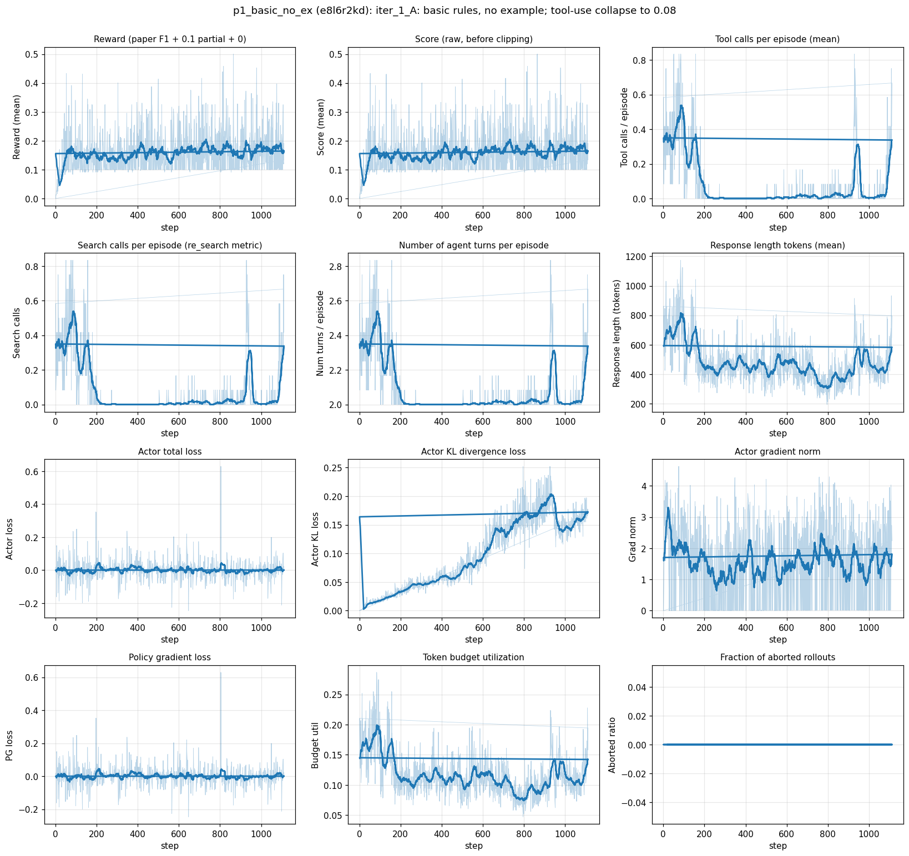

**Tool-use collapse**: tool calls drift from 0.27 down to 0.08; num turns 2.27 → 2.08; response length 619 → 478. End-of-run reward 0.169 (lower than the `_w_ex` variant by ~2pp, despite the model abandoning the search tool). Confirms that the partial-credit reward floor (§7) carries the model upward even without tool use.

---

### `p2_basic2_w_ex` (6dl2fz14)

**Same as `p1_basic_w_ex` with two phrasing tweaks: "multiple" dropped from the opening; "Answers should be based on…" replaced by "Use the information in the search results to determine the final answer."**

```text
You are a helpful assistant who can answer questions using a Wikipedia search tool.
You can call the search tool by writing: <search> your query </search>
You will receive the result in: <result> your search result </result>
Use the search tool to obtain the information needed for the answer.
Use the information in the search results to determine the final answer.
You may use the search tool multiple times if needed before giving the final answer.
Provide the final answer in the format: <answer>The final answer is \[ \boxed{answer here} \]</answer>.
For example:
Question: What is the nationality of the author of Hamlet?
<search>Hamlet</search>
<result>The Tragedy of Hamlet was written by William Shakespeare.</result>
<search>William Shakespeare</search>
<result>William Shakespeare was an English playwright.</result>
<answer>The final answer is \[ \boxed{English} \]</answer>
```

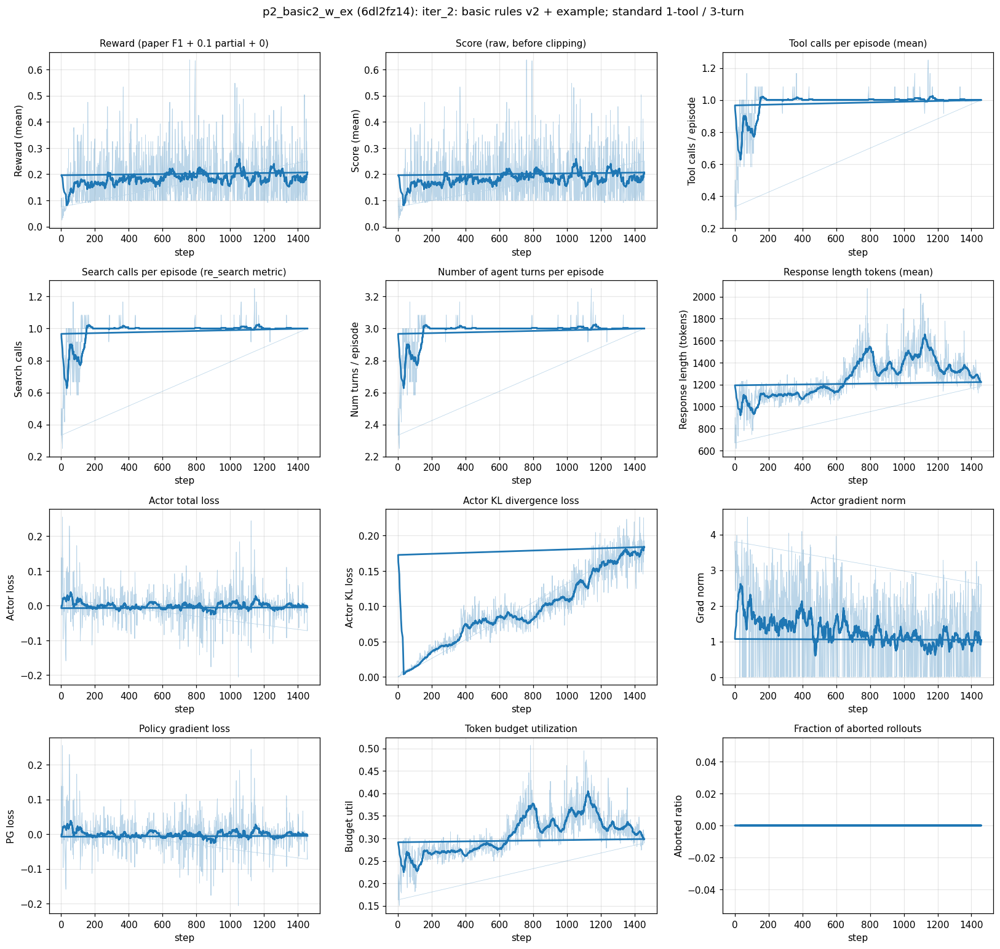

Standard mode: 1 tool call, 3 turns, ~1320 token responses. End-of-run reward 0.189. Dropping "multiple" from the opening line collapses the heavy-tool behavior of `p1_basic_w_ex` back to single-tool, even though the example still demonstrates two searches.

---

### `p2_basic2_no_ex` (1cuveici)

**Same rules as `p2_basic2_w_ex`, example removed.**

```text
You are a helpful assistant who can answer questions using a Wikipedia search tool.
You can call the search tool by writing: <search> your query </search>
You will receive the result in: <result> your search result </result>
Use the search tool to obtain the information needed for the answer.
Use the information in the search results to determine the final answer.
You may use the search tool multiple times if needed before giving the final answer.
Provide the final answer in the format: <answer>The final answer is \[ \boxed{answer here} \]</answer>.
```

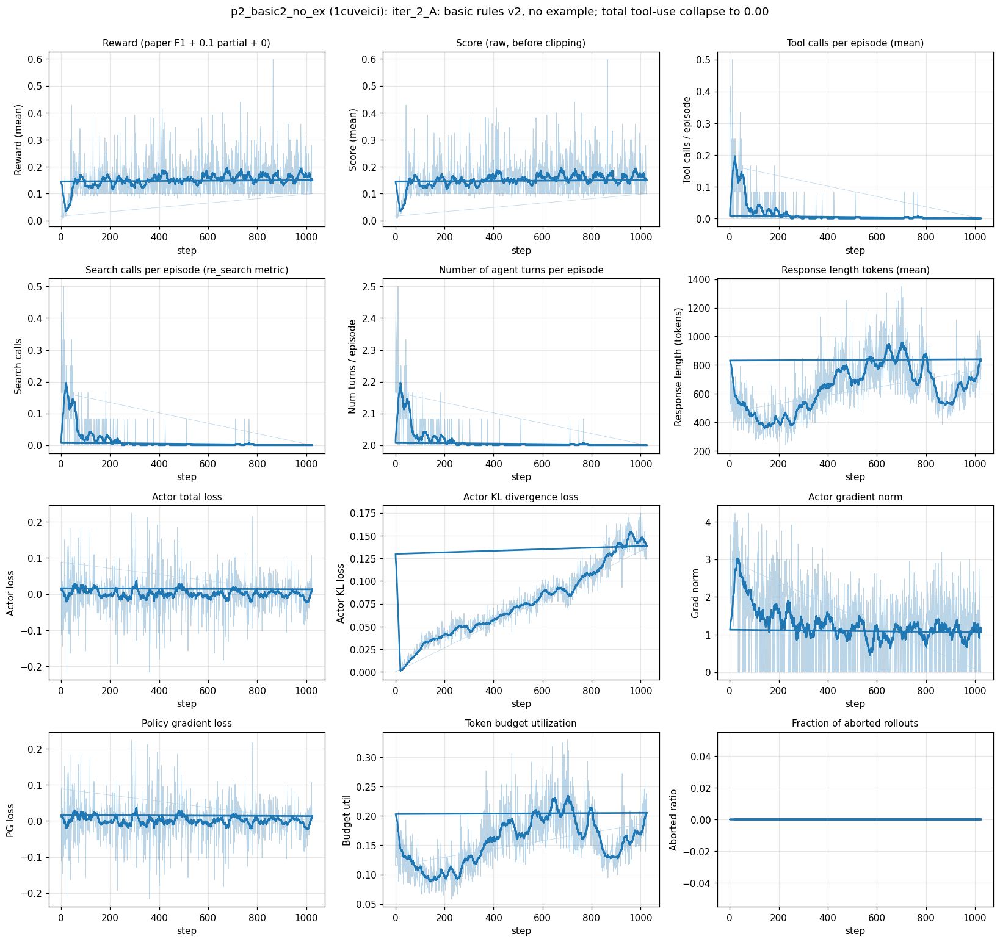

**Total tool-use collapse**: tool calls 0.06 → 0.00; num turns 2.06 → 2.00; response length 451 → 640. End-of-run reward 0.159 (worst of the block). The most extreme collapse case in the data: the model never makes a single search by the end of training, yet still finishes above the bare 0.1 partial-credit floor because of occasional F1 hits from parametric knowledge.

---

### `p3_decide_w_ex` (0rjkbaa1)

**`p2_basic2_w_ex` plus two extra rule sentences about per-step decision-making, plus "Reasoning Process N" labels in the example.**

```text
You are a helpful assistant who can answer questions using a Wikipedia search tool.
You can call the search tool by writing: <search> your query </search>
You will receive the result in: <result> your search result </result>
Use the search tool to obtain the information needed for the answer.
Use the information in the search results to determine the final answer.
After each search result, decide whether another search is needed or whether you can provide the final answer.
If a search result is incomplete, search again for the missing information.
You may use the search tool multiple times if needed before giving the final answer.
Provide the final answer in the format: <answer>The final answer is \[ \boxed{answer here} \]</answer>.
For example:
Question: What is the nationality of the author of Hamlet?
Reasoning Process 1
<search>Hamlet</search>
<result>The Tragedy of Hamlet was written by William Shakespeare.</result>
Reasoning Process 2
<search>William Shakespeare</search>
<result>William Shakespeare was an English playwright.</result>
Reasoning Process 3
<answer>The final answer is \[ \boxed{English} \]</answer>
```

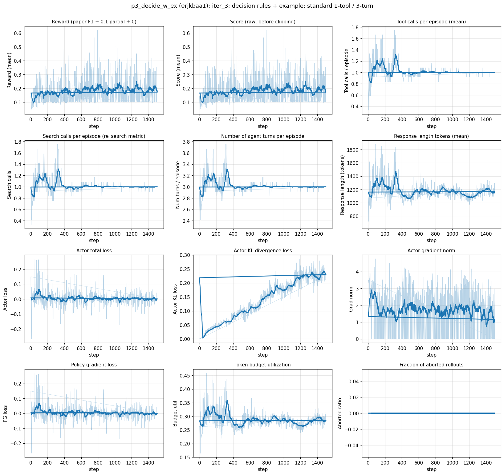

Standard mode: 1 tool call, 3 turns, ~1150 token responses. End-of-run reward 0.190. Adding the per-step decision rules does not push the model toward heavy-tool use here; the same standard pattern as `p2_basic2_w_ex`.

---

### `p3_decide_no_ex` (el6s2d2h)

**Same rules as `p3_decide_w_ex`, example removed.**

```text
You are a helpful assistant who can answer questions using a Wikipedia search tool.
You can call the search tool by writing: <search> your query </search>
You will receive the result in: <result> your search result </result>
Use the search tool to obtain the information needed for the answer.
Use the information in the search results to determine the final answer.
After each search result, decide whether another search is needed or whether you can provide the final answer.
If a search result is incomplete, search again for the missing information.
You may use the search tool multiple times if needed before giving the final answer.
Provide the final answer in the format: <answer>The final answer is \[ \boxed{answer here} \]</answer>.
```

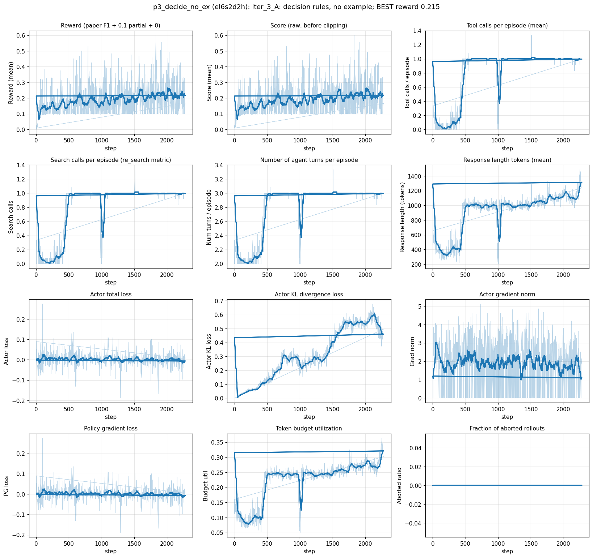

**Best reward of the block**: 0.215 at end-of-run. Tool calls climb 0.38 → 1.00; num turns 2.38 → 3.00; response length 599 → 1117. Tool-use **survives example removal here**, unlike the `p1_basic` and `p2_basic2` pairs. The two extra rule sentences (`After each search result, decide…` / `If a search result is incomplete, search again…`) are the difference. This run is the strongest argument that **decision-rule guidance can substitute for an example** in this regime.

---

### `p4_think_w_ex` (2jfi1l4c)

**Structurally different: introduces explicit `<think>` tags into the loop and a numbered procedure.**

```text
You are a helpful assistant who can answer questions using a Wikipedia search tool.

You must follow this process:
1. First write a brief reasoning step inside <think> </think> explaining what information you need or what you will search for.
2. If more information is needed, call the search tool by writing:
<search> your query </search>
3. You will receive the tool result in:
<result> your search result </result>
4. After every <result>, write another brief reasoning step inside <think> </think> analyzing the result and deciding whether:
   - another search is needed, or
   - you can provide the final answer.
5. Repeat this loop until you have enough information.
6. Then provide the final answer in the format:
<answer>The final answer is \[ \boxed{answer here} \]</answer>

The required behavior is:
<think>reason about what to search</think>
<search>query</search>
<result>search result</result>
<think>analyze the result and decide the next step</think>
<search>another query</search> or <answer>final answer</answer>

Keep each <think> block brief and focused only on deciding the next action.

Example:
Question: What is the nationality of the author of Hamlet?
<think>I need to find who wrote Hamlet.</think>
<search>Hamlet author</search>
<result>Hamlet was written by William Shakespeare.</result>
<think>Now I know the author. I need to find William Shakespeare's nationality.</think>
<search>William Shakespeare nationality</search>
<result>William Shakespeare was English.</result>
<think>I now have enough information to answer.</think>
<answer>The final answer is \[ \boxed{English} \]</answer>
```

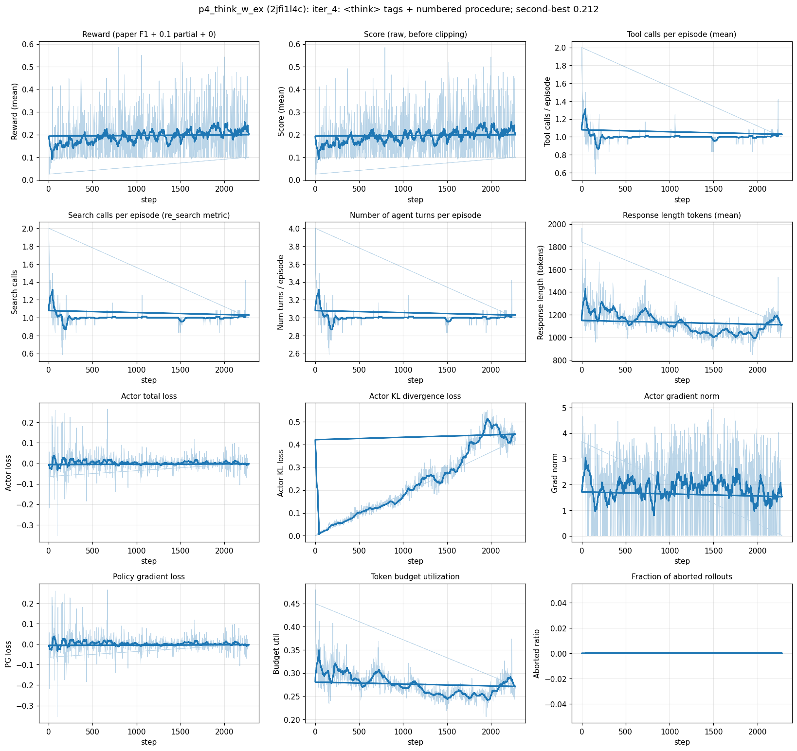

**Second-best reward**: 0.212. Standard 1-tool / 3-turn behavior, ~1071 token responses. The `<think>` tags introduce explicit reasoning between tool calls; behaviorally the run looks like a regularised version of `p3_decide_w_ex` with slightly tighter responses.

---

## 7. Why rewards plateau around 0.18: the partial-credit floor

The paper reward (replicated here verbatim) gives:

- **0** if format is bad (tags wrong, EOS missing).
- **0.1** if an answer is extracted, format is OK, but F1 = 0 (well-formatted but wrong).
- **F1 ∈ (0, 1]** if the boxed answer overlaps with the ground truth.

A model that almost always emits a well-formatted answer but rarely matches ground truth sits near 0.1. End-of-run means of 0.16 to 0.22 imply roughly 6 to 12 % of episodes get a non-zero F1 hit on top of the 0.1 baseline. For a 0.6B model on multi-hop QA (MuSiQue is hard) this is plausible.

The implication: a flat 0.18 mean reward is not a training failure; it is a sparse signal saturating a small model. Any reward-design ablation must address the 0.1 floor (drop it; condition it on tool-use; replace partial-credit with strict EM).

---

## 8. The `_A` suffix is a controlled ablation: example removal

With prompts recovered, the `_A` suffix has a clean definition:

> **`_A` = the same prompt, with the few-shot `For example:` block removed. Rules section is identical.**

Three paired comparisons:

| Pair | Rules section | With example | Without example (`_A`) | Tool-use survives `_A`? |
|---|---|---|---:|---|
| `p1_basic` / `p1_basic_no_ex` | "Use the search tool…" + "Answers should be based on…" (2 sentences) | tool_calls 2.00, reward 0.190 | tool_calls 0.08, reward 0.169 | **No, collapses** |
| `p2_basic2` / `p2_basic2_no_ex` | "Use the search tool…" + "Use the information in the search results…" (2 sentences) | tool_calls 1.00, reward 0.189 | tool_calls 0.00, reward 0.159 | **No, collapses** |
| `p3_decide` / `p3_decide_no_ex` | `p2_basic2` + "After each search result, decide…" + "If a search result is incomplete…" (4 sentences) | tool_calls 1.00, reward 0.190 | tool_calls 1.00, reward **0.215** | **Yes, survives; best reward** |

**The pattern**: removing the few-shot example causes tool-use collapse for prompts whose rules section is short (2 sentences). With a richer rules section that gives explicit per-step decision guidance (4 sentences, including "decide whether another search is needed"), tool-use survives example removal and actually delivers the best reward.

The `p4_think_w_ex` prompt confirms the same pattern from a different angle: it has both a structured numbered procedure AND `<think>` tags AND an example; it ranks second-best (0.212) and is in the standard 1-tool / 3-turn regime.

> **One-line takeaway**: in this 0.6B regime, give the model **either** a few-shot example **or** explicit per-step decision rules. If neither is given, the model quietly stops calling the tool because the partial-credit reward floor lets it.

---

## 9. Pre-`run_1_4b` setup runs (context)

These five runs predate the actual ablation block. They are kept here as the bring-up record. None of them have full prompt bodies in W&B notes; only behavioral inference is possible.

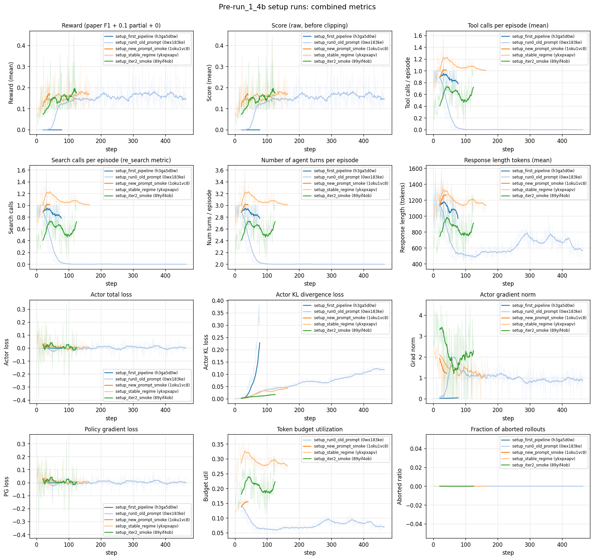

### `setup_first_pipeline` (h3ga5d0w)
77 steps. First successful end-to-end pipeline run. Too short to draw any conclusion.

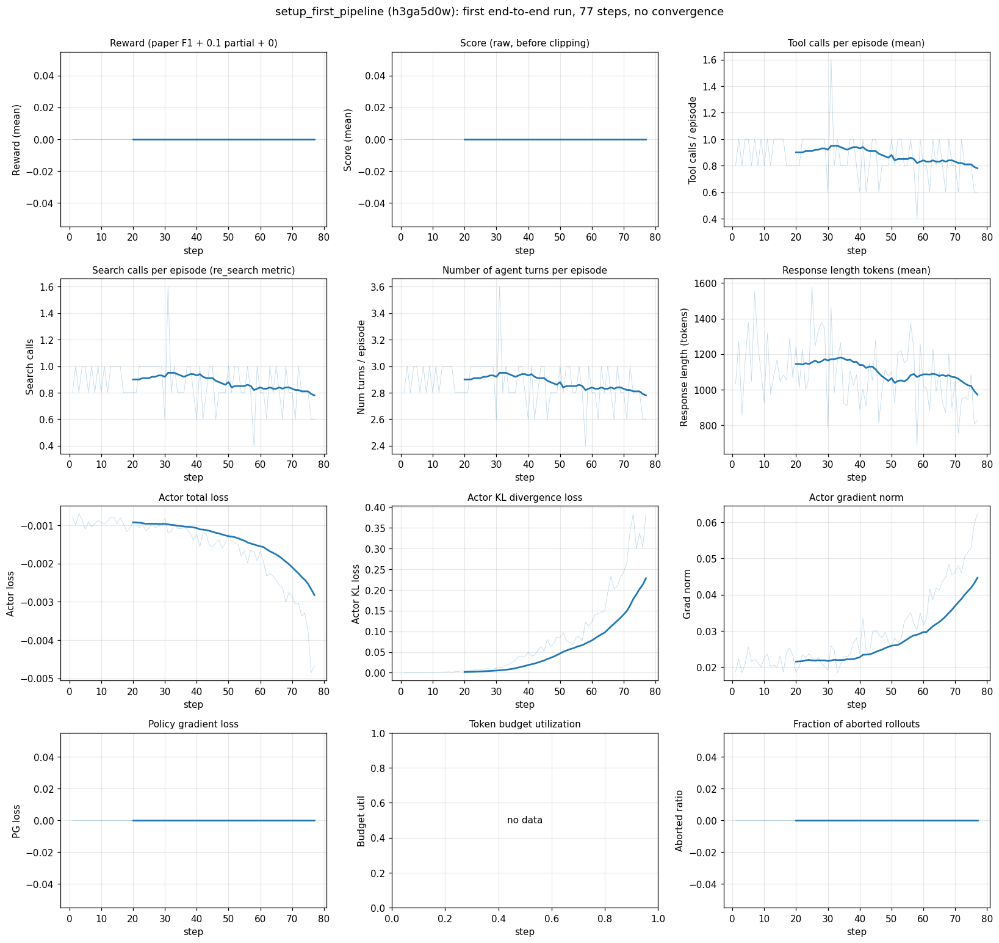

### `setup_run0_old_prompt` (0wx183ke)
464 steps, "Base line (old prompt)" per W&B notes. Tool-use collapses to 0; reward still climbs (0.004 → 0.151) via the partial-credit floor. This is the same collapse mode that `p1_basic_no_ex` and `p2_basic2_no_ex` later reproduce.

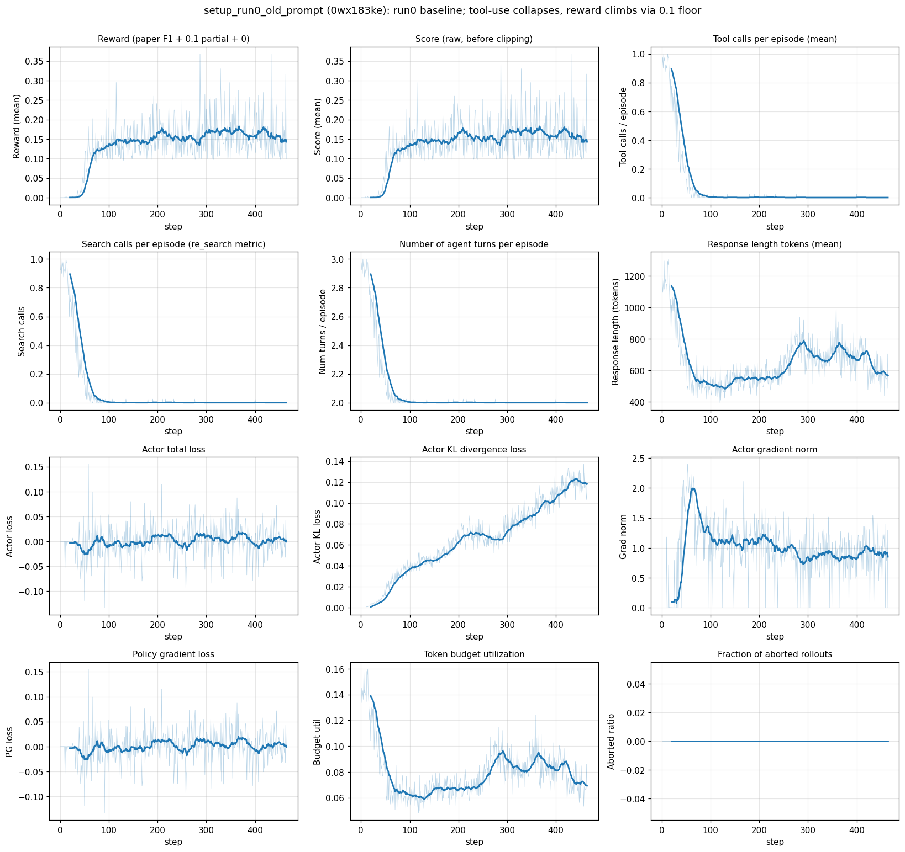

### `setup_new_prompt_smoke` (1oku1vc8)
41 steps, "New Prompt" per W&B notes. Crashed early; not interpretable.

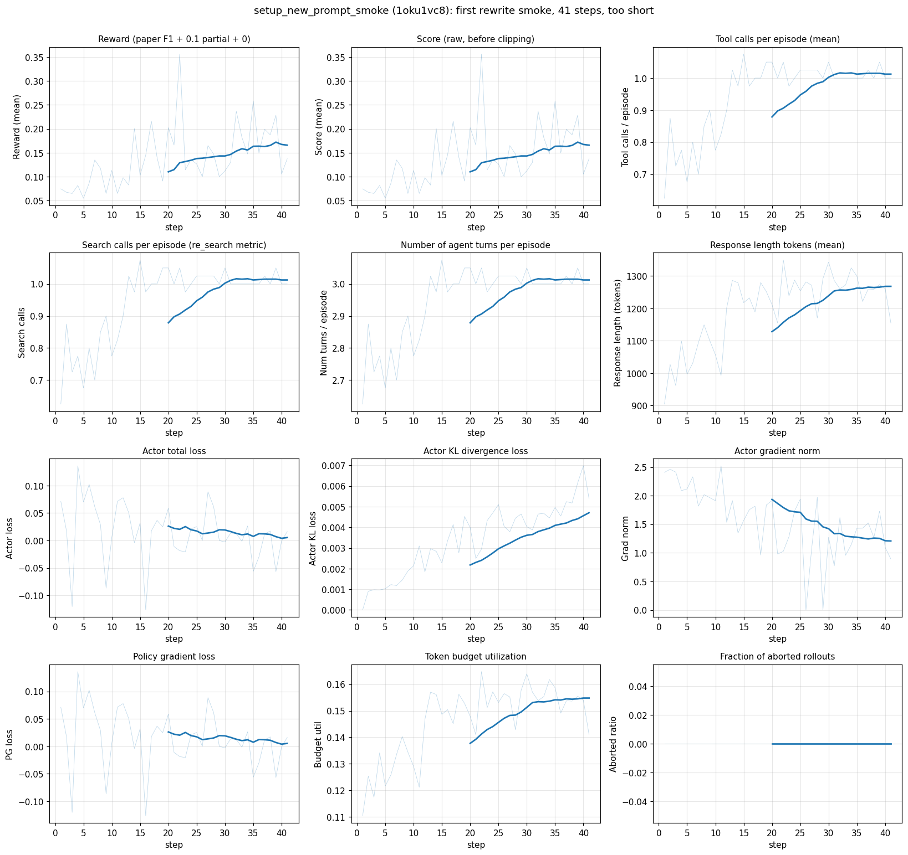

### `setup_stable_regime` (ykxpxapv)
164 steps, "stable regime: tool use + learning + controlled outputs" per W&B notes. Reaches the same 1-tool / 3-turn pattern that most `run_1_4b` runs converge to. The label is consistent with the data.

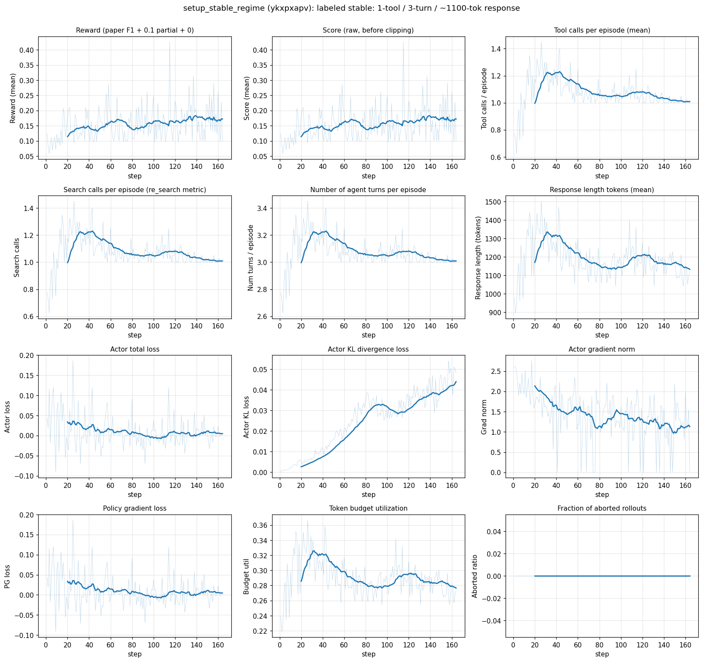

### `setup_iter2_smoke` (89yif4ob)
125 steps, untagged smoke of an early iter_2 prompt. In transition; reward climbing but no convergence yet.

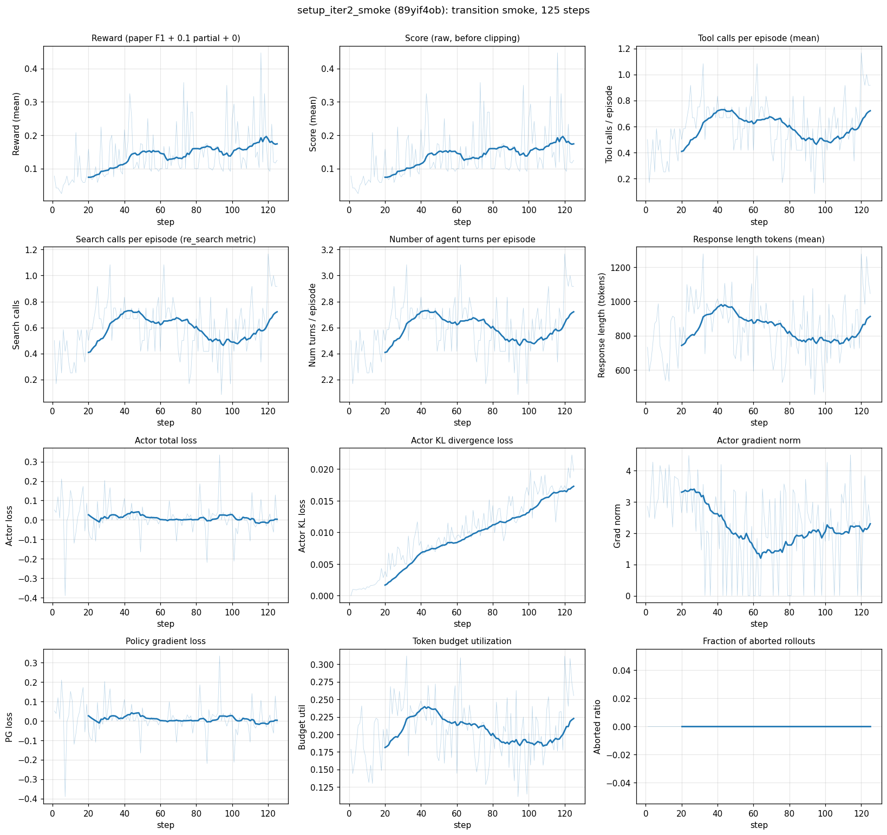

---

## 10. Cross-run summary table

First-decile mean → last-decile mean for each metric. Bold rows are the `run_1_4b` block.

| Run | Compact name | Reward (first → last) | Δ | Tool calls | Num turns | Resp len |
|---|---|---|---:|---|---|---|
| h3ga5d0w | setup_first_pipeline | 0.000 → 0.000 | +0.000 | 0.91 → 0.74 | 2.91 → 2.74 | 1185 → 904 |
| 0wx183ke | setup_run0_old_prompt | 0.004 → 0.151 | +0.147 | 0.64 → 0.00 | 2.64 → 2.00 | 968 → 584 |
| 1oku1vc8 | setup_new_prompt_smoke | 0.072 → 0.165 | +0.092 | 0.75 → 1.01 | 2.75 → 3.01 | 998 → 1237 |
| ykxpxapv | setup_stable_regime | 0.104 → 0.184 | +0.080 | 0.97 → 1.01 | 2.97 → 3.01 | 1159 → 1115 |
| 89yif4ob | setup_iter2_smoke | 0.053 → 0.175 | +0.122 | 0.37 → 0.79 | 2.37 → 2.79 | 724 → 978 |
| **fj9ew2ik** | **p0_paper_w_ex** | 0.145 → 0.181 | +0.036 | 0.96 → 1.00 | 2.96 → 3.00 | 1160 → 1425 |
| **un4quq94** | **p_minimal** | 0.143 → 0.189 | +0.046 | 0.99 → 1.00 | 2.99 → 3.00 | 1312 → 1348 |
| **z7kcxfof** | **p1_basic_w_ex** | 0.148 → 0.190 | +0.042 | 1.83 → 2.00 | 3.83 → 4.00 | 1788 → 2047 |
| **e8l6r2kd** | **p1_basic_no_ex** | 0.138 → 0.169 | +0.031 | 0.27 → 0.08 | 2.27 → 2.08 | 619 → 478 |
| **6dl2fz14** | **p2_basic2_w_ex** | 0.156 → 0.189 | +0.033 | 0.91 → 1.00 | 2.91 → 3.00 | 1055 → 1320 |
| **1cuveici** | **p2_basic2_no_ex** | 0.126 → 0.159 | +0.033 | 0.06 → 0.00 | 2.06 → 2.00 | 451 → 640 |
| **0rjkbaa1** | **p3_decide_w_ex** | 0.154 → 0.190 | +0.036 | 1.05 → 1.00 | 3.06 → 3.00 | 1245 → 1150 |
| **el6s2d2h** | **p3_decide_no_ex** | 0.151 → 0.215 | +0.065 | 0.38 → 1.00 | 2.38 → 3.00 | 599 → 1117 |
| **2jfi1l4c** | **p4_think_w_ex** | 0.166 → 0.212 | +0.046 | 1.02 → 1.00 | 3.02 → 3.00 | 1218 → 1071 |

---

## 11. Findings

### 11.1. The model learns, slowly
Every long run shows a positive reward delta. Final means cluster at 0.18 to 0.22 over a 9968-step horizon. No catastrophic collapse, no NaN, no reward hacking.

### 11.2. Prompt drives behavior more than reward (in this block)
With identical training config and identical reward, swapping prompt text moves end-of-run tool-call rate from 0 to 2 and response length from ≈480 to ≈2050 tokens, almost an order of magnitude. The reward changes only ±3 pp across the same prompts.

### 11.3. The `_A` suffix is "no example": it controls a single thing
With prompts recovered, `_A` is exactly "remove the few-shot example". Whether tool-use survives example removal depends on whether the rules section gives explicit per-step decision guidance:
- `p1_basic`, `p2_basic2` (2-sentence rules) ⇒ no example ⇒ collapse.
- `p3_decide` (4-sentence rules with explicit "decide whether another search is needed") ⇒ no example ⇒ tool-use survives, best reward of the block (0.215).

### 11.4. The 0.1 partial-credit floor masks the tool-use signal
Even runs that completely abandon tool use (`p2_basic2_no_ex`) finish at 0.159 mean reward. The 0.1 floor for well-formatted-but-wrong answers plus a few F1 hits is enough to pull rewards monotonically upward. Tool-using vs no-tool runs are separated by only 3 to 6 pp of reward, which is tiny relative to the 9-pp prompt-driven behavior swing. The reward as defined here is not strongly distinguishing tool-using from non-tool-using policies.

### 11.5. Hybrid-vs-base was not actually tested in this block
All 14 runs use `Qwen3-0.6B` (the post-trained hybrid checkpoint) with `re_search_add_thinking=False`. The base-vs-hybrid ablation that was originally intended is not in this dataset. The W&B run names containing `_instruct_` reflect treating the hybrid checkpoint as the instruct equivalent.

### 11.6. Numerical stability is fine on 1× A100-40GB at this scale
Single-A100 with `param_offload=True`, `train_batch_size=4`, `rollout.n=3`, `max_model_len=4608` runs to 2.3K steps without crashing on the GRPO + multi-turn stack.

### 11.7. `p3_decide` and `p4_think_w_ex` bracket the working regime
For the 0.6B hybrid in this block, the most reliable prompt design is **rules with explicit per-step decision guidance** (`p3_decide_no_ex`) or a structured numbered procedure with `<think>` tags (`p4_think_w_ex`). Adding the example is cheap insurance for weaker rule-sets but is not necessary for stronger ones.

---

## 12. Open questions raised by these results

1. Is the 0.18 to 0.22 reward plateau a 0.6B ceiling, or is more training needed? Curves are still climbing at 2.3K steps. (Moot for this block since Qwen3-0.6B is retired; relevant for whether to expect a similar ceiling at the Qwen3.5 size we are now using.)
2. Should the partial-credit reward floor be removed for the next block? It is the single biggest driver of "everything reaches ≈0.18 regardless of behavior" and obscures what the model is actually learning.
3. Does the no-tool collapse in `p2_basic2_no_ex` represent a successful exploit of the partial-credit reward, or a separate failure mode? Inspecting rollout JSONLs from that run would settle it.
4. Would a clean base-vs-hybrid comparison need to control for prompt? The prompt-driven variance dominates rewards here (±3 pp prompt vs ±6 pp tool-use vs ±?? base/hybrid), so any base/hybrid claim must hold the prompt fixed.
5. The current `re_search_template_sys` in git uses the new `<tool_call>` JSON format, but every run in this block used the legacy `<search>` / `<result>` paper-style tags. Behavior on the JSON tool-call format is not in this dataset and would need its own ablation.
