# Results v1: Second Block (W&B project `research_revamp`)

**Date compiled**: 2026-05-03  
**Source**: W&B project [`gaurisankarj1996-leiden-university/research_revamp`](https://wandb.ai/gaurisankarj1996-leiden-university/research_revamp)  
**Hardware**: ALICE cluster, 1× A100 (mostly `gpu_1_40gb`; three short smoke runs on `gpu_1_80gb`).  
**Model**: still `Qwen3-0.6B` (10 instruct runs) + `Qwen3-0.6B-Base` (5 base runs). Qwen3-0.6B was retired after this block.

> **Bottom line up front**:
> 1. v1 introduced the new tool-call format (`<tool_call>{...JSON...}</tool_call>` + `<tool_response>`) and the JSON `{"query": "..."}` arguments contract. Three instruct prompts (`r0_strict_contract`, `r1_query_object`, `r2_concise`) all converged to the standard 1-tool / 3-turn / ~1000-1100 token regime, with rewards in the 0.14 to 0.18 band (slightly lower than v0's 0.18 to 0.22).
> 2. **The base-model attempts (`base_*`) all failed to learn tool use**: across 5 runs, `tool_call_counts/mean` stayed at 0.00 throughout training. The base model simply doesn't emit `<tool_call>` tokens.
> 3. **`base_breakthrough` (b8vv0qe2) shows reward 0.700**, but with 0 tool calls and ~93-token responses, on configs identical to `base_state_machine_a` (hmf76bfd) which finished at 0.0. The reward function code was edited between Apr 17 and Apr 18; this is most likely a **reward-function relaxation, not a learning breakthrough**. Treat the 0.7 number as instrumented, not earned.
> 4. Several late runs (`exp_one`, `think_prefill`, `reward_v3`) are stuck at reward 0 throughout, likely due to format-validator mismatches with the prompt body or reward function bugs.

---

## 1. Run roster (15 runs)

| W&B id | Compact name | Date | Steps | Model | Behavior summary |
|---|---|---|---:|---|---|
| `xtcb7mo9` | `r0_strict_contract` | 2026-04-12 | 228 | instruct | OUTPUT CONTRACT verbose prompt; standard 1-tool / 3-turn; reward 0.149 |
| `0bhfwm68` | `r1_query_object` | 2026-04-12 | 884 | instruct | JSON `query` arg required; standard 1-tool / 3-turn; reward 0.179 |
| `gzz5amvj` | `r2_concise` | 2026-04-12 | 1176 | instruct | shortened JSON-arg prompt; standard 1-tool / 3-turn; reward 0.138 |
| `x7ya3ev3` | `r3_80gb_a` | 2026-04-14 | 31 | instruct | 80GB profile smoke |
| `jv6g32zu` | `r3_80gb_b` | 2026-04-14 | 79 | instruct | 80GB profile smoke |
| `iz3w4cxj` | `r3_80gb_c` | 2026-04-14 | 96 | instruct | 80GB profile smoke |
| `cse8dhqk` | `exp_zero` | 2026-04-17 | 350 | instruct | EXPERIMENT ZERO; tool-use collapses to 0; reward 0.144 |
| `urlw74yz` | `exp_one` | 2026-04-17 | 218 | instruct | EXPERIMENT ONE; reward stuck at 0 throughout (broken) |
| `hmf76bfd` | `base_state_machine_a` | 2026-04-17 | 2301 | **base** | strict state-machine prompt; 0 tool calls; reward ~0 |
| `zrphud77` | `base_state_machine_b` | 2026-04-17 | 2301 | **base** | duplicate of `_a`; same outcome |
| `guzkoeg4` | `base_with_example_a` | 2026-04-18 | 115 | **base** | with-example prompt; crashed; 0 tool calls |
| `d5ey6zj9` | `base_with_example_b` | 2026-04-18 | 204 | **base** | duplicate of `_a`; crashed; 0 tool calls |
| `b8vv0qe2` | `base_breakthrough` | 2026-04-18 | 2301 | **base** | **anomaly: reward 0.700, 0 tool calls** (likely reward-function change) |
| `huw425rb` | `think_prefill` | 2026-04-19 | 38 | instruct | ADDED THINK PREFILL; too short to read; reward 0 |
| `w00kccwq` | `reward_v3` | 2026-04-19 | 594 | instruct | NEW REWARD FORMAT 3; reward stuck at 0 throughout |

---

## 2. Shared training configuration (across all 15 runs)

Pulled from W&B run config; identical across all 15 runs unless noted in §3.

| Setting | Value |
|---|---|
| Algorithm | GRPO |
| KL control | `kl_ctrl.kl_coef=0.001`, `kl_loss_coef=0.001`, `kl_loss_type=low_var_kl` |
| Optimizer | AdamW, `lr=1e-06`, constant schedule |
| Reward | `re_search` reward manager (paper-shape, but **the underlying code was edited between Apr 17 and Apr 18**; see §10.3) |
| Train batch | `train_batch_size=4`, `ppo_mini_batch_size=4` |
| Sequence (most runs) | `max_prompt_length=512`, `max_response_length=4096` |
| Rollout | `n=3`, `vllm.max_model_len=4608`, `enforce_eager=True` |
| FSDP | `actor.param_offload=True`, `ref.param_offload=True` |
| Agent loop | `re_search_agent` (verl_latest async) |
| Retriever | CPU FAISS, `wiki18_100w_mini`, `http://127.0.0.1:3005` |
| Hardware | ALICE: 1 GPU per node, 1 node |
| Compile | `use_torch_compile=True`, `attn_implementation=sdpa` |

---

## 3. Per-run differences

| Run | Model | Prompt template name | `re_search_use_chat_format` |
|---|---|---|---|
| 10 instruct runs | `Qwen3-0.6B` | `re_search_template_sys` | True |
| 5 base runs (`base_*`) | `Qwen3-0.6B-Base` | `re_search_template` (paper template, no system prompt) | False |

The instruct vs base split also implies a chat-format split: instruct runs use `apply_chat_template` (system + user turn); base runs use the raw `re_search_template` with `User: {prompt} Assistant:` framing.

---

## 4. Reward focus across all 15 runs

Color-coded by experimental subgroup: instruct-new-prompts (blue), 80GB smoke (orange), instruct-experiments (green), base (red), late-instruct (purple).

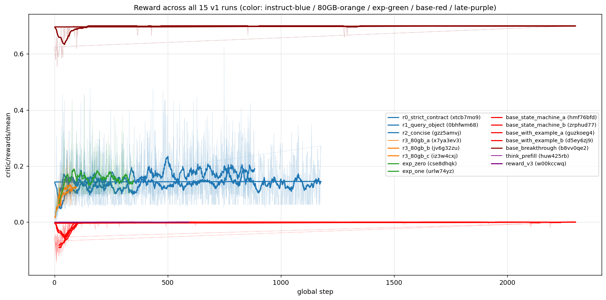

What the chart shows at a glance:
- The **instruct band 0.14 to 0.18** (blue and orange curves) is consistent with the v0 instruct runs but lower-ceiling. v0 best instruct was 0.215 (`p3_decide_no_ex`); v1 best instruct is 0.179 (`r1_query_object`).
- **`base_breakthrough` (dark red, top)** sits at ~0.7, far above everything else. This is anomalous; see §10.
- **`exp_one`, `think_prefill`, `reward_v3`** sit at 0 throughout (stuck rewards, likely format / reward bugs).
- **The four other base runs (red)** sit at 0 throughout because the model never emits a tool call and the strict format validator rejects everything.

---

## 5. Combined view: instruct, new tool_call prompts (Apr 12)

Three prompts, all using the new `<tool_call>` JSON format. Each tests a different rules verbosity: `r0_strict_contract` (very strict OUTPUT CONTRACT), `r1_query_object` (medium-length, JSON-arg with example), `r2_concise` (short).

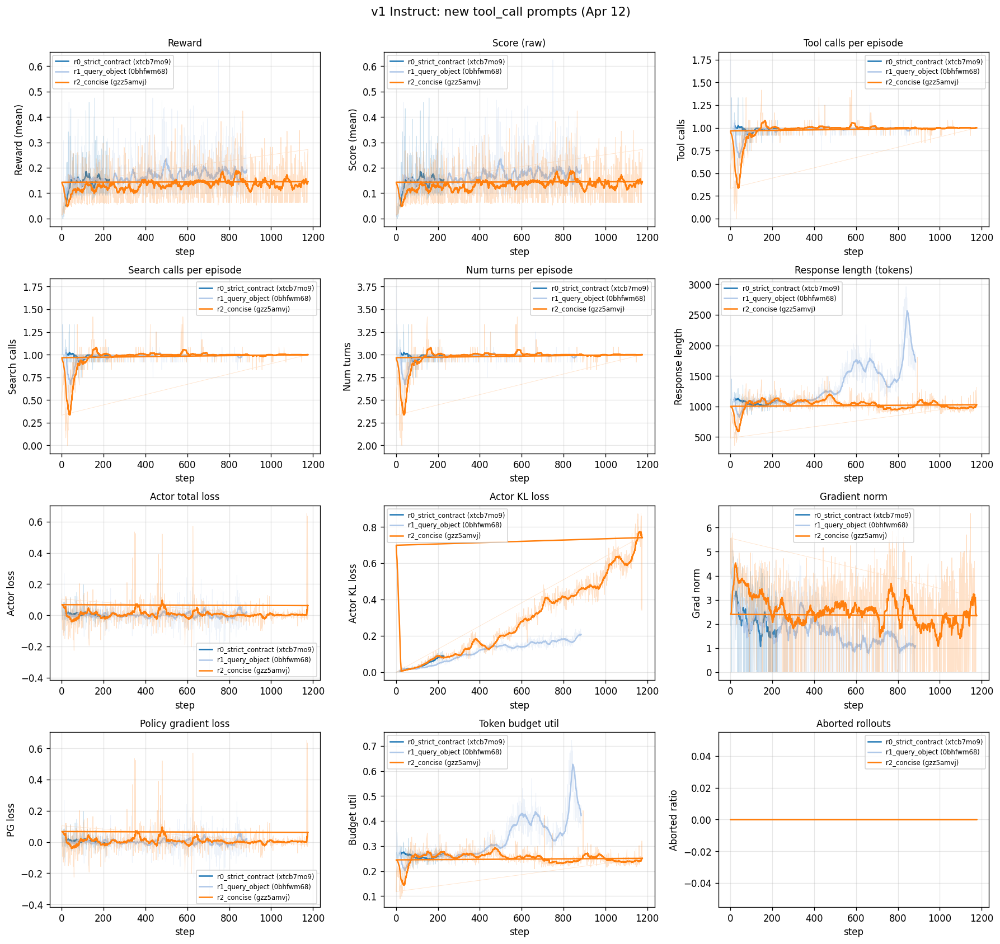

All three converge to the same standard 1-tool / 3-turn pattern. Reward ordering: `r1_query_object` (0.179) > `r0_strict_contract` (0.149) ≥ `r2_concise` (0.138). The middle-verbosity prompt with explicit JSON arg schema and an example wins, mirroring v0's finding that decision rules + example is the working regime.

---

## 6. Combined view: 80GB smoke runs (Apr 14)

Three short bring-up runs on the 80GB profile (no notes). All <100 steps; not interpretable as ablations, kept as record.

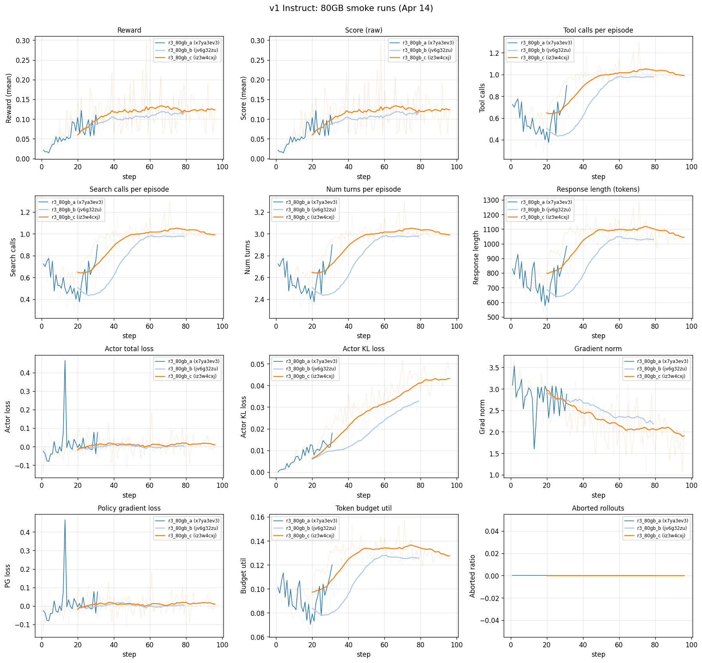

---

## 7. Combined view: EXPERIMENT ZERO / EXPERIMENT ONE (Apr 17)

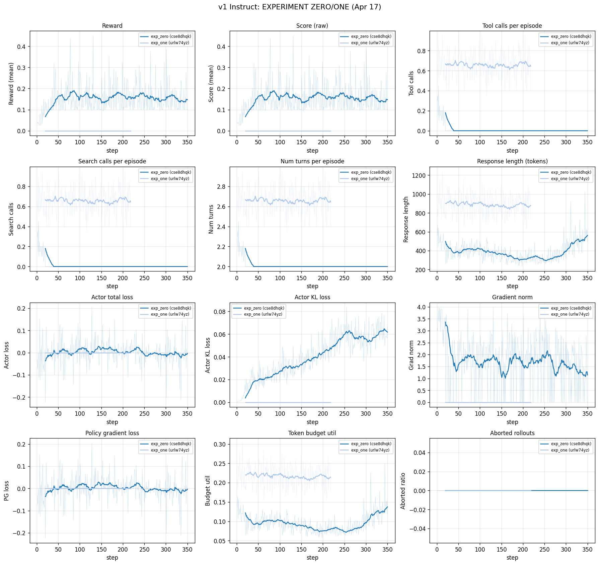

- **`exp_zero`** (cse8dhqk, 350 steps): tool-use collapses from 0.10 to 0.00 over training; reward climbs to 0.144 via the partial-credit floor. Same behavioral signature as v0's `p1_basic_no_ex` and `p2_basic2_no_ex` collapse modes.
- **`exp_one`** (urlw74yz, 218 steps): reward stays at 0.000 for the entire 218 steps despite tool calls happening (~0.66 mean) and reasonable response lengths (~870 tokens). The format validator is likely rejecting every rollout, suggesting a prompt/validator mismatch.

---

## 8. Combined view: BASE model attempts (Apr 17 to 18)

Five attempts to train the Qwen3-0.6B-Base model. **None of them got the base model to emit a tool call.**

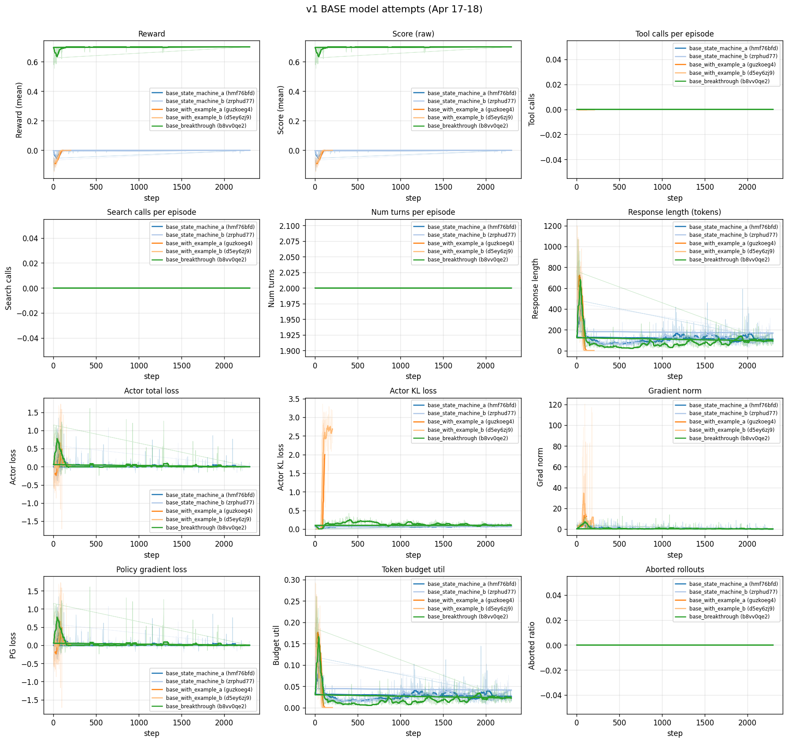

| Run | Prompt style | Steps | Reward (first to last) | Tool calls | Resp len |
|---|---|---:|---|---|---|
| `base_state_machine_a` (hmf76bfd) | strict state machine | 2301 | -0.005 → -0.000 | 0 → 0 | 115 → 113 |
| `base_state_machine_b` (zrphud77) | dup of `_a` | 2301 | -0.005 → -0.000 | 0 → 0 | 111 → 125 |
| `base_with_example_a` (guzkoeg4) | with Hamlet example | 115 | -0.088 → -0.001 | 0 → 0 | 563 → 1 |
| `base_with_example_b` (d5ey6zj9) | dup of `_a` | 204 | -0.082 → 0.000 | 0 → 0 | 607 → 1 |
| `base_breakthrough` (b8vv0qe2) | (no notes; same prompt) | 2301 | **0.694 → 0.700** | 0 → 0 | 99 → 92 |

The first four are consistent: the base model under the new strict tool_call prompt format simply does not emit `<tool_call>` (it has no chat-template / instruction-tuning to follow such a structured format). The format validator therefore rejects every rollout; reward = 0 (slightly negative due to KL penalty).

The `base_with_example_*` pair both show response_length collapsing to 1 token, consistent with the model finding it easier to emit a single token than to attempt the structured format. Both crashed before 250 steps.

The `base_breakthrough` outlier is the diagnostic finding of this block; see §10.

---

## 9. Combined view: late instruct (Apr 19)

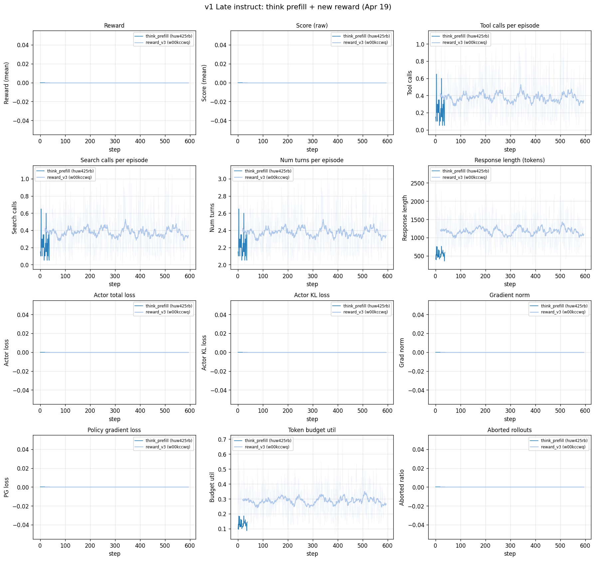

- **`think_prefill`** (huw425rb, 38 steps): added a `<think>` prefill to the assistant header. Crashed too early to interpret.
- **`reward_v3`** (w00kccwq, 594 steps): "NEW REWARD FORMAT 3"; reward stuck at 0.000 for all 594 steps, despite tool calls happening (~0.4 mean) and response lengths >1000 tokens. The new reward format is broken or not finding the answer; the model is otherwise behaving normally.

---

## 10. Per-run details: prompts and plots

### `r0_strict_contract` (xtcb7mo9, 228 steps, instruct)

OUTPUT CONTRACT: very strict and verbose; allows only `<think>`, `<tool_call>`, `<tool_response>`, `<answer>`. Defines a state machine in prose.

```text
You are a reasoning agent that answers questions using a search tool.
You MUST follow a strict step-by-step loop.

# OUTPUT CONTRACT (STRICT)
- You may ONLY output the following tags:
  <think>, <tool_call>, <tool_response>, <answer>
- Do NOT output any text outside these tags.

# STATE TRANSITIONS
1. Start with <think>...</think>
2. After each <think>, you MUST output exactly ONE of:
   - <tool_call>...</tool_call>
   - <answer>...</answer>
3. After each <tool_call>, you will receive <tool_response>...</tool_response>
4. After each <tool_response>, you MUST output <think>...</think>
5. You MUST end with <think>...</think> <answer>The final answer is \[ \boxed{...} \]</answer>
6. After </answer>, STOP. Do not generate anything else.

# RULES
- Every tool call MUST be preceded by <think>
- Every <tool_response> MUST be followed by <think>
- Do NOT write answers outside <answer> tags
- Phrases like "final answer is ..." outside <answer> are INVALID
- Keep <think> short and focused on the next step

# TOOLS
<tools>
{"name": "search", "description": "Search Wikipedia for factual information.", "parameters": {"type": "string"}}
</tools>

Tool call format:
<tool_call>
{"name": "search", "arguments": "query"}
</tool_call>

Tool response format:
<tool_response>
result
</tool_response>
```

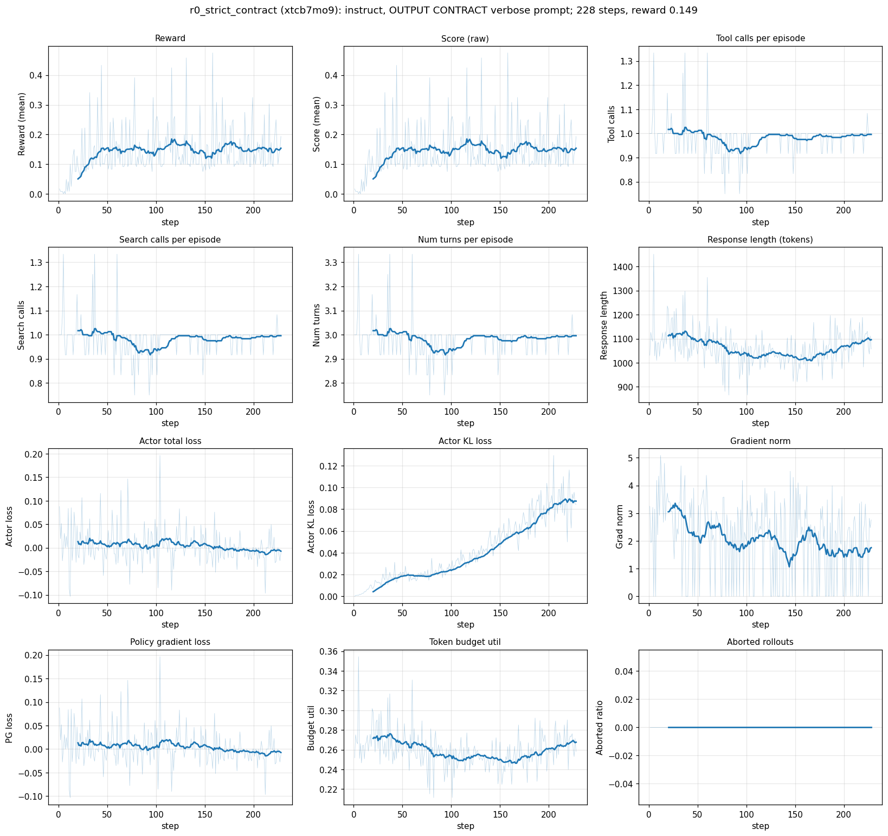

Standard 1-tool / 3-turn / ~1100-token responses; reward 0.052 → 0.149. Note `arguments` is a plain string here (`"arguments": "query"`), not a JSON object.

---

### `r1_query_object` (0bhfwm68, 884 steps, instruct)

Adds the explicit `arguments.query` JSON object schema and a worked example.

```text
You are a reasoning agent with one tool named search.

Your output must consist only of these tags: <think>, <tool_call>, <tool_response>, <answer>.
Output nothing outside those tags.

Required reasoning-over-search loop:
1. Begin with <think>...</think>
2. After each <think>, output exactly one next block:
   - <tool_call>...</tool_call>
   - <answer>...</answer>
3. After each <tool_call>, a <tool_response>...</tool_response> will be provided
4. After each <tool_response>, continue with a new <think>...</think>
5. Continue this loop until you have enough evidence to answer
6. Finish with exactly one <answer>The final answer is \[ \boxed{...} \]</answer>
7. After </answer>, stop immediately

Hard rules:
- Never stop after <think>, <tool_call>, or <tool_response>
- Every tool call must be preceded by a <think>
- Every answer must be preceded by a <think>
- After every <tool_response>, you must reason in a new <think> before deciding to search again or answer
- Keep each <think> concise, specific, and decision-oriented; avoid repetition
- Do not state or draft the final answer inside <think>
- Use as many searches as needed to answer correctly, but do not make unnecessary searches
- Never write literal tag names inside the content of another block
- Every <tool_call> must be valid JSON with this exact schema:
  {"name": "search", "arguments": {"query": "short factual query"}}

Example valid trace:
<think>Need one key fact first.</think>
<tool_call>{"name": "search", "arguments": {"query": "entity founding year"}}</tool_call>
<tool_response>retrieved evidence</tool_response>
<think>This gives the year, so I can now answer.</think>
<answer>The final answer is \[ \boxed{example} \]</answer>

<tools>
{"name": "search", "description": "Search Wikipedia for factual information.", "parameters": {"type": "object", "properties": {"query": {"type": "string", "description": "Short factual search query."}}, "required": ["query"]}}
</tools>
```

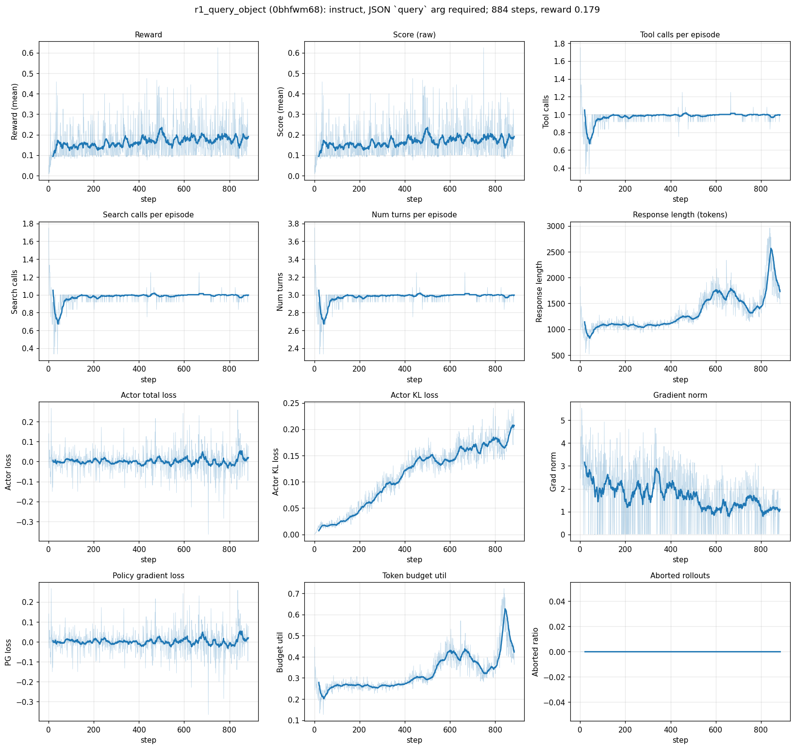

Standard 1-tool / 3-turn; response_length grows 1010 → 1981; reward 0.137 → 0.179. Best of the v1 instruct prompts. The schema with `{"query": ...}` and the worked example anchor the model on valid JSON tool-call output.

---

### `r2_concise` (gzz5amvj, 1176 steps, instruct)

Same JSON schema, much shorter rules block.

```text
You are a reasoning assistant with one tool: search.

Use only these tags in assistant output: <think>, <tool_call>, <tool_response>, <answer>.

Use multi-step tool calling when needed:
<think>...</think>
<tool_call>{"name":"search","arguments":{"query":"short factual query"}}</tool_call>
<tool_response>...</tool_response>
<think>...</think>

Repeat this loop until you have enough evidence, then finish once with:
<answer>The final answer is \[ \boxed{...} \]</answer>

Rules:
- Every <tool_call> must be valid JSON with arguments as an object.
- Do not stop after <think>, <tool_call>, or <tool_response>.
- After </answer>, stop immediately.

<tools>
{"name":"search","description":"Search Wikipedia for factual information.","parameters":{"type":"object","properties":{"query":{"type":"string","description":"Short factual search query."}},"required":["query"]}}
</tools>
```

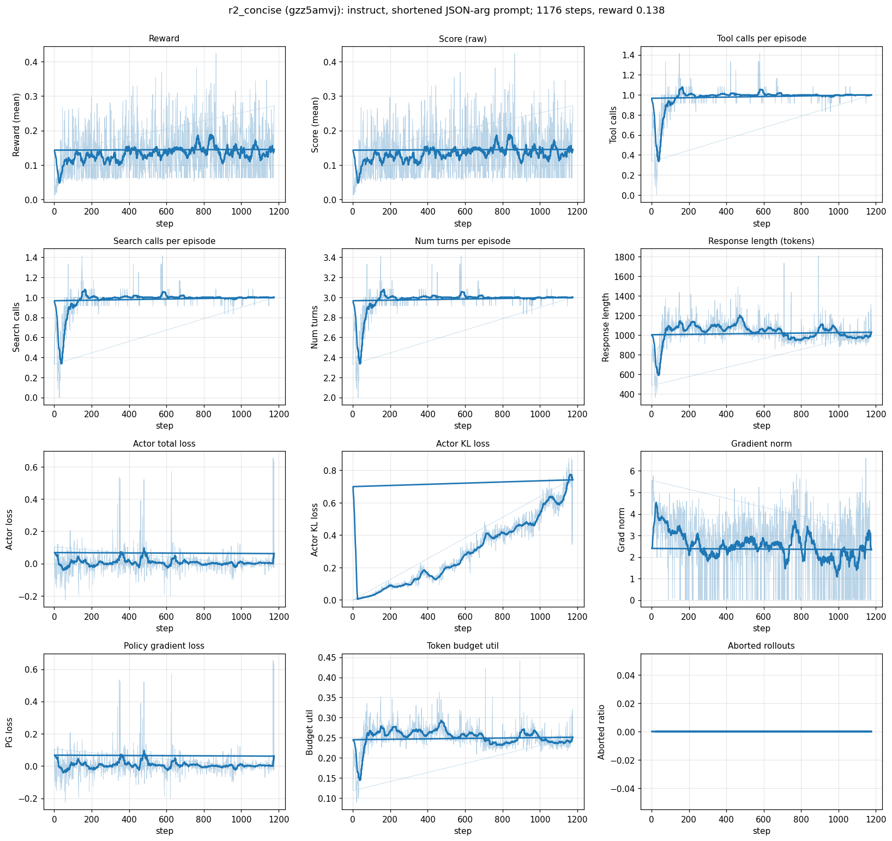

Standard 1-tool / 3-turn / ~1000-token responses; reward 0.113 → 0.138. The shortened prompt loses ~4 pp of final reward vs `r1_query_object` despite running longer (1176 vs 884 steps); the explicit "Hard rules" list in `r1` is doing real work.

---

### `r3_80gb_a` / `_b` / `_c` (x7ya3ev3, jv6g32zu, iz3w4cxj, all instruct)

Three short bring-up runs on the 80GB profile; no notes; 31, 79, 96 steps respectively.

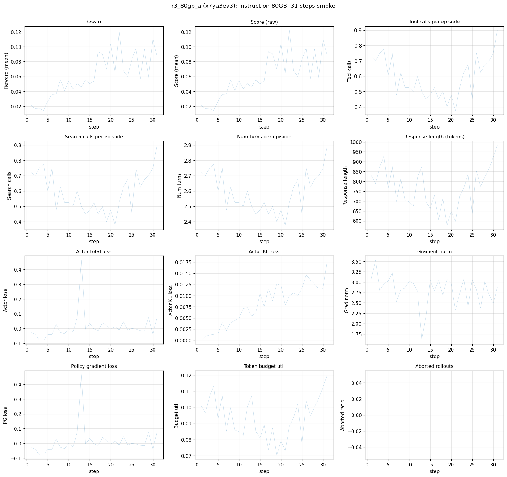

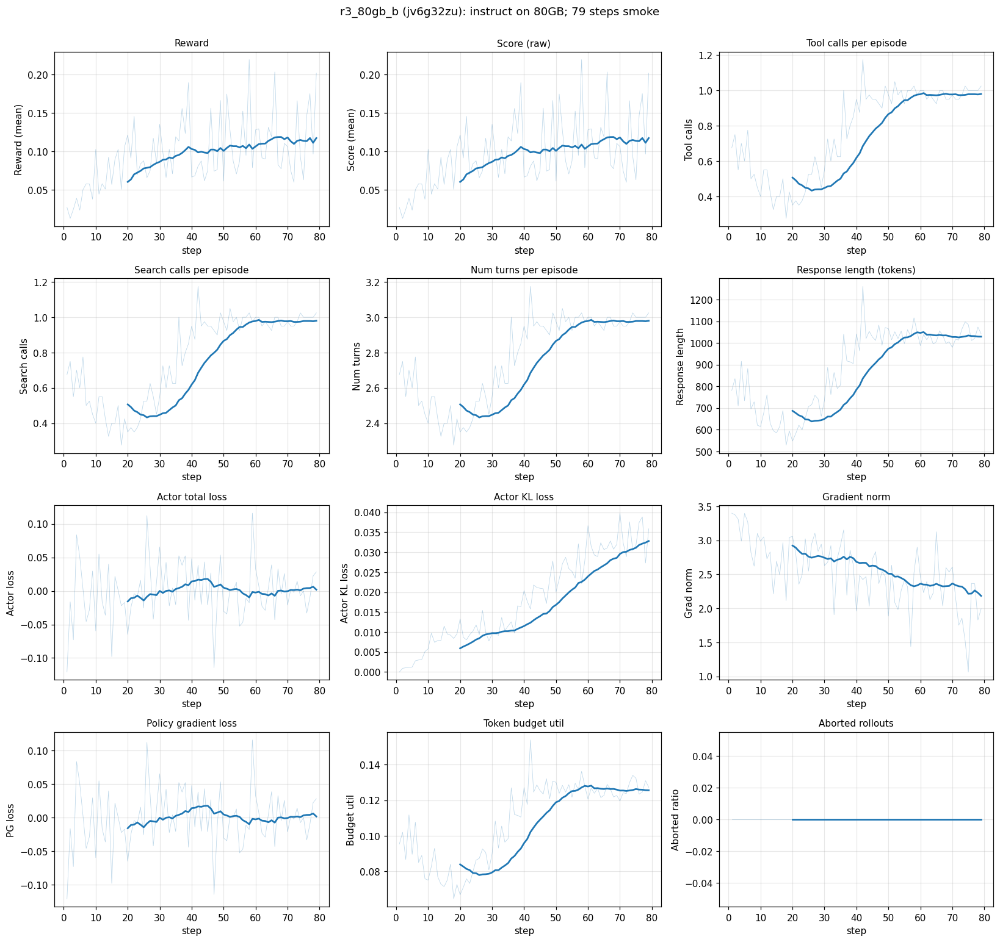

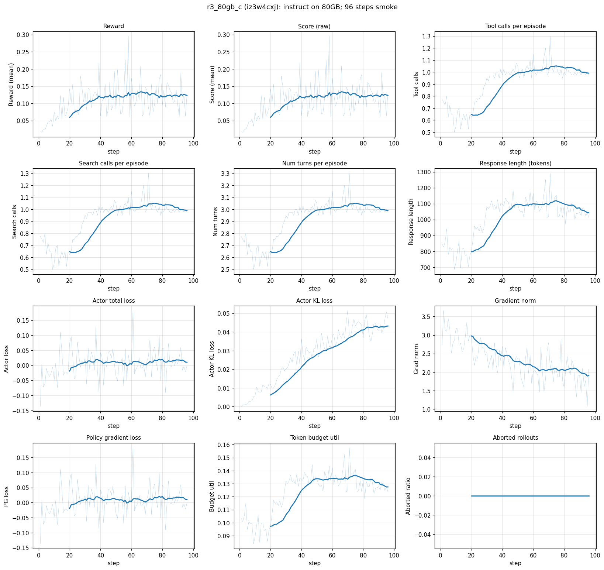

All three reach ~1.0 tool calls before crashing. Not interpretable as ablations.

---

### `exp_zero` (cse8dhqk, 350 steps, instruct)

W&B note: `EXPERIMENT ZERO`. Prompt body not in notes.

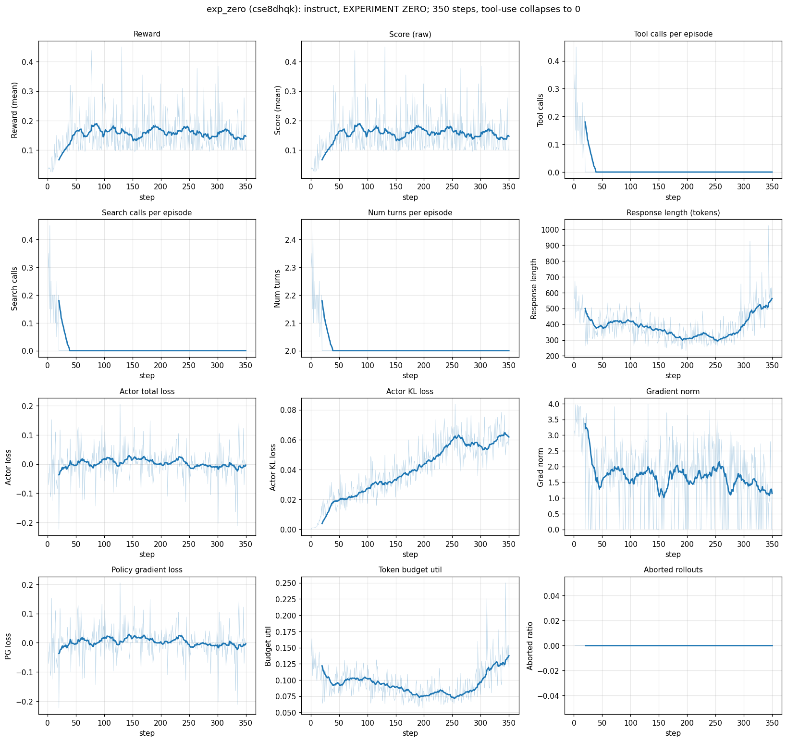

Tool-use collapses from 0.10 to 0.00 over training; num_turns drops to 2 (think + answer); response length 449 → 533. Reward 0.086 → 0.144 via the partial-credit floor. Same collapse mode as v0's `p1_basic_no_ex` / `p2_basic2_no_ex`.

---

### `exp_one` (urlw74yz, 218 steps, instruct)

W&B note: `EXPERIMENT ONE`. Prompt body not in notes. Reward stuck at 0 the entire run despite ~0.66 tool calls and ~870 token responses, suggesting the format validator is rejecting every rollout (likely a tag mismatch between this prompt body and the reward function).

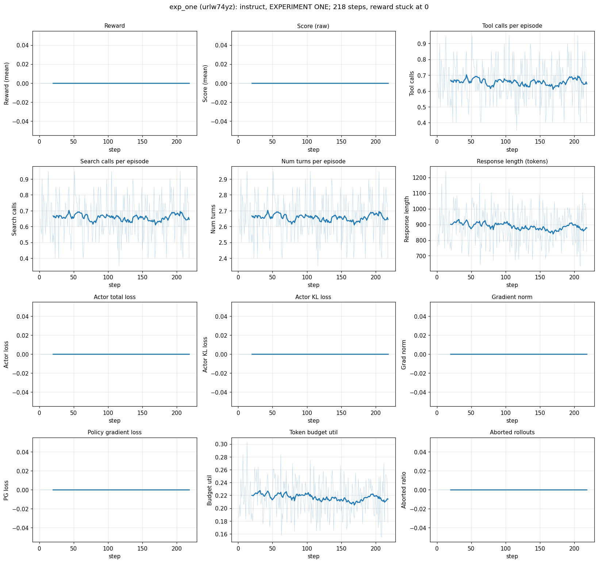

---

### `base_state_machine_a` / `_b` (hmf76bfd, zrphud77, both base, both 2301 steps)

W&B note: `ABLATION ONE`. Prompt body identical between the two runs. The `{prompt}` placeholder is the user's question; the template is concatenated as `User: {prompt}. Assistant:`.

```text
You must follow a strict tool-use protocol. Output only these tags: <think>, <tool_call>, <tool_response>, <answer>. No text outside tags.

<tools>
{"name":"search","description":"Search Wikipedia for factual information.","parameters":{"type":"object","properties":{"query":{"type":"string","description":"The search query."}},"required":["query"]}}
</tools>

State machine (STRICT):
1) Start with <think>...</think>.
2) After each <think>, output exactly one of:
   a) <tool_call>{"name":"search","arguments":{"query":"..."}}</tool_call>
   b) <answer>\boxed{...}</answer>
3) After <tool_call>, you receive <tool_response>...</tool_response>.
4) After each <tool_response>, output <think>...</think> next.
5) Stop immediately after </answer>.

<tool_call> content must be a single valid JSON object. The final answer must appear only inside <answer>...</answer> and must include \boxed{...}.

User: {prompt}. Assistant:
```

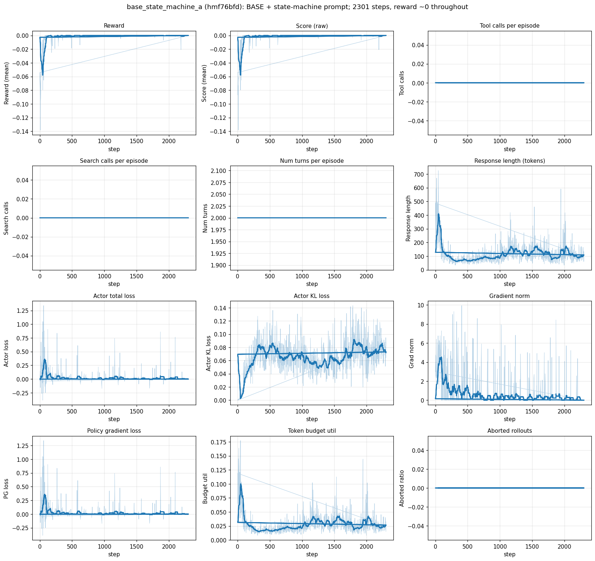

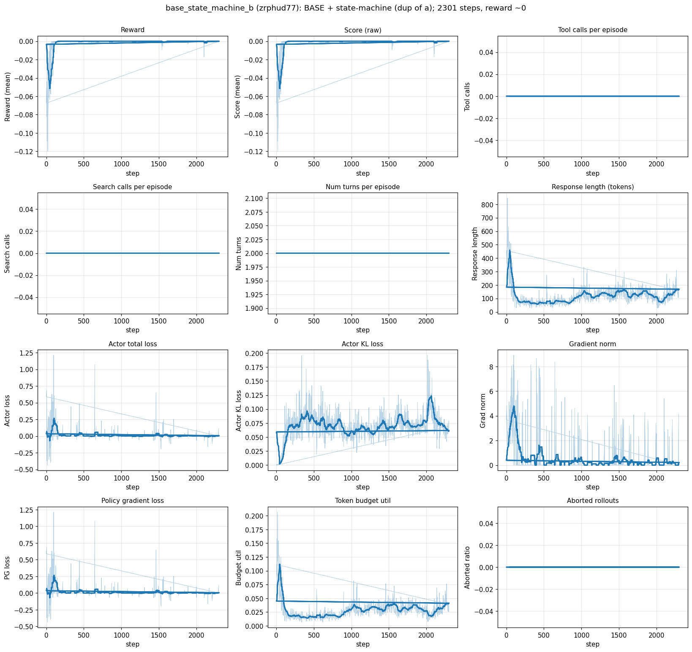

Both ran 2301 steps. Both: 0 tool calls throughout, num_turns = 2 throughout, response_length ≈ 110 to 125 tokens, reward ≈ 0 throughout (slightly negative early due to KL). The base model never produces a `<tool_call>` segment. With this strict prompt, the model emits a short answer-like text directly, format validation fails, score is 0 (or very small partial), KL penalty makes the net reward slightly negative. This is the **expected outcome of trying to teach a base (non-instruction-tuned) checkpoint to follow a structured tool-call format from cold start**.

---

### `base_with_example_a` / `_b` (guzkoeg4, d5ey6zj9, both base)

W&B note: `ABLATION ONE` (different prompt body than the state-machine pair). Adds a worked Hamlet example and an `Assistant: <think>` prefill at the end.

```text
You are an assistant that must use a strict reasoning-and-search format.

Output only these tags:
<think>, <tool_call>, <tool_response>, <answer>

Do not write any text outside these tags.

You have one tool:
<tools>
{"name":"search","description":"Search Wikipedia for factual information.","parameters":{"type":"object","properties":{"query":{"type":"string","description":"A short factual search query."}},"required":["query"]}}
</tools>

Follow this loop exactly:
1. Start with <think>...</think>
2. After each <think>, output exactly one next block:
   - <tool_call>{"name":"search","arguments":{"query":"..."}}</tool_call>
   - <answer>\boxed{...}</answer>
3. After each <tool_call>, a <tool_response>...</tool_response> block will appear
4. After each <tool_response>, output a new <think>...</think>
5. Continue until you have enough information to answer
6. Stop immediately after </answer>

Rules: (omitted for brevity; see W&B notes)

Example:
<think>I need one key fact first.</think>
<tool_call>{"name":"search","arguments":{"query":"author of Hamlet"}}</tool_call>
<tool_response>Hamlet was written by William Shakespeare.</tool_response>
<think>I now know the author and can answer.</think>
<answer>The final answer is \boxed{William Shakespeare}</answer>

User: {prompt}
Assistant: <think>
```

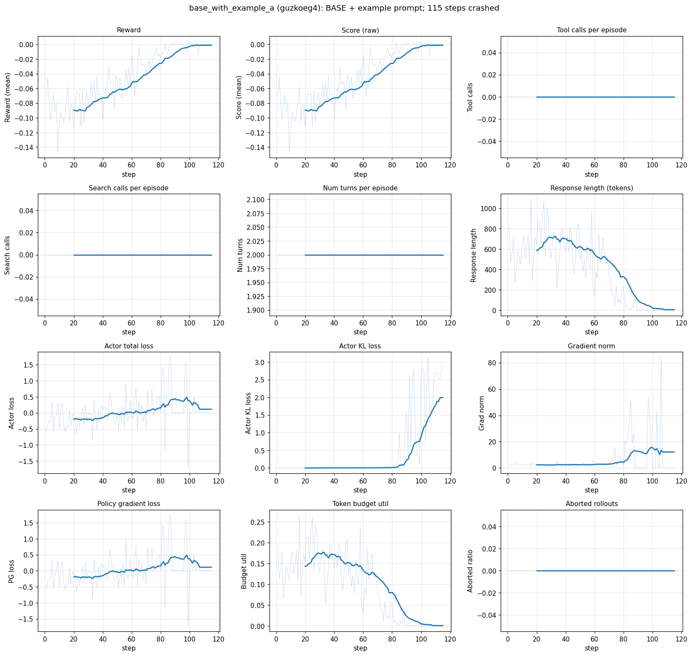

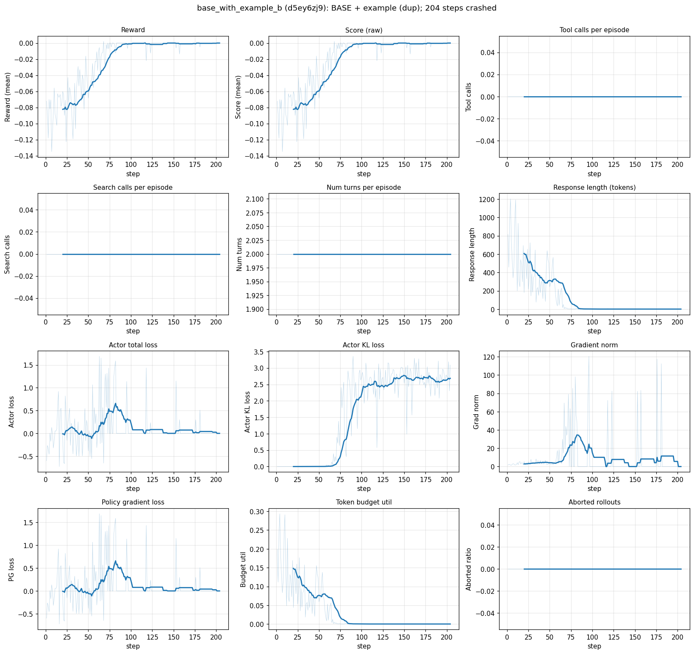

Both crashed early (115 and 204 steps). Tool calls 0 throughout. Response length collapses from ~600 to ~1 token over the course of the short runs: the model finds it easier to emit a single token than the structured format. The `Assistant: <think>` prefill does not help: the base model has no idea what to do after the prefill.

---

### `base_breakthrough` (b8vv0qe2, 2301 steps, base)

W&B note: (none). Run name `qwen3_0.6b_base_grpo_gpu_1_40gb_20260418_204148` (Apr 18 evening, ~12 hours after `base_state_machine_a/b`). **Identical W&B config** to `base_state_machine_a` (same `prompt_template_name`, same agent loop, same retriever URL, same chat-format flags), but **reward starts at 0.694 and stays at ~0.7 throughout 2301 steps**.

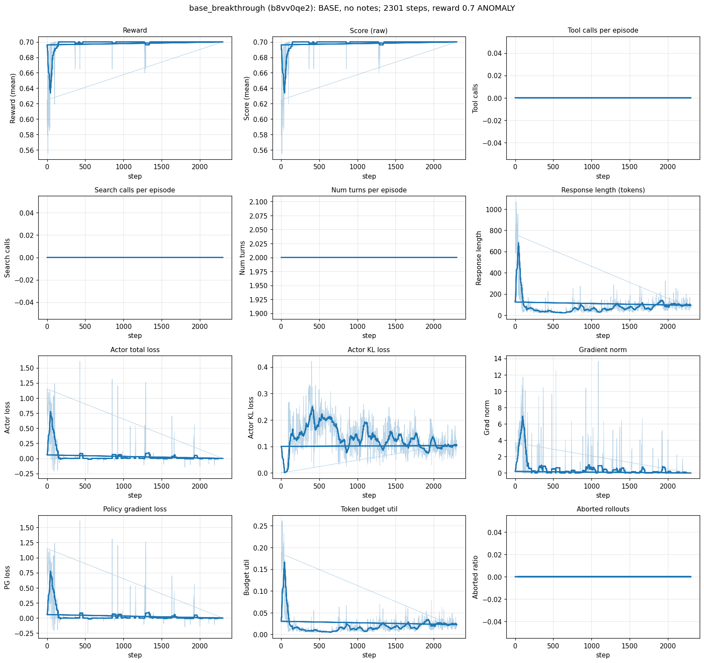

Behavioral facts:
- Tool calls: 0 throughout.
- num_turns: 2 throughout (think + answer or just answer).
- response_length: 92 to 99 tokens throughout (very short outputs).
- Reward: 0.694 → 0.700 (essentially flat, no learning).

This is **almost certainly not a learning breakthrough**. The behavior (0 tool calls, ~95-token responses, flat reward) matches `base_state_machine_a` exactly. The only thing that changed is the score returned by the reward function, suggesting the **reward function code was edited between Apr 17 and Apr 18** to relax format validation or change how partial credit is assigned. The 0.7 number means "this version of the reward function returns 0.7 for the same model behavior that the previous version scored at 0".

This finding is the central diagnostic of the v1 block; see §11 for the implication.

---

### `think_prefill` (huw425rb, 38 steps, instruct)

W&B note: `ADDED THINK PREFILL`. Prompt re-uses the simpler tool-call template format.

```text
You are a helpful assistant that answers questions by calling a Wikipedia search tool when needed.

# Tool
<tools>
{"name":"search","description":"Search Wikipedia for factual information about specific topics.","parameters":{"type":"object","properties":{"query":{"type":"string","description":"The search query."}},"required":["query"]}}
</tools>

# How to call the tool
When you need external information, output a tool call inside <tool_call></tool_call> as a JSON object:
<tool_call>
{"name":"search","arguments":{"query":"..."}}
</tool_call>

After you call the tool, you will receive the result inside:
<tool_response>...</tool_response>

# Termination (STRICT)
When you are ready to answer, you MUST output exactly one final answer inside <answer></answer>.
The final answer MUST include \boxed{...}.

Valid final format:
<answer>The final answer is \[ \boxed{...} \]</answer>

Do not put the final answer anywhere outside <answer>...</answer>.
Do not output anything after the closing </answer>.
```

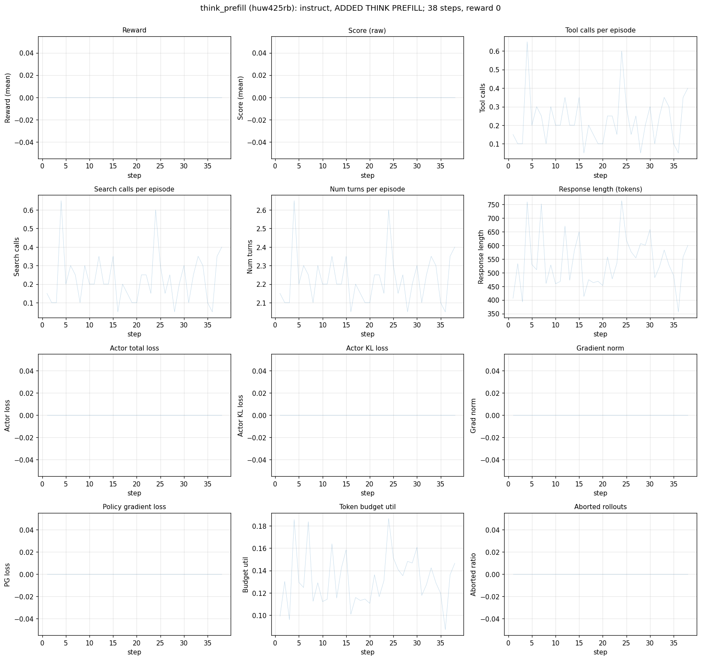

Crashed at 38 steps; not interpretable. Tool calls 0.12 → 0.27, response_length 444 → 505, reward 0.000 throughout (likely format validator rejecting the prefilled think block).

---

### `reward_v3` (w00kccwq, 594 steps, instruct)

W&B note: `NEW REWARD FORMAT - 3`. Same prompt template body as `think_prefill`.

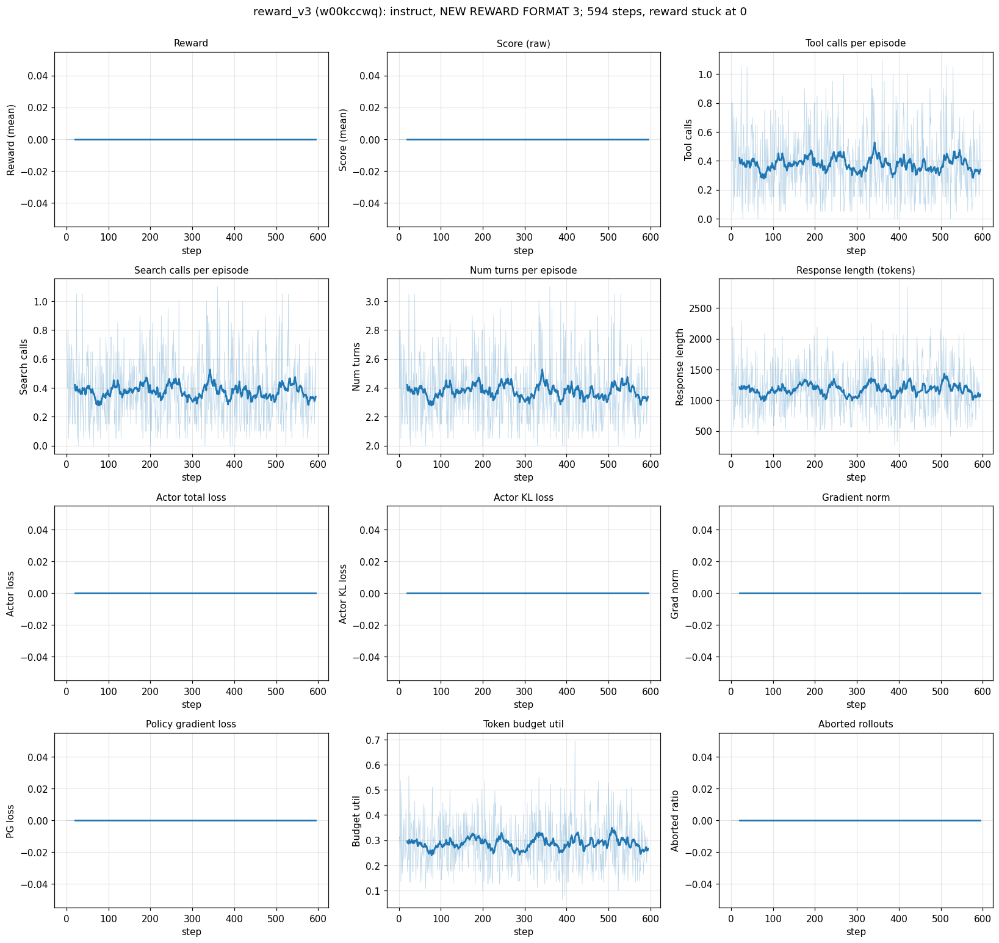

594 steps; tool calls 0.40 → 0.35; response_length 1189 → 1114; **reward 0.000 throughout the entire run.** The model is behaving (calling tools, producing reasonable-length responses) but the new reward function never returns non-zero. Either the format validator is rejecting these specific outputs or the F1 / EM extraction is failing on this prompt's expected answer format.

---

## 11. Cross-run summary table

First-decile mean → last-decile mean for each metric.

| Run | Compact name | Reward (first → last) | Tool calls | Num turns | Resp len |
|---|---|---|---|---|---|
| xtcb7mo9 | r0_strict_contract | 0.052 → 0.149 | 1.02 → 1.00 | 3.02 → 3.00 | 1110 → 1097 |
| 0bhfwm68 | **r1_query_object** | 0.137 → **0.179** | 0.89 → 0.99 | 2.89 → 2.99 | 1010 → 1981 |
| gzz5amvj | r2_concise | 0.113 → 0.138 | 0.88 → 1.00 | 2.88 → 3.00 | 1005 → 1003 |
| x7ya3ev3 | r3_80gb_a | 0.018 → 0.085 | 0.72 → 0.78 | 2.73 → 2.78 | 831 → 924 |
| jv6g32zu | r3_80gb_b | 0.034 → 0.135 | 0.65 → 1.00 | 2.65 → 3.00 | 793 → 1056 |
| iz3w4cxj | r3_80gb_c | 0.033 → 0.112 | 0.69 → 0.99 | 2.69 → 2.99 | 822 → 1040 |
| cse8dhqk | exp_zero | 0.086 → 0.144 | 0.10 → 0.00 | 2.10 → 2.00 | 449 → 533 |
| urlw74yz | exp_one (broken) | 0.000 → 0.000 | 0.66 → 0.65 | 2.66 → 2.65 | 893 → 872 |
| hmf76bfd | base_state_machine_a | -0.005 → -0.000 | 0.00 → 0.00 | 2.00 → 2.00 | 115 → 113 |
| zrphud77 | base_state_machine_b | -0.005 → -0.000 | 0.00 → 0.00 | 2.00 → 2.00 | 111 → 125 |
| guzkoeg4 | base_with_example_a | -0.088 → -0.001 | 0.00 → 0.00 | 2.00 → 2.00 | 563 → 1 |
| d5ey6zj9 | base_with_example_b | -0.082 → 0.000 | 0.00 → 0.00 | 2.00 → 2.00 | 607 → 1 |
| b8vv0qe2 | **base_breakthrough** | **0.694 → 0.700** | **0.00 → 0.00** | 2.00 → 2.00 | 99 → 92 |
| huw425rb | think_prefill | 0.000 → 0.000 | 0.12 → 0.27 | 2.12 → 2.27 | 444 → 505 |
| w00kccwq | reward_v3 (broken) | 0.000 → 0.000 | 0.40 → 0.35 | 2.40 → 2.35 | 1189 → 1114 |

---

## 12. Findings

### 12.1. New tool_call format works for instruct, costs about 4 pp of reward vs v0
v1's three working instruct prompts (`r0_strict_contract`, `r1_query_object`, `r2_concise`) end at rewards 0.149, 0.179, 0.138 respectively. Best v0 instruct prompts ended at 0.215 and 0.212. The new JSON tool-call format raises the floor on what the model has to produce (must emit valid JSON in `<tool_call>`), which makes it a strictly harder optimization problem and predicts the lower ceiling.

### 12.2. The base model cannot learn the tool-call format from cold start
Five base-model runs across two different prompt strategies (strict state machine and worked-example with assistant prefill) all show **0 tool calls throughout training**. The base model has no instruction-tuning to anchor the structured format; the GRPO signal is not strong enough to teach the format from scratch on a 0.6B base in 2300 steps. This is a genuine negative result: simple prompt engineering will not bootstrap base into tool use here.

### 12.3. The 0.7 base_breakthrough reward is a reward-function artifact, not learning
`base_state_machine_a` and `base_breakthrough` use **identical configs** (same model path, same prompt template name, same agent, same chat-format flags, same retriever) and produce **identical behavior** (0 tool calls, ~95-token responses, num_turns = 2). The only difference is reward: 0.000 vs 0.700. The reward function code in `verl_latest/verl/utils/reward_score/re_search.py` was edited between these two runs (Apr 17 evening to Apr 18 evening). Treat the 0.7 number as instrumented, not earned. **The next block should re-evaluate `base_breakthrough`'s saved checkpoints under both reward functions to confirm.**

### 12.4. "EXPERIMENT ONE" and "NEW REWARD FORMAT 3" are stuck-at-zero failures
`exp_one` (218 steps, ~0.66 tool calls) and `reward_v3` (594 steps, ~0.4 tool calls) both have **non-zero behavior but zero reward**. Both are likely format-validator rejections: the prompt body and the reward function's tag/regex expectations have drifted out of sync. These are fixable bugs, not fundamental training failures.

### 12.5. The tool-use collapse mode from v0 reproduces in v1
`exp_zero` (cse8dhqk) shows the same collapse pattern as v0's `p1_basic_no_ex` / `p2_basic2_no_ex`: tool-use rate decays to 0, num_turns drops to 2, reward still climbs via the partial-credit floor. The collapse mode is robust across the v0 → v1 prompt format change.

### 12.6. The 80GB profile bring-up did not produce interpretable results in v1
Three short runs on 80GB (Apr 14) all <100 steps, no notes. They confirm the 80GB script runs but do not contribute ablation data.

### 12.7. The reward function was actively in flux during v1
At least two reward-function changes happened during v1: one between Apr 17 and Apr 18 (visible in the `base_state_machine` → `base_breakthrough` jump) and one explicitly labeled `NEW REWARD FORMAT - 3` on Apr 19 (`reward_v3`). Going forward, **the reward-function version needs to be tagged in W&B alongside the prompt and model**; otherwise the same run config produces incomparable numbers across days.

---

## 13. Open questions raised by these results

1. What exactly changed in `compute_score` between Apr 17 and Apr 18 to take base-model reward from 0 to 0.7 under identical behavior? Inspecting the git history of `verl_latest/verl/utils/reward_score/re_search.py` between those dates would settle it.
2. Is the prompt-validator drift in `exp_one` and `reward_v3` due to tag-name mismatches, JSON-schema mismatches, or EM/F1 extraction logic? Inspecting one rollout JSONL row from each would settle it quickly.
3. The base model's "0 tool calls" finding is interesting on its own: under what conditions could a 0.6B base be coaxed into tool use? (Few-shot demonstrations injected into the rollout? An SFT warm-start? Curriculum from formats it can already produce?) Out of scope for v1, but worth flagging as a thesis-worthy direction.
4. The 4 pp instruct ceiling drop from v0 to v1 is consistent with the JSON-tool-call format being harder. Whether this gap closes with longer training (>3K steps) or is a persistent v1 cost is not answered by this dataset.
