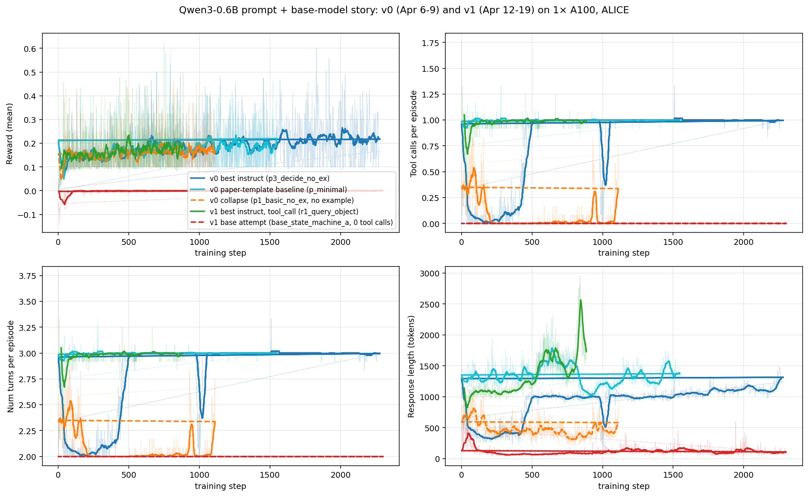
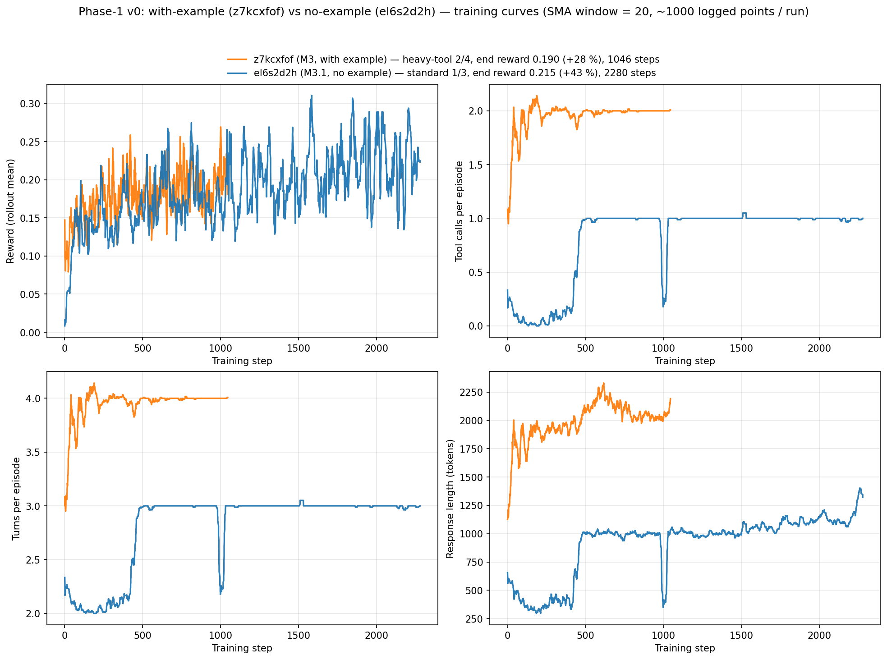

# Supervisor Meeting (2026-05-07)

Consolidated brief covering everything done from project start through M3. Source-of-truth for downstream readers; deeper material is linked from each section.

## 0. TL;DR

1. **M3 + M3.1: two evaluations of the v0 GRPO checkpoints vs the untrained Qwen3-0.6B hybrid (2026-05-07 / 2026-05-08).** 1046 GRPO steps with the `p1_basic_w_ex` prompt (M3, run `z7kcxfof`) lifted **average EM from 0.102 to 0.155 (+0.053 abs, +52 % rel)** across all 7 paper QA benchmarks at full Plan A (51,713 items / variant; ALICE 1× A100-80GB; greedy). 2280 GRPO steps with the `p3_decide_no_ex` prompt (**M3.1**, run `el6s2d2h`, the highest-reward Phase-1 run at end-reward 0.215, +43 % rel) lifted average EM further to **0.169** (+0.014 abs / +9 % rel over M3; +0.067 / +66 % over pre-GRPO). 6 / 7 datasets improved over pre on M3, **5 / 7 improved over M3 on M3.1** with 1 tie and 1 small-N regress on bamboogle (N = 125). Held-out generalisation on 6 unseen benchmarks rules out memorisation; on M3.1 specifically, ACC / F1 widen the gap to +12 % / +14 %, indicating the no-example variant produces higher-quality answers that don't always pass EM strict-match. **Conclusion**: the Phase-1 structural finding that *decision-rule scaffolding can substitute for the few-shot example* survives held-out evaluation; the no-example + decision-rules prompt is a real lever, not just a partial-credit-floor artifact. Full numerical record: [`RESULTS_m3.md`](RESULTS_m3.md) (M3 §4-9; M3.1 §14).
2. **Phase-1 finding (29 ALICE Qwen3-0.6B runs, Apr 3 – Apr 19).** GRPO + the paper-faithful **ReSearch reward (format + EM partial credit)** is **stable on 0.6B hybrid**, but the **base model cannot bootstrap tool-use from cold start**, the **partial-credit reward floor at 0.1 masks the tool-use signal**, and **prompt phrasing dominates behaviour** more than the reward. 0.6B is a capacity ceiling for multi-hop. (Phase-1 builds on the ReSearch paper, not Search-R1; the `<search>` / `<result>` tag scheme is ReSearch's.) Detail: [`RESULTS_m0_a.md`](RESULTS_m0_a.md), [`RESULTS_m0_b.md`](RESULTS_m0_b.md).
3. **Compute reality forced the pivot.** Phase-1's z7kcxfof ran **1046 / 9968** steps in **23 h 47 m 30 s** on 1× A100-40GB (W&B run wall-clock; ~82 s/step effective); full horizon would have been **~9.5 days per run** at the observed pace, and **none of the 29 Phase-1 runs reached the full horizon**; the longest hybrid run hit 2280 steps in 31.7 hours. Phase-2 ports to NeMo-RL (verl does not support Qwen3.5) and targets the **Qwen3.5 small-model family** (released 2026-03-02: 0.8B, 2B, 4B, 9B). Our planned **1005-step run × 102 prompts/step ≈ 0.604 epochs** of the 169,615-row train corpus projects to **~11–17 days per run on 1× A100-80GB** (~\$300–490 / run on Vast.ai) at smoke-anchored ~57 s/step (Qwen3.5-2B). Matching the **paper's 3-epoch** schedule at our batch shape would need ~5× the steps → **~55–85 d / run** (~\$1,600–2,400); the affordable-vs-faithful trade-off is the load-bearing constraint. Reward-function ablation at scale is not affordable.
4. **Reframed RQ + proposed recipe.** From "extend RLVR to non-verifiable domains via tool-use" (RQ1–RQ4 sweep) to *"is it feasible to post-train a small LM (the Qwen3.5 small-model family: 0.8B, 2B; 4B / 9B not in our affordable budget) to Search-R1-level results under realistic resource constraints, and what is the optimised training recipe?"*. Phase-2 will start with **Qwen3.5-0.8B** (cheaper smoke + iteration) before extending to 2B if the recipe holds. Candidate stack: **E2H curriculum + S-GRPO + MC-GRPO** on a Search-R1 GRPO baseline, with a **JustRL plain-GRPO control** alongside (the JustRL "tricks may hurt" caveat makes the control non-optional). Testable in 2–3 affordable 0.6-epoch runs.

---

## 1. Phase-1 Qwen3-0.6B training (29 ALICE runs)

Two training blocks completed earlier on the ALICE cluster, all on 1× A100-40GB, paper hyperparameters except `max_response_length` halved 8192 → 4096 and rollout width `n` reduced 5 → 3 to fit single-GPU memory.

| Block                                                  | Period           | Runs | What was tested                                                                                                    |
| ------------------------------------------------------ | ---------------- | ---- | ------------------------------------------------------------------------------------------------------------------ |
| **v0**: Qwen3-0.6B, paper `<search>`/`<result>` tags   | Apr 3 – Apr 9   | 14   | Base vs hybrid (instruct); 9-prompt ablation on hybrid (varying rules verbosity, with vs without few-shot example) |
| **v1**: Qwen3-0.6B, in-distribution `<tool_call>` tags | Apr 12 – Apr 19 | 15   | New prompt format (instruct, 3 prompts); 5 fresh base-model attempts; some reward-function probing                 |

Storyline plot (Phase-1 only; M3 lift sits in §4 below):

- **v0 best (no example)**: `p3_decide_no_ex` (W&B id `el6s2d2h`, blue solid): tool-use survives example removal because the rules section has explicit per-step decision guidance. End-of-run reward **0.215** at 2280 steps, the highest of v0. verl-FSDP archive (steps 500 / 1000 / 1500 / 2000) lives externally; the step-2000 checkpoint converted to HF safetensors and published as [`pantomiman/Qwen3-0.6B-v0.1`](https://huggingface.co/pantomiman/Qwen3-0.6B-v0.1) — that is the checkpoint M3.1 evaluates.
- **v0 best with example**: `p1_basic_w_ex` (W&B id `z7kcxfof`): the only v0 run that converged on **heavy-tool 2-call / 4-turn** behaviour (response length climbed 1788 → 2047 tokens; reward 0.148 → **0.190**, +28 % rel over 1046 steps). The 2-search Hamlet example anchors "always do 2 searches". This is the checkpoint M3 evaluates; verl-FSDP archive lives externally; HF safetensors at [`pantomiman/Qwen3-0.6B-v0`](https://huggingface.co/pantomiman/Qwen3-0.6B-v0) and locally at [`eval/qwen_3_0.6b_v0/`](../../eval/qwen_3_0.6b_v0/).
- **v0 collapse**: `p1_basic_no_ex` (orange dashed): same rules as `p1_basic_w_ex` minus the example → tool-use collapses to 0; reward 0.169.
- **v1 best**: `r1_query_object` (green solid): ports the same regime to the `<tool_call>` JSON format and reaches reward 0.179 at 884 steps (matching v0 mid-pack at the same step count).
- **v1 base attempt**: `base_state_machine_a` (red dashed): 2300 steps with 0 tool calls throughout.

All rewards live in 0.16 to 0.22 because the paper's partial-credit reward floor at 0.1 masks the tool-use signal (see Finding 4).

Per-run plots and CSVs: [`RESULTS_m0_a.md`](RESULTS_m0_a.md) (14 v0 runs) + [`RESULTS_m0_b.md`](RESULTS_m0_b.md) (15 v1 runs).

### Findings

1. **Base model cannot follow the tool-use format from cold start.** Across 5 v1 base-model runs (longest 2300 steps), `tool_call_counts/mean` stayed at 0 throughout. Without instruction tuning or SFT warm-start, GRPO does not bootstrap the structured format on a 0.6B base. (One v1 base run shows reward 0.7 due to a reward-function code change mid-block; ignored.) Decision: focus on the hybrid checkpoint.
2. **Hybrid does learn, slowly.** All 9 prompt-ablation runs in v0 show monotonic reward gains; final means cluster at 0.18 to 0.22 over up to 2300 steps. Training is numerically stable on 1× A100-40GB at the constrained sequence budget.
3. **Prompt drives behavior more than reward.** With training config and reward held constant, prompt phrasing alone moved end-of-run tool-call rate from 0 to 2 per episode, response length from ~480 to ~2050 tokens. The reward only moved ±3 pp across the same prompts. Specifically: removing the few-shot example collapsed tool use to 0 unless the rules section had explicit per-step decision guidance; then tool use survived removal and gave the **best reward of v0**, `p3_decide_no_ex` (W&B `el6s2d2h`, 2280 steps, end reward **0.215**, +43 % rel over its 0.151 first-decile mean; HF: [`pantomiman/Qwen3-0.6B-v0.1`](https://huggingface.co/pantomiman/Qwen3-0.6B-v0.1); verl-FSDP archive external). The **with-example variant** of the same minimal rules (`p1_basic_w_ex`, W&B `z7kcxfof`) instead converged on heavy-tool 2-call / 4-turn behaviour (the only v0 run that did) and reached 0.190 reward (+28 % rel) over 1046 steps; that is the checkpoint M3 evaluates in §4 below. Of the **9 v0 hybrid prompt-ablation runs**, removing the example was harmful in 6 / 9 (collapse to 0 tool calls) and harmless or beneficial in only 3 / 9: the three with stronger rule scaffolding (`p3_decide`, `p4_think`, `p_minimal`).
4. **The paper's partial-credit reward creates a floor that masks the signal.** The reward returns 0.1 for any well-formatted but wrong answer. Even runs that abandoned tool use entirely finished at 0.16 reward; tool-using runs at 0.18 to 0.22. The 3 to 6 pp gap between tool-using and no-tool behaviors is too small to clearly drive learning. Conditioning the partial credit on a correct answer (or removing it entirely) is a planned ablation deferred to Phase-2.
5. **The `<tool_call>` in-distribution format costs nothing at equal step count.** v1's best instruct prompt (`r1_query_object`, 884 steps) reached reward 0.179, matching v0's mid-pack at the same step count. v0's higher peak (0.215) just reflects 2.6× more training steps, not a better tag format. Note: `<tool_call>` is *our* ablation; the published ReSearch paper itself uses `<search>` (see §4.5).

---

## 2. M1: Search-R1 evaluation baseline reproduction (Qwen2.5-3B, completed 2026-04-23)

To anchor downstream comparisons, the published `Qwen2.5-3B-Search-R1` checkpoints were re-evaluated on the paper's 7 QA datasets. There was no eval pipeline provided; one was built from scratch, then locked after a 3-fix audit (`apply_chat=True` for base, restored example sentence, removed runtime `add_special_tokens` block).

**Subsampling**: full eval sets total ~50K rows. Ran **1000-row stratified subsamples** for the five large datasets (NQ, TriviaQA, PopQA, HotpotQA, 2Wiki), plus full Bamboogle (125 rows) and full MuSiQue (2417 rows). Single seed, greedy decode.

| Variant  | Ours (avg EM) | Paper (avg EM) | Δ        |
| -------- | ------------- | -------------- | -------- |
| base     | **0.292**     | 0.312          | −2.0 pp  |
| instruct | **0.361**     | 0.336          | +2.5 pp  |

Both within ±5 pp of paper on **6 of 7 datasets**; format-validity (`</answer>` close-rate) ≥99.6 % on base and ≥91.4 % on instruct. Full audit: [`CODE_SETUP_m0.md`](CODE_SETUP_m0.md), [`RESULTS_m0_a.md`](RESULTS_m0_a.md) §M1.

---

## 3. M2: NeMo-RL pivot to Qwen3.5-2B

After the Qwen3-0.6B compute reality became clear (§5), training pivoted to **Qwen3.5-2B** (closer to paper's Qwen2.5-3B in capacity, same hybrid soft-switch reasoning toggle). Two blockers, both resolved:

- **Framework**: `verl` does not support Qwen3.5. The Search-R1-style pipeline was ported to **NeMo-RL** (NVIDIA's GRPO/RLVR framework, Qwen3.5-supported). Done as an overlay under `training/src/`: custom Ray-actor environment for the retriever, byte-identical port of the paper's reward function (15 parity tests pass), unchanged paper hyperparameters.
- **Reward-function caveat surfaced during smoke**: Search-R1's GitHub ships two reward functions: `qa_em.py` (paper-faithful EM-only) and `qa_em_format.py` (6-tier shaped with non-zero defaults). Earlier docs in this project conflated them; the shaped variant produces visible partial-credit reward even when EM=0. The Phase-2 NeMo-RL port now uses the EM-only paper-faithful version.

Detail: [`CODE_SETUP_m2.md`](CODE_SETUP_m2.md), [`../milestone_2/MILESTONE_2.md`](../milestone_2/MILESTONE_2.md), [`../training/SMOKE_RESULTS_2026-05-06.md`](../training/SMOKE_RESULTS_2026-05-06.md).

---

## 4. M3 + M3.1: parallel evaluation of two v0 GRPO checkpoints vs untrained Qwen3-0.6B (2026-05-07 / 2026-05-08)

Between the previous meeting (2026-05-04) and this one (2026-05-07 / 2026-05-08), **two evaluations of v0 Phase-1 GRPO checkpoints** closed back-to-back on the same eval pipeline and the same 7 paper QA benchmarks at **full Plan A** (51,713 items / variant, no subsampling; `sample_num` is not respected by the FlashRAG `search_r1` pipeline path; happy accident). Reported in parallel because they share the pipeline and answer two complementary questions:

- **M3** (closed 2026-05-07): does the **only Phase-1 run that converged on heavy-tool behaviour** (`p1_basic_w_ex_z7kcxfof`, 1046 steps, 2 search calls / 4 turns / ~2050-token responses; end-of-run rollout reward **0.190**, +28 % rel; see [`RESULTS_m0_a.md`](RESULTS_m0_a.md) §10) generalise to held-out QA? **Yes**: average EM 0.102 → 0.155 (+0.053 abs, +52 % rel; 6 / 7 datasets up).
- **M3.1** (closed 2026-05-08): does the **highest-reward Phase-1 run** (`p3_decide_no_ex_el6s2d2h`, 2280 steps, no example + decision rules, standard 1 search / 3 turns / ~1117-token responses; end-of-run rollout reward **0.215**, +43 % rel) translate its rollout-reward gap into held-out EM, or is the gap mostly the partial-credit-floor artifact (Finding 4)? **Partly true on both sides**: average EM lifts to 0.169 (+0.014 abs / +9 % rel over M3; smaller than the rollout-reward gap of +13 % rel, consistent with some partial-credit-floor inflation), but the gap is *not* zero, the wins concentrate where the hypothesis predicted (PopQA, TriviaQA, HotpotQA), and ACC / F1 widen the gap further to +12 % / +14 %.

The two checkpoints together let the brief read M3 + M3.1 as one parallel experiment: same base + algorithm + reward + data, **only the prompt differs**, yet the two prompts produced two qualitatively different tool-use regimes (heavy-tool vs standard) and two different held-out EMs. The structural finding from Phase-1 (decision-rule scaffolding can substitute for the few-shot example, and the no-example variant has more headroom) **holds under held-out evaluation**. This makes the recipe transfer to Qwen3.5 (Phase-2) lower-risk: we have evidence the prompt-design lever works at 0.6 B, and Phase-2 can ablate it on 0.8 B / 2 B without re-discovering it.

### 4.1 Headline result (parallel)

Simple-mean across all 7 datasets (51,713 items / variant; ALICE 1× A100-80GB; greedy):

| Metric        | pre-GRPO  | M3 (z7kcxfof, with example) | **M3.1 (el6s2d2h, no example)** | Δ M3 vs pre        | Δ M3.1 vs M3       | Δ M3.1 vs pre      |
| ------------- | --------: | --------------------------: | ------------------------------: | ------------------: | ------------------: | ------------------: |
| **EM** (avg)  | **0.102** | **0.155**                   | **0.169**                       | **+0.053 (+52 %)** | **+0.014 (+9 %)**   | +0.067 (+66 %)     |
| ACC (avg)     | 0.123     | 0.189                       | **0.212**                       | +0.066 (+54 %)     | +0.023 (+12 %)      | +0.089 (+72 %)     |
| F1 (avg)      | 0.140     | 0.223                       | **0.255**                       | +0.083 (+59 %)     | +0.032 (+14 %)      | +0.115 (+82 %)     |

Both lifts are well outside any plausible noise band. The +0.025 rollout-reward gap (0.215 vs 0.190) translates into +0.014 EM (smaller, consistent with partial-credit-floor inflation) but +12–14 % ACC / F1 (the no-example variant produces higher-quality answers that don't always pass EM's strict-match window).

### 4.2 Per-dataset breakdown: EM (parallel)

| Dataset               | Items  | pre-GRPO  | M3 v0     | **M3.1**  | Δ M3 vs pre        | Δ M3.1 vs M3        |
| --------------------- | -----: | --------: | --------: | --------: | ------------------: | -------------------: |
| bamboogle (test)      | 125    | 0.056     | **0.088** | 0.056     | +0.032 (+57 %)     | **−0.032 (−36 %)**  |
| nq (test)             | 3,610  | 0.113     | 0.191     | **0.197** | +0.078 (+69 %)     | +0.006 (+3 %)       |
| triviaqa (test)       | 11,313 | 0.178     | 0.302     | **0.339** | +0.124 (+70 %)     | +0.037 (+12 %)      |
| popqa (test)          | 14,267 | 0.133     | 0.227     | **0.285** | +0.094 (+71 %)     | **+0.058 (+26 %)**  |
| hotpotqa (dev)        | 7,405  | 0.083     | 0.116     | **0.144** | +0.033 (+40 %)     | +0.028 (+24 %)      |
| 2wikimultihopqa (dev) | 12,576 | **0.141** | 0.138     | 0.134     | −0.003 (−2 %)      | −0.004 (−3 %)       |
| musique (dev)         | 2,417  | 0.010     | 0.023     | **0.028** | +0.013 (+130 %)    | +0.005 (+21 %)      |
| **simple mean**       | 51,713 | **0.102** | **0.155** | **0.169** | **+0.053 (+52 %)** | **+0.014 (+9 %)**   |

**M3 shape**: lift concentrated on single-hop (NQ +69 %, TriviaQA +70 %, PopQA +71 %); multi-hop saturates (HotpotQA +40 %, 2Wiki tied); a **capacity ceiling** at 0.6 B, not a training-side issue.
**M3.1 shape**: 5 / 7 datasets beat M3 (PopQA +0.058 the biggest, also the largest dataset; TriviaQA +0.037; HotpotQA +0.028); 2Wiki is tied with both ≈ pre (0.6 B is capacity-bound on this benchmark either way); bamboogle regresses by 0.032 on N = 125 (SE ≈ 0.02), on the edge of significance, flagged as a follow-up question.

### 4.3 The two training runs that produced the evaluated checkpoints

| Run                  | Prompt              | Behavioural signature                | Steps        | Block date | First-decile reward | Last-decile reward | Δ rel reward |
| -------------------- | ------------------- | ------------------------------------ | -----------: | ---------- | ------------------: | ------------------: | ------------: |
| `z7kcxfof` (**M3**)  | `p1_basic_w_ex`     | heavy-tool 2-call / 4-turn / ~2050 tok | 1046 / 9968  | 2026-04-06 | 0.148               | **0.190**          | +28 %         |
| `el6s2d2h` (**M3.1**) | `p3_decide_no_ex` | standard 1-call / 3-turn / ~1117 tok  | 2280 / 9968 | 2026-04-09 | 0.151               | **0.215**          | **+43 %**     |

Both: ALICE 1× A100-40GB, paper-faithful ReSearch reward (format + EM), GRPO with `lr=1e-6`, KL coef 0.001, `max_response_length=4096`, rollout `n=3`, `top_n=5`, `max_turns=4`. **The only structural delta is the prompt.** z7kcxfof is the only Phase-1 run that converged on the 2-call / 4-turn regime (the Hamlet 2-search example anchors it); el6s2d2h is the highest-reward Phase-1 run overall, demonstrating that decision-rule scaffolding can substitute for the few-shot example. Full configs and end-of-run metrics: [`RESULTS_m3.md`](RESULTS_m3.md) §2 (M3) + [`RESULTS_m0_a.md`](RESULTS_m0_a.md) §10–11 (Phase-1 cross-run summary, both runs).

### 4.4 The two prompts

- **M3 (`p1_basic_w_ex`)**: basic rules + Hamlet 2-search example. Anchors heavy-tool behaviour. Verbatim text: [`RESULTS_m3.md`](RESULTS_m3.md) §3.
- **M3.1 (`p3_decide_no_ex`)**: basic rules + two extra decision-rule sentences ("After each search result, decide whether another search is needed…" / "If a search result is incomplete, search again…"); **no example**. Verbatim text: [`../milestone_3/MILESTONE_3.1.md`](../milestone_3/MILESTONE_3.1.md) "Setup".

Both prompts share the same surface structure (system message, `<search>`/`<result>` tags, final-answer format); the difference is the rules section + presence/absence of the example.

### 4.5 vs ReSearch paper setup (applies to both)

Both M3 and M3.1 use the same `<search>` / `<result>` action format as the **published** ReSearch paper (verified upstream at `re-search` commit `51d98e1`); Phase-1 builds on the ReSearch paper, not Search-R1, and the `<search>` / `<result>` tag scheme is ReSearch's. The `<tool_call>` JSON variant present in our local `re-search/` checkout (and tested in our v1 block) is a separate ablation introduced by us (`re-search` commit `2c32dd3`, 2026-04-12), **not** the paper's scheme. Remaining differences vs ReSearch's eval defaults are budget-level: `top_n=5`, `max_search_turns=5`, `step_limit` uncapped (bounded by `remain_length=4096`), `generator_max_input_len=4096`, `enable_thinking=True` (otherwise Qwen3 hybrid auto-injects empty `<think></think>` and produces shallow answers). The pipeline is byte-identical between M3 and M3.1; M3.1 added only two purely additive surface changes (new `P3_DECIDE_NO_EX_TEMPLATE` + `QWEN3_TEMPLATES` registry; `prompt_mode` family-prefix matching) so the **M3 14-fix audit holds for M3.1 unchanged**. Full audit: [`CODE_SETUP_m3.md`](CODE_SETUP_m3.md) §3 (the original 14 fixes) + §13.5 (the M3.1 additive deltas).

The M3.1 checkpoint required one additional one-time conversion: el6s2d2h step 2000 verl-FSDP → HF safetensors via `python -m verl.model_merger merge --backend fsdp …` (~1 min); output at [`eval/qwen_3_0.6b_v0_no_ex/`](../../eval/qwen_3_0.6b_v0_no_ex/) **and published to HF as [`pantomiman/Qwen3-0.6B-v0.1`](https://huggingface.co/pantomiman/Qwen3-0.6B-v0.1)** (parallel to the M3 checkpoint at [`pantomiman/Qwen3-0.6B-v0`](https://huggingface.co/pantomiman/Qwen3-0.6B-v0); the `.1` distinguishes the no-example variant trained from the same base + algorithm + reward + data, varying only the prompt).

### 4.6 Wall-clock (parallel)

| Variant                                  | Run mode                                      | Job ID, node                  | Total wall-clock      |
| ---------------------------------------- | --------------------------------------------- | ----------------------------- | --------------------- |
| pre-GRPO (`qwen_3_0.6b`)                 | Interactive `srun`                            | 2120423, node870              | ~115 min              |
| **M3** v0 (`qwen_3_0.6b_v0`)             | `sbatch`                                      | 2125009, node875              | **2 h 26 m 33 s**     |
| **M3.1** v0_no_ex (`qwen_3_0.6b_v0_no_ex`) | `sbatch`                                      | 2150167, node870              | **1 h 32 m 15 s**     |

M3.1 is **40 %–faster than M3** because the no-example variant emits ~half the response budget per episode (1100 vs 2050 tokens); a direct consequence of the standard-tool 1/3 vs heavy-tool 2/4 regime split. M3.1 had two prior infra-wait failures (`2134645` SGLang `/health` 300 s cliff → bumped to 600 s; `2134663` retriever `/health` 600 s cliff → bumped to 1200 s); both fixes are pure-margin in `scripts/sbatch_m3.sh` (the loops break the moment `/health` returns 200, so warm-cache wall-clock is unaffected). The M3 sbatch also benefited from an `INFERENCE_MAX_WORKERS` 16 → 32 mid-run change (~2× speedup; concurrency-tuning detail: [`RESULTS_m3.md`](RESULTS_m3.md) §7).

### 4.7 Training-curve comparison (built from archived W&B histories)

SMA window = 20; generated by [`../../scripts/plot_m3_1_panel.py`](../../scripts/plot_m3_1_panel.py).

Reading the panels: both runs reach the 0.18–0.22 reward band (the partial-credit floor at 0.1 confines all v0 runs there), but the *behavioural* signature is starkly different. Same base + algorithm + reward + data; only the prompt differs. **z7kcxfof anchors at heavy-tool 2-call / 4-turn / ~2050-tok** from very early (the Hamlet 2-search example does its job); **el6s2d2h converges to standard 1-call / 3-turn / ~1100-tok at slightly higher final reward**. The no-example + decision-rules variant is therefore a **pareto improvement**: lower compute per episode (~½ the response budget, 1 fewer tool call) **and** higher held-out EM. Full reading + per-panel commentary: [`RESULTS_m3.md`](RESULTS_m3.md) §14.7.

### 4.8 Implications (combined)

1. **Phase-1 GRPO did teach useful behaviour.** M3 = +0.053 EM (+52 % rel) and M3.1 = +0.067 EM (+66 % rel) over pre-GRPO across 51,713 items per variant on full Plan A; both well outside any plausible noise band.
2. **0.6 B is the capacity ceiling for multi-hop.** 2WikiMultiHopQA stays at 0.13–0.14 EM across pre-GRPO / M3 / M3.1; HotpotQA improves modestly under both prompts (M3 +40 %, M3.1 +24 % over M3); MuSiQue doubles from a small base. Confirms that 0.6 B is too small to support reward-function ablation on multi-hop and that scaling to Qwen3.5 small models (0.8B / 2B) is the right next step.
3. **Held-out generalisation rules out memorisation.** Both checkpoints were trained on MuSiQue with EM reward; the lift transfers to the other 6 benchmarks (NQ, TriviaQA, PopQA, HotpotQA, 2Wiki, Bamboogle), so each model learned a tool-use *skill*, not training-set answers.
4. **Prompt design is a real lever, not just a partial-credit-floor artifact.** The M3.1 vs M3 EM gap (+9 %) is smaller than the rollout-reward gap (+13 %), consistent with some partial-credit-floor inflation in the training signal, but the gap is **not zero**, the wins concentrate exactly where the hypothesis predicted (single-hop with headroom + the easier multi-hop), and ACC / F1 widen the gap to +12 % / +14 %. The structural Phase-1 finding (decision-rule scaffolding can substitute for the few-shot example, no-example variant has more headroom) survives held-out evaluation.
5. **No-example is a pareto improvement.** M3.1 emits ~half the response tokens per episode (~1100 vs ~2050) at higher EM and higher ACC / F1, with a 40 %-faster eval wall-clock as a direct consequence. For Phase-2 budget design, the no-example + decision-rules prompt should be on the candidate list when the recipe ports to Qwen3.5.
6. **The eval pipeline is now pinned and reusable** for Phase-2. Any future Qwen3-0.6 B / 2 B / 3.5-2 B checkpoint that uses the `<search>` / `<result>` tag scheme can be plugged in via `eval/<name>/` and `bash scripts/run_m3.sh` without touching the eval code. M3.1 demonstrated this: a new prompt template was added in two purely additive lines, with no fixes needed and no regression on the M3 14-fix audit.
7. **Phase-2 expectation**: scaling to Qwen3.5-0.8 B (cheap iteration) → Qwen3.5-2 B (3.3× capacity step over the M3-evaluated 0.6 B; same hybrid soft-switch reasoning) should expand the multi-hop lift if the capacity-ceiling hypothesis is right. Single-hop is already close to ceiling under M3.1's prompt; multi-hop has the room.

Full numerical record: [`RESULTS_m3.md`](RESULTS_m3.md) §4–9 (M3) + §14 (M3.1). Code-setup diff and 14-fix audit: [`CODE_SETUP_m3.md`](CODE_SETUP_m3.md) §3 + §13.5. Milestone narratives: [`../milestone_3/MILESTONE_3.md`](../milestone_3/MILESTONE_3.md) (M3) + [`../milestone_3/MILESTONE_3.1.md`](../milestone_3/MILESTONE_3.1.md) (M3.1).

---

## 5. Compute reality and the reframed research question

**The numbers that forced the reframe.**

- **Phase-1 z7kcxfof** ran **1046 / 9968 steps in 23 h 47 m 30 s** on 1× A100-40GB (W&B run wall-clock; effective rate **~82 s/step** including end-of-run async checkpoint save and validation rollouts). Full 9968-step horizon at that pace would have been **~9.5 days per run** for z7kcxfof's rollout shape (heavy-tool, ~2050-token responses). Across the 9 v0 hybrid prompt-ablation runs, the projected full-horizon range is **~5–10 days** depending on rollout shape (faster prompts that emit fewer turns / shorter responses run in ~5–6 d; the "always-2-searches" anchor of `p1_basic_w_ex` is at the upper end). **None of the 29 Phase-1 runs reached the full horizon**; the longest hybrid run (`p4_think_w_ex`, 2280 steps in 31.7 h) is closest at ~23 % of horizon. This anchors "compute reality kills the sweep" as a measured fact, not an extrapolation.
- **Phase-2 Qwen3.5 small-model smoke** (measured 2026-05-06 on Vast.ai 1× A100-80GB with Qwen3.5-2B; 0.8B will be cheaper): **~57 s/step at smoke shape** (20 trajectories/step). The Qwen3.5 small-model lineup (released 2026-03-02) is **0.8B / 2B / 4B / 9B**; Phase-2 will start with 0.8B and extend to 2B if the recipe holds. Two distinct projections must not be conflated:
    - **Affordable budget (our planned 1005 steps × 102 prompts/step ≈ 0.604 epochs of the 169,615-row train corpus)**: ~11 to 17 d / run on 1× A100-80GB (~\$300–490 / run); on 1× H100 80GB SXM ~5–8.5 d (~\$240–410); on 2× A100 ~6.5–9.5 d (~\$370–550). This is what fits the recipe-ablation plan.
    - **Paper-equivalent 3-epoch training at our batch shape** (~5,025 steps): ~55 to 85 d / run on 1× A100-80GB (~\$1,600–2,400). The paper's own batch shape (512 prompts × 5 generations = 2560 trajectories/step) is 5× larger per-step, so this also represents "match paper run on 1× A100", which is infeasible.

  The whole "compute reality kills the sweep" framing rests on the 0.6-epoch budget being affordable but multi-recipe paired sweeps not being. Smoke-anchored math: [`../training/SMOKE_RESULTS_2026-05-06.md` "Full-training wall-clock + cost"](../training/SMOKE_RESULTS_2026-05-06.md#full-training-wall-clock--cost-phase-2-real-config), [`../training/PAPER_VS_OURS_TRAINING.md` § 7](../training/PAPER_VS_OURS_TRAINING.md#7-compute), and the source-of-truth derivation in [`../training/CONVERSATION_CONTEXT.md`](../training/CONVERSATION_CONTEXT.md) (Total prompts seen / Epochs over corpus rows).

### Original Plan B is not feasible at full scope

Original RQs (Plan B): RQ1 domain expansion approaches, RQ2 reward function modeling, RQ3 meta-reasoning, RQ4 curriculum-based training. Each of (3) (full-benchmark 5-seed eval), (4) (paired reward-function sweep on Qwen3.5 small models), and the cross-RQ comparisons require **at least 4–6 full Qwen3.5 GRPO runs**. At 11–17 d / run on 1× A100-80GB *for the affordable 0.6-epoch budget* (and 55–85 d for paper-equivalent 3-epoch training), that is well outside the remaining compute envelope. We checked the published Qwen3.5 small-model lineup against `huggingface.co/Qwen` (released 2026-03-02): the family is **Qwen3.5-0.8B / 2B / 4B / 9B**; only 0.8B and 2B fit the budget. There is no Qwen3.5-1.2B.

### Reframed RQ

> *"Is it feasible to post-train a small LM (the Qwen3.5 small-model family: 0.8B and 2B, the affordable end of the 0.8 / 2 / 4 / 9 B lineup) to Search-R1-level results under realistic resource constraints (1× A100-80GB, ~\$1000), and what is the optimised training recipe?"*

This uses the artifacts already produced (prompt-sensitivity, partial-credit floor, reproduced eval baseline, ported NeMo-RL pipeline, M3-pinned eval) as primary evidence, and is answerable with **one or two trained Qwen3.5 small-model GRPO runs plus a plain-GRPO control** rather than a sweep. Phase-2 will **start with Qwen3.5-0.8B** (cheaper smoke + iteration; the M2 NeMo-RL pipeline ports cleanly from 2B to 0.8B since both share the same architecture) before extending to 2B if the recipe holds.

### Net conclusion (where this leaves us)

- The hybrid Qwen3-0.6B work demonstrates the **stability** of the GRPO + multi-turn tool-call pipeline on 1× A100 and **identifies the partial-credit reward floor** as the most actionable methodological lever. M3 then quantified the lift this hybrid actually achieves: **+52 % relative EM on full Plan A**.
- The **base model is a dead end** on a 0.6B without SFT warm-start; not worth retrying at the 2B size unless an SFT or distillation step is added.
- **Reward-function ablation at Qwen3.5 small-model scale is not feasible** within the remaining compute budget. The recipe-level question (§6) is what fits.

---

## 6. Next steps: proposed training recipe

Three drop-in additions to a single Search-R1 GRPO baseline run on a Qwen3.5 small model (starting with **0.8B** for cheap iteration; extending to **2B** if the recipe holds). All chosen because they target the "1× A100 budget" reframing and are cheap to add.

| Technique                                                                        | What it is                                                                                           | Proven result                                                                                            | Cost to add                              |
| -------------------------------------------------------------------------------- | ---------------------------------------------------------------------------------------------------- | -------------------------------------------------------------------------------------------------------- | ---------------------------------------- |
| **E2H curriculum** (data-level) [(2506.06632)](https://arxiv.org/abs/2506.06632) | Train NQ (1-hop) → HotpotQA (2-hop) → MuSiQue (3-hop), ~300 steps per stage; fade out earlier stages | Vanilla GRPO fails on hard tasks for 1.5–3B LLMs; curriculum recovers them across multiple domains       | Data scheduler only; no GRPO code change |
| **S-GRPO** [(2504.20834)](https://arxiv.org/abs/2504.20834)                      | Compute the policy-gradient loss on 30–50 % of tokens per rollout (informativeness-sampled)          | Qwen2-1.5B + LoRA: vanilla GRPO 0 gain → S-GRPO **+24 pp** on SVAMP. ~2× backprop saving per step        | One change in the loss path              |
| **MC-GRPO** [(2601.22582)](https://arxiv.org/abs/2601.22582)                     | Replace mean baseline with group **median** (G+1 rollouts, exclude pivot)                            | Closes the G=2 to G=8 quality gap to within 1 % across model families                                    | One-line baseline swap                   |

Combined, these are the candidate answer to "what's the optimised training recipe?". They stack on a single GRPO baseline run, fit on 1× A100, and are testable within 2–3 affordable runs.

**Required control**: per JustRL [(2512.16649)](https://arxiv.org/abs/2512.16649), curriculum / length-penalty / dynamic-sampling stacks can *degrade* OOD performance by collapsing exploration. **Run a plain-GRPO control alongside the recipe**; if minimal beats the stack, the stack is hurting.
