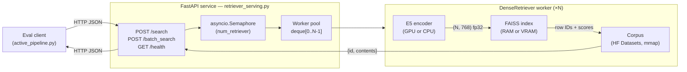
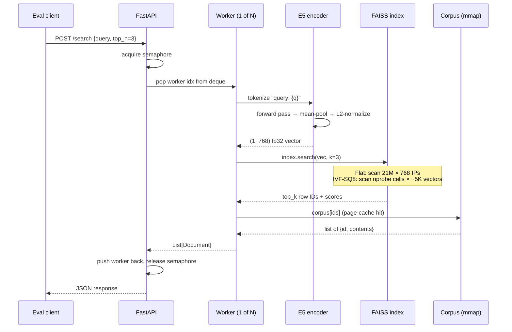
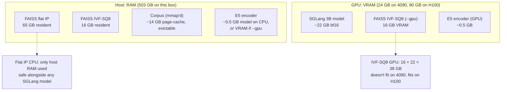
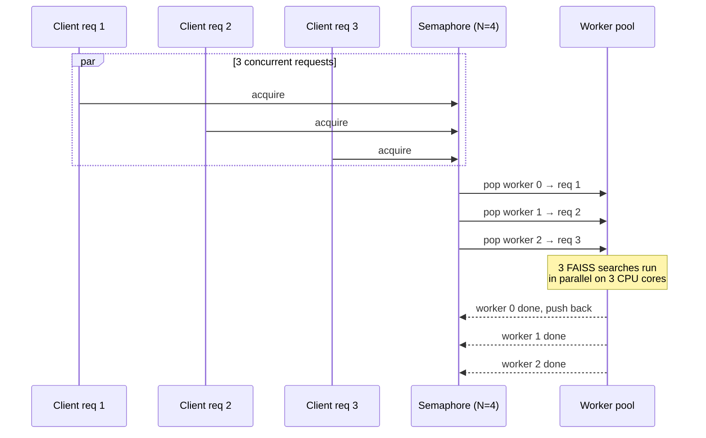

# Index Architecture

How the retriever service is wired up: components, query lifecycle, build pipeline, memory layout. For the *what-to-pick* side (RAM/VRAM/recall/latency tradeoffs across Flat/HNSW/IVF/PQ) see [RETRIEVER_INDEXING.md](RETRIEVER_INDEXING.md). For known concurrency issues in the current implementation (sync calls in async handlers, RAM duplication) see [RETRIEVER_CONCURRENCY.md](RETRIEVER_CONCURRENCY.md).

## Components



Three things to know:

1. **One service, N workers, one shared FAISS read path per worker.** `--num_retriever N` instantiates N independent `DenseRetriever` objects, each holding its own encoder + FAISS handle. Read-only, fully parallel-safe.
2. **The semaphore + deque pattern** in [`retriever_serving.py:14-35`](../../local_retriever/retriever_serving.py) hands one worker to one in-flight request. This caps concurrent FAISS searches at N.
3. **Two artifacts are kept row-aligned**: the FAISS index and the corpus jsonl. Row `i` in FAISS = embedding of row `i` in `corpus/wiki18_100w.jsonl`. FAISS returns integer row IDs, the corpus lookup returns the text.

## Query lifecycle



Wall-clock per stage (single 4090, [../eval/EVAL_OPS.md](../eval/EVAL_OPS.md) profile):

| Stage | Flat IP CPU | IVF-SQ8 CPU | IVF-SQ8 GPU |
|---|---:|---:|---:|
| Encode | 3–8 ms | 3–8 ms | 3–8 ms |
| FAISS search | 100–300 ms | 30–100 ms | 5–15 ms |
| Corpus lookup | <0.1 ms | <0.1 ms | <0.1 ms |
| HTTP overhead | ~10 ms | ~10 ms | ~10 ms |

## Index build pipeline

The flat IP index ships pre-built. The IVF-SQ8 index is reconstructed *from* the flat index — no re-embedding.

```mermaid
flowchart TB
    subgraph Source["Source assets (downloaded)"]
        Wiki["wiki-18.jsonl.gz<br/>21M passages, ~13 GB"]
        Flat["wiki18_100w_e5_flat_inner.index<br/>21M × 768 fp32, ~65 GB"]
    end
    subgraph Build["Build (build_ivf_sq8.py)"]
        Load["Load flat index<br/>~60–90s"]
        Sample["Random sample<br/>1M training vectors"]
        Reconstruct["faiss.reconstruct_n()<br/>~10–30s"]
        Train["Train k-means on GPU<br/>nlist=4096, <1 min"]
        Add["Add all 21M vectors<br/>chunks of 1M, ~5–10 min"]
        Write["Write to disk"]
    end
    Out["wiki18_100w_e5_ivf4096_sq8.index<br/>~16 GB"]
    HFDataset["HF: pantomiman/reason-over-search<br/>retriever/wiki18_100w_e5_ivf4096_sq8.index"]
    Wiki -.->|served as text| Service["Retriever service"]
    Flat --> Load --> Sample --> Reconstruct --> Train --> Add --> Write --> Out
    HFDataset -.->|curl download<br/>(default path)| Out
    Out -.->|default| Service
    Flat -.->|optional swap<br/>(exact recall)| Service
```

The IVF-SQ8 index is the retriever's default. The fastest way to obtain it is to download the prebuilt artifact from this project's HF dataset:

```bash
curl -L -o local_retriever/indexes/wiki18_100w_e5_ivf4096_sq8.index \
  https://huggingface.co/datasets/pantomiman/reason-over-search/resolve/main/retriever/wiki18_100w_e5_ivf4096_sq8.index
```

If you want to rebuild it locally instead (~1 hour): the build script reconstructs vectors from the flat index rather than re-embedding 21 M passages — re-embedding takes 6–10 hours on a single 4090, while reading them back via `faiss.reconstruct_n()` is fast and deterministic. See [/workspace/index_creation/README.md](../../../index_creation/README.md) for the build script and [build_ivf_sq8.py](../../../index_creation/build_ivf_sq8.py) for the implementation.

`nlist=4096` is constrained by FAISS's `min_points_per_centroid=39` floor: with 1 M training samples, 4096 cells gives ~244 points per centroid. Going to 65 536 cells would need ≥ 2.55 M training samples to clear the floor, so `4096` is the largest viable choice with the current sample size.

## Memory layout

Where each artifact lives at runtime, by index choice:



The hard constraint on a 24 GB 4090: SGLang's 22 GB footprint leaves 2 GB free. Neither the 65 GB flat index nor the 16 GB IVF-SQ8 index fits on GPU alongside SGLang. So on the 4090, the retriever is **CPU-only by default**.

On 80 GB H100: 22 GB (SGLang) + 16 GB (IVF-SQ8 in VRAM) + 0.5 GB (E5 encoder) = ~38 GB, fits comfortably with headroom. GPU FAISS becomes viable. See [RETRIEVER_INDEXING.md](RETRIEVER_INDEXING.md) for the speedup ranking on each option.

## Concurrency model



Each worker is a thread-isolated `DenseRetriever` instance. FAISS index reads are GIL-released (the heavy lifting is in C++), so the workers *would* do truly parallel CPU work — except that the current handlers call into them synchronously from `async def`, blocking the event loop. See [RETRIEVER_CONCURRENCY.md](RETRIEVER_CONCURRENCY.md) for the audit and the one-line fix that makes this diagram match reality.

## Files involved

| Path | Role |
|---|---|
| [`local_retriever/retriever_serving.py`](../../local_retriever/retriever_serving.py) | FastAPI service, semaphore pool, CLI |
| [`local_retriever/retriever_config.yaml`](../../local_retriever/retriever_config.yaml) | Default index path, encoder path, nprobe |
| [`local_retriever/flashrag/retriever/retriever.py`](../../local_retriever/flashrag/retriever/retriever.py) | `DenseRetriever`: index load, search, batch_search |
| [`local_retriever/flashrag/retriever/encoder.py`](../../local_retriever/flashrag/retriever/encoder.py) | E5 encoder: tokenize, forward, pool, normalize |
| [`local_retriever/indexes/wiki18_100w_e5_ivf4096_sq8.index`](../../local_retriever/indexes/) | 16 GB IVF-SQ8 index (default; download from HF: [`pantomiman/reason-over-search`](https://huggingface.co/datasets/pantomiman/reason-over-search/blob/main/retriever/wiki18_100w_e5_ivf4096_sq8.index)) |
| [`local_retriever/indexes/wiki18_100w_e5_flat_inner.index`](../../local_retriever/indexes/) | 65 GB Flat IP index (optional, exact recall) |
| [`local_retriever/corpus/wiki18_100w.jsonl`](../../local_retriever/corpus/) | Raw passages, mmap'd |
| [`/workspace/index_creation/build_ivf_sq8.py`](../../../index_creation/build_ivf_sq8.py) | IVF-SQ8 build pipeline (alternative to HF download) |
